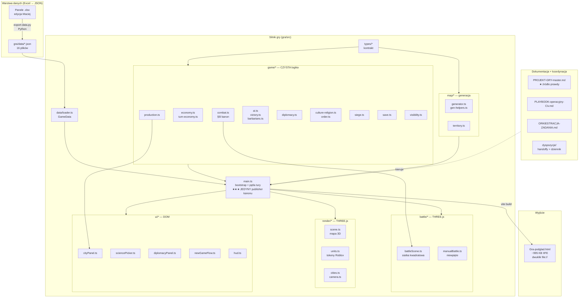
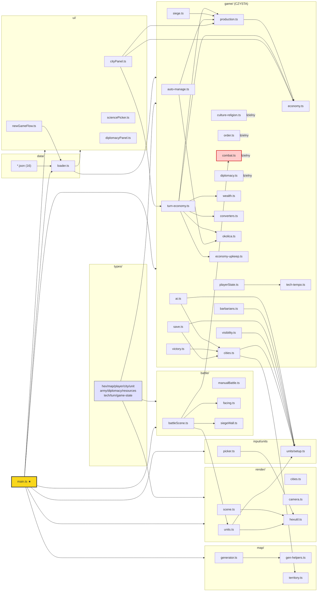
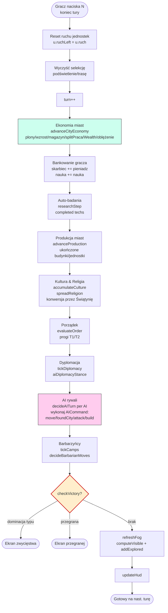

# ANALIZA ARCHITEKTURY — projekt „The Game" (Civ)

> Kompleksowa analiza architektury projektu gry 4X w stylu Cywilizacji.
> Wykonana przez GLM 5.2 (rola Architekta), 2026-06-26.
> Ścieżka projektu: `C:\Users\macie\OneDrive - NASTER S.A\_NOWA_STRUKTURA\06_Prywatne\Gry\Civ`

---

## 1. Podsumowanie wykonawcze (Executive summary)

**„The Game"** to przeglądarkowa gra 4X w stylu Cywilizacji, budowana w **TypeScript + Vite + Three.js**, dystrybuowana jako **single-file HTML** (IIFE, dwuklik z `file://`). Wyróżnikiem projektu jest **realistyczna, ewoluująca ekonomia** (Praca → Pieniądz → Energia) i **wierny model walki Total War** (§5l kanon). Projekt jest **w średnio-zaawansowanym stanie**: kod silnika (~93 pliki TS) pokrywa mapę 3D, ruch, mgłę, ekonomię miast, walkę, AI, dyplomację, kulturę/religię, oblężenia i save/load — ale **integruje je w części** (wiele modułów jest gotowych, lecz „czeka w kolejce" na wpięcie w pętlę tury). Projekt jest prowadzony **multi-agentowo** (Claude Code → obecnie przejście na playbook GLM=plan / Composer=implement / Opus=review) z rygorystycznym podziałem na działy (LANE) i twardą własnością plików.

**Stan:** grywalny kanon `Gra-podglad.html` (~995 KB, v0.1: Kamień+Brąz) — mapa, ruch, zakładanie miast, ekonomia co turę, AI rywali, bitwa, save/load. Brakuje: pełnego HUD, menu, epok 3–10, RTS, multiplayer.

---

## 2. Pełna mapa katalogów (z przeznaczeniem każdego folderu)

```
Civ/                                   # KORZEŃ projektu (OneDrive)
├── PROJEKT-GRY-master.md              # ★ JEDYNE ŹRÓDŁO PRAWDY — żywy dokument główny (§0–§9f)
├── ZASADY-WSPOLPRACY.md               # ★ Reguły pracy agenta (format pytań, edycja plików)
├── PLAYBOOK-operacyjny-Civ.md         # ★ Playbook multi-agent (tryby, koszty, bezpieczniki)
├── PLAYBOOK-operacyjny-Civ.html       # Wersja HTML playbooka
├── ORKIESTRACJA-ZADANIA.md            # ★ Rozkład prac na sesje (M0–M7, status milowy)
├── ARCHITEKTURA-PLIKI.md              # ★ Inwentarz wszystkich plików projektu (mapa)
├── BACKLOG-PELNY.md                   # Pełny backlog zadań + DoD + przydział na agenty
├── DYSPOZYCJE-SESJI.md                # Dyspozycje bieżącej sesji
├── ANALIZA-ARCHITEKTURY-Civ.md        # ★ TEN PLIK (wynik analizy)
├── Spec-ekonomia.md                   # Spec systemu ekonomicznego (Praca/Handel/Pieniądz)
├── Spec-generator-mapy.md             # Spec generatora mapy heksowej
├── DESIGN-cywilizacje-spawn.md        # Decyzje o rozstawieniu cywilizacji
├── SPRZATANIE.ps1 / SPRZATANIE-ARCHIWUM.ps1  # Skrypty czyszczenia dist-*
│
├── gra/                               # ★ KOD GRY (repo git, ale BRAK commitów — init only)
│   ├── package.json                   # the-game v0.1.0: three, vite, playwright, jsdom
│   ├── tsconfig.json                  # strict, ES2020, @/* → src/*
│   ├── vite.config.ts                 # viteSingleFile + fixScriptTag (IIFE, file://)
│   ├── index.html                     # Wejście dev: <script src=/src/main.ts>
│   ├── .gitignore                     # node_modules/, dist/, *.log
│   ├── smoke_test.cjs                 # Smoke test ładowania buildu (JSDOM + fake WebGL)
│   ├── data/                          # ★ 16 JSON-ów (z Exceli, NIE edytować ręcznie)
│   │   ├── units.json (65 KB)         # staty wszystkich jednostek
│   │   ├── buildings.json (21 KB)     # definicje budynków (baza/przyrost/koszt)
│   │   ├── civs.json (16 KB)          # cywilizacje + bonusy + start_gry
│   │   ├── tech.json (12 KB)          # drzewko technologii
│   │   ├── diplomacy.json (23 KB)     # akcje/parametry/panel dyplomacji
│   │   ├── econ-params.json (13 KB)   # parametry ekonomiczne (easy/normal/hard)
│   │   ├── ai-params.json (12 KB)     # parametry decyzji AI
│   │   ├── society-params.json (23 KB)# zdrowie/szczęście/kultura/religia/porządek
│   │   ├── terrain-yields.json        # plony terenów + modyfikatory
│   │   ├── terrain-movement.json      # koszty ruchu per teren
│   │   ├── terrain-combat.json        # modyfikatory walki per teren
│   │   ├── counters.json              # macierz przewag typów jednostek
│   │   ├── resources.json             # katalog surowców
│   │   ├── miasto-params.json         # parametry miasta (import bezpośredni)
│   │   ├── ui-params.json             # parametry UI (import bezpośredni)
│   │   └── *.bak-*                    # backupy per-dział (baked into build pipeline)
│   ├── src/                           # ★ KOD ŹRÓDŁOWY TypeScript (~93 pliki .ts)
│   │   ├── main.ts (123 KB)           # ★★★ PUNKT WEJŚCIA — bootstrap + pętla tury + sklejanie
│   │   ├── types/                     # Definicje typów (barrel index.ts)
│   │   ├── data/loader.ts             # Ładowanie 13 JSON-ów → typowany GameData
│   │   ├── game/                      # ★ CZYSTA logika gry (bez DOM/THREE)
│   │   ├── map/                       # Generacja mapy + territory
│   │   ├── render/                    # THREE.js (scena, jednostki, miasta, kamera)
│   │   ├── battle/                    # Bitwa taktyczna 3D (kwadratowa siatka)
│   │   ├── ui/                        # Panele DOM (miasto, nauka, dyplomacja, menu)
│   │   ├── units/setup.ts             # RuntimeUnit + ruch (Dijkstra)
│   │   ├── input/picker.ts            # Piksele → heks
│   │   └── *preview/                  # Makiety preview (galeria, miasto, mapa, ruch…)
│   ├── tools/                         # Skrypty: export-data.py + testy *.cjs
│   └── dist-*/                        # Buildy preview (oblezenie, mur, galeria, siege)
│
├── Civ-AI/                            # Dział AI — hub dokumentacji + panel
│   ├── README.md                      # Indeks działu AI
│   ├── Spec-AI.md                     # Design AI (§1–§9)
│   ├── Spec-AI-architektura.md (24 KB)# Dokumentacja dev AI (API, sygnatury, reguły)
│   ├── AI-parametry.xlsx              # PANEL STEROWANIA AI
│   └── START-nowy-task-AI.md
│
├── Civ-CYWILIZACJE/                   # Dział cywilizacji
│   ├── DOKUMENTACJA-DEV-CYWILIZACJE.md (39 KB)
│   ├── Panel-CYWILIZACJE.xlsx         # Panel cywilizacji + efekty
│   ├── PROPOZYCJA-dyplomacja-AI-v0.1.md
│   └── SPEC-Respekt.md                # Spec modelu Respektu
│
├── Civ-DANE/                          # Dział danych cywilizacji
│   ├── DOKUMENTACJA-DANE-cywilizacje.md
│   ├── INDEX.md
│   ├── Jednostki-specjalne-przeglad.xlsx
│   └── PACZKA-DLA-UNITS-od-DANE.md    # Handoff → UNITS
│
├── Civ-MAPA/                          # Dział mapy — makiety + parametry
│   ├── DOKUMENTACJA-Civ-MAPA.md (22 KB)
│   ├── README-Civ-MAPA.md
│   ├── MAPA-TASKOW.md
│   ├── Parametry-Civ-MAPA.xlsx
│   ├── Ulepszenia-na-terenach-matryca.xlsx
│   ├── Gra-podglad-*.html             # Makiety (KLASTRY, MAPA, MIASTA, OBLEZENIE…)
│   ├── Makieta-panel-miasta.html
│   └── hex_*.png                      # Assety terenu
│
├── Civ-UNITS/                         # Dział jednostek/bitwy
│   ├── Dokumentacja-UNITS-BITWA.md (54 KB)
│   ├── README-UNITS.md
│   ├── Macierz-walki-analiza.md
│   ├── Bitwa-parametry.xlsx
│   ├── Makieta-pasek-armii.html / Makieta-przed-bitwa.html
│   ├── Galeria-jednostek-4widoki.html # 36 jednostek, 4 rzuty
│   ├── Referencje-jednostek/          # README + obrazy referencyjne
│   └── renders/                       # Renderowane modele (12 PNG)
│
├── Dyplomacja/                        # Dział dyplomacji
│   ├── Dyplomacja-DOKUMENTACJA-DEV.md (21 KB)
│   ├── Dyplomacja-zasady.md
│   ├── Dyplomacja-szablon.md (21 KB)
│   ├── Dyplomacja.xlsx                # Panel sterowania (38 parametrów, panele A–F)
│   └── README.md
│
├── EKONOMIA/                          # Dział ekonomii
│   ├── _INDEKS.md
│   ├── EKONOMIA-DOKUMENTACJA-DEWELOPERSKA.md (35 KB)
│   ├── EKONOMIA-model-scalony.md
│   ├── EKONOMIA-analiza-surowce-budynki.md
│   ├── EKONOMIA-rozwoj-4kubelek-projekt.md
│   ├── EKONOMIA-wealth-projekt.md
│   ├── EKONOMIA-zdrowie-miasta-projekt.md
│   ├── EKONOMIA-ulepszenia-terenu-v01.md
│   ├── EKONOMIA-panel-parametrow.xlsx
│   └── Ulepszenia-terenu.xlsx
│
├── MIASTO/                            # Dział miasta
│   ├── MIASTO-DOKUMENTACJA-DEWELOPERSKA.md (26 KB)
│   ├── Schemat-dzialania-miasta.md (24 KB)
│   ├── Spec-spoleczenstwo.md (13 KB)  # Zdrowie/Szczęście/Kultura/Religia
│   ├── Ulepszenia-terenu-spec.md
│   ├── Budynki.xlsx
│   ├── Spoleczenstwo-parametry.xlsx
│   ├── Panel-przeglad-danych.html/.xlsx
│   ├── Widok-miasta.html / Zasieg-miasta-okolica.html
│   ├── WIADOMOSCI-do-wyslania.md
│   └── README.md
│
├── SILNIK/                            # Dział silnika — integracja + kanon
│   ├── SILNIK-ARCHITEKTURA-DEWELOPER.md (26 KB) ★ Jak działa pętla tury + wpięcia
│   ├── SILNIK-HANDOVER-DO-MASTERA.md
│   ├── SILNIK-parametry.xlsx           # Lustro wszystkich parametrów silnika
│   └── README-SILNIK.md
│
├── UI/                                # Dział UI
│   ├── Spec-UI.md (43 KB)
│   ├── _INDEX.md
│   ├── UI-parametry.xlsx
│   ├── Gra-podglad-HUD/MENU/MIASTO/NAUKA/UI.html   # Makiety paneli
│   ├── Makieta-HUD-mapa-swiata.html
│   ├── Makieta-flow-nowa-gra.html
│   ├── Makieta-drzewko-uklad-bez-przeciec.html
│   └── Makieta-panel-armii.html
│
├── dyspozycje/                        # ★ Kanał koordynacji master↔działy
│   ├── _handoff/                      # ~90 plików handoff <OD>-do-<DO>_<temat>.md
│   ├── *.md (per dział)               # Dyspozycje master→dział
│   ├── *-DO-MASTERA.md                # Raporty dział→master (append-only)
│   ├── DZIENNIK-MASTERA.md (23 KB)    # Log zbiorczy + REJESTR PRZEPŁYWÓW
│   └── _ANALIZA-MATERIALY.md
│
├── archiwum/ _archiwum/ _backup/      # Snapshoty historyczne (gra_*, baseline, city…)
│
└── (pliki Excel/HTML/MD w korzeniu)   # Panele danych + makiety + buildy
    ├── Cywilizacje.xlsx, Jednostki.xlsx, Macierz-walki.xlsx, Surowce.xlsx…
    ├── Ekonomia-parametry.xlsx, Plony-terenow.xlsx, Technologie-drzewko.xlsx
    ├── Status-projektu-The-Game.xlsx  # Tracker statusu
    ├── Gra-podglad*.html              # Buildy kanonu (BITWA, MUR, OBLEZENIE)
    └── assets_check.png
```

---

## 3. Tech stack

| Warstwa | Technologia |
|---|---|
| **Język** | TypeScript 5.6 (strict, `noUncheckedIndexedAccess`, ES2020, `verbatimModuleSyntax`) |
| **Build** | Vite 5.4 + `vite-plugin-singlefile` → **IIFE single-file HTML** (działa z `file://`) |
| **Grafika 3D** | Three.js 0.169 (mapa świata heksowa + bitwa taktyczna) |
| **Mapa** | Heksy pointy-top axial (q, r); PRNG mulberry32 + fBm noise |
| **Testy** | Node.js + JSDOM (fake WebGL) + Playwright; testy logic w `tools/*.cjs` |
| **Dane** | Excel (panele edycji) → Python (`export-data.py`) → JSON → import statyczny Vite |
| **Build target** | `Gra-podglad.html` (~995 KB) — dwuklik, bez serwera |
| **Repo** | `gra/.git` — zainicjowane, **BRAK commitów** (puste refs/heads) |
| **Środowisko** | OneDrive (uwaga: dehydratacja plików, EPERM na `dist/` → build do `/tmp`) |
| **Zależności** | `three`, `@types/three`, `vite`, `typescript`, `jsdom`, `playwright`, `vite-plugin-singlefile` |

**Kluczowa decyzja architektoniczna:** logika gry jest **czysta** (bez DOM, bez THREE) i testowalna w Node; warstwy `render/*`, `ui/*`, `battle/*` trzymają DOM/THREE. `main.ts` jest **jedynym** miejscem sklejającym pętlę tury i **jedynym** publisherem kanonu.

---

## 4. Architektura komponentów — moduły/systemy i ich odpowiedzialności

### 4.1 Warstwa typów (`src/types/`) — kontrakt danych

| Plik | Odpowiedzialność |
|---|---|
| `index.ts` | Barrel — re-eksport wszystkich typów |
| `game-state.ts` | **`GameState`** — korzeń całego stanu (map, players, cities, units, armies, globalneZasoby, turn, dyplomacja, config); `GameConfig`, `RozmiarMapy`, `WarunekZwyciestwa` |
| `player.ts` | **`Player`** — id, `TypCywilizacji` (10 typów: Grecy…Germanie+Drobna), `Skarbiec`, `NaukaGracza`, `KulturaGracza`, relacje dyplomacji, isAI, isAlive |
| `city.ts` | **`City`** (bogata wersja) — ludność, zdrowie, zadowoleni/niezadowoleni, kultura, religia, magazyny (żywność/surowce), kolejka produkcji, zasięg terytorium, specjaliści, budynki, suwaki PodziałPracy/PodziałHandlu |
| `unit.ts` | **`Unit`** — typNazwa, health, morale, amunicja, stan (`StanJednostki`: Gotowy/Poruszyła/Obozuje/Wyczerpana), armiaId, rola (`RolaJednostki`: Wrecz/Dystans/Flanka/Wsparcie/Morska), isSuperJednostka |
| `army.ts` | **`Army`** — stos jednostek, `Formacja` (Standardowa/Defensywna/Forsowny_marsz/Oboz) |
| `hex.ts` | **`Hex`** — terenBazowy (`TerenBazowy` 7 typów), `Nakladka` (Las/złoża…), `Ulepszenie`, `Wioska`, `RzekaInfo`, `Widocznosc` (Nieodkryty/Odkryty/Widoczny) |
| `map.ts` | **`GameMap`** — szerokoscQ, wysokoscR, `hexes: Record<"q,r", Hex>`, seed, riverPaths |
| `resources.ts` | `SurowiecId` (12 surowców), `ResourceStock`, `ZapasJednegoSurowca` |
| `tech.ts` | `TechId` (13 technologii Kamień+Brąz), `TechState` (zbadane, badana, postep) |
| `diplomacy.ts` | `RelacjaDyplomatyczna` (zaufanie+respekt+relacjaOgolna 0–200), `RodzajTraktatu` (7), `StanWojny` (4), `DiplomacyConfig`, `DiplomacyState` |
| `turn.ts` | `Turn` (numer, rok, `FazaTury`: Gracza/KoniecTury/AI, aktywnyGraczId) |

> **UWAGA ważna:** Istnieją **dwa równoległe modele `City`** — bogaty `types/city.ts` (kanoniczny, dokumentacja) oraz „rzadki" `game/cities.ts` (runtime: id/ownerId/q/r/name/population/magazynZywnosci/maMur/oblegane/garnizon). Moduły logiki (economy, siege, culture-religion) **mapują rzadki City na własne bogate kształty** (`EconomyCity`, `SiegeCity`, `CultureCity`) zamiast edytować wspólny typ — to świadoma decyzja de-couplingu dla pracy równoległej.

### 4.2 Warstwa danych (`src/data/loader.ts`)

`loadGameData()` importuje statycznie 13 JSON-ów i zwraca typowany `GameData`:
- `units: UnitDef[]`, `buildings: BuildingDef[]`, `resources`, `tech`, `civs: {cywilizacje, start_gry}`, `terrainYields`, `terrainCombat`, `counters`, `diplomacy`, `econParams`, `aiParams`, `societyParams`, `terrainMovement`
- Akcesory: `getUnitDef`, `getBuildingDef`, `getTechDef`, `getTechByLevel`, `getTerrainCombat`
- **PUŁAPKA:** `miasto-params.json` i `ui-params.json` są importowane **bezpośrednio** (nie przez loader) — omijają pipeline.

### 4.3 Warstwa mapy (`src/map/`)

| Moduł | Odpowiedzialność |
|---|---|
| `generator.ts` | `generateMap(w,h,seed,typ)` → `GameMapWithStarts`; `generujSwiat(seed, rozmiar, typ)` (5 rozmiarów: malenki→ogromny, 988→19992 heksów); 3 typy świata (kontynenty/pangea/wyspy) |
| `gen-helpers.ts` (679 linii) | Czyste helpery: `mulberry32` PRNG, `buildPermTable`, `fbm` (fBm noise), maski lądu (Pangea/Kontynenty/Wyspy), `classifyTerrain`, `generateRivers`, `placeDeposits`, `computeStartPositions` (≥5 od siebie) |
| `territory.ts` | `isInTerritory(q,r,nodes)`, `cityTerritoryRadius` (miasto=pop cap 15, posterunek=5, fort=10), `CityNode` — **bramka zakładania miast/ulepszeń** |

### 4.4 Warstwa logiki gry (`src/game/`) — CZYSTA, bez DOM/THREE

| Moduł | Status | Odpowiedzialność |
|---|---|---|
| `turn-economy.ts` (30 KB) | **WPIĘTE** | Adapter ekonomii na turę: runtime City → EconomyCity, `advanceCityEconomy()`; plony z terenu, wzrost populacji, magazyn żywności, agregat per-owner; WIRE: zdrowie, splitPraca, Wealth, oblężenie |
| `economy.ts` (26 KB) | pośrednio | Formuły ekonomii: `cityYieldPerTurn`, `populationGrowth`, mnożniki budynków, specjaliści, zdrowie. **UWAGA:** `TERRAIN_YIELDS` zaszyte dublują `terrain-yields.json` |
| `economy-upkeep.ts` (21 KB) | czeka | Magazyny żywności/surowców, `militaryFoodConsumption`, `buildUnitUpkeepTable`, `upkeepBalance` |
| `playerState.ts` (14 KB) | **WPIĘTE** | `PlayerState` (skarbiec, nauka, zbadane:Set, era, pieniadzMnoznik ×10 po Walucie), `createPlayerState()`, `researchStep()` (auto-badania), `availableTechs`, `setPlayerResearchTarget` |
| `production.ts` (27 KB) | **WPIĘTE** (panel) | Kolejka produkcji: `ProductionItem`, `CityProduction`, `advanceProduction`, `enqueue/dequeue`, `availableProduction`, `splitPraca` (suwak Pracy), `buildingEffectAtLevel`, `populationCostOf` |
| `cities.ts` (5 KB) | **WPIĘTE** | Walidacja + zakładanie miast: `canFoundCity` (morze/góry/zbyt blisko/terytorium), `foundCity`, `cityName`, `MIN_CITY_DISTANCE=5` |
| `combat.ts` (24 KB) | **WPIĘTE** | **Kanon §5l walki:** `resolveCombat`, `hitChance=clamp(50+(Atk−Obr)×5,10,90)`, `baseDamage=max(1,Atk−Pancerz+Przebicie)+Uderzenie`, countery ×1.5, teren, flank/tył, `CombatUnit` |
| `ai.ts` (62 KB) | **WPIĘTE** | `decideAITurn()` → `AICommand[]` (move/foundCity/attack/build/endTurn), `chooseAIResearch`, `decideAIDiplomacy`, archetypy 9 cywilizacji, `loadDifficultyParams` |
| `victory.ts` (8 KB) | **WPIĘTE** | `checkVictory()`: dominacja typu (eliminacja wszystkich rywali tego samego typu), zwycięstwo naukowe (statek kosmiczny), przegrana (0 miast) |
| `barbarians.ts` (21 KB) | **WPIĘTE** | Neutralni wrogowie: `spawnCamps`, `tickCamps`, `decideBarbarianMoves`, `BARBARIAN_OWNER_ID=-1`, obozy + regen |
| `diplomacy.ts` (38 KB) | **WPIĘTE** (tyka) | Model relacji: `Relation` (zaufanie+respekt), `applyDiplomaticEvent`, `computePotegaNacji`, `computeRespekt`, `tickDiplomacy`, `aiDiplomacyStance`, `initialRelation`, `relationTier` |
| `culture-religion.ts` (41 KB) | **WPIĘTE** | `accumulateCulture` (granice +3 heksy przy progach), `cultureHappiness`, `spreadReligion` (sąsiednie miasta), `civReligion`, `religionHappiness`, konwersja przez Świątynię (§5f-religia) |
| `order.ts` (19 KB) | **WPIĘTE** | **Porządek = Szczęście + Prawo** (§9b): `evaluateOrder` → `{order, tier, effects}`, progi T1 (unrest)/T2 (revolt), `loadOrderParams` |
| `siege.ts` (28 KB) | czeka | Oblężenia: `cityDefenseBonus` (mury +5+3/level, wzgórza ×1.5), `resolveSiegeAttack`, `canCaptureCity/captureCity`, milicja (§9c, 20% pop = chłopi z widłami) |
| `wealth.ts` (9 KB) | **WPIĘTE** | `advanceWealth`, `freshWealthState`, `loadWealthParams` — model Wealth (luksus→pieniądz) |
| `okolica.ts` (4 KB) | **WPIĘTE** | `assignWorkedTile`, `cityRangeForPopulation`, `TileYield` — okolica miasta |
| `converters.ts` (9 KB) | czeka | `runConverters` (budynki przetwarzające wejście→wyjście 1:1), `DEFAULT_CONVERTER_RECIPES`, `loadThroughput` |
| `auto-manage.ts` (7 KB) | **WPIĘTE** | `autoManageCity` — heurystyka auto-produkcji (priorytet: żywność→produkcja→nauka→pieniądz→wojsko→obrona) |
| `save.ts` (13 KB) | **WPIĘTE** | `SaveGame`, `serializeGame/deserializeGame`, `saveToLocal/loadFromLocal/listSaves`, `SAVE_VERSION=1`; **mapa NIE w save** — regenerowana z seed |
| `visibility.ts` (4 KB) | **WPIĘTE** | Mgła wojny: `computeVisible` (sight=3), `addExplored`, `allHexKeys` |
| `tech-tempo.ts` (2 KB) | **WPIĘTE** | `applyTempoKoszt`, `TempoGry` (szybka/standardowa/długa) — mnożnik kosztu badań |
| `research.ts` (15 KB) | **ORPHAN** | Duplikat badań — zastąpiony przez `playerState.researchStep`. **Do usunięcia** |
| `player-economy.ts` | **ORPHAN** | Duplikat bankowania — zastąpiony inline w main.ts. **Do usunięcia** (ale odzyskać wzory upkeep) |

### 4.5 Warstwa renderowania (`src/render/`) — THREE.js

| Moduł | Odpowiedzialność |
|---|---|
| `scene.ts` (51 KB) | Główna scena: prizmy heksów (InstancedMesh per teren), lasy/góry/wzgórza/wybrzeża/pustynie/oazy, rzeki (ribbon), mgła wojny (`setFog`), ocean + ramka |
| `units.ts` (364 KB!) | **Tokeny jednostek Roblox R6-style** (box avatar + gear per category: osadnik/miecznik/włócznik/łucznik/procarz/oszczepnik/maczuga/topór/konnica/rydwan/super), highlight disc, route tube |
| `cities.ts` (13 KB) | Znaczniki miast + zasięg terytorialny |
| `camera.ts` (6 KB) | `CameraController` — orbit/pan/zoom (minDist:8, maxDist:160) |
| `hexutil.ts` (3 KB) | `axialToWorld`, `worldToAxial`, `HEX_R`, `mapCenter` |
| `bronzeCity.ts` (30 KB) | Modele miast epoki Brązu (PAŁĄCE, Świątynie) |
| `stoneCity.ts` (8 KB) | Modele miast epoki Kamienia |
| `improvements.ts` (15 KB) | Ulepszenia terenu (farmy, kopalnie, drogi, pastwiska) |
| `resources.ts` (5 KB) | Nakładki surowców na mapie |

### 4.6 Warstwa bitwy (`src/battle/`) — THREE.js

| Moduł | Odpowiedzialność |
|---|---|
| `battleScene.ts` (400 KB!) | **Taktyczna bitwa 3D auto** — siatka KWADRATOWA (B7, 4-kier. N/E/S/W, Manhattan), facing 4-stronny (front/flanka/tył → §5l), pętla tury (1 akcja/jedn.), cios-za-cios, amunicja (B6: pilum zamiast kuli ognia), placement w kolumnach naprzeciw |
| `manualBattle.ts` (53 KB) | Sterowanie ręczne bitwą (gotowe, **niewpięte** — brak przycisku „Sterowanie ręczne") |
| `battle-terrain.ts` (14 KB) | `generateBattleTerrain`, `BTerrain`, `tileJitter` — teren pola bitwy |
| `facing.ts` (6 KB) | Helpery facing (kwadrat 4-stronny) |
| `siegeWall.ts` (33 KB) | `buildSiegeWall`, `attachRowBreachPanels` — mury oblężnicze |
| `testBattle.ts` (15 KB) | `buildTestArmies` (Legionista vs Falanga) |

### 4.7 Warstwa UI (`src/ui/`) — DOM

| Moduł | Odpowiedzialność |
|---|---|
| `cityPanel.ts` (53 KB) | **Pełnoekranowy panel miasta** (Widok-miasta.html): header, 3 kolumny (obywatele/budynki \| plony/produkcja \| garnizon/zasoby/kultura), Okolica, kolejka produkcji, Wykup |
| `sciencePicker.ts` (38 KB) | Wybór technologii do badań (drzewko) |
| `preBattle.ts` (30 KB) | Ekran przed-bitewny (auto/pole) |
| `diplomacyPanel.ts` (10 KB) | Panel relacji dyplomatycznych |
| `newGameFlow.ts` (22 KB) | Kreator nowej gry (5 kroków: Intro→Cywilizacja→Epoka→Ustawienia→Generowanie) |
| `mainMenu.ts` (13 KB) | Menu główne |
| `hud.ts` (15 KB) | HUD (pasek stanu) |
| `empireBalance.ts` (5 KB) | Bilans imperium |
| `orderPanel.ts` (6 KB) | Panel Porządku |
| `armyStackPrompt.ts` (7 KB) | Okno „Połącz/nie łącz" armii |
| `uiParams.ts` (2 KB) | `UI_PARAMS` z `ui-params.json` |

### 4.8 Warstwa wejścia (`src/input/`)

- `picker.ts` — `pixelToHex`, `unitAt`, `keyOf` (piksele myszy → heks)

### 4.9 Warstwa jednostek (`src/units/setup.ts`)

- `RuntimeUnit` (id, ownerId 0=gracz/1..N=AI, typeId, category, q, r, ruch, ruchLeft)
- `placeStartingUnits`, `configureTerrainMovement`, `terrainMoveCost`, `computeReachable` (Dijkstra), `computePath` (Dijkstra), `pathCost`, `hexDistance`, `categoryOf`, `RIVER_MOVE_BONUS=4`

### 4.10 Makiety preview (`src/*preview/`)

Każda to niezależna aplikacja Vite (własny `vite.*.config.ts`) do podglądu: `bronzepreview`, `citypreview`, `clusterpreview`, `gallery4`, `improvepreview`, `mappreview`, `movepreview`, `placementpreview`, `siegepreview`, `wallpreview`, `zasiegpreview`, `oblezenie`, `mainview`. Służą do iteracji wizualnej bez ruszania kanonu.

### 4.11 Narzędzia (`gra/tools/`)

- **Eksport danych (Python):** `export-data.py` (główny, wszystkie Excel→JSON), `export-civs.py`, `export-tech.py`, `export-ai-params.py`, `export-diplomacy.py`, `export-panel.py`, `export-ulepszenia.py`, `gen-dashboard.py`, `gen-panel-xlsx.py`, `gen-ulepszenia-xlsx.py`
- **Testy (*.cjs):** `smoke.cjs`, `battle-smoke.cjs`, `logic-test.cjs` (163 asercji), `combat-test.cjs` (6), `ai-test.cjs` (88), `diplomacy-test.cjs` (98), `barbarians-test.cjs` (53), `wealth-test.cjs` (25), `converters-test.cjs` (30), `auto-manage-test.cjs` (26), `culture-religion-test.cjs` (43), `research-test.cjs`, `okolica-test.cjs` (16), `split-output-test.cjs` (46), `wire-ekonomia-test.cjs` (23), `upkeep-test.cjs` (51), `found-from-village-test.cjs` (24), `happiness-breakdown-test.cjs` (38), `koszary-gate-test.cjs`, `growthmult-compound-test.cjs`, `tech-tempo-test.cjs`, `currency-test.cjs`, `oblezenie-test.cjs`, `converters-test.cjs`
- **Razem: 762/762 testów jednostkowych zielonych** (wg dziennika mastera, 2026-06-25)

---

## 5. Mapa połączeń — co importuje/co wywoła/zależności (data flow + event flow)

### 5.1 Strumień danych (pipeline)

```
┌─────────────┐   export-data.py   ┌──────────────┐   import statyczny   ┌──────────────┐
│  *.xlsx     │ ─────────────────► │ gra/data/    │ ───────────────────► │ loader.ts    │
│ (panele     │   (Python,         │ *.json       │   (Vite bundle)      │ → GameData   │
│  edycji)    │    per-arkusz)     │ (16 plików)  │                      │              │
└─────────────┘                    └──────────────┘                      └──────┬───────┘
                                                                               │
                                            ┌──────────────────────────────────┘
                                            ▼
┌─────────────────────────────────────────────────────────────────────────────────────┐
│  main.ts (bootstrap + pętla tury)                                                    │
│  ┌─────────────┐  ┌──────────────┐  ┌─────────────┐  ┌────────────┐  ┌───────────┐  │
│  │ loadGameData│→ │ generateMap  │→ │ buildScene  │→ │ placeUnits │→ │ renderLoop│  │
│  └─────────────┘  └──────────────┘  └─────────────┘  └────────────┘  └───────────┘  │
│                                                                                      │
│  PĘTLA TURY (klawisz "N"):                                                           │
│  ekonomia → bankowanie → badania → produkcja → kultura/religia → dyplomacja →        │
│  AI rywali → barbarzyńcy → zwycięstwo → mgła → HUD                                   │
└─────────────────────────────────────────────────────────────────────────────────────┘
                                            │
                                            ▼
┌─────────────────────────────────────────────────────────────────────────────────────┐
│  Render/UI/Battle (THREE/DOM)                                                        │
│  scene.ts ◄── units.ts ◄── cities.ts ◄── camera.ts ◄── hexutil.ts                    │
│  battleScene.ts ◄── combat.ts (kanon §5l)                                            │
│  cityPanel.ts ◄── production.ts ◄── economy.ts                                       │
└─────────────────────────────────────────────────────────────────────────────────────┘
```

### 5.2 Graf zależności importów (warstwa logiki → warstwa prezentacji)

```
types/* (kontrakt, bez zależności)
   ▲
   │
data/loader.ts ──import JSON──► gra/data/*.json
   │
   ▼
game/* (CZYSTA logika, zależy od types + loader + innych game/*)
  ├─ economy.ts ◄─ production.ts (buildingEffectAtLevel)
  ├─ turn-economy.ts ◄─ economy.ts, economy-upkeep.ts, converters.ts, production.ts, wealth.ts, okolica.ts
  ├─ playerState.ts ◄─ tech-tempo.ts, loader (TechDef)
  ├─ combat.ts (samodzielny, czyta counters/terrain-combat z loader)
  ├─ ai.ts ◄─ cities.ts, units/setup.ts, loader
  ├─ diplomacy.ts ◄─ types/diplomacy, types/player
  ├─ culture-religion.ts (samodzielny, czyta society-params + civs)
  ├─ order.ts (samodzielny, czyta society-params)
  ├─ siege.ts ◄─ production.ts (buildingEffectAtLevel)
  ├─ barbarians.ts ◄─ units/setup.ts
  ├─ victory.ts ◄─ cities.ts
  ├─ save.ts ◄─ units/setup.ts, cities.ts
  └─ cities.ts ◄─ map/types, units/setup.ts, miasto-params.json
   │
   ▼
main.ts (SKLEJKA — importuje ~30 modułów: data, map, render, ui, battle, game)
   │
   ▼
render/* (THREE) ◄─ types, units/setup, hexutil
battle/* (THREE) ◄─ game/combat (kanon), render/units, battle-terrain, siegeWall
ui/* (DOM) ◄─ game/production, game/turn-economy, game/economy, loader, uiParams
```

### 5.3 Strumień zdarzeń (event flow)

```
GRACZ (mysz/klawiatura)
  │
  ├─ klik heksu ──► picker.pixelToHex ──► main.ts: selekcja / ruch / akcja
  ├─ klik miasta ──► cityPanel.showCityPanel ──► produkcja/zarządzanie
  ├─ klik wroga w zasięgu ──► resolveCombat ──► wynik na mapę (HP/śmierć)
  ├─ "N" (koniec tury) ──► PĘTLA TURY (sekcja 5.4)
  ├─ "B" (załóż miasto) ──► canFoundCity → foundCity
  ├─ "T" (bitwa testowa) ──► preBattle → BattleScene.play
  ├─ "F" (mgła) ──► refreshFog
  ├─ Ctrl+S / Ctrl+L ──► save.ts (save/load)
  └─ przycisk Nauka/Dyplomacja ──► sciencePicker / diplomacyPanel
```

### 5.4 Pętla tury (rdzeń silnika — klawisz „N")

```
1. "dośnij" animację ruchu (zapisz q/r, odejmij koszt)
2. RESET RUCHU: for u in units: u.ruchLeft = u.ruch
3. wyczyść selekcję/podświetlenie/trasę
4. turn++
5. EKONOMIA MIAST: advanceCityEconomy(cities, map, data, 'normal')
   → plony per-miasto, wzrost/populacja, magazyn, splitPraca, Wealth, oblężenie
6. BANKOWANIE GRACZA: player.skarbiec += Σ(pieniadz gracza); player.nauka += Σ(nauka)
7. AUTO-BADANIA: researchStep(player, data.tech) → completed[]
8. PRODUKCJA: advanceProduction per miasto → completed (budynki/jednostki)
9. KULTURA/RELIGIA: accumulateCulture + spreadReligion per miasto
10. PORZĄDEK: evaluateOrder per miasto → progi T1/T2
11. DYPLOMACJA: tickDiplomacy + aiDiplomacyStance
12. AI RYWALI: decideAITurn per AI → wykonaj AICommand[]
13. BARBARZYŃCY: tickCamps + decideBarbarianMoves
14. ZWYCIĘSTWO: checkVictory → ekran końcowy jeśli spełnione
15. updateHud() + refreshFog()
```

> **Stan faktyczny:** kroki 5–7 + 12–15 są wpięte; 8–11 wpięte częściowo/tykają; pozostałe moduły (siege z mapy, manualBattle, pełne 50 cyw) czekają.

---

## 6. Diagramy Mermaid

### (a) Architektura systemu — wysoki poziom



### (b) Graf zależności modułów (dependency graph)



### (c) Pętla tury / runtime flow (klawisz „N")



---

## 7. Kontekst Claude Code (poprzednie decyzje i konwencje)

Projekt był prowadzony w **Claude Code** przez multi-agentowy system. Odkryte konwencje:

### 7.1 Źródła prawdy i konwencje

1. **`PROJEKT-GRY-master.md`** — jedyne źródło prawdy, żywy dokument. Każda decyzja dopisywana w §0 (dziennik zmian, najnowsze u góry). Obecnie pokrywa §0–§9f (7 typów cywilizacji, super-jednostki, model walki §5l, ekonomia, kultura/religia, Porządek, milicja, warunki zwycięstwa).

2. **`ZASADY-WSPOLPRACY.md`** — 21 reguł pracy agenta:
   - Język polski, format pytań numerowany z opcjami A/B/C
   - „Jeden plik na rzecz, bez duplikatów"; Excel = edytowalna powierzchnia danych
   - Brak dostępu do pliku = plik otwarty u użytkownika (NIE tworzyć kopii)
   - Orkiestracja wyłącznie przez subagentów; główny agent tylko koordynuje
   - Auto-eksport Excel→JSON wpięty w build
   - Styl wizualny **Roblox obowiązkowy** dla jednostek

3. **`PLAYBOOK-operacyjny-Civ.md`** — playbook multi-agent (v1.0, 2026-06-24):
   - Oś kontrola↔autonomia; dobór trybu wg typu zadania
   - **Kluczowe koszty:** zimne starty agenta × objętość kontekstu (nie ilość tekstu)
   - Progressive disclosure: `<LANE>-STAN.md` (12 linii) → `<LANE>.md` (~60–100) → `<LANE>-DO-MASTERA.md` (archiwum)
   - Bezpieczniki: MAX_ITER (loop-until-done=3, verify=2 cykle, fan-out pilot 2→max 10, tournament 6 rund)
   - **Tryb modelu:** działy=Sonnet, master=Opus, eskalacja „POTRZEBNY OPUS"
   - **Protokół decyzji:** master sugeruje ABC → Maciej potwierdza → dopiero do działów
   - **Backup rolling:** `cp <plik> <plik>.bak-<DZIAL>` = ostatnia ZIELONA wersja

4. **`ARCHITEKTURA-PLIKI.md`** — inwentarz + podział pracy równoległej (parallel-safe):
   - Elementy niezależne (własne pliki): Jednostki, Budynki, Technologie, Ekonomia, Społeczeństwo, Walka, AI, Dyplomacja, Mapa, Cywilizacje, Makiety
   - Pliki wspólne (jeden task naraz): `main.ts`, `scene.ts`, `units.ts`, `loader.ts`, `types/*`, `export-data.py`, master, zasady

5. **`SILNIK/SILNIK-ARCHITEKTURA-DEWELOPER.md`** — dokumentacja warstwy silnika:
   - **Złota zasada:** logika czysta (bez DOM/THREE), render/ui/battle trzymają DOM/THREE
   - `main.ts` = jedyny publisher kanonu
   - Build: `vite build --outDir /tmp/civ-dist` (NIE `npm run build` — prebuild kasuje JSON-y!)
   - OneDrive: dehydratacja → Read + czekaj + retry; EPERM na `dist/` → build do `/tmp`

6. **`ORKIESTRACJA-ZADANIA.md`** — status milowy M0–M7 + przydział na agenty.

### 7.2 Podział na działy (LANE) — twarda własność plików

| Dział | Pliki kodu (wyłączne) | Hub dokumentacji |
|---|---|---|
| **SILNIK** | `main.ts`, `Gra-podglad.html` (JEDYNY publisher) | `SILNIK/` |
| **EKONOMIA** | `economy.ts`, `turn-economy.ts`, `upkeep.ts`, `wealth.ts`, `okolica.ts` | `EKONOMIA/` |
| **MIASTO** | `cities.ts`, `production.ts`, `order.ts`, `culture-religion.ts` | `MIASTO/` |
| **UNITS/Battle** | `units.ts`, `battle/` (wewnętrzne) | `Civ-UNITS/` |
| **UI** | `src/ui/` | `UI/` |
| **DANE** | `src/data/`, JSON-y, Excel→JSON export | `Civ-DANE/` |
| **AI** | `ai.ts`, `barbarians.ts`, `victory.ts` | `Civ-AI/` |
| **DYPLOMACJA** | `diplomacy.ts` | `Dyplomacja/` |
| **MAPA** | `map/generator.ts`, `gen-helpers.ts`, `territory.ts`, `render/*` | `Civ-MAPA/` |
| **CYWILIZACJE** | `civs.json`, `Cywilizacje.xlsx` | `Civ-CYWILIZACJE/` |
| **MASTER** | `dyspozycje/*.md`, `DZIENNIK-MASTERA.md` | — |

### 7.3 Kanał koordynacji (`dyspozycje/`)

- Master → dział: `dyspozycje/<LANE>.md`
- Dział → master: `<LANE>-DO-MASTERA.md` (append-only, NIE nadpisuj)
- Dział → dział: **NIGDY bezpośrednio** — przez `_handoff/<NADAWCA>-do-<ODBIORCA>_<temat>.md` + master rozdziela
- `DZIENNIK-MASTERA.md` — log zbiorczy + **REJESTR PRZEPŁYWÓW** (tablica kontrolna otwartych wątków cross-lane)

> W `dyspozycje/_handoff/` jest **~90 plików handoff** — bogata historia uzgodnień między działami (np. `MIASTO-do-UI_kontrakt-produkcji.md`, `EKONOMIA-do-MASTER_wpiecie-scalonej-tury.md`, `UNITS-do-MASTER_UX-bitwy.md`).

### 7.4 REJESTR PRZEPŁYWÓW (stan na 2026-06-25, z `DZIENNIK-MASTERA.md`)

12 otwartych wątków cross-lane (m.in.):
1. Nauka = pula sterowana przez gracza (BRAK auto-zakupu)
2. Dostęp surowców = boolean
3. Zasięgi terytorium (5/10/15)
4. Bonusy obrony struktur (mur+200/fort+100/posterunek+50)
5. Mnożnik Handel→Pieniądz (baza 2, per-cyw) + Mennica
6. Widok główny/HUD (BLOK — czeka na akceptację Maciej)
7. Plaster EKONOMIA+UI (GOTOWE-do-wpięcia)
8. Wealth (BLOK — decyzje W1-W6)
9. Ulepszenia terenu + posterunki (BLOK)
10. AI: archetypy 7→9
11. Bitwa→kanon + UX (BLOK — Q2-Q7)
12. Nowe jednostki render + oblężenie wg epok

**Kanon:** `Gra-podglad.html` md5 `90695efc` (995 KB, opublikowany 2026-06-25, 762/762 testów zielonych).

### 7.5 Kanon walki §5l (jedyne źródło prawdy dla walki)

```
trafienie% = clamp(50 + (Atak − Obrona) × 5, 10, 90)
obrażenia = max(1, Atak − Pancerz + Przebicie) + Uderzenie (tylko R1/szarża)
Fazy: 1. dystansowa → 2. szarża (R1) → 3. zwarcie (R2+)
Countery: włócznia > konnica > dystans > włócznia; maczuga/topór +50% vs opancerzeni
Flanka/tył: kary Obrony per typ (miecznicy −15/−30%, falanga −50/−80%)
Próg dezercji: 25% startowego Health (elity niżej, milicja wyżej, Niezłomny ignoruje)
```

---

## 8. Stan ukończenia — co gotowe / częściowe / brakuje

### 8.1 Kamienie milowe (z `ORKIESTRACJA-ZADANIA.md`)

| Milowy | Status | Co gotowe | Co brakuje |
|---|---|---|---|
| **M0** | ✅ | Pipeline Excel→JSON, GameState, decyzje, Egipt/Sumer, balans | — |
| **M1** | ✅ | Mapa 3D + ruch + mgła + modele Roblox, HUD podstawowy | — |
| **M2** | 🟡 | Ekonomia miasta (plony/wzrost/żywność = `turn-economy.ts`) | Skarbiec/nauka częściowo; kolejka produkcji w panelu; pełne UI miasta |
| **M3** | 🟡 | Walka §5l (6/6) + auto-bitwa + `manualBattle.ts` (gotowy, niewpięty) | Walka z mapy (wpięte częściowo), ręczne sterowanie wpięte |
| **M4** | 🟡 | `ai.ts` wpięte, `victory.ts` wpięte, barbarzyńcy | Pętla AI pełna, Nowa gra flow (makieta gotowa, wpięcie częściowe) |
| **M5** | 🟡 | `diplomacy.ts` tyka, `culture-religion.ts` wpięte, `order.ts` wpięte | Pełne 50 cywilizacji (obecnie stub 'Grecy' dla AI), kultura/religia pełna w turze |
| **M6** | 🟡 | `save.ts` wpięte (Ctrl+S/L) | Menu główne w grze, pełny HUD (pasek zasobów, minimapa, panele 1–12) |
| **M7** | ⬜ | — | Epoki 3–10, waluty, ustroje, cuda, RTS, backend/multiplayer |

### 8.2 Moduły — szczegółowy stan wpięcia

**WPIĘTE i działające w pętli tury:**
- `turn-economy.ts`, `playerState.ts` (skarbiec+nauka+auto-badania), `cities.ts`, `visibility.ts`, `combat.ts`, `production.ts` (przez panel), `culture-religion.ts`, `order.ts`, `wealth.ts`, `okolica.ts`, `auto-manage.ts`, `tech-tempo.ts`, `save.ts`, `diplomacy.ts` (tyka), `ai.ts`, `victory.ts`, `barbarians.ts`

**GOTOWE, ale czekają/niewpięte:**
- `siege.ts` (oblężenia — logika gotowa, niewpięta w walkę z mapy)
- `manualBattle.ts` (ręczne sterowanie bitwą — brak przycisku „Sterowanie ręczne")
- `economy-upkeep.ts`, `converters.ts` (magazyny/utrzymanie/przetwórstwo — nikt nie importuje)
- `research.ts`, `player-economy.ts` (**ORPHAN** — duplikaty, do usunięcia)

**BRAKUJE / do zrobienia (z BACKLOG-PELNY.md):**
- **A1** Wpięcie produkcji w turę (miasto buduje za Pracę, ukończenie dodaje do gry)
- **A2** Panel miasta: realne plony + wzrost + kolejka + Buduj/Ulepsz
- **A3** `upkeep.ts` (magazyny + utrzymanie) — lub decyzja: użyć orphana
- **A5** Licznik zasobów co turę (panel „Bilans")
- **B1** Walka z mapy (wpięte częściowo — atak w zasięgu hex=1)
- **B3** Wpięcie `siege.ts` (atak na miasto z mapy)
- **C3** Pełny flow Nowej gry (makieta gotowa, wpięcie częściowe)
- **D2** Pełne 50 cywilizacji + religie (obecnie stub)
- **E1** Pełne save/load (wpięte podstawowo)
- **E2/E3** Menu główne + pełny HUD
- **G1** Dedup orphans (`research.ts`, `player-economy.ts`)
- **H** Epoki 3–10 (M7 — przyszłość)

### 8.3 Liczby plików

| Kategoria | Liczba |
|---|---|
| Pliki `.ts` (bez backupów/tmp) | ~93 |
| Pliki `.json` w `gra/data/` (bez backupów) | 16 |
| Pliki `.xlsx` (panele, bez backupów) | ~25 (8 w korzeniu + 17 w hubach) |
| Pliki `.md` dokumentacji | ~80+ (10 w korzeniu + ~70 w hubach/dyspozycje) |
| Makiety `.html` | ~30+ |
| Testy `*.cjs` | ~25 |
| Handoffy w `dyspozycje/_handoff/` | ~90 |

---

## 9. Dług techniczny i ryzyka

### 9.1 Dług techniczny

1. **Brak commitów git** — `gra/.git` zainicjowane, ale `refs/heads` puste, brak logów. Cała historia zmian żyje w `.bak-*` backupach i `_backup/` snapshotach. **Ryzyko:** utrata pracy, brak `git bisect`, brak `git revert`. **Rekomendacja:** natychmiast pierwszy commit + regularne commity po każdej fali.

2. **Mnóstwo plików `.bak-*`** — każdy moduł ma 2–10 backupów per-dział (`ai.ts.bak-AI`, `.bak-CYWILIZACJE`, `.bak-CYWILIZACJE-enum9`…). `main.ts` ma **17 backupów**! `units.ts` (364 KB) ma backupy. To zanieczyszczenie + ryzyko konfuzji. **Rekomendacja:** po przejściu na git — usunąć `.bak-*` (git zastępuje backupy).

3. **Duplikaty typów `City`** — bogaty `types/city.ts` vs rzadki `game/cities.ts`. Moduły logiki tworzą własne kształty (`EconomyCity`, `SiegeCity`, `CultureCity`). To świadomy de-coupling, ale **ryzyko rozjechania**. **Rekomendacja:** przy konsolidacji ujednolicić lub udokumentować mapowania.

4. **`TERRAIN_YIELDS` zaszyte w `economy.ts`** — dubluje `terrain-yields.json`. **Ryzyko:** zmiana w Excelu nie wpłynie na ekonomię. **Rekomendacja:** wynieść do JSON lub świadomie zostawić §5l w kodzie i usunąć martwy `terrain-combat.json`.

5. **Wzór walki §5l zaszyty w kodzie** (`combat.ts`) — mimo że `terrain-combat.json` istnieje. **Ryzyko:** balanser (Maciej w Excelu) nie może stroić walki bez kodera. **Rekomendacja:** ujednolicić źródło prawdy (albo JSON, albo kod + usunąć martwy JSON).

6. **`main.ts` = 123 KB (2800+ linii)** — monolit sklejający ~30 importów, pętlę tury, handlery myszy/klawiatury, HUD, menu. **Ryzyko:** trudny w utrzymaniu, jeden tor edycji (SILNIK). **Rekomendacja:** ekstrakcja sub-modułów (turn-loop, input-handlers, hud-setup) — ale ostrożnie, to kanon.

7. **`units.ts` = 364 KB, `battleScene.ts` = 400 KB** — ogromne pliki renderu/bitwy. **Ryzyko:** wolne ładowanie w edytorze, trudna nawigacja. **Rekomendacja:** podział na kategorie/model-builder (przy okazji refactor).

8. **Orphan modules** — `research.ts`, `player-economy.ts` (duplikaty), `upkeep.ts`, `converters.ts`, `barbarians.ts` (wcześniej martwe, teraz wpięte). **Rekomendacja:** dedup G1 (usunąć orphany po potwierdzeniu).

9. **AI civType = stub 'Grecy' dla wszystkich** — dopóki roster per-właściciel nie zostanie wpięty (czeka na format startowego rozmieszczenia: CYWILIZACJE pkt3 ← MAPA). **Ryzyko:** AI nie używa swoich bonusów cywilizacji.

10. **Backupy timestamp Vite** — dziesiątki plików `*.config.ts.timestamp-*.mjs` w `src/*preview/` i `gra/`. **Rekomendacja:** dodać do `.gitignore` i wyczyścić.

### 9.2 Ryzyka operacyjne

1. **OneDrive dehydratacja** — pliki w chmurze mogą być ucięte w sandbox-mount. **Objawy:** „Unexpected end of file", `vite`/`tsc` widzą ucięty plik. **Obrona:** Read (hydracja) + czekaj + retry; „Always keep on this device" na `gra/`. **NIGDY nie sklejać/nadpisywać uciętych plików.**

2. **EPERM na `dist/`** — OneDrive blokuje `unlink`. **Obrona:** build zawsze do `/tmp/civ-dist` (NIE `npm run build`).

3. **`npm run build` kasuje JSON-y** — hook `prebuild = npm run data` odpala `export-data.py` i **nadpisuje wszystkie JSON-y** (w tym cudzy `civs.json`). **Obrona:** SILNIK buduje `vite` bezpośrednio; targeted export per-arkusz.

4. **Kolizje równoległej edycji** — 2 agenty na `main.ts` = nadpisanie. **Obrona:** twarda reguła 1 toru SILNIK; worktree isolation przy kolizjach.

5. **Brak zdalnego repo** — git config nie ma `[remote]`. Cała praca tylko lokalnie na OneDrive. **Ryzyko:** awaria dysku = utrata wszystkiego. **Rekomendacja:** dodać remote (GitHub/GitLab prywatny) i push.

---

## 10. Rekomendowane następne kroki (zgodne z playbookiem)

> Playbook użytkownika: **GLM 5.2 = Architekt/Planista, Composer 2.5 = Implementer, Opus 4.8 = Recenzent.**
> Nowy chat przy zmianie roli. Handoff: design doc + AC → implementacja → review → merge.

### 10.1 Pilne (dbałość o fundamencie) — rola GLM (plan)

1. **Git: pierwszy commit + remote.** Zainicjować zdalne repo (prywatne), commit obecnego stanu `gra/` + dokumentacji. To zabezpiecza całą pracę i zastępuje `.bak-*`. **AC:** `.gitignore` czysty, pierwszy commit "Initial: The Game v0.1 (M0-M6 partial)", push do remote.

2. **Dedup orphans (G1).** Usunąć `research.ts` i `player-economy.ts` po potwierdzeniu, że `playerState.ts` je pokrywa (zweryfikować grepem importów). Odzyskać wzory upkeep z `player-economy.ts` do `economy-upkeep.ts`. **AC:** `tsc=0` + build + testy zielone po usunięciu.

3. **Wyczyść backupy.** Po pierwszym commicie — usunąć wszystkie `.bak-*`, `.tmp`, `.dehydrated-*`, `*.timestamp-*.mjs`. Dodać wzorce do `.gitignore`. **AC:** drzewo czyste, build nadal zielony.

### 10.2 Fala wpięć (M2→M6) — rola Composer (implement), potem Opus (review)

Sekwencja seryjna (jeden `main.ts` naraz — wg BACKLOG-PELNY.md):

1. **A1 [SILNIK]** Wpięcie `production.ts` w turę (miasto buduje za Pracę, ukończenie → budynek/jednostka). Zależy: `production.ts` (gotowy).
2. **A4 [SILNIK]** Budowa/ulepszenie budynków (poziom per epoka, `buildings.json`).
3. **A2 [UI]** Panel miasta: realne plony + kolejka + Buduj/Ulepsz.
4. **B1 [SILNIK]** Walka z mapy (rozszerzyć z hex=1 do pełnego zasięgu ataku).
5. **B3 [SILNIK]** Wpięcie `siege.ts` (atak na miasto, mury, milicja).
6. **B2 [BATTLE]** Przycisk „Sterowanie ręczne" → `manualBattle.ts`.
7. **C3 [SILNIK+UI]** Pełny flow Nowej gry (makieta gotowa → wpięcie).
8. **D2 [DATA]** Pełne 50 cywilizacji + religie → `civs.json` + roster per-właściciel (odblokuje AI civType).
9. **E1 [SILNIK]** Pełne save/load (rozszerzyć o skarbiec/naukę/produkcję).
10. **E2/E3 [UI]** Menu główne + pełny HUD (pasek zasobów, minimapa, panele 1–12).

Po każdej fali: **jeden świeży kanon** `Gra-podglad.html` przez pełną bramkę (`tsc=0` + `build` + `smoke` + `battle-smoke` + `logic` + `combat` + `ai` + `diplomacy` + …).

### 10.3 Decyzje projektowe otwarte (wymagają ABC Macieja)

Z `DZIENNIK-MASTERA.md` — REJESTR PRZEPŁYWÓW (status 2026-06-25):

1. **Nauka = pula sterowana przez gracza** (BRAK auto-zakupu) — EKONOMIA robi
2. **Dostęp surowców = boolean** (złoże + ulepszenie w zasięgu + przetwórczy budynek)
3. **Zasięgi terytorium** (5/10/15) — MAPA egzekwuje
4. **Bonusy obrony struktur** (mur+200/fort+100/posterunek+50)
5. **Mnożnik Handel→Pieniądz** (baza 2, per-cyw) + Mennica
6. **Widok główny/HUD** — BLOK, czeka na akceptację Maciej (6B)
7. **Plaster EKONOMIA+UI** — GOTOWE-do-wpięcia, czeka „idz"
8. **Wealth** — BLOK, decyzje W1-W6
9. **Ulepszenia terenu + posterunki** — BLOK, lista/wartości
10. **Bitwa→kanon + UX bitwy** — BLOK, Q2-Q7
11. **Model ruchu/armii** — decyzje 1-4 (1C min.1 pole, 2 brak ZoC + reakcja, 3 stacking bez limitu, 4 zaokrętowanie)
12. **Oblężenie na mapie** — atrycja 8%/turę, próg upadku 30-40%, kapitulacja

### 10.4 Handoff do następnego agenta

**Architekt (GLM, ten chat) → Implementer (Composer, nowy chat):**
- Ten dokument (`ANALIZA-ARCHITEKTURY-Civ.md`) = mapa terytorium
- `PROJEKT-GRY-master.md` = kanon designu
- `SILNIK-ARCHITEKTURA-DEWELOPER.md` = jak wpiąć moduł (wzorzec KROK 2)
- `ORKIESTRACJA-ZADANIA.md` = kolejka zadań
- `BACKLOG-PELNY.md` = DoD każdego zadania
- **AC przykładowego zadania A1:** `production.ts` wpięty w handler „N" po bloku ekonomii; miasto buduje 1 item/turę; ukończenie dodaje budynek do `city.budynki` lub spawnuje jednostkę (`populationCostOf`); `tsc=0` + build + smoke + logic-test zielone; funkcja realnie działa (widać postęp w panelu).

**Implementer → Recenzent (Opus, nowy chat, tryb Ask/review):**
- Diff zmian + bramka testów
- Sprawdzenie: czysty build, brak regresji, zachowane reguły LANE, sedzia (adversarial verification) wg DoD
- Rubryka: `tsc=0` / `build OK` / `smoke OK` / `battle-smoke OK` / `logic-test zielone` / `funkcja działa` / `brak konfliktu z cudzym plikiem`

### 10.5 Priorytety na najbliższy tydzień (rekomendacja architekta)

| Priorytet | Zadanie | Rola | Efekt |
|---|---|---|---|
| 1 (krytyczne) | Git: pierwszy commit + remote | GLM (plan) + Composer (exec) | Bezpieczeństwo pracy |
| 2 (wysoki) | Dedup orphans G1 | Composer | Czystsze drzewo |
| 3 (wysoki) | A1 produkcja w turę | Composer | Miasto realnie buduje |
| 4 (wysoki) | Decyzje ABC (6, 7, 8, 9, 11) | Maciej + GLM (propozycja) | Odblokowanie wątków BLOK |
| 5 (średni) | D2 pełne 50 cyw + roster | Composer (DATA) | AI używa bonusów cyw |
| 6 (średni) | B1/B3 walka z mapy + oblężenie | Composer | Pełna pętla walki |
| 7 (niski) | E2/E3 menu + HUD | Composer (UI) | Grywalność |
| 8 (niski) | Wyczyść `.bak-*` + timestamp | Composer | Higiena |

---

## 11. Słownik kluczowych pojęć (dla kontynuujących)

| Pojęcie | Definicja |
|---|---|
| **Kanon** | `Gra-podglad.html` — jedyny opublikowany build gry (IIFE, dwuklik) |
| **§5l** | Kanoniczny model walki w `PROJEKT-GRY-master.md` — wzory trafienia/obrażeń |
| **LANE** | Dział z twardą własnością plików (SILNIK, EKONOMIA, MIASTO, UNITS, UI, DANE, AI, DYPLOMACJA, MAPA, CYWILIZACJE) |
| **Handoff** | Plik `_handoff/<OD>-do-<DO>_<temat>.md` — kontrakt między działami (NIE gadają wprost) |
| **DoD** | Definition of Done — kryteria odbioru zadania (testy zielone, sedzia OK) |
| **Sędzia** | Osobny świeży agent weryfikujący deliverable wg DoD (adversarial verification) |
| **Orphan** | Moduł napisany, ale nieimportowany przez nikogo (martwy kod) |
| **WPIĘTE** | Moduł realnie wołany w pętli tury / grze |
| **KOLEJKA** | Moduł gotowy, czeka na wpięcie przez SILNIK |
| **Plaster** | Skonsolidowana zmiana cross-lane (np. plaster EKONOMIA+UI) |
| **Porządek** | Parametr = Szczęście + Prawo (§9b, zastąpił „Zadowolenie") |
| **Super-jednostka** | Unikalna jednostka cywilizacji (max 1, bezpłatna, respawn w stolicy) |
| **REJESTR PRZEPŁYWÓW** | Tablica kontrolna w `DZIENNIK-MASTERA.md` — stan otwartych wątków cross-lane |
| **Progressive disclosure** | Trójwarstwowy kontekst lane'a: STAN (12 linii) → dyspozycja (~60-100) → historia (archiwum) |

---

*Koniec analizy. Dokument żywy — aktualizować przy zmianach architektury. Źródło prawdy designu pozostaje `PROJEKT-GRY-master.md`; źródło prawdy operacyjne — `PLAYBOOK-operacyjny-Civ.md` + `SILNIK-ARCHITEKTURA-DEWELOPER.md`.*
