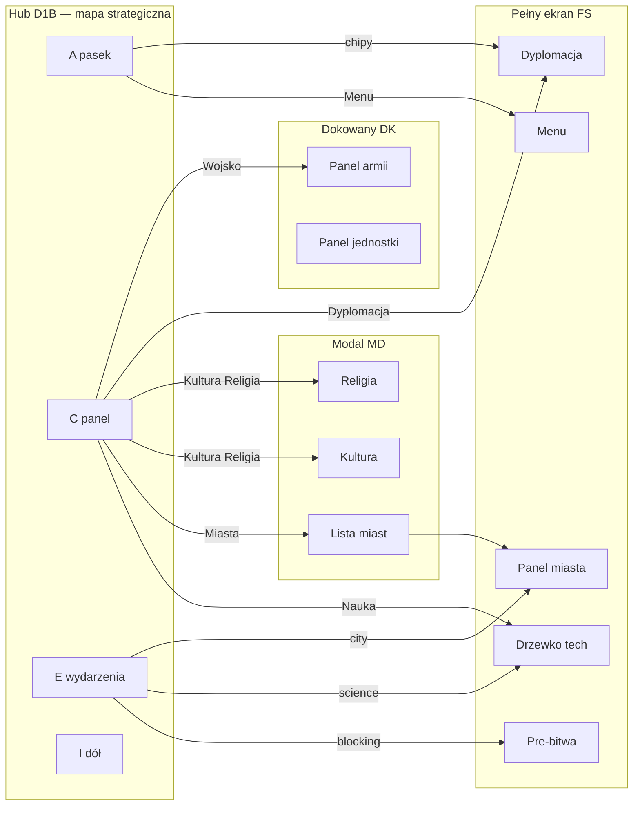

# A1 — Plan mockupów po kliknięciu (HUD mapy D1=B)

| Pole | Wartość |
|------|---------|
| **ID** | A1-MOCKUPY-KLIK |
| **Data** | 2026-06-26 |
| **Status** | **P0 ZROBIONE** (2026-06-26) — hub podpięty, przewodnik: `docs/A1-HUD-KLIKI-MOCKUP-PRZEWODNIK.md` |
| **Hub** | `UI/Makieta-HUD-D1B-preview.html` — **główny mockup mapy strategicznej** |
| **Mapa logiki klików** | `docs/A1-HUD-MAP-KLIKNIEC.md` |
| **Excel** | `Status-projektu-The-Game.xlsx` → arkusz **`HUD-mapa-kliki`** (+ nowa kolumna *mockup* w tej fazie) |

---

## 0. Flow gry (przed HUD-em mapy)

**Pełny schemat:** `docs/A1-FLOW-EKRANY-GRY.md`

| Etap | Plik mockupu | Rola |
|------|--------------|------|
| **[S0] Menu główne** | `UI/Gra-podglad-MENU.html` | **Punkt startu gry** (Maciej 2026-06-26) |
| **[S1] Nowa gra** | `UI/Makieta-flow-nowa-gra.html` | 5 kroków: intro → cywilizacja → epoka → ustawienia → generacja |
| **[S2] Mapa / HUD** | `UI/Makieta-HUD-D1B-preview.html` | Ten dokument + hub kliknięć |

Menu z [S2] (☰ prawy górny [A]) → powrót do **[S0]**.

---

## 1. Po co ten dokument

Maciej ma **jeden ekran** (hub D1B) z całym HUD-em. Kolejny krok to dla **każdego klikalnego elementu** ustalić:

1. **Co się dzieje** po kliknięciu (logika — już w A1-KLIKI).
2. **Jak to wygląda** (osobny mockup HTML lub overlay w hubie).
3. **Gdzie to pokazujemy** (pełny ekran, modal, panel boczny, tryb na mapie).
4. **Status** — co jest dziś (toast / szkic / gotowy plik).

**Cel v1.0 mockupów:** Maciej klika w hubie D1B → widzi **prawdziwy wygląd** docelowego panelu (nie tylko toast).

---

## 2. Hub vs osobne pliki

| Sposób | Kiedy | Przykład |
|--------|--------|----------|
| **Overlay w hubie D1B** | Małe / średnie panele imperium; szybki podgląd w jednym F5 | Kultura, Religia, Miasta (lista), Nauka (skrót) — **już częściowo** |
| **Pełnoekran w hubie** | Przykrywa mapę; ESC wraca do HUD | Drzewko tech, panel miasta, dyplomacja, menu |
| **Osobny plik HTML** | Duży, złożony UI — link z huba lub embed później | `Makieta-panel-armii.html`, `Gra-podglad-MIASTO.html` |
| **Tryb na mapie (G2)** | HUD zostaje; banner + panel boczny + kursor | Budowa ulepszeń |
| **Tylko mapa / toast** | Brak osobnego mockupu panelu | Toggles F2, zasoby [A] bez kliku |

**Zasada na fazę mockupów:** najpierw **podpinamy istniejące pliki** (Gra-podglad-*, Makieta-*); brakujące robimy jako **nowe overlaye w D1B** lub **nowy plik w `UI/`**.

---

## 3. Typy wyświetlania (słownik)

| Typ | Kod | HUD mapy w tle | Zamknięcie | Docelowy moduł gry |
|-----|-----|----------------|------------|------------------|
| Pełnoekran | **FS** | ukryty / przyciemniony | ESC, Zamknij, „Mapa" | `sciencePicker`, `cityPanel`, `diplomacyPanel`, `mainMenu` |
| Modal średni | **MD** | widoczny (blur) | ✕, klik tła | overlay kultura/religia/miasta/cuda |
| Panel dokowany | **DK** | widoczny | ✕ / ESC | panel armii [H rozszerzony] |
| Tryb mapy | **MP** | **cały HUD** + banner | ESC (G2) | tryb Budowa |
| Warstwa 3D | **W3** | bez panelu | toggle OFF | granice, nazwy, zasięgi |
| Tooltip | **TT** | — | — | zasoby [A] |
| Akcja natychmiastowa | **AX** | — | — | koniec tury, ruch jednostki |

---

## 4. Tabela — klik z hubu D1B → mockup

Legenda statusu: ✅ w hubie · 🔗 osobny plik (istnieje) · 📝 szkic w hubie · ⬜ do zrobienia · — brak panelu

### [A] Pasek górny

| Klik | Typ | Co pokazujemy | Plik mockupu | Status | Priorytet |
|------|-----|---------------|--------------|--------|-----------|
| Zasoby (Żywność…Ludność) | TT | Tooltip — bez panelu v1.0 | — | — | — |
| Epoka | TT | Tylko pasek % | — | — | — |
| **Power [A′]** | MD | Składniki potęgi + ranking | 📝 `ov-power` w D1B | 📝 | **P1** |
| Chip **Sojusz** 🤝 | FS | `diplomacyPanel` — zakładka relacje, **fokus nacja** | ⬜ `UI/Makieta-dyplomacja.html` (nowy) lub 🔗 fragment w Gra-podglad | ⬜ | **P1** |
| Chip **Pakt** 🕊️ | FS | j.w., sekcja paktów | j.w. | ⬜ | **P1** |
| Chip **Wojna** ⚔ | FS | j.w., fokus wróg + wojna | j.w. | ⬜ | **P1** |
| **☰ Menu** | FS | Menu główne | 🔗 `UI/Gra-podglad-MENU.html` | 🔗 | **P0** |

### [C] Panel Imperium

| Klik | Typ | Co pokazujemy | Plik mockupu | Status | Priorytet |
|------|-----|---------------|--------------|--------|-----------|
| 🏙 Miasta | FS / MD | Lista miast → klik → pełny panel miasta | 📝 `ov-miasta` w D1B · 🔗 `UI/Gra-podglad-MIASTO.html` | 📝+🔗 | **P0** |
| 🔬 Nauka | FS | Drzewko technologii (mapa w tle G3) | 🔗 `UI/Makieta-drzewko-uklad-bez-przeciec.html` · `UI/Gra-podglad-NAUKA.html` | 🔗 | **P0** |
| 🎭 Kultura | MD | Parametry imperium (A1-Q12a) | 📝 `ov-kultura` w D1B | 📝 | **P1** |
| ⛪ Religia | MD | Parametry imperium (A1-Q12b) | 📝 `ov-religia` w D1B | 📝 | **P1** |
| 🏛 Cuda | MD / FS | Lista cudów + postęp budowy | ⬜ `UI/Makieta-cuda.html` | ⬜ | **P2** |

### [C] Panel Akcje

| Klik | Typ | Co pokazujemy | Plik mockupu | Status | Priorytet |
|------|-----|---------------|--------------|--------|-----------|
| 🤝 Dyplomacja | FS | Pełny panel dyplomacji (bez fokusu) | ⬜ `UI/Makieta-dyplomacja.html` | ⬜ | **P0** |
| ⚔ Wojsko | DK | Zarządzanie armią, posiłki, lista wojsk | 🔗 `UI/Makieta-panel-armii.html` | 🔗 | **P0** |
| 🔨 Budowa | MP | Banner G2 + panel 15 ulepszeń + ghost na hexie | ⬜ tryb w D1B lub 🔗 wzorzec `gra/src/mainview/index.html` | ⬜ | **P1** |

### [E] Wydarzenia

| Klik | Typ | Co pokazujemy | Plik mockupu | Status | Priorytet |
|------|-----|---------------|--------------|--------|-----------|
| Chip blocking (wróg) | FS | `preBattle` → bitwa | ⬜ `UI/Makieta-preBattle.html` | ⬜ | **P0** |
| Chip science | FS | `sciencePicker` | 🔗 drzewko | 🔗 | P0 |
| Chip city | FS | `cityPanel` | 🔗 MIASTO | 🔗 | P0 |
| Chip + **✕** | AX | dismiss — bez mockupu | — | — | — |

### [F] / [F2] Minimapa

| Klik | Typ | Co pokazujemy | Plik mockupu | Status | Priorytet |
|------|-----|---------------|--------------|--------|-----------|
| Minimapa hex | AX | Skok kamery — animacja w D1B | — | toast | — |
| 🗺️ 🏷️ 🎭 ⛪ toggles | W3 | Warstwa na mapie — bez panelu | efekt w D1B (overlay kultury/religii) | ✅ częściowo | — |

### [I] / [I2] Dół

| Klik | Typ | Co pokazujemy | Plik mockupu | Status | Priorytet |
|------|-----|---------------|--------------|--------|-----------|
| WYKONAJ | AX | Otwiera ten sam panel co pierwszy blocking chip | routing jak [E] | toast | P0 |
| Zakończ turę | AX | Następna tura — bez overlay | toast | ✅ | — |

### [D] Mapa 3D (klik na hex / jednostkę)

| Klik | Typ | Co pokazujemy | Plik mockupu | Status | Priorytet |
|------|-----|---------------|--------------|--------|-----------|
| Własne miasto | FS | `cityPanel` | 🔗 MIASTO | 🔗 | P0 |
| Obce miasto | FS / TT | Dyplomacja lub tooltip | dyplomacja | ⬜ | P1 |
| Własna jednostka | DK | Panel [H] — akcje jednostki | ⬜ `UI/Makieta-panel-jednostki.html` (A2-Q4) | ⬜ | **P2** |
| Wróg + zaznaczenie | FS | `preBattle` | preBattle | ⬜ | P0 |
| Hex w trybie Budowa | MP | Placement ulepszenia | budowa | ⬜ | P1 |

---

## 5. Kolejność prac (propozycja dla Macieja)

### Paczka **P0** — „przeklikaj całą grę z huba"

1. **Podpiąć w D1B** istniejące pliki (nowa karta lub iframe w overlay): Menu, Nauka, Miasto, Armia.
2. **Nowy mockup:** `Makieta-dyplomacja.html` (sojusz / pakt / wojna = ten sam panel, inny fokus).
3. **Nowy mockup:** `Makieta-preBattle.html` (blocking chip → bitwa).
4. **WYKONAJ** w D1B — symulacja: otwiera ten sam overlay co blocking.

### Paczka **P1** — imperium + budowa

5. Dopracować overlaye **Kultura / Religia / Miasta** (treść z A1-Q12, lista miast klikalna).
6. **Tryb Budowa** w D1B (banner G2 + panel ulepszeń po prawej).
7. Chipy [A] Sojusz/Pakt/Wojna → dyplomacja z fokusem (jeden plik, 3 stany demo).

### Paczka **P2** — reszta v1.0

8. **Cuda** — lista + postęp.
9. **Panel jednostki [H]** (zależy od A2-Q4).
10. Tooltips zasobów [A] (opcjonalnie).

---

## 6. Jak podpinamy mockupy w hubie D1B (technicznie)

**Faza mockupów (teraz):**

```
Klik w D1B
  → jeśli MD: openOverlay('ov-…')     ← już jest dla 4 paneli
  → jeśli FS: openFullscreen(url)     ← do dodania: iframe 100% lub wklejony HTML
  → jeśli 🔗: window.open('UI/…')   ← tymczasowo OK dla playtestu Macieja
  → jeśli MP: classList body 'build-mode' + pokaż banner/panel
```

**Po akceptacji Macieja → MASTER:** moduły `gra/src/ui/*.ts`, bez iframe — jeden build Vite.

---

## 7. Schemat przepływu (Maciej)



---

## 8. Checklist akceptacji (Maciej)

Dla każdego mockupu z paczki P0:

- [ ] Klik z huba D1B otwiera **właściwy** ekran (nie toast).
- [ ] Widać **ESC / Zamknij / Mapa** — powrót do HUD.
- [ ] Styl spójny z D1B (ciemny + złoto).
- [ ] Blocking chip **blokuje** „Zakończ turę" (G1) — widać w hubie.
- [ ] Maciej sign-off → wpis w `docs/MACIEJ-HUD-CHECKLIST-D1B.md` → dopiero wtedy MASTER wpina `hud.ts`.

---

## 9. Pliki powiązane

| Plik | Rola |
|------|------|
| `UI/Makieta-HUD-D1B-preview.html` | **Hub** — główny mockup |
| `UI/Gra-podglad-MENU.html` | Menu |
| `UI/Gra-podglad-MIASTO.html` | Panel miasta |
| `UI/Gra-podglad-NAUKA.html` | Nauka (starszy podgląd) |
| `UI/Makieta-drzewko-uklad-bez-przeciec.html` | Drzewko tech (docelowe) |
| `UI/Makieta-panel-armii.html` | Wojsko |
| `docs/A1-HUD-MAP-KLIKNIEC.md` | Logika klików |
| `docs/decyzje/A1-revB-uklad-mockup.md` | Układ stref A–I2 |

---

## 10. Następny krok operacyjny

**Maciej:** akceptuj kolejność **P0 → P1 → P2** (lub zmień priorytety ABC).

**Grupa A / UI mockup:** implementacja podpięć w D1B + nowe pliki `Makieta-dyplomacja.html`, `Makieta-preBattle.html`.

**Po P0:** review Opus → handoff MASTER (`dyspozycje/_handoff/UI-do-MASTER_hud-D1B-mockupy.md`).
