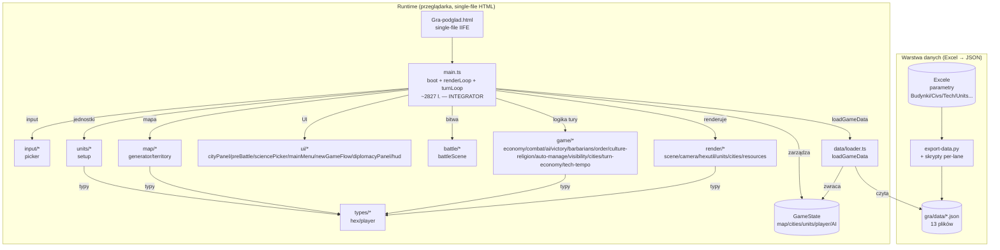
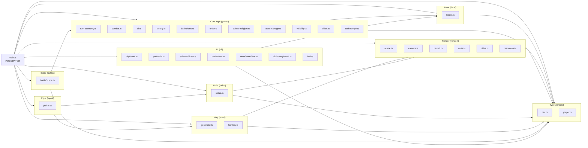
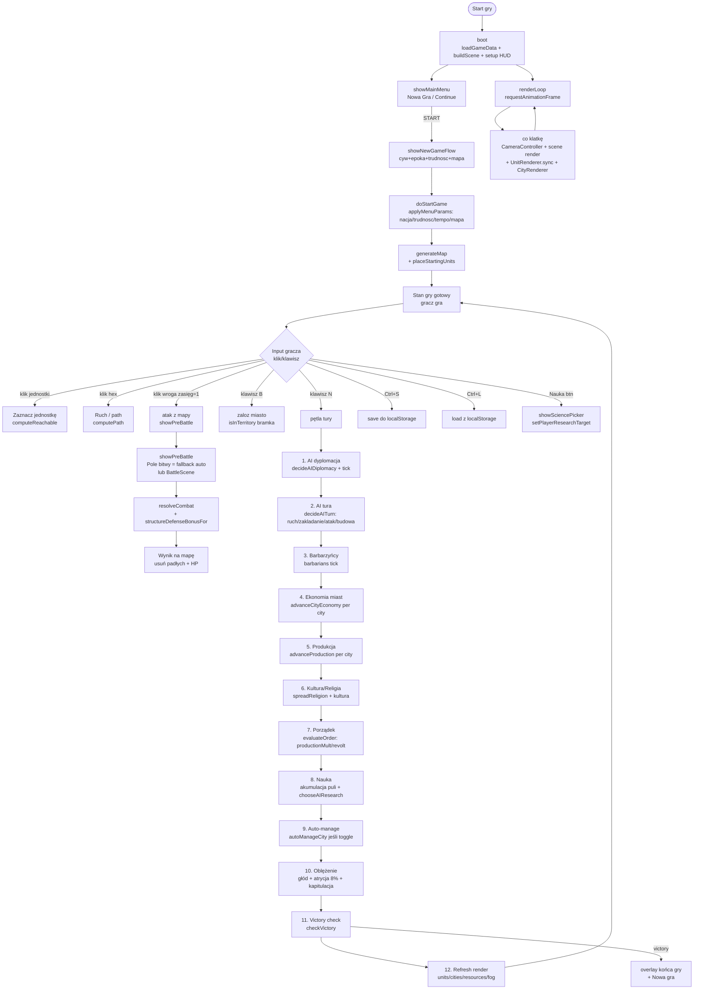
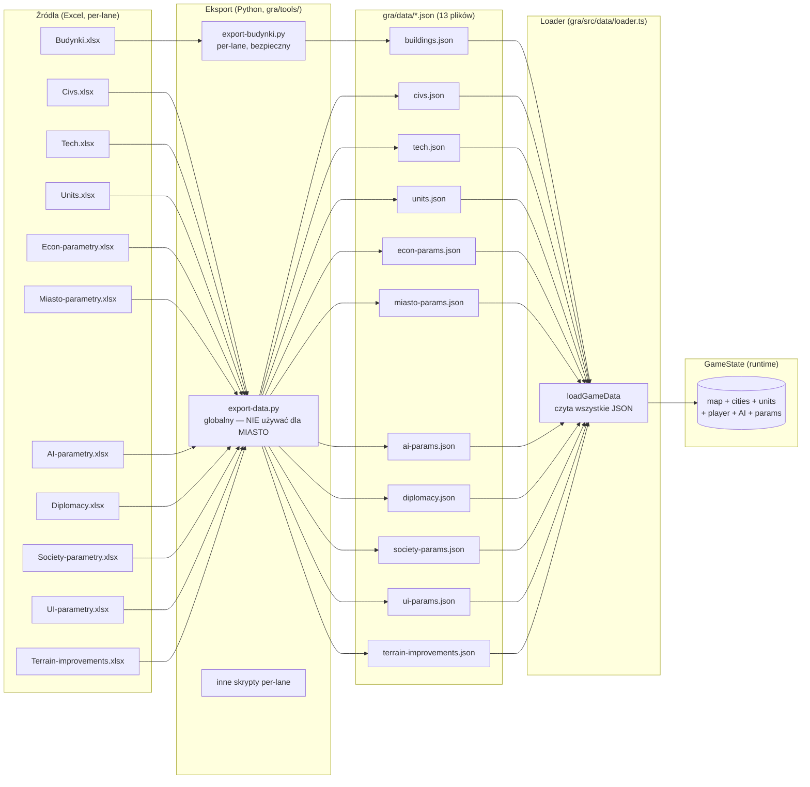
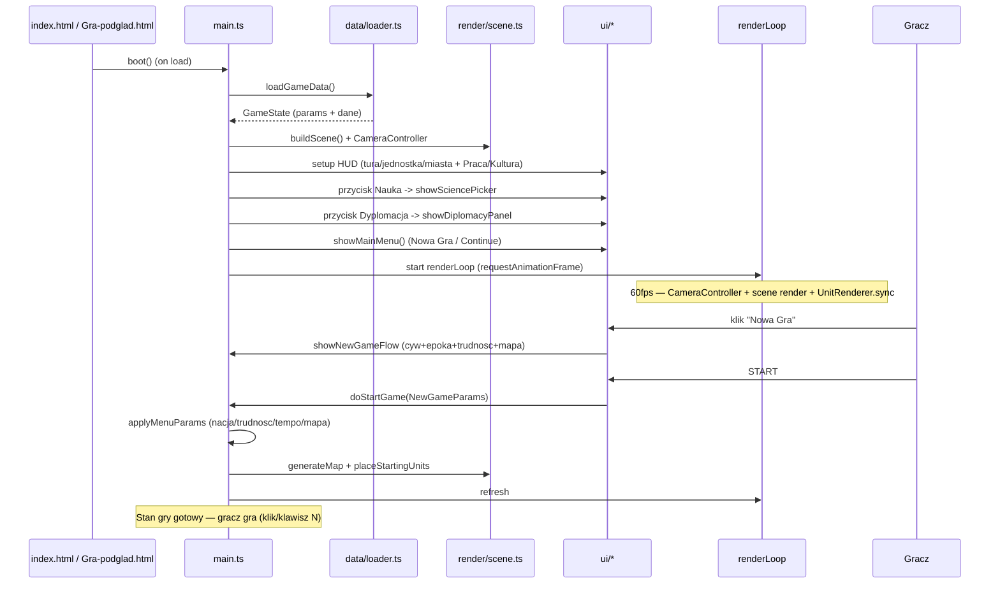

# CURSOR — ARCHITEKTURA (Civ / "The Game")

> Referencja architektoniczna dla projektu gry 4X "The Game" (Civ).
> Powstała na podstawie audytu `SILNIK/SILNIK-ARCHITEKTURA-DEWELOPER.md`, `gra/src/main.ts` (importy + struktura), modułów `gra/src/{game,render,battle,ui,map,units,data,types,input}/*`, `gra/package.json`, `gra/tsconfig.json`, `gra/vite.config.ts`, `gra/index.html` oraz `ARCHITEKTURA-PLIKI.md`.
>
> **Data audytu:** 2026-06-26. **Kanon:** `Gra-podglad.html` (md5 `2276ec0f`).
> **Autor:** GLM 5.2 (Agent) — rola Architekt.

---

## 1. Tech stack

| Warstwa | Technologia | Wersja / uwagi |
|---------|-------------|----------------|
| **Język** | TypeScript | `strict: true`, `noUncheckedIndexedAccess`, `verbatimModuleSyntax`, `resolveJsonModule`, `noEmit` (`gra/tsconfig.json`) |
| **Bundler** | Vite | `vite-plugin-singlefile` → jeden plik HTML (IIFE); `fixScriptTag` dla `file://` CORS (`gra/vite.config.ts`) |
| **Grafika 3D** | three.js | import `* as THREE from 'three'`; render heksów, jednostek, miast, surowców, bitwy |
| **Runtime** | Przeglądarka | gra dwuklik z `file://` (single-file HTML); brak serwera w produkcji |
| **Testy** | Node.js + jsdom | `gra/tools/*.cjs` (pre-bundlowane); playwright (devDep, e2e); 17 suitów, ~762+ testów |
| **Dane** | Excel → JSON | `gra/data/*.json` (13 plików) ładowane przez `data/loader.ts`; eksport `gra/tools/export-data.py` + skrypty per-lane |
| **Dev server** | Vite dev | `npm run dev` (`vite`); `npm run build` (`vite build`, domyślnie `dist/` — ale OneDrive blokuje → build do `/tmp/civ-dist`) |
| **Typecheck** | `tsc --noEmit` | `npm run typecheck` |
| **VCS** | brak git (OneDrive jako VCS) | ryzyko — patrz `CURSOR-PLAN-DZIALANIA.md` §7 |

### Skrypty (`gra/package.json`)
- `npm run data` — eksport Excel→JSON (Python)
- `npm run dev` — Vite dev server
- `npm run build` — `vite build` (do `dist/`; w praktyce `npx vite build --outDir /tmp/civ-dist`)
- `npm run typecheck` — `tsc --noEmit`

### Build protocol (krytyczne dla OneDrive)
```bash
cd gra
npx vite build --outDir /tmp/civ-dist
# wynik: /tmp/civ-dist/Gra-podglad.html (single-file, ~1003 KB)
# kopiować ręcznie do root projektu jako Gra-podglad.html
```
OneDrive blokuje zapis do `gra/dist/` (dehydratacja) → **zawsze budować do `/tmp/`**.

---

## 2. High-level system diagram (Mermaid)



**Kluczowe:** `main.ts` jest centralnym integratorem — importuje i wywołuje systemy ze wszystkich lane'ów. Dane płyną Excel→JSON→loader→GameState; GameState mutowany przez `turnLoop` (klawisz "N"); renderowany co klatkę przez `renderLoop`.

---

## 3. Module dependency graph (Mermaid)

Zależności importów między katalogami modułów (na podstawie importów w `main.ts` + struktury `gra/src/`).



**Zasada:** `main.ts` jest jedynym modułem, który importuje ze WSZYSTKICH katalogów. Moduły wewnątrz `game/`, `render/`, `map/`, `units/`, `battle/`, `ui/` importują głównie z `data/` i `types/` (rzadko cross-lane bezpośrednio) — koordynacja cross-lane odbywa się przez `main.ts` (lub przez kontrakty w `_handoff/` + wpięcie przez SILNIK).

---

## 4. Turn loop / runtime flow (Mermaid)

Pętla tury (klawisz "N" = next turn) oraz pętla renderowania (co klatkę, `requestAnimationFrame`).



**Klucz:** pętla tury (kolejność 1-12) jest SEKWENCYJNA i zdefiniowana w `main.ts`. Każdy krok wywołuje moduł z `game/`. Pętla renderowania jest asynchroniczna (60fps) i tylko odzwierciedla `GameState`.

---

## 5. Connection map (co importuje / wywołuje co)

Na podstawie importów w `main.ts` (linie 43-116) — pełna mapa wywołań.

### main.ts → data/
- `loadGameData` (z `data/loader.ts`) — ładuje wszystkie `gra/data/*.json` do `GameState`

### main.ts → map/
- `generateMap`, `DEFAULT_WIDTH`, `DEFAULT_HEIGHT` (z `map/generator.ts`) — generator heks
- `isInTerritory`, `CityNode` (z `map/territory.ts`) — bramka terytorialna zakładania miast

### main.ts → render/
- `buildScene` (z `render/scene.ts`) — scena Three.js
- `CameraController` (z `render/camera.ts`) — kamera + kontrola
- `HEX_R`, `axialToWorld`, `worldToAxial` (z `render/hexutil.ts`) — geometria heks
- `UnitRenderer` (z `render/units.ts`) — render jednostek
- `CityRenderer`, `CityRenderOptions` (z `render/cities.ts`) — render miast
- `buildResourceOverlay` (z `render/resources.ts`) — overlay surowców

### main.ts → units/
- `placeStartingUnits`, `computeReachable`, `computePath`, `listUnitTypes`, `pathCost`, `configureTerrainMovement`, `hexDistance`, `categoryOf`, `RuntimeUnit` (z `units/setup.ts`) — setup + ruch jednostek

### main.ts → input/
- `pixelToHex`, `unitAt`, `keyOf` (z `input/picker.ts`) — hit-testing klików

### main.ts → game/
- `advanceCityEconomy`, `EconUnit` (z `game/turn-economy.ts`) — ekonomia per-tura
- `canFoundCity`, `foundCity`, `foundCityAt`, `cityName`, `City` (z `game/cities.ts`) — miasta
- `computeVisible`, `addExplored`, `allHexKeys`, `DEFAULT_SIGHT` (z `game/visibility.ts`) — mgła wojny
- `resolveCombat`, `CombatUnit` (z `game/combat.ts`) — resolver walki
- `loadOrderParams`, `evaluateOrder` (z `game/order.ts`) — porządek (szczęście+prawo)
- `decideAITurn`, `chooseAIResearch`, `decideAIDiplomacy`, `loadDifficultyParams`, `AITurnOpts`, `RelacjaWejscie`, `DiplomacyInputs`, `AIDiplomacyCommand` (z `game/ai.ts`) — AI
- `checkVictory`, `VictoryPlayer`, `VictoryInput` (z `game/victory.ts`) — warunki zwycięstwa
- `BarbCamp`, `BarbUnit` (z `game/barbarians.ts`) — barbarzyńcy
- `autoManageCity` (z `game/auto-manage.ts`) — auto-zarządca miasta
- `applyTempoKoszt`, `TempoGry` (z `game/tech-tempo.ts`) — tempo nauki

### main.ts → battle/
- `BattleScene`, `BattleUnit` (z `battle/battleScene.ts`) — taktyczna bitwa 3D

### main.ts → ui/
- `showCityPanel`, `hideCityPanel`, `isCityPanelOpen`, `configureCityPanel` (z `ui/cityPanel.ts`)
- `showPreBattle`, `hidePreBattle`, `isPreBattleOpen`, `PreBattleInfo`, `PreBattleUnit` (z `ui/preBattle.ts`)
- `configureSciencePicker`, `showSciencePicker` (z `ui/sciencePicker.ts`) — picker badan
- `showMainMenu`, `hideMainMenu` (z `ui/mainMenu.ts`)
- `showNewGameFlow`, `hideNewGameFlow`, `NewGameParams` (z `ui/newGameFlow.ts`)
- `showDiplomacyPanel`, `hideDiplomacyPanel`, `isDiplomacyPanelOpen`, `updateDiplomacyPanel`, `DiploRelation` (z `ui/diplomacyPanel.ts`)

### main.ts → types/
- `TerenBazowy`, `Nakladka` (z `types/hex.ts`)
- `Player`, `TypCywilizacji` (z `types/player.ts`)

### main.ts → three
- `* as THREE` — grafika 3D

### window hooks (public API dla UI/testów)
`main.ts` wystawia na `window.__civ_*`:
- `__civ_setResearchTarget`, `getResearchState`, `getAvailableTechs` — nauka sterowana graczem
- `configureSciencePicker` / `showSciencePicker` — picker
- `setPlayerResearchTarget` — cel badań
- (dokładna lista w `main.ts` — do zmapowania w refaktorze)

---

## 6. Entry points i integration points w main.ts

### Entry points (uruchomienie)
- **`boot()`** (linia 123) — jedyny entry point; wywoływany na load. Sekwencja:
  1. `loadGameData()` → `GameState`
  2. `buildScene()` + `CameraController` → scena Three.js
  3. Setup HUD (tura/jednostka/miasta + Praca/Kultura)
  4. Przyciski: "Nauka" → `showSciencePicker`, dyplomacja → `showDiplomacyPanel`
  5. `showMainMenu()` → gracz wybiera Nowa Gra / Continue
  6. Start `renderLoop` (requestAnimationFrame)
- **`showErr(msg)`** (linia 14) — handler błędów boot (inline w `index.html` też)

### Integration points (gdzie lane'y są wpięte)
| Miejsce w main.ts | Co wpięte | Lane |
|-------------------|-----------|------|
| `boot()` load | `loadGameData` | DANE |
| `boot()` scene | `buildScene`, `CameraController`, `HEX_R` | RENDER |
| `boot()` HUD | HUD setup + przycisk Nauka/Dyplomacja | UI/SILNIK |
| `doStartGame()` | `applyMenuParams` (nacja/trudność/tempo/mapa) + `generateMap` + `placeStartingUnits` | SILNIK/MAPA/UNITS |
| input handler (klik) | `pixelToHex`, `unitAt`, `computeReachable`, `computePath` | INPUT/UNITS |
| akcja "zaloz miasto" (B) | `isInTerritory` bramka + `foundCityAt` | MAPA/MIASTO |
| akcja "atak z mapy" | `showPreBattle` → `resolveCombat` + `structureDefenseBonusFor` | UI/UNITS/SILNIK |
| pętla tury (N) krok 1 | `decideAIDiplomacy` + `tickDiplomacy` | AI/DYPLOMACJA |
| pętla tury krok 2 | `decideAITurn` (ruch/zakładanie/atak/budowa) | AI |
| pętla tury krok 3 | barbarians tick | AI (barbarzyńcy) |
| pętla tury krok 4 | `advanceCityEconomy` per city | EKONOMIA |
| pętla tury krok 5 | `advanceProduction` per city | MIASTO |
| pętla tury krok 6 | spreadReligion + kultura | MIASTO |
| pętla tury krok 7 | `evaluateOrder` (productionMult/revolt) | MIASTO |
| pętla tury krok 8 | akumulacja nauki + `chooseAIResearch` | EKONOMIA/AI |
| pętla tury krok 9 | `autoManageCity` (toggle) | MIASTO |
| pętla tury krok 10 | oblężenie (głód + atrycja + kapitulacja) | UNITS/EKONOMIA |
| pętla tury krok 11 | `checkVictory` | AI |
| pętla tury krok 12 | refresh render (units/cities/resources/fog) | RENDER/MAPA |
| `renderLoop` | `CameraController` + scene render + `UnitRenderer.sync` + `CityRenderer` | RENDER |
| Ctrl+S / Ctrl+L | save/load localStorage | SILNIK |
| `window.__civ_*` | hooks dla UI/testów (nauka, picker) | SILNIK/UI |

### KOLEJKA (gotowe, NIEwpięte — z `SILNIK-ARCHITEKTURA-DEWELOPER.md` + DZIENNIK)
- `manualBattle.ts` (1398 l.) — gotowe, niewpięte (przycisk manualnej bitwy)
- `siege.ts` — gotowe, niewpięte (start oblężenia + HP garnizonu + machiny)
- traversal ruchu z prototypu `RUCH.html` (MAPA)
- typ mapy z menu (MAPA generator)
- BattleScene z mapy (UNITS kontrakt — dziś fallback auto)
- Wealth (EKONOMIA — BLOK decyzje W1-W6)
- plaster EKONOMIA+UI (splitPraca/kup-za-Pieniadz — GOTOWE-do-wpiecia, czeka "idz")
- ulepszenia terenu + posterunki (render gotowy — BLOK akceptacja)
- HUD widok główny + granica C (BLOK akceptacja 6B)

### Orphaned / dead files (z `SILNIK-ARCHITEKTURA-DEWELOPER.md`)
- `research.ts` — zastąpione przez `tech-tempo.ts` + pula sterowana graczem
- `player-economy.ts` — zastąpione przez `turn-economy.ts`
- martwy kod Robotnika (usunięto aktywny ref, martwy zostaje — 2A)

---

## 7. Data flow: Excel → JSON → loader → game state



### Zasady danych (z `PLAYBOOK-operacyjny-Civ.md` + MIASTO handoffy)
- **Jedno źródło prawdy per plik JSON** — owner wg lane'a (patrz `civ-workflow.mdc` §File ownership).
- **Eksport bezpieczny** — MIASTO używa `export-budynki.py` (tylko `buildings.json`), NIE globalny `export-data.py` (ryzyko nadpisania cudzych).
- **`buildings.json` schema `przyrost` ZOSTAJE** — czytane przez `economy.ts` (buildingValue) i `siege.ts` (mury.przyrost.obrona); compound koszt/efekt w `production.ts`/`order.ts`/`culture-religion.ts`.
- **Dehydratacja OneDrive** — JSON mogą appearing truncated; `loader.ts` musi być odporny (lub rebuild po touch).
- **`civs.json` `bonusy[]`** — 27 efektów, pole `realizuje` (walka/miasto/ekonomia) determinuje lane implementujący.

---

## 8. Struktura katalogów `gra/src/`

```
gra/src/
├── main.ts                      # INTEGRATOR (~2827 l.) — boot + renderLoop + turnLoop
├── data/
│   └── loader.ts                # loadGameData — czyta wszystkie JSON
├── game/                        # Core logic (logika tury, bez renderu)
│   ├── cities.ts                # canFoundCity/foundCity/cityName
│   ├── turn-economy.ts          # advanceCityEconomy (plony/wzrost/zywnosc)
│   ├── combat.ts                # resolveCombat + structureDefenseBonusFor
│   ├── ai.ts                    # decideAITurn/chooseAIResearch/decideAIDiplomacy
│   ├── victory.ts               # checkVictory
│   ├── barbarians.ts            # BarbCamp/BarbUnit
│   ├── order.ts                 # loadOrderParams/evaluateOrder (szczescie+prawo)
│   ├── culture-religion.ts      # spreadReligion + kultura
│   ├── auto-manage.ts           # autoManageCity (toggle)
│   ├── visibility.ts            # computeVisible/addExplored/allHexKeys
│   └── tech-tempo.ts            # applyTempoKoszt
├── render/                      # Three.js rendering
│   ├── scene.ts                 # buildScene
│   ├── camera.ts                # CameraController
│   ├── hexutil.ts               # HEX_R/axialToWorld/worldToAxial
│   ├── units.ts                 # UnitRenderer
│   ├── cities.ts                # CityRenderer
│   └── resources.ts             # buildResourceOverlay
├── map/                         # Mapa + terytorium
│   ├── generator.ts             # generateMap (kontynenty/pangea/wyspy)
│   └── territory.ts             # isInTerritory + CityNode
├── units/                       # Jednostki setup + ruch
│   └── setup.ts                 # placeStartingUnits/computeReachable/computePath
├── battle/                      # Bitwa taktyczna
│   └── battleScene.ts           # BattleScene (3D, cios-za-cios)
├── ui/                          # Interfejs (DOM overlay)
│   ├── cityPanel.ts             # panel miasta
│   ├── preBattle.ts             # ekran przed-bitwą
│   ├── sciencePicker.ts         # picker badan (drzewo)
│   ├── mainMenu.ts              # menu główne
│   ├── newGameFlow.ts           # kreator nowej gry
│   ├── diplomacyPanel.ts        # panel dyplomacji
│   └── hud.ts                   # HUD (makieta, częściowo wpięte)
├── input/                       # Hit-testing
│   └── picker.ts                # pixelToHex/unitAt/keyOf
└── types/                       # Typy współdzielone
    ├── hex.ts                   # TerenBazowy/Nakladka
    └── player.ts                # Player/TypCywilizacji
```

### Pliki backup (`main.ts.*`)
`main.ts` ma wiele backupów (OneDrive jako VCS) — nie edytować; git (po wdrożeniu) zastąpi.

---

## 9. Boot sequence (szczegółowo)



---

## 10. Test suites (`gra/tools/*`)

| Plik | Co testuje | Status (wg DZIENNIKA 2026-06-26) |
|------|-----------|----------------------------------|
| `smoke.cjs` | smoke test główny (boot + render) | ZIELONE |
| `battle-smoke.cjs` | smoke bitwy (BattleScene) | ZIELONE |
| `logic-test.cjs` | logika tury (ekonomia/produkcja/porządek/kultura) | 180/180 ZIELONE |
| `combat-test.cjs` | resolveCombat + bonusy obrony | 6/6 ZIELONE |
| `ai-test.cjs` | decideAITurn + archetypy | 113/132 ZIELONE |
| `diplomacy-test.cjs` | diplomacy tick + relacje | 98 ZIELONE |
| `barbarians-test.cjs` | barbarzyńcy | 53 ZIELONE |
| `currency-test.cjs` | waluta + Handel→Pieniadz | ZIELONE |
| `oblezanie-test.cjs` | oblężenie (głód + atrycja + kapitulacja) | 27 ZIELONE |
| `wealth-test.cjs` | Wealth (szkielet) | 25 ZIELONE |
| `converters-test.cjs` | converters EKONOMIA | 30 ZIELONE |
| `auto-manage-test.cjs` | autoManageCity | 26 ZIELONE |
| `found-from-village-test.cjs` | zakładanie z mapy | 24 ZIELONE |
| `happiness-test.cjs` | porządek/szczęście | 38 ZIELONE |
| `okolica-test.cjs` | okolica (zasięg/plony) | 16 ZIELONE |
| `split-output-test.cjs` | splitPraca | 46 ZIELONE |
| `wire-ekonomia-test.cjs` | wire ekonomii | 23 ZIELONE |
| `upkeep-test.cjs` | upkeep | 51 ZIELONE |
| `culture-religion-test.cjs` | kultura/religia | 43 ZIELONE |
| `research-test.cjs` | nauka (pula sterowana) | 33 ZIELONE |
| `koszary-gate-test.cjs` | lazaret.epokaWejscia | **CZERWONE (baseline-red, oczekiwane — Lazaret=Średniowiecze=przyszłość)** |

**Bramka publikacji kanonu:** wszystkie ZIELONE oprócz `koszary-gate-test` (baseline-red, nie regresja — decyzja Macieja 2026-06-26).

### Uruchamianie testów
```bash
cd gra
node tools/logic-test.cjs
node tools/combat-test.cjs
node tools/smoke.cjs
# ... lub wszystkie: for %t in (tools\*.cjs) do node %t
```
**Uwaga środowiskowa:** `node` musi być w PATH (w PowerShell sandbox może nie być — użyć `npx` w worktree Composer lub Cursor terminal z node).

---

## 11. Konwencje i reguły architektoniczne

- **`main.ts` = jedyny integrator** — edytowany TYLKO przez SILNIK (Composer z gated batch).
- **Moduły lane'ów są samowystarczalne** — importują głównie `data/` + `types/`; koordynacja cross-lane przez `main.ts` lub kontrakty `_handoff/`.
- **Strict TS** — `strict: true`, `noUncheckedIndexedAccess` (każdy indeks tablicy wymaga checku), `verbatimModuleSyntax` (importy typów z `import type`).
- **Single-file build** — `vite-plugin-singlefile` + IIFE + `fixScriptTag` (dla `file://`).
- **Build do `/tmp/`** — OneDrive blokuje `gra/dist/`.
- **Dane = JSON** — brak runtime Excel; `loader.ts` czyta JSON, moduły konsumują.
- **`window.__civ_*`** — public API dla UI/testów; stabilne haki.
- **Kanon = `Gra-podglad.html`** — md5 jako checkpoint; dwuklik = grywalne.

---

*Opracowano przez GLM 5.2 (Agent, rola Architekt) na podstawie audytu kodu i dokumentacji Civ, 2026-06-26. Powiązane: `docs/CURSOR-PLAN-DZIALANIA.md`, `docs/CURSOR-BACKLOG.md`, `.cursor/rules/civ-workflow.mdc`.*
