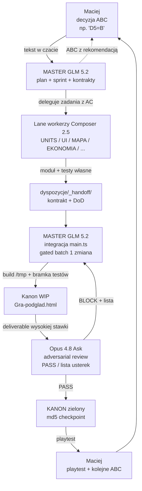

# MASTER-PLAN DOKOŃCZENIA — The Game (Civ)

> **⚠️ ROLE §0–§2 SUPERSEDED (2026-06-30):** Model „MASTER edytuje main.ts" wycofany.
> **Aktualne role:** [`docs/obieg/ROLE-2026-06-30.md`](obieg/ROLE-2026-06-30.md) + [`docs/obieg/_ZASADY.md`](obieg/_ZASADY.md).
> Ten plik zostaje dla harmonogramu faz A–F, decyzji ABC §8 i backlogu historycznego.

> **Główny dokument operacyjny dla Macieja.** Tu się zaczyna i kończy każda sesja.
> Powstał na bazie pełnego audytu (RAPORT-KONCOWY, PLAN-DZIALANIA, BACKLOG, ARCHITEKTURA, DZIENNIK-MASTERA, analiza/06, PLAYBOOK, BACKLOG-PELNY).
> **Data:** 2026-06-26. **Kanon:** `Gra-podglad.html` (md5 `2276ec0f`, grywalny end-to-end, ~762 testy zielone).
> **Autor:** GLM 5.2 (rola MASTER/Architekt). **Język:** polski.

---

## 0. TL;DR — jedna strona dla Macieja

Gra **„The Game" (Civ)** jest dziś **grywalna end-to-end** (menu → mapa 3D → ruch → miasta → ekonomia → AI rywale → atak → save → dyplomacja → warunki zwycięstwa). Kamon `2276ec0f` przechodzi ~762 testów (1 świadomy czerwony baseline — koszary-gate, nie naprawiać).

**Do v1.0 (skończona gra)** brakuje:
1. **Twoich decyzji ABC** — 9 decyzji P0 + 6 decyzji dodatkowych (patrz §8, Karta Decyzji).
2. **Wpięcia gotowych modułów** do silnika (multi-unit, start oblężenia, pełny generator, pełny HUD, mechanizacja bonusów cywilizacji).
3. **Bitwy manualnej + oblężenia** (epik, kontrakty już dostarczone przez UNITS).
4. **Wealth minimalny** + strojenie AI + polish UI.

**Model pracy (2026-06-30):** Ty decydujesz (ABC) → **Master Orkiestrator** (hub, bez kodu) planuje i deleguje → Grupy A–E kodują moduły → **Grupa F** wpina `main.ts` → Master weryfikuje → Opus 4.8 review → kanon. Szczegóły: [`docs/obieg/ROLE-2026-06-30.md`](obieg/ROLE-2026-06-30.md).

**Najbliższy krok:** otwórz `docs/MACIEJ-DECYZJE-ROZWINIETE.md` (główna lektura — każde pytanie ABC tłumaczone prostym językiem: co zrobimy, co zobaczysz, plusy/minusy/czas), rozstrzygnij D1–D5 (odblokowują ~40% pracy), wpisz litery w skróconej tabeli `docs/MACIEJ-KARTA-DECYZJI.md`, napisz w czacie: „D1=C, D2=A, D3=C, D4=A, D5=B" → MASTER rusza Sprint 1. **Od 2026-06-26 wszystkie pytania ABC używają formatu z `MACIEJ-DECYZJE-ROZWINIETE.md`.**


### Git (gałęzie)

- **`main`** — stabilny kanon (`Gra-podglad.html`); zmiany tylko po review **Opus 4.8** i merge przez MASTER.
- **`develop`** — praca agentów (lane), buildy testowe; tu commituje Composer.
- Maciej **nie musi** używać gita — szczegóły: `docs/GIT-WORKFLOW.md`.

---

## 1. Rola Macieja — co decydujesz, czego NIE robisz

### ✅ Co robisz (Twoja rola = DECYDENT GAMEPLAY)

- **Decyzje produktowe w formacie ABC** — wybierasz literę A/B/C dla każdej decyzji (patrz §8 + Karta Decyzji). To Twoje główne zadanie.
- **Playtest** — grasz w `Gra-podglad.html` (dwuklik), oceniasz „czy to fajne", zgłaszasz uwagi.
- **Akceptacja makiet** — drzewko technologii, panel armii, podgląd miast BRAZU, mockup HUD.
- **Priorytety biznesowe** — co najpierw (bitwa vs ekonomia vs polish), harmonogram.
- **Wartości balansu** — liczby w Excele (koszty, bonusy cywilizacji, progi) → eksport do JSON.
- **Ostateczny sign-off v1.0** — „gra gotowa do wydania" to Twój werdykt.

**Zasada nadrzędna (PLAYBOOK §17a):** KAŻDA decyzja idzie przez ABC → Ty akceptujesz/korygujesz → DOPERO wtedy MASTER rozsyla dyspozycje do lane'ów. Nic nie trafia do kodu bez Twojej akceptacji (wyjątek: czysto inżynierskie wpicie JUŻ zatwierdzonego modułu — execution bez pytania).

### ❌ Czego NIE robisz (to robią role techniczne)

| Czego nie robisz | Kto to robi |
|---|---|
| Kod TypeScript / edycja `main.ts` / modułów `gra/src/*` | Composer 2.5 (lane worker) |
| Integracja modułów w silnik, build ROBOCZA | **Grupa F** (osobny czat) — jedyny editor `main.ts` |
| Plan, dyspozycje, weryfikacja, ACK kanonu | **Master Orkiestrator** (hub) — **bez kodu** |
| Review przed ACK | **Subagent readonly** (Master wywołuje) — **Opus wycofany** |
| Integracja `main.ts`, build, publish | **Grupa F** (osobny czat) — jedyny editor `main.ts` |

**Nie musisz rozumieć kodu.** Twój język to „chcę bitwę ręczną", „HUD ma mieć minimapę", „Wealth ma być prosty". MASTER tłumaczy to na zadania techniczne.

---

## 2. Model ról technicznych (SUPERSEDED — czytaj ROLE-2026-06-30)

> **Nieaktualne:** poniższa tabela mówiła „MASTER = jedyny editor main.ts". **Od 2026-06-30:** [`docs/obieg/ROLE-2026-06-30.md`](obieg/ROLE-2026-06-30.md).

| Rola | Edytuje `main.ts`? |
|------|---------------------|
| Master Orkiestrator (hub) | **NIE** |
| Grupa F Integrator-kod | **TAK — jedyny** |
| Grupy A–E | NIE |
| Opus 4.8 | NIE |

---

## 2-legacy. Model 3 ról technicznych + MASTER (archiwum 2026-06-26)

---

## 3. Schemat działania — jak płynie praca



**Sekwencja jednego zadania (np. „wpięcie multi-unit"):**
1. **Maciej** decyduje D8=A (posiłki 1 heks) w czacie.
2. **MASTER** (GLM, nowy chat) czyta kontrakt `_handoff/UNITS-do-MASTER_kontrakt-walka-multi.md`, planuje batch (AC, zależności), ew. pyta Macieja o ABC jeśli konflikt.
3. **MASTER** wpija do `main.ts` (gated batch = 1 zmiana), build do `/tmp/civ-dist`, bramka testów.
4. **Opus 4.8** (Ask, ręczny) robi adversarial review wg DoD → PASS lub lista usterek.
5. Jeśli PASS → MASTER publikuje kanon (`Gra-podglad.html`), wpis do `DZIENNIK-MASTERA.md`, md5 checkpoint.
6. Jeśli BLOCK → MASTER/Composer naprawia (max 2 cykle) → ponownie Opus.
7. **Maciej** playtestuje kanon, zgłasza kolejne ABC.

---

## 4. Token economy — jak nie przepalać kontekstu

Koszt = **liczba zimnych startów agenta × objętość kontekstu każdego startu**. Tekst jest tani; drogi jest każdy nowy agent ładujący kontekst od zera.

### 4.1 Kiedy nowy chat, kiedy subagent

| Sytuacja | Tryb | Dlaczego |
|---|---|---|
| Zmiana roli (GLM→Composer→Opus) | **Nowy chat** | Czysty kontekst, niższy koszt, brak przeładowania |
| MASTER planuje sprint | 1 chat GLM | MASTER trzyma big picture |
| Lane worker implementuje 1 zadanie z AC | **Subagent Composer** (Task tool, `composer-2.5-fast`) | Izolowany, wąski kontekst, po skończeniu raport wraca do MASTER |
| Review deliverable do kanonu | **Opus Ask** (ręczny, nowy chat) | Read-only, świeży sceptyk, bije self-preference |
| Kilka NIEZALEŻNYCH lane'ów (UI + MAPA + DANE) | **Subagenci równolegle** (multitask) | Patrz §WORKFLOW-SCHEMAT — tylko niezależne lane'y |
| SILNIK integracja `main.ts` | **SEKWENCYJNIE** (1 edytor naraz) | `main.ts` = monolit, zero kolizji |
| Pętla „aż zielone" (build/testy) | **MAX 3 przebiegi** | Bezpiecznik — potem STOP + eskalacja |

### 4.2 Max scope per lane (jedno zadanie na subagent-chat)

- **1 lane = 1 subagent-chat = 1 zadanie z AC.** Nie ładuj 3 zadań na jednego workera.
- Lane worker czyta: swój `<LANE>-STAN.md` (12 linii) + kontrakt z `_handoff/` + AC. **NIE czyta całego `main.ts`** (~2827 linii — to monopol MASTER).
- Lane worker czyta TYLKO pliki swojego lane'a + `data/` + `types/`. Cross-lane koordynacja idzie przez kontrakty, nie przez czytanie cudzego kodu.

### 4.3 Idea `<LANE>-STAN.md` (progressive disclosure)

Zamiast czytać pełną dyspozycję przy każdym starcie, warstwuj (PLAYBOOK §3.2):

| Warstwa | Plik | Kiedy czyta | Rozmiar |
|---|---|---|---|
| **STAN** | `dyspozycje/<LANE>-STAN.md` | ZAWSZE na starcie | ≤ 12 linii (obecny krok, status, 2 ostatnie zdarzenia) |
| **Dyspozycja** | `dyspozycje/<LANE>.md` | Gdy STAN sygnalizuje nowe zadanie | ~60–100 linii |
| **Historia** | `dyspozycje/<LANE>-DO-MASTERA.md` | Tylko na żądanie / eskalacja | rosnący → decay (ostatnie 10 wpisów) |

**Dziś:** pliki `<LANE>-STAN.md` jeszcze nie istnieją — to punkt wdrożenia w Fazie A (S1.6). Efekt: ~80% tańszy self-check lane'a.

### 4.4 Twarde limity (bezpieczniki tokenów, PLAYBOOK §11)

- Loop-until-done (build/testy): **MAX 3 przebiegi** → STOP + raport.
- Verify-loop (worker→sędzia→poprawka): **MAX 2 cykle** → STOP + eskalacja.
- Fan-out (równolegle subagenci): **pilot 2 itemy** → max 10 równoległych.
- **MAX 12 wywołań subagentów** na jedno zadanie bez zgody MASTER → STOP + pytaj.
- Tournament (balans): **MAX 6 rund**.

---

## 5. Mapa 10 lane'ów — stan, co brakuje, następny krok, kto

Procenty z `Status-projektu-The-Game.xlsx` + korekta z `DZIENNIK-MASTERA` (2026-06-26). **Owner = domyślna rola w Cursor.**

| Lane | Pliki (własność) | % | Co brakuje do v1.0 | Następny krok | Kto |
|---|---|---|---|---|---|
| **SILNIK** | `gra/src/main.ts` (JEDYNY editor!), `Gra-podglad.html` | ~75% | Wpięcie: multi-unit (RDY-02), start oblężenia (RDY-03), pełny generator + typ z menu (RDY-06), pełny `hud.ts` (RDY-08), moduły AI (RDY-10), mechanizacja bonusów (RDY-01), akcja „buduj ulepszenie" (BLK-04), fix Sumer→Babilon | Sprint 1: plaster EKONOMIA+UI (BLK-02) + granica C | **Composer 2.5 (gated batch)** — review Opus |
| **EKONOMIA** | `economy.ts`, `turn-economy.ts`, `upkeep.ts`, `converters.ts`, `wealth.ts` | ~72% | Wealth kod (BLK-03 po D3=C), migracja compound (RDY-12), `mnoznikHandelPieniadz` per-cyw (RDY-11), surowce żelazo/stal (D14) | Po D3: Wealth minimalny (pula + 1 zarabianie + 1 wydawanie) | **Composer** — plan GLM, review Opus |
| **MIASTO** | `cities.ts`, `production.ts`, `order.ts`, `culture-religion.ts`, `auto-manage.ts` | ~88% | Etap2 (RDY-13: growthMult/tradeMult/pełny spread), bonusy ulepszeń, pula Pracy, budynek „Mury" (INP-03) | Etap2 po Fazie D | **Composer** — review Opus |
| **UNITS** | `units/setup.ts`, `combat.ts`, `battle/*`, `siege.ts`, `manualBattle.ts` | ~85% | Implementacja AUTO-rozstrzygania (RDY-02), model armii/merge/transfer (D7), UX bitwy Q2-Q7 (BLK-05 po D5), Katapulta epoka (D10), nowe modele render (INP-01) | Po D5: UX bitwy Q2-Q7 (UI proponuje domyślne) | **Composer** — UX plan GLM, review Opus |
| **UI** | `gra/src/ui/*` (cityPanel, preBattle, sciencePicker, mainMenu, newGameFlow, diplomacyPanel, hud) | ~78% | Pełny `hud.ts` (RDY-08, po D1), panel transferu armii (D7, po v0.1), port drzewka (po D11), paczka zwrotna MIASTO, podgląd miast BRAZU (D12) | Po D1: pełny HUD wg akceptacji | **Composer** — mockupy GLM, review UX |
| **DANE** | `gra/data/*` (civs.json, tech.json, units.json, buildings.json, *.json), `loader.ts`, `export-*.py` | ~85% | Surowce żelazo/stal (D14), `terrain-improvements.json` wartości (BLK-04 po D4) | Po D4: wartości ulepszeń w JSON | **Composer** (targeted export) — review Opus |
| **AI** | `ai.ts`, `barbarians.ts`, `victory.ts` | ~70% | Harness testowy (RDY-10), heurystyka nauki AI, heurystyka fight/flee (RDY-04), strojenie archetypów 7→9 | Po Fazie C: fight/flee hook | **Composer** — heurystyki plan GLM |
| **DYPLOMACJA** | `diplomacy.ts` | ~68% | Efekty relacji na rozgrywkę (RDY-14, świadomie bezczynne v0.1 → po v0.1) | Po v0.1 | **Composer** |
| **MAPA** | `map/*` (generator, territory), `render/*` (scene, camera, hexutil, units, cities, resources) | ~72% | Traversal ruchu z prototypu (RDY-05), typ mapy z menu (RDY-06), granica C render, nazwy klastrów (RDY-07), instancjonowanie przy 20k heksów, minimapa wariant (D15) | Sprint 2: traversal + typ mapy z menu | **Composer** — generator plan GLM, screenshot review |
| **CYWILIZACJE** | `civs.json`, archetypy, `clusters.ts`, współdzieli z AI/DANE | ~70% | Mechanizacja bonusów 23/1/3 (RDY-01), Sumer/Babilon fix (RDY-09), defaulty startu cross-lane (D13), korekta liczb balansu | Równolegle z Sprint 1: rozdział bonusów | **GLM** (archetypy/balans) + Composer (kod) |

**Średnia gotowość modułów:** ~76%. **Integracja w grę:** ~75%. **Grywalność v1.0 (cel):** ~75% dziś → 100% po Fazie F.

---

## 6. Etapy do końca gry (Faza A–F)

Każda faza ma **cel, zadania (z ID backlog), exit criteria**. Sprint = ~1 tydzień. Fazy mogą się częściowo nakładać (niezależne lane'y równolegle).

### Faza A — Odblokowanie decyzji (tydzień 0–1)

**Cel:** Maciej rozstrzyga wszystkie decyzje ABC P0 → MASTER ma „zielone światło" na Sprint 1+2.

**Zadania:**
- Maciej: `MACIEJ-KARTA-DECYZJI.md` → D1, D2, D3, D4, D5, D8, D10, D11, D12, D13, D14, D15 (format ABC).
- MASTER (GLM, nowy chat): sprint planning Sprint 1 + 2 (AC, zależności, kolejność).
- MASTER: utwórz `<LANE>-STAN.md` × 10 w `dyspozycje/` (S1.6, ≤12 linii każde).
- MASTER: zrób `Wealth spec` minimalny (po D3=C) — model pula + 1 zarabianie + 1 wydawanie.

**Exit criteria:**
- [ ] ≥9 decyzji ABC zapisanych w `MACIEJ-KARTA-DECYZJI.md` (z datą + literą).
- [ ] 10 plików `<LANE>-STAN.md` utworzonych.
- [ ] Sprint 1 + 2 zaplanowane (lista zadań z AC w `CURSOR-BACKLOG.md`).

### Faza B — Sprint integracji P0 (tydzień 1–2)

**Cel:** Wpiąć wszystko, co czeka na „idz"/akceptację. Wynik = kanon z odblokowanym HUD/ekonomią/ulepszeniami/bonusami.

**Zadania:**
- BLK-02 (D2=A): SILNIK wpięcie plastr EKONOMIA+UI (splitPraca/kup-za-Pieniadz). AC: wire-ekonomia 23/23.
- BLK-01 (D1): SILNIK wpięcie widoku głównego + granicy C (MAPA renderuje). AC: linia terytorium widoczna.
- BLK-04 (D4=A): SILNIK wpięcie ulepszeń terenu + posterunków (akcja „buduj ulepszenie z mapy"). AC: akcja działa z mapy.
- RDY-01: realizacja civBonusy w systemach (23 UNITS + 1 MIASTO + 3 EKONOMIA). AC: nowy suite `civ-bonusy-test.cjs` (27 efektów).
- RDY-09: Sumer/Babilon fix (roster). AC: `civs.json` spójny.
- Fix Sumer→Babilon w `main.ts` (3 miejsca `c.typCywilizacji ?? c.ikonaId`).
- Opus review każdego batcha → kanon checkpoint.

**Exit criteria:**
- [ ] Bramka: 17 suitów zielono (koszary-gate = baseline-red OK) + smoke + battle-smoke.
- [ ] HUD + granica C + plaster + ulepszenia + bonusy cyw ŻYWE w kanonie (adversarial Opus PASS).
- [ ] Nowy md5 kanonu + wpis w `DZIENNIK-MASTERA.md`.
- [ ] Maciej playtest → kolejne ABC (jeśli uwagi).

### Faza C — Bitwa + oblężenie epik (tydzień 2–4)

**Cel:** Grywalna bitwa manualna + oblężenie FULL + BattleScene z mapy. To największy epik v1.0.

**Zadania:**
- BLK-05 (D5=B): UI proponuje Q2-Q7 domyślne → Maciej zatwierdza → UI projekt HUD bitwy (Total War: Pharaoh).
- RDY-02: multi-unit/posiłki 1-heks (kontrakt UNITS gotowy 2026-06-26). SILNIK wpija zbieranie składu + AUTO-rozstrzyganie.
- RDY-03: start oblężenia + HP garnizonu + machiny (kontrakt UNITS gotowy). SILNIK wpija (`city.oblegane`, atrycja 8%, próg 30-40%, kolejka machin 1/turę, szturm→bitwa, captureCity).
- RDY-04: reakcja fight/flee (heurystyka CYW + hook SILNIK + odwrot MAPA). AC: `reaction-test.cjs`.
- RDY-05: traversal ruchu z prototypu `RUCH.html` (MAPA→SILNIK). AC: `movement-test.cjs`, min.1 pole (1C), brak ZoC, stacking.
- RDY-06: typ mapy z menu (generator MAPA + wpięcie SILNIK). AC: `generator-test.cjs` (3 typy).
- BLK-05 c.d.: UNITS impl `manualBattle.ts` (1398 l., gotowe) + deployment + roster → SILNIK scalenie bitwy do kanonu (10A).
- INP-03: pełne bonusy obrony struktur (budynek „Mury" MIASTO + `structureDefenseBonusFor` pełne).
- D10 (Katapulta epoka): rozstrzygnięcie → units.json epoki machin.

**Exit criteria:**
- [ ] Bitwa manualna grywalna z mapy (nie tylko fallback auto).
- [ ] Oblężenie FULL: start → głód → atrycja → szturm → zdobycie/kapitulacja.
- [ ] Multi-unit: skład bitwy zbiorowej (heks + ≤1 sąsiednie) działa.
- [ ] fight/flee: AI wroga reaguje na adjacency.
- [ ] Traversal ruchu + typ mapy z menu w kanonie.
- [ ] Bramka + adversarial Opus PASS. Maciej playtest bitwy.

### Faza D — Epoki/Wealth/AI/ulepszenia (tydzień 4–6)

**Cel:** Ekonomia pełna (Wealth) + AI dobra + ulepszenia UX spójne.

**Zadania:**
- BLK-03 (D3=C): EKONOMIA koduje Wealth minimalny (pula + 1 zarabianie + 1 wydawanie) → SILNIK wpija → UI panel Wealth. AC: `wealth-test.cjs` rozszerzone.
- RDY-10: AI harness testowy `ai.ts` + heurystyka nauki AI + strojenie archetypów 7→9. AC: `ai-test.cjs` rozszerzone.
- RDY-11: `mnoznikHandelPieniadz` per-cyw (1.7-2.4) + Mennica. AC: `currency-test.cjs`.
- RDY-12: migracja compound (efekt ekonomiczny budynków w `economy.ts`). AC: `economy-test.cjs` + `wire-ekonomia-test.cjs`.
- RDY-13: etap2 MIASTO (growthMult + tradeMult + pełny spread religii). AC: `culture-religion-test.cjs` + `okolica-test.cjs`.
- INP-02: dostęp surowców = boolean (pole `dostep` + zasięgi).
- INP-04: zasięgi terytorium dokończenie (posterunek +5/fort +10).
- D14: surowce żelazo/stal (DANE/MAPA).

**Exit criteria:**
- [ ] Wealth minimalny grywalny (zarabianie + wydawanie + panel).
- [ ] AI harness + strojenie archetypów zielone.
- [ ] Ekonomia compound + per-cyw + etap2 MIASTO w kanonie.
- [ ] Bramka + Opus PASS. Maciej playtest ekonomii/AI.

### Faza E — Polish + UX (tydzień 6–8)

**Cel:** Spójne UX, brakujące panele, balans playtest.

**Zadania:**
- RDY-08: pełny `hud.ts` (zasoby/minimapa/panele 1-12) — po D1 + D15 (minimapa wariant).
- RDY-07: nazwy klastrów/miast na mapie (po D12).
- D11: port drzewka technologii (algorytm bez przecięć → `sciencePicker.ts`) — po akceptacji makiety.
- D12: podgląd miast BRAZU 4 nacji (MAPA render) → akceptacja → wpiecie.
- Balans playtest (CYWILIZACJE + Maciej): korekty z `Macierz-walki.xlsx` (Legionista OP, Falanga vs Włócznik, Łucznik bez roli).
- D7 (jeśli czas): panel transferu armii mockup → akceptacja → impl (epik, można odłożyć po v1.0).
- Bug triage (Opus Ask → Composer fix → Opus verify).

**Exit criteria:**
- [ ] Pełny HUD + minimapa + nazwy miast w kanonie.
- [ ] Drzewko technologii bez przecięć w grze.
- [ ] Balans po pierwszej iteracji playtest.
- [ ] Bug list triageowany (P0/P1 = 0).

### Faza F — v1.0 release gate (tydzień 8–9)

**Cel:** v1.0 release-ready. Opus sign-off + Maciej sign-off.

**Zadania:**
- Pełny audyt adversarial (Opus 4.8 Ask): 17 suitów + smoke + battle-smoke + wszystkie wpiecia ŻYWE.
- Bug triage końcowy (max 2 cykle).
- Balans playtest końcowy (Maciej).
- Dokumentacja: README v1.0, changelog, instrukcja dwuklik.
- **Release gate:** Opus 4.8 Ask → **APPROVE / BLOCK**. Jeśli BLOCK → Faza E+ dopięcie.
- **Maciej sign-off:** „gra gotowa do wydania".
- Git: gałęzie `main`/`develop` — patrz `docs/GIT-WORKFLOW.md` (zainicjowane 2026-06-26).

**Exit criteria (v1.0 = skończona gra):**
- [ ] Opus APPROVE (adversarial PASS).
- [ ] Maciej sign-off (playtest OK).
- [ ] Kanon `Gra-podglad.html` dwuklik → gra działa end-to-end, save/load, bitwa, oblężenie, dyplomacja, warunki zwycięstwa.
- [ ] Wszystkie P0–P2 backlog DONE (P3 mogą zostać po v1.0).
- [ ] README + changelog v1.0.

### Po v1.0 (M7 — PRZYSZŁOŚĆ, NIE teraz)

Z `BACKLOG-PELNY.md` §H: epoki Żelazo+ (Proch/Para/Prąd/Komputery/Internet/SI/Roboty), przejścia walut (×10→×100→×1000), ustroje/rządy, cuda świata, tryb RTS bitwy, backend/multiplayer, dźwięk/muzyka, cywilizacje przyszłe (Hetyci/Galowie/Scytowie). **To osobny wątek po v1.0 — nie blokuje wydania.**

---

## 7. Co brakuje — pełna lista do v1.0

Pogrupowane: **Gameplay (decyzje Macieja)**, **Technika (MASTER/Composer)**, **Docs/Ops**. ID z `CURSOR-BACKLOG.md`.

### 7.1 Gameplay — decyzje Macieja (BLOCKED, patrz §8 + Karta Decyzji)

| ID | Decyzja | Priorytet | Rekomendacja MASTER |
|---|---|---|---|
| BLK-01 / D1 | Widok główny / HUD (6B) | P0 | C (minimapa + panel boczny inkrementalnie) |
| BLK-02 / D2 | Plaster EKONOMIA+UI „idz" (#7) | P0 | A (wpinaj teraz) |
| BLK-03 / D3 | Wealth scope v0.1 (#8) | P0 | C (minimalny: pula + 1 zarabianie + 1 wydawanie) |
| BLK-04 / D4 | Ulepszenia terenu + posterunki (#9) | P0 | A (akcept obecnej listy) |
| BLK-05 / D5 | UX bitwy Q2-Q7 (#11) | P0 | B (UI proponuje domyślne, Maciej zatwierdza) |
| D6 | Model ruchu #4 zaokrętowanie | P1 | A (zostaje robocze A, defer po v0.1) |
| D7 | Panel transferu armii (mockup #170/#178) | P2 | B (odłóż pełny panel po v0.1, okno połącz-armie wystarcza) |
| D8 | Posiłki (potwierdzenie B, 1 heks) | P1 | A (potwierdź B — kontrakt UNITS gotowy) |
| D9 | Subagenci na Sonnet (koszty) | P2 | B (w Cursor: GLM/Composer/Opus wg playbooka) |
| D10 | Katapulta epoka (Żelazo vs Średniowiecze) | P1 | Żelazo (wg UNITS/Macieja wprost) — rozstrzygnij konflikt |
| D11 | Drzewko technologii układ (akceptacja makiety) | P1 | Zobacz `Makieta-drzewko-uklad-bez-przeciec.html` → akceptuj |
| D12 | Miasta BRAZU podgląd 4 nacji (8B) | P1 | Zobacz podgląd → akceptuj (nazwy miast TAK) |
| D13 | Defaulty startu gry cross-lane (cyw/trudność/tempo/epoka) | P1 | MASTER proponuje defaulty → Maciej zatwierdza |
| D14 | Surowce żelazo/stal (DANE/MAPA) | P2 | DANE/MAPA definiują, EKONOMIA flaguje |
| D15 | Minimapa wariant A/B (UI↔MAPA) | P1 | B (`getMinimapData`, UI rysuje siatkę) |

### 7.2 Technika — MASTER/Composer (READY + IN PROGRESS)

**READY (można zacząć po decyzjach):**
- RDY-01: realizacja civBonusy w systemach (23+1+3 efektów) — równolegle Sprint 1.
- RDY-02: multi-unit/posiłki 1-heks (kontrakt gotowy) — Sprint 2.
- RDY-03: start oblężenia + HP garnizonu + machiny (kontrakt gotowy) — Sprint 2.
- RDY-04: reakcja fight/flee (heurystyka CYW + hook SILNIK) — Sprint 2.
- RDY-05: traversal ruchu z prototypu — Sprint 2.
- RDY-06: typ mapy z menu — Sprint 2.
- RDY-07: nazwy klastrów na mapie — Faza E.
- RDY-08: pełny `hud.ts` — Faza E (po D1+D15).
- RDY-09: Sumer/Babilon fix — Sprint 1.
- RDY-10: AI harness + strojenie archetypów 7→9 — Faza D.
- RDY-11: mnożnik Handel→Pieniądz per-cyw + Mennica — Faza D.
- RDY-12: migracja compound (efekt ekonomiczny budynków) — Faza D.
- RDY-13: etap2 MIASTO (growthMult/tradeMult/pełny spread) — Faza D.
- RDY-14: efekty relacji dyplomacji na rozgrywkę — po v0.1 (świadomie bezczynne v0.1).

**IN PROGRESS (dokończyć):**
- INP-01: nowe jednostki render + oblężenie wg epok (modele + epoki w `units.json`).
- INP-02: dostęp surowców = boolean (pole `dostep` + zasięgi).
- INP-03: bonusy obrony struktur pełne (budynek „Mury" + `structureDefenseBonusFor`).
- INP-04: zasięgi terytorium dokończenie (posterunek +5/fort +10).
- INP-05: NAUKA pula — zasadniczo DONE (UX picker = D11).

**Wpięcia MASTER (KOLEJKA SILNIKA, gated batch):**
- multi-unit + start oblężenia (kontrakty dane).
- pełny generator `generujSwiat` + typ z menu + reconcile rozmiarów (4 menu vs 5 generator).
- pełny `hud.ts` (po D1+D15).
- moduły AI do tury + fix Sumer→Babilon.
- mechanizacja bonusów (rozdanie 23/1/3).
- akcja „buduj ulepszenie z mapy".
- pogodzenie `splitOutput` vs 2-suwakowy kanon.

### 7.3 Docs / Ops

- `<LANE>-STAN.md` × 10 w `dyspozycje/` (Faza A, S1.6).
- Aktualizacja `Status-projektu-The-Game.xlsx` po każdym sprincie (MIASTO ma `gen-panel-xlsx.py`).
- `DZIENNIK-MASTERA.md` = source of truth operacyjny (REJESTR PRZEPŁYWÓW + decyzje) — aktualizacja po każdym batchu.
- Decay logów `<LANE>-DO-MASTERA.md` (ostatnie 10 wpisów, reszta do `-arch.md`).
- Git lokalny (`main`/`develop`) — `docs/GIT-WORKFLOW.md`.
- README v1.0 + changelog + instrukcja dwuklik — Faza F.
- OneDrive: „Always keep on this device" dla `gra/` (dehydratacja).

---

## 8. Decyzje ABC dla Macieja — pełna tabela D1–D15

**Prosty język, bez żargonu.** Każda decyzja: kontekst → opcje A/B/C → rekomendacja MASTER. Pełna karta: `docs/MACIEJ-KARTA-DECYZJI.md`.

### D1 — Widok główny / HUD (wątek #6, P0)
**Kontekst:** Na ekranie gry potrzebujesz paska z zasobami (żywność/praca/pieniądz/nauka/kultura), numerem tury i minimapy. MAPA ma gotowy widok, czeka na Twój układ.
- **A:** Zaakceptować obecny prosty HUD (tura/jednostka/miasta + zasoby) → najszybsze odblokowanie.
- **B:** Nowy HUD v2 od zera (pełny mockup) → UI robi → akceptacja → impl.
- **C:** Hybryda — obecny HUD + dodaj minimapę i panel boczny inkrementalnie → **najlepszy kompromis**.
- **Rekomendacja:** **C** (minimapa + panel boczny doklejane do obecnego HUD; szybkie i pełne).

### D2 — Plaster EKONOMIA+UI „idz" (wątek #7, P0)
**Kontekst:** Gotowa paczka poprawek ekonomii miasta (podział Pracy, kupowanie za Pieniądz). Przetestowana, czeka tylko na Twoje „idz".
- **A:** Wpinaj teraz → SILNIK wpija + sędzia + kanon.
- **B:** Czekaj na decyzję Wealth (spójność ekonomiczna).
- **C:** Wpiąć częściowo (bez gate terytorialnego).
- **Rekomendacja:** **A** (plaster gotowy i niezależny od Wealth).

### D3 — Wealth scope v0.1 (wątek #8, P0)
**Kontekst:** Wealth = „bogactwo" jako dodatkowy zasób obok Pieniądza. EKONOMIA ma szkielet (25 testów). Pytanie: ile Wealth w wersji 1.0?
- **A:** Pełny model Wealth (6 decyzji W1-W6) → duży epik.
- **B:** Odłóż Wealth po v0.1 (gra grywalna bez niego).
- **C:** Minimalny Wealth (pula + 1 sposób zarabiania + 1 wydawania) na v0.1 → pełny później.
- **Rekomendacja:** **C** (odblokowuje ekonomię bez przeładowania scope'u).

### D4 — Ulepszenia terenu + posterunki (wątek #9, P0)
**Kontekst:** Gracz buduje na mapie ulepszenia (droga, irygacja, posterunek, fort). Render gotowy, bonusy określone. Robotnik usunięty (2A) → ulepszenia to akcja z mapy.
- **A:** Zaakceptować obecną listę i wartości → SILNIK wpije.
- **B:** Eksportuj Excel z wartościami → przejrzyj → potem wpiecie.
- **C:** Skrócona lista na v0.1 (posterunek + fort + droga + irygacja) → reszta później.
- **Rekomendacja:** **A** (render gotowy, bonusy określone; strojenie wartości w toku).

### D5 — UX bitwy Q2-Q7 (wątek #11, P0)
**Kontekst:** Bitwa manualna (gracz steruje) już zdecydowana Q1=B + przełącznik AUTO + faza rozstawiania. Zostały detale UX (minimapa w bitwie, tooltip, górny pasek, ekran przed-bitwą, styl antyczny vs ciemny, sterowanie mysz vs klawisze).
- **A:** Ty odpowiadasz Q2-Q7 każde po kolei → UI projektuje → impl.
- **B:** UI proponuje domyślne odpowiedzi Q2-Q7 (referencja Total War: Pharaoh) → Ty zatwierdzasz/odrzucajesz → impl.
- **C:** Tylko Q1 + rozstawianie na v0.1; reszta Q2-Q7 po v0.1.
- **Rekomendacja:** **B** (UI ma referencje; Ty tylko zatwierdzasz — najszybsza ścieżka do grywalnej bitwy).

### D6 — Model ruchu #4 zaokrętowanie (P1)
**Kontekst:** Decyzje ruchu 1C (min.1 pole), 2 (brak ZoC + reakcja fight/flee), 3 (stacking bez limitu) już podjęte. #4 = zaokrętowanie (wchodzenie na statek po Żeglarstwie).
- **A:** Zostaje robocze A (po Żeglarstwie) — defer do po v0.1.
- **B:** Zdecydować teraz → wpiecie z traversal ruchu.
- **C:** Usunąć zaokrętowanie z v0.1 (jednostki wodne = tylko transport).
- **Rekomendacja:** **A** (nie blokuje v1.0; traversal wepnie 1C/2/3).

### D7 — Panel transferu armii (mockup #170/#178, P2)
**Kontekst:** UI robi mockup panelu armii w stylu Total War (przeciąganie kart jednostek między armiami, scalanie rannych). Dziś jest proste okno „połącz/nie połącz".
- **A:** UI robi mockup → Ty akceptujesz → impl (po kontrakcie merge).
- **B:** Pominąć pełny panel na v0.1 (okno połącz-armie wystarcza) → pełny panel po v0.1.
- **C:** Tylko scalanie rannych na v0.1 → reszta później.
- **Rekomendacja:** **B** (okno połącz-armie wystarcza na v0.1; pełny panel = epik po v0.1).

### D8 — Posiłki (potwierdzenie B, P1)
**Kontekst:** Bitwa zbiorowa: strona ataku = heks atakującego + sąsiednie własne armie ≤1 heks; obrona analogicznie. Już rozstrzygnięte 2026-06-25.
- **A:** Potwierdź B (1 heks) → kontrakt UNITS gotowy + SILNIK wpina.
- **B:** Zmień na 0 heksów (tylko ten sam heks) — uproszczenie.
- **C:** 2 heksy — większe bitwy.
- **Rekomendacja:** **A** (już rozstrzygnięte; kontrakt gotowy 2026-06-26).

### D9 — Subagenci na Sonnet (koszty, P2)
**Kontekst:** Stare pytanie o subagentów na Sonnet (koszty). W środowisku Cursor mapujemy na GLM/Composer/Opus.
- **A:** Zebrać odpowiedzi od działów → Ty decydujesz budżet.
- **B:** W Cursor: GLM/Composer/Opus wg playbooka (pytanie straciło sens).
- **C:** Odpuścić (decyzja budżetowa po v0.1).
- **Rekomendacja:** **B** (w Cursor mapujemy na GLM/Composer/Opus — pytanie bez przedmiotu).

### D10 — Katapulta epoka (Żelazo vs Średniowiecze, P1) — KONFLIKT
**Kontekst:** UNITS + Ty wprost trzymacie Katapulta=Żelazo; dziennik MASTERa mówi Średniowiecze. Konflikt do rozstrzygnięcia. Taran=Kamień, Wieża=Brąz (ustalone).
- **A:** Katapulta=Żelazo (wg UNITS/Macieja) → `units.json` epoka 3.
- **B:** Katapulta=Średniowiecze (wg dziennika) → po v0.1 (z Lazaretem).
- **C:** Dwie machiny: Katapulta lekka=Żelazo, ciężka=Średniowiecze.
- **Rekomendacja:** **A** (trzymaj Żelazo — spójne z Taran=Kamień/Wieża=Brąz; epoki rosną z kamień→brąz→żelazo).

### D11 — Drzewko technologii układ (P1)
**Kontekst:** UI zrobiło makieta drzewka bez przecięć (`Makieta-drzewko-uklad-bez-przeciec.html`). Przed portem do gry → Twoja akceptacja układu.
- **A:** Zaakceptuj układ → UI port do `sciencePicker.ts`.
- **B:** Poprawki → UI dopracuje → akceptacja.
- **C:** Zostaw obecny picker (z przecięciami) na v0.1.
- **Rekomendacja:** **A** (makieta gotowa, układ strefowy N=0 przecięć).

### D12 — Miasta BRAZU podgląd 4 nacji (8B, P1)
**Kontekst:** MAPA ma modele miast BRAZU dla 4 nacji (Sumer/Egipt/Inkowie/Zulusi). Chcesz zobaczyć podgląd przed wpieciem. Nazwy miast na mapie = TAK (8B już zdecydowane).
- **A:** Zobacz podgląd 4 nacji → akceptuj → wpiecie.
- **B:** Tylko nazwy miast na mapie (bez modeli BRAZU) na v0.1.
- **C:** Wszystkie 9 nacji modele BRAZU (większy epik).
- **Rekomendacja:** **A** (MAPA ma gotowe; obejrzyj i akceptuj).

### D13 — Defaulty startu gry cross-lane (P1)
**Kontekst:** Menu „Nowa gra" zbiera cywilizację gracza, trudność, tempo, epokę startu. Defaulty (gdy gracz nie wybierze) cross-lane niepotwierdzone.
- **A:** MASTER proponuje defaulty (np. cyw=Rzym, trudność=Normal, tempo=Normal, epoka=Kamień) → Ty zatwierdzasz.
- **B:** Brak defaultów — gracz musi wybrać wszystko.
- **C:** Tylko epoka startu=Kamień (reszta bez defaultu).
- **Rekomendacja:** **A** (MASTER proponuje rozsądne defaulty, Ty zatwierdzasz).

### D14 — Surowce żelazo/stal (P2)
**Kontekst:** Po Żelazo GO (1A) potrzebne surowce żelazo/stal w danych. EKONOMIA tylko flaguje; definiują DANE/MAPA.
- **A:** DANE/MAPA definiują żelazo/stal (złoża + łańcuch ruda→stal) → EKONOMIA flaguje dostęp.
- **B:** Tylko żelazo (bez stali) na v0.1.
- **C:** Odłóż surowce żelazo/stal po v0.1.
- **Rekomendacja:** **A** (Żelazo GO wymaga surowców; DANE/MAPA dostarczą).

### D15 — Minimapa wariant A/B (UI↔MAPA, P1)
**Kontekst:** Minimapa w HUD. Dwa warianty: A (MAPA renderuje WebGL do slotu UI) / B (UI rysuje siatkę z danych od MAPY). UI gotowe obie ścieżki.
- **A:** Wariant A (MAPA renderuje, cięższe — duplikacja sceny 516kB).
- **B:** Wariant B (`getMinimapData`, UI rysuje siatkę z danych) — lżejsze.
- **C:** Bez minimapy na v0.1 (tylko pełna mapa).
- **Rekomendacja:** **B** (lżejsze, UI zakładało że rysuje; buildScene za ciężki do duplikacji).

---

## 9. Jak uruchamiać w Cursor — konkretne prompty

**Zasada:** nowy chat przy zmianie roli. Każdy prompt zaczyna od deklaracji roli.

### Scenariusz 1: Ty decydujesz (format ABC)
```
Jestem Maciej. Otwórz docs/MACIEJ-KARTA-DECYZJI.md. Chcę rozstrzygnąć decyzje
P0. Podaj mi po kolei D1-D5 z kontekstem i opcjami A/B/C, zaczynając od D1.
Po mojej odpowiedzi (litera) zapisz w Karcie i przejdź do następnej.
```
Po rozstrzygnięciu wszystkich:
```
Jestem Maciej. Zapisz moje decyzje w docs/MACIEJ-KARTA-DECYZJI.md z datą:
D1=C, D2=A, D3=C, D4=A, D5=B, D8=A, D10=A, D11=A, D12=A, D13=A, D14=A, D15=B.
Następnie otwórz nowy chat jako MASTER i zaplanuj Sprint 1.
```

### Scenariusz 2: MASTER planuje sprint
```
Jestem MASTER (GLM 5.2, rola Architekt). Projekt Civ.
Przeczytaj: docs/CURSOR-MASTER-PLAN-DOKONCZENIA.md, docs/CURSOR-BACKLOG.md,
dyspozycje/DZIENNIK-MASTERA.md (REJESTR PRZEPŁYWÓW), docs/MACIEJ-KARTA-DECYZJI.md.
Zaplanuj Sprint 1 (Faza B): listę zadań z AC, zależności, kolejność wpiec,
kto (Composer lane), jakie kontrakty z _handoff/ potrzebne.
Nie edytuj main.ts — to zrobi Composer w osobnym chacie.
```

### Scenariusz 3: Composer implementuje 1 zadanie lane
```
Jestem Composer 2.5 (lane UNITS). Projekt Civ.
Zadanie: RDY-02 (multi-unit/posiłki 1-heks).
Przeczytaj: dyspozycje/_handoff/UNITS-do-MASTER_kontrakt-walka-multi.md,
dyspozycje/UNITS-STAN.md, docs/CURSOR-BACKLOG.md (RDY-02 AC).
NIE ruszaj main.ts (to MASTER). Implementuj w units/setup.ts + combat.ts.
Testy: node tools/combat-test.cjs. Raport do dyspozycje/UNITS-DO-MASTERA.md.
```

### Scenariusz 4: MASTER integruje main.ts
```
Jestem MASTER (GLM 5.2, rola SILNIK/integracja). Projekt Civ.
Zadanie: wpiąć plaster EKONOMIA+UI (BLK-02, D2=A) do main.ts.
Przeczytaj: docs/CURSOR-ARCHITEKTURA.md (integration points),
dyspozycje/_handoff/EKONOMIA-do-MASTER_plaster.md, docs/CURSOR-BACKLOG.md (BLK-02 AC).
Backup: cp gra/src/main.ts gra/src/main.ts.bak-SILNIK-2026-06-26.
Gated batch (1 zmiana) → build /tmp/civ-dist → bramka testów → raport.
Nie publikuj kanonu bez review Opus.
```

### Scenariusz 5: Opus review (ręczny, tryb Ask)
```
[Wybierz model Opus 4.8 ręcznie w UI. Tryb Ask.]
Jestem Reviewer (Opus 4.8, tryb Ask — read-only). Projekt Civ.
Przeczytaj: docs/CURSOR-ARCHITEKTURA.md, docs/CURSOR-BACKLOG.md (DoD dla BLK-02),
ostatni wpis dyspozycje/DZIENNIK-MASTERA.md (batch do review).
Zweryfikuj adversarial: build czysty? 17 suitów zielone (poza koszary-gate)?
Wszystkie wpiecia ŻYWE (nie martwy kod)? Raport: PASS lub lista konkretnych usterek.
NIE edytuj kodu — tylko raport.
```

### Scenariusz 6: Fix po review (Composer)
```
Jestem Composer 2.5 (fix po review Opus). Projekt Civ.
Opus zgłosił listę usterek: [wklej listę].
Napraw w [plik]. Testy: [suite]. Raport do dyspozycje/[LANE]-DO-MASTERA.md.
Max 2 cykle poprawek → eskalacja do MASTER.
```

### Scenariusz 7: Playtest Macieja
```
Jestem Maciej. Zbuduj kanon i uruchom podgląd do playtestu:
cd "C:\Users\macie\OneDrive - NASTER S.A\_NOWA_STRUKTURA\06_Prywatne\Gry\Civ\gra"
npx vite build --outDir $env:TEMP\civ-dist --emptyOutDir
Skopiuj $env:TEMP\civ-dist\index.html do Gra-podglad.html.
Powiedz mi co kliknąć żeby przetestować [bitwa/oblężenie/ekonomia].
```

---

## 10. Harmonogram sugerowany (tygodnie, nie daty)

| Tydzień | Faza | Cel tygodnia | Decyzje Macieja potrzebne |
|---|---|---|---|
| 0–1 | A | Decyzje ABC + STAN.md ×10 + sprint planning | D1-D5, D8, D10-D15 |
| 1–2 | B | Sprint 1: plaster + HUD + granica C + ulepszenia + civBonusy + Sumer fix | (już podjęte) |
| 2–3 | C | Bitwa: multi-unit + start oblężenia + fight/flee + UX Q2-Q7 | (D5=B w toku) |
| 3–4 | C | Bitwa c.d.: BattleScene z mapy + traversal ruchu + typ mapy + bonusy obrony pełne | D10 (Katapulta) |
| 4–5 | D | Wealth minimalny + AI harness + compound migracja | D3 potwierdzone |
| 5–6 | D | Etap2 MIASTO + per-cyw + surowce żelazo/stal + zasięgi | D14 |
| 6–7 | E | Pełny HUD + minimapa + nazwy miast + drzewko | D1, D11, D12, D15 |
| 7–8 | E | Balans playtest + bug triage + (panel armii jeśli czas) | (playtest) |
| 8–9 | F | v1.0 release gate: Opus sign-off + Maciej sign-off + README | (sign-off) |

**Razem: ~8–9 tygodni do v1.0** (przy 1 lane workerze sekwencyjnie + MASTER integracja). Multitask (niezależne lane'y równolegle) może skrócić do ~6 tygodni — patrz `CURSOR-WORKFLOW-SCHEMAT.md`.

---

## 11. Ryzyka i mitigacje (skrót)

| Ryzyko | Severity | Mitigacja |
|---|---|---|
| OneDrive dehydratacja (build fail) | 🔴 | „Always keep on this device" dla `gra/`; build do `/tmp/civ-dist` (NIE `dist/`); Read przed build |
| `main.ts` monolit rośnie (~2827 l.) | 🟠 | MASTER = jedyny editor; gated batch (1 zmiana); refaktor na moduły po v1.0 |
| Brak git (OneDrive jako VCS) | 🟠 | Git init na `Civ/` po v1.0; rolling `.bak`; md5 kanonu jako checkpoint |
| `npm run build` kasuje JSON | 🔴 | ZAKAZ — tylko `npx vite build --outDir /tmp/civ-dist` |
| Kaskada blokad Macieja | 🟠 | Karta Decyzji + MASTER proponuje rekomendacje (min. kliknięć) |
| Scope creep bitwy (manual+deployment+roster) | 🟠 | D5=B (UI domyślne); v0.1 = Q1+deployment+multi-unit; pełny panel po v1.0 |
| Testy nieuruchamialne w sandbox | 🟡 | Testy lokalnie: `cd gra; node tools/*.cjs` (node w PATH) |
| `npx` niedostępny w sandbox Cursor | 🟡 | Composer w worktree z node; lub Cursor terminal z node w PATH |

---

## 12. Quick wins (1–2 dni, wysoki ROI) — zacznij od tych

| # | Co | Effort | Impact | Zadanie z backlog |
|---|---|---|---|---|
| QW1 | Plaster EKONOMIA+UI (D2=A) | S | 🔴 Ekonomia miasta | BLK-02 |
| QW2 | Granica C render (D1) | S | 🟠 Wizualne terytorium | BLK-01 |
| QW3 | Okno połącz-armie (UI gotowe) | S | 🟠 Stacking | (po RDY-04) |
| QW4 | Realizacja civBonusy (27 efektów) | M | 🟡 Balans cywilizacji | RDY-01 |
| QW5 | `<LANE>-STAN.md` × 10 | S | 🟠 −80% koszt self-check | S1.6 |
| QW6 | Sumer/Babilon fix | S | 🟡 Higiena rosteru | RDY-09 |

---

## 13. Nawigacja po dokumentacji

| Chcę… | Idź do… |
|---|---|
| **Rozstrzygnąć decyzje ABC** | `docs/MACIEJ-KARTA-DECYZJI.md` |
| Zobaczyć schemat workflow + multitask | `docs/CURSOR-WORKFLOW-SCHEMAT.md` |
| Pełny stan projektu (1 strona) | `docs/CURSOR-RAPORT-KONCOWY.md` |
| Task list z ID/priorytetami/AC | `docs/CURSOR-BACKLOG.md` |
| Architektura techniczna + Mermaid | `docs/CURSOR-ARCHITEKTURA.md` |
| Plan sprintów 1-4 (szczegóły) | `docs/CURSOR-PLAN-DZIALANIA.md` |
| Audyt per lane | `docs/analiza/01-08` |
| Operacje multi-agent (playbook) | `PLAYBOOK-operacyjny-Civ.md` |
| Source of truth operacyjny | `dyspozycje/DZIENNIK-MASTERA.md` |
| Wysokopoziomowy backlog M0-M7 | `BACKLOG-PELNY.md` (archiwum) |
| Reguły Cursor (zawsze ładowane) | `.cursor/rules/civ-workflow.mdc` |

---

## 14. Definicja „skończonej gry" (v1.0)

**v1.0 = `Gra-podglad.html` dwuklik → gra działa end-to-end, bez blokerów:**

- ✅ Menu → Nowa Gra (9 cyw + epoka + trudność + rozmiar + rywale + tempo) → START.
- ✅ Mapa 3D + ruch jednostek (traversal, min.1 pole, brak ZoC, stacking) + mgła wojny.
- ✅ Zakładanie miast z mapy (klawisz B + bramka terytorialna) + granica C.
- ✅ Ekonomia per-tura (plony/wzrost/żywność) + produkcja + Wealth minimalny.
- ✅ Nauka sterowana graczem (picker drzewko bez przecięć) + AI wybiera tech.
- ✅ AI rywale (ruch/zakładanie/atak/budowa + archetypy 9 + fight/flee) + barbarzyńcy.
- ✅ **Bitwa manualna z mapy** (multi-unit + posiłki 1-heks + deployment + AUTO) + **oblężenie FULL** (start→głód→atrycja→szturm→zdobycie).
- ✅ Ulepszenia terenu + posterunki (akcja z mapy) + bonusy obrony struktur pełne.
- ✅ Dyplomacja (tick + panel + notyfikacje) + efekty relacji (P3, mogą być minimalne v0.1).
- ✅ Bonusy cywilizacji (27 efektów mechanizowanych) + balans po playtest.
- ✅ Pełny HUD (zasoby + minimapa + panele) + nazwy miast + typ mapy z menu.
- ✅ Save/load (Ctrl+S/L) + overlay końca gry + warunki zwycięstwa.
- ✅ Opus 4.8 APPROVE (adversarial) + Maciej sign-off (playtest OK).
- ✅ Wszystkie P0–P2 backlog DONE (P3 mogą zostać po v1.0).
- ✅ README + changelog v1.0.

**M7 (epoki Żelazo+, backend, multiplayer, cuda, ustroje) = PO v1.0, osobny wątek.**

---

*Opracował MASTER (GLM 5.2, rola Architekt/Planista), 2026-06-26. Powiązane: `MACIEJ-KARTA-DECYZJI.md`, `CURSOR-WORKFLOW-SCHEMAT.md`, `.cursor/rules/civ-workflow.mdc`, `CURSOR-START-TUTAJ.md`.*
