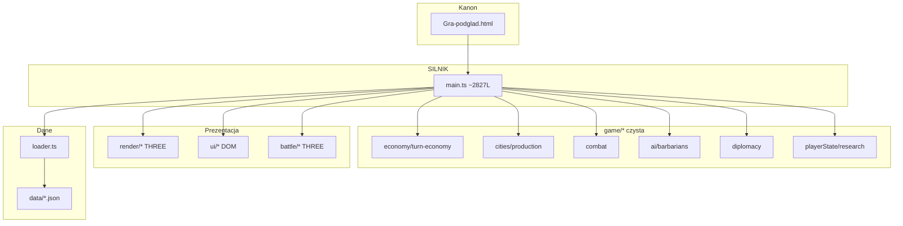
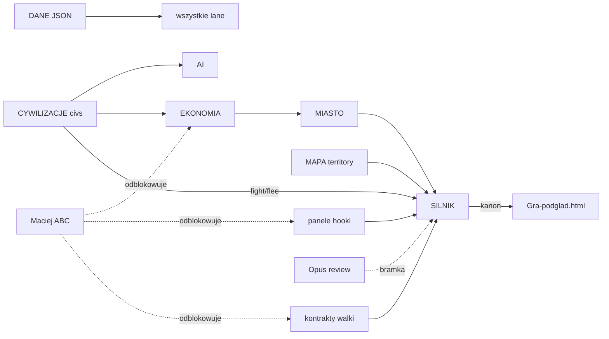

# CURSOR — Raport Końcowy (synteza audytu 2026-06-26)

*Master report: 8 analiz + DZIENNIK-MASTERA + PLAYBOOK + PROJEKT-GRY*
*Sesja autonomiczna Cursor — Maciej nieobecny ~2h*

---

## 1. Stan projektu (1 strona)

**The Game** to przeglądarkowa gra 4X (TypeScript + Vite + Three.js), single-file `Gra-podglad.html`. Projekt w modelu **10 lane'ów** multi-agent z Maciejem jako decydentem ABC.

### Co działa dziś (grywalne end-to-end)
Menu → Nowa Gra (9 cywilizacji × epoka × trudność) → mapa 3D → ruch jednostek → zakładanie miast (klawisz B) → ekonomia per-tura → produkcja budynków → nauka sterowana graczem (picker) → AI rywale (ruch/atak/budowa) → barbarzyńcy → atak z mapy → save/load (Ctrl+S/L) → dyplomacja (panel) → auto-zarządca miasta → warunki zwycięstwa.

### Metryki
| Metryka | Wartość |
|---------|---------|
| Testy jednostkowe | ~762 (17 suite) + smoke/battle-smoke |
| Znany czerwony baseline | koszary-gate-test (Lazaret=Sredniowiecze — NIE naprawiać) |
| main.ts | ~2827 linii (monolit integracyjny) |
| Kanon | md5 `2276ec0f` / po batchach `8e180b7a`, ~995 KB–1 MB |
| Otwarte wątki cross-lane | 12 |
| Zablokowane na Macieja | 6 decyzji ABC |
| Handoffy w `_handoff/` | 92 pliki |

### Blokery #1
**6 decyzji ABC** od Macieja odblokowują ~40% pozostałej pracy: HUD (6B), plaster (7-go), Wealth (W6), ulepszenia (U1), UX bitwy (Q2), balans cyw (T1–T4).

---

## 2. Mapa 10 lane'ów

| Lane | % | Owner | Next action | Rola |
|------|---|-------|-------------|------|
| **SILNIK** | 72% | Composer | Batch: plaster EKONOMIA+UI, granica C, traversal ruchu | Composer impl + Opus review |
| **EKONOMIA** | 78% | Composer | Wealth po W6; export terrain-improvements po U1 | GLM model → Composer |
| **MIASTO** | 82% | Composer | Budynek Mury prereq; UX zasięgu dynamicznego | Composer |
| **UNITS** | 68% | Composer | Kontrakt multi-unit + start oblężenia + machiny | Composer + GLM UX |
| **UI** | 74% | Composer | HUD po 6B; armyStackPrompt po UNITS | Composer + **Maciej 6B** |
| **DANE** | 85% | Composer | terrain-improvements export po U1 | Composer |
| **AI** | 75% | Composer | fight/flee heurystyka; archetypy 9 | Composer + GLM balans |
| **DYPLOMACIA** | 70% | Composer | Efekty aktywne v0.2 (teraz pasywne) | GLM spec → Composer |
| **MAPA** | 62% | Composer | Traversal→SILNIK; granica C; generator typ+rozmiar | Composer + **Maciej 6B** |
| **CYWILIZACJE** | 70% | GLM+Composer | civBonusy realizacja; T1–T4 tuning | GLM balans + **Maciej ABC** |

---

## 3. Wszystkie decyzje ABC dla Macieja

| ID | Priorytet | Temat | Opcje | Rekomendacja Mastera | Wątek |
|----|-----------|-------|-------|---------------------|-------|
| **6B** | P0 | Układ HUD / widok główny | A) overlay B) HUD v2 C) hybryda | **C** — minimapa + panel boczny inkrementalnie | #6 |
| **7-go** | P0 | Plaster EKONOMIA+UI gotowy | A) Wpinaj teraz B) Czekaj HUD C) Bez gate | **A** — przetestowany, gate osobno | #7 |
| **W6** | P0 | Wealth scope v0.1 | W1–W6 pełny model; **W6 najpierw** | Wybierz scope v0.1 (co wchodzi, co nie) | #8 |
| **U1** | P0 | Lista ulepszeń terenu | Excel EKONOMIA → akceptuj → JSON | Przejrzyj terrain-improvements + Excel | #9 |
| **UX-Q2** | P0 | UX bitwy: auto vs ręczna | A) auto B) ręczna C) hybryda | **Q2 najpierw**, potem Q3–Q7 sekwencyjnie | #11 |
| **1A/B/C** | P1 | Epoka Żelaza w v0.1? | A) GO pełne B) tylko tech C) wstrzymaj | **1A** (Hastati/Triari, budynki) | Zelazo |
| **2A/B** | P1 | Usunąć Robotnika? | A) Usuń B) Zostaw | **2A ZAMKNIĘTE** — usuń odwołania | Robotnik |
| **CYW-T1** | P1 | Balans tier 1 cywilizacji | ABC per tier | 4 pytania w CYWILIZACJE-DO-MASTERA | #10 |
| **CYW-T2** | P1 | Balans tier 2 | ABC | j.w. | #10 |
| **CYW-T3** | P1 | Balans tier 3 | ABC | j.w. | #10 |
| **CYW-T4** | P1 | Balans tier 4 | ABC | j.w. | #10 |
| **Zasięg** | P1 | Okolica stepped vs liniowy | A) Stepped B) Liniowy | **B** — potwierdzić „Decyzja Naster" | #3 |
| **#4** | P1 | Zaokrętowanie po Żeglarstwie | A) Robocze A B) Inna reguła | Robocze A — potwierdzić | Ruch |
| **Cluster** | P2 | min_dist 9 vs 5 | — | Niepilne | Generator |
| **Subagenci** | P2 | Sonnet subagenci per lane? | 5 odpowiedzi czeka | UI=TAK | Koszty |

---

## 4. Top 10 priorytetów P0–P1

| # | Priorytet | Zadanie | Rola | Lane |
|---|-----------|---------|------|------|
| 1 | **P0** | Maciej: decyzje ABC (6B, 7-go, W6, U1, Q2) | **Maciej** | — |
| 2 | **P0** | Wpięcie plastra EKONOMIA+UI (#7) | Composer | SILNIK |
| 3 | **P0** | Review kanonu adversarial (762 testów) | Opus | SILNIK |
| 4 | **P0** | HUD wg decyzji 6B | Composer | UI+MAPA |
| 5 | **P1** | Traversal ruchu z prototypu MAPA | Composer | SILNIK+MAPA |
| 6 | **P1** | Multi-unit + posiłki 1-heks kontrakt | Composer | UNITS+SILNIK |
| 7 | **P1** | Start oblężenia + HP garnizon + machiny | Composer | UNITS+SILNIK |
| 8 | **P1** | Hook fight/flee (heurystyka AI) | Composer | CYW+SILNIK |
| 9 | **P1** | Wealth moduł po decyzji W6 | GLM→Composer | EKONOMIA |
| 10 | **P1** | Ulepszenia terenu po akceptacji U1 | Composer | MAPA+EKONOMIA |

---

## 5. Sprint 1 (tydzień 1) — konkretne zadania z AC

| ID | Zadanie | Rola | AC (Definition of Done) |
|----|---------|------|-------------------------|
| S1.1 | Maciej: ABC 6B, 7-go, W6, U1, UX-Q2 | Maciej | 5 decyzji zapisanych w DZIENNIKU |
| S1.2 | SILNIK: plaster EKONOMIA+UI | Composer | splitPraca + kup-za-Pieniądz w kanonie; wire-ekonomia 23/23 |
| S1.3 | SILNIK: granica C render | Composer | Linia terytorium widoczna na mapie; isInTerritory OK |
| S1.4 | Review kanonu adversarial | Opus | 762/762 PASS + smoke OK; raport PASS/lista usterek |
| S1.5 | Wealth szkielet scope v0.1 | GLM→Composer | Moduł + wealth-test PASS; handoff SILNIK |
| S1.6 | `<LANE>-STAN.md` × 10 | GLM | 12 linii per lane w dyspozycje/ |
| S1.7 | Usunięcie Robotnika (2A) | Composer | Brak Robotnika w units.json/main/setup; testy zielone |

---

## 6. Sprint 2 (tydzień 2)

| ID | Zadanie | Rola | AC |
|----|---------|------|-----|
| S2.1 | Traversal ruchu MAPA→SILNIK | Composer | Ruch z prototypu; min 1 pole (1C); testy logic |
| S2.2 | Multi-unit + posiłki 1-heks | Composer | Skład bitwy z heksa+sąsiedztwo; combat 6/6 |
| S2.3 | Start oblężenia + garnizon + machiny | Composer | Flaga oblegane; atrycja; oblezenie-test rozszerzony |
| S2.4 | Hook fight/flee | Composer | Adjacency→AI decyzja→bitwa/odwrót; ai-test |
| S2.5 | Akcja buduj ulepszenie z mapy | Composer | Po U1; bez Robotnika |
| S2.6 | armyStackPrompt wpięcie | Composer | Okno połącz/nie przy stacking |
| S2.7 | Generator mapy typ+rozmiar z menu | Composer | Menu param → generator; smoke OK |

---

## 7. Ryzyka

| Ryzyko | Severity | Mitigacja |
|--------|----------|-----------|
| OneDrive dehydratacja | 🔴 | Build /tmp; Always keep gra/; Read przed build |
| main.ts monolith rośnie | 🟠 | Sprint 4 refaktor; 1 edytor naraz |
| Brak git na Civ/ | 🟠 | Git init root; rolling .bak |
| npm run build kasuje JSON | 🔴 | ZAKAZ — tylko vite --outDir /tmp |
| Master bez ABC | 🟠 | Protokół 17a — każda decyzja ABC |
| 6 blokad Macieja kumuluje | 🟠 | CURSOR-START-TUTAJ — 5 kroków na powrót |
| npx niedostępny w sandbox | 🟡 | Testy lokalnie: `cd gra; node tools/logic-test.cjs` |

---

## 8. Quick wins (1–2 dni, wysoki ROI)

| # | Co | Effort | Impact |
|---|-----|--------|--------|
| QW1 | Plaster EKONOMIA+UI (#7) — czeka „idź" | S | 🔴 Ekonomia miasta |
| QW2 | Granica C render | S | 🟠 Wizualne terytorium |
| QW3 | Okno połącz-armie (UI gotowe) | S | 🟠 Stacking |
| QW4 | mnoznikHandel per-cyw (pole istnieje) | S | 🟡 Balans |
| QW5 | STAN.md × 10 | S | 🟠 −80% koszt self-check |
| QW6 | Usunięcie Robotnika (2A zamknięte) | S | 🟡 Higiena kodu |

---

## 9. Mermaid — architektura

---

## 10. Mermaid — zależności lane'ów (kolejność wpieć)

---

## 11. Testy — stan (ostatnia znana bramka)

| Suite | Pass | Fail | Nota |
|-------|------|------|------|
| logic-test | 180 | 0 | |
| combat-test | 6 | 0 | |
| ai-test | 132+ | 0 | |
| diplomacy-test | 98 | 0 | |
| research-test | 33 | 0 | |
| oblezenie-test | 27 | 0 | |
| wire-ekonomia-test | 23 | 0 | |
| upkeep-test | 51 | 0 | |
| culture-religion-test | 43 | 0 | |
| wealth-test | 25 | 0 | |
| auto-manage-test | 26 | 0 | |
| barbarians-test | 53 | 0 | |
| found-from-village-test | 24 | 0 | |
| happiness-breakdown-test | 38 | 0 | |
| split-output-test | 46 | 0 | |
| converters-test | 30 | 0 | |
| okolica-test | 16 | 0 | |
| koszary-gate-test | — | 1 | **baseline świadomy** |
| smoke.cjs | OK | — | |
| battle-smoke.cjs | OK | — | |
| **SUMA** | **~762** | **1 baseline** | |

*Sesja 2026-06-26: testy NIE uruchomione w sandbox (npx niedostępny w PATH). Weryfikuj lokalnie.*

---

## 12. Pliki utworzone w sesji autonomicznej

| Plik | Akcja |
|------|-------|
| `docs/analiza/01-SILNIK-main.md` | UTWORZONY (techniczny deep-dive) |
| `docs/analiza/02-GAME-logika.md` | UTWORZONY (techniczny deep-dive) |
| `docs/analiza/03-MAPA-RENDER.md` | UTWORZONY (techniczny deep-dive) |
| `docs/analiza/04-UNITS-BATTLE.md` | UTWORZONY (techniczny deep-dive) |
| `docs/analiza/05-UI-panele.md` | UTWORZONY (techniczny deep-dive) |
| `docs/analiza/06-DYSPOZYCJE-stan.md` | UTWORZONY (techniczny deep-dive) |
| `docs/analiza/07-DANE-TESTY.md` | UTWORZONY (techniczny deep-dive) |
| `docs/analiza/08-DOKUMENTACJA.md` | UTWORZONY (techniczny deep-dive) |
| `docs/analiza/02-EKONOMIA-MIASTO.md` | UTWORZONY (perspektywa lane — EKONOMIA wchłonęła MIASTO) |
| `docs/analiza/03-UNITS-BITWA.md` | UTWORZONY (perspektywa lane — UNITS/Bitwa: 46 jednostek, morale, AI bitwy, machiny) |
| `docs/analiza/04-MAPA-RENDER.md` | UTWORZONY (perspektywa lane — MAPA: render, miasta, klastry, generator) |
| `docs/analiza/05-AI-CYWILIZACJE-DANE.md` | UTWORZONY (perspektywa lane — AI+CYW+DANE: roster 9 cyw, tech Żelazo, tier 5) |
| `docs/analiza/06-DYPLOMACJA-SPOLECZENSTWO.md` | UTWORZONY (perspektywa lane — DYPLOMACJA: Zaufanie+Respekt, T1-T4, religie 9) |
| `docs/analiza/07-UI-UX.md` | UTWORZONY (perspektywa lane — UI: makiety, HUD 6B, drzewko Q2=A) |
| `docs/analiza/08-DOKUMENTACJA-OPS.md` | UTWORZONY (perspektywa lane — OPS: PLAYBOOK, build, testy) |
| `docs/analiza/README.md` | ZAKTUALIZOWANY (indeks obu numeracji) |
| `docs/CURSOR-ARCHITEKTURA.md` | UTWORZONY |
| `docs/CURSOR-BACKLOG.md` | UTWORZONY/ZAKTUALIZOWANY |
| `docs/CURSOR-RAPORT-KONCOWY.md` | UTWORZONY/ZAKTUALIZOWANY (ten plik) |
| `docs/CURSOR-START-TUTAJ.md` | UTWORZONY |
| `.cursor/rules/civ-workflow.mdc` | UTWORZONY (mapowanie 10 lane'ów → GLM/Composer/Opus/Maciej) |

---

*Koniec raportu. Następny krok: `docs/CURSOR-START-TUTAJ.md`*
