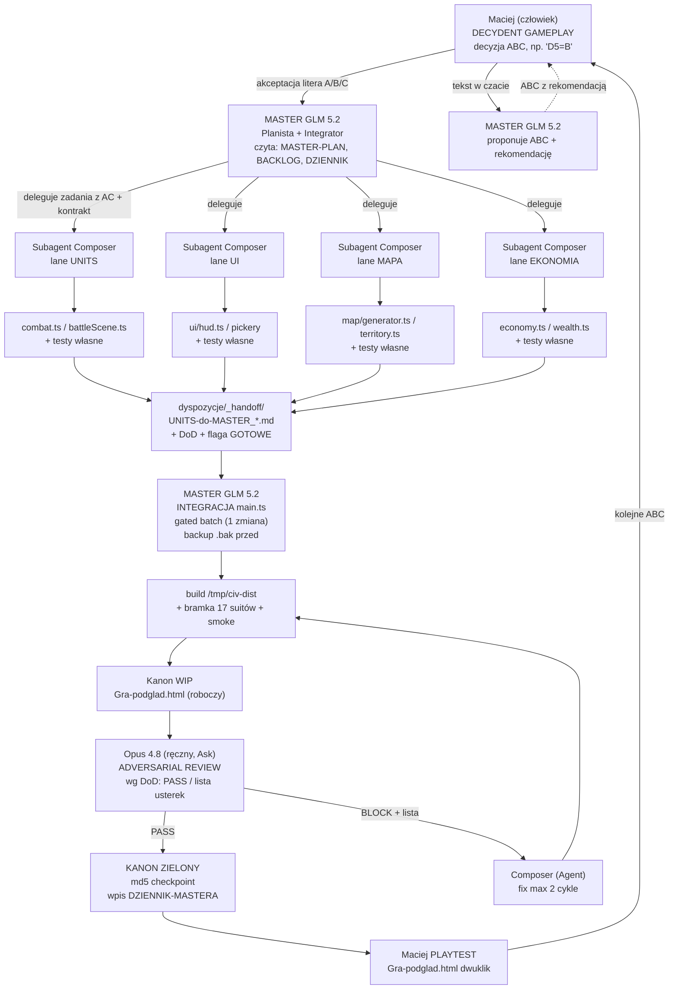
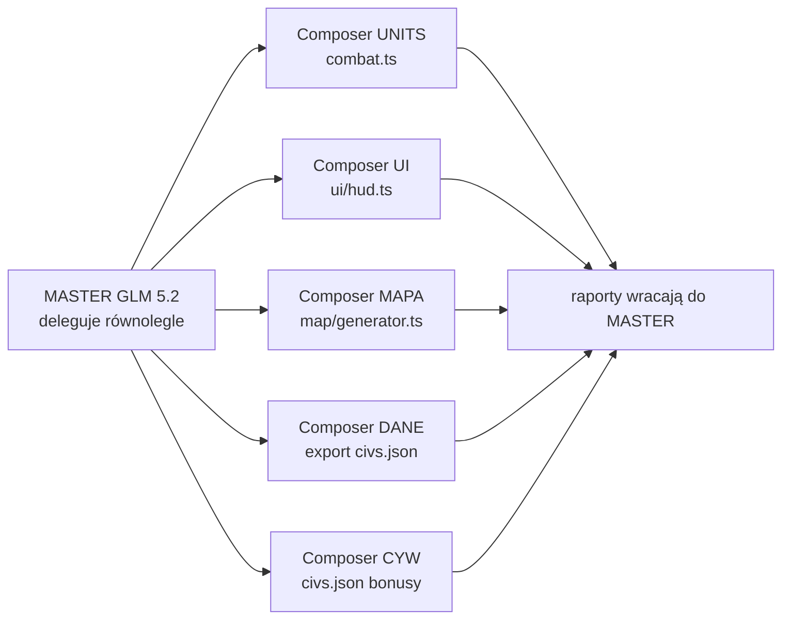
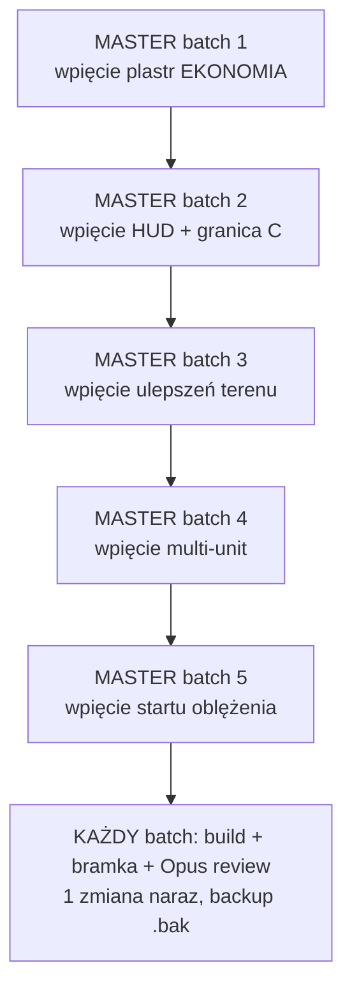
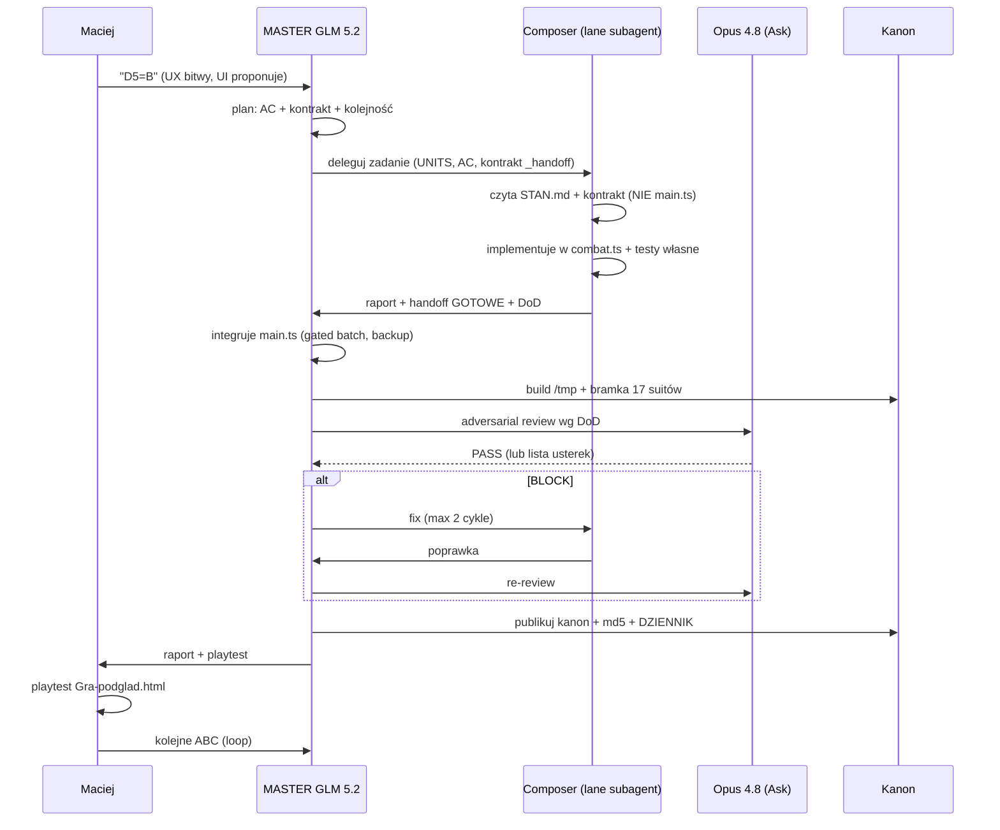
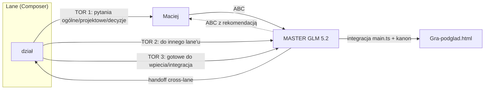

# WORKFLOW SCHEMAT — The Game (Civ)

> Wizualny schemat działania multi-agent w Cursor: kiedy równolegle, kiedy sekwencyjnie, jak płyną pliki i decyzje.
> Powiązane: `docs/CURSOR-MASTER-PLAN-DOKONCZENIA.md` (główny plan), `.cursor/rules/civ-workflow.mdc` (reguły), `PLAYBOOK-operacyjny-Civ.md` (źródło prawdy technik).
> **Data:** 2026-06-26. **Autor:** GLM 5.2 (MASTER).

---

## 1. Schemat główny — przepływ decyzji i plików (Mermaid)



---

## 2. Schemat — uproszczony (ASCII, szybka ścięga)

```
[Maciej] --ABC--> [MASTER GLM 5.2: plan + kontrakty]
                        |
            +-----------+-----------+-----------+ (delegacja z AC)
            v           v           v           v
       [Composer    [Composer    [Composer   [Composer
        UNITS]       UI]          MAPA]       EKONOMIA]
            |           |           |           |
            +-----------+-----------+-----------+
                        |
                        v
              [_handoff/*.md + DoD]
                        |
                        v
          [MASTER GLM 5.2: integruje main.ts]
              (gated batch, 1 zmiana, backup)
                        |
                        v
          [build /tmp + bramka 17 suitów]
                        |
                        v
          [Opus 4.8 Ask: adversarial review]
                        |
                +-------+-------+
                |               |
             PASS             BLOCK
                |               |
                v               v
        [KANON zielony]   [Composer fix, max 2 cykle]
                |               |
                v               +---> back to build
          [Maciej playtest]
                |
                v
          [kolejne ABC] ---> loop
```

---

## 3. Multitask mode — kiedy MASTER spawnuje równolegle lane subagenci

MASTER może uruchomić **kilka lane subagentów równolegle** (Task tool, `composer-2.5-fast`) **TYLKO gdy lane'y są NIEZALEŻNE** (różne pliki, zero kolizji). Patrz reguła własności plików w `civ-workflow.mdc` §3.

### 3.1 Kiedy TAK (równolegle — niezależne lane'y)



**Zestawienia równoległe (bezpieczne — różne pliki):**

| Zestaw | Lane'y | Pliki (zero kolizji) | Kiedy |
|---|---|---|---|
| RDY-01 civBonusy | UNITS (23) + MIASTO (1) + EKONOMIA (3) | `combat.ts` / `production.ts` / `economy.ts` | Sprint 1 |
| Sprint 2 bitwa | UNITS (multi-unit) + CYW (fight/flee) + MAPA (traversal) | `combat.ts` / `ai.ts` / `map/*` | Faza C |
| Faza D ekonomia | EKONOMIA (Wealth) + MIASTO (etap2) + DANE (surowce) | `wealth.ts` / `culture-religion.ts` / `data/*.json` | Faza D |
| Quick wins | UI (hud) + MAPA (nazwy) + CYW (Sumer fix) | `ui/*` / `map/*` / `civs.json` | Faza E |

### 3.2 Kiedy NIE (sekwencyjnie — kolizja lub zależność)

**SILNIK integracja `main.ts` = ZAWSZE sekwencyjnie (1 edytor naraz).** `main.ts` to monolit ~2827 linii — 2 agentów = nadpisanie.



**Zasady sekwencji SILNIK:**
- 1 batch = 1 zmiana w `main.ts` (nie 5 na raz).
- Po każdym batchu: `cp main.ts main.ts.bak-SILNIK-<data>` (rolling backup) → build `/tmp/civ-dist` → bramka 17 suitów → Opus review → (PASS) kanon.
- Kolejność batchy wg zależności (patrz `CURSOR-BACKLOG.md` + `CURSOR-MASTER-PLAN-DOKONCZENIA.md` §6 Fazy).

### 3.3 Kiedy worktree isolation (2 lane'y TEN SAM plik)

Gdy 2+ lane'ów MUSI ruszyć ten sam plik równolegle:
- Użyj `isolation: "worktree"` w Task tool (lub `best-of-n-runner` subagent).
- Każdy agent na osobnym branchu → merge po zakończeniu (MASTER lub SILNIK dla `main.ts`).
- Rozwiązuje dehydratację OneDrive + clobber przy równoległej edycji.
- W Civ rzadko potrzebne (własność plików twarda) — głównie przy równoległym refaktorze tego samego modułu.

---

## 4. Cykl życia jednego zadania (timeline)



---

## 5. Routing komunikacji (3 tory, PLAYBOOK §12-ROUTING)



| Tor | Co | Dokąd | Format |
|---|---|---|---|
| **1** | Pytania ogólne/projektowe/decyzje | Maciej (w oknie lane'a, czat) | Zwykły tekst + wpis `<LANE>-DO-MASTERA.md` (NIE popup) |
| **2** | Do innego lane'u | przez MASTER (handoff `_handoff/`) | `<OD>-do-<DO>_<temat>.md` + meldunek |
| **3** | Gotowe do wpiecia/integracja silnika | MASTER (handoff + `<LANE>-DO-MASTERA.md`) | Moduł + kontrakt + DoD + flaga GOTOWE |

**MASTER = router między działami + silnik + sędzia + kanon.** Nie rozstrzyga pytań projektowych działów — te idą do Macieja (Tor 1).

---

## 6. Self-check lane'a (progressive disclosure — po wdrożeniu STAN.md)

```
[START — co godzinę / na żądanie "SPRAWDŹ"]
  1. Wczytaj <LANE>-STAN.md (≤12 linii) — coś nowego?
     NIE → zapisz "brak zmian" + exit (1 zimny start, min. tokeny)
     TAK → wczytaj pełny <LANE>.md
  2. Znajdź najnowszą sekcję START / DO ZROBIENIA TERAZ / ODPOWIEDŹ MASTERA
  3. Wdróż krok (bez pytania — pytaj tylko gdy brak danych/blokada)
  4. Dopisz raport do <LANE>-DO-MASTERA.md (timestamp ISO + treść, APPEND-ONLY)
  5. To samo w czacie (transparentność dla Maciej)
  6. Wczytaj <LANE>.md od nowa → kolejny krok? → idź do 3
  7. Brak kolejnego kroku → zaktualizuj <LANE>-STAN.md → exit
  BLOKADA w kroku 3 → raport + wpisz stan BLOK do <LANE>-STAN.md → exit
```

**Trigger re-czytania:** Maciej pisze „SPRAWDŹ" / „przeczytaj dyspozycje". Brak auto-pętli (PLAYBOOK §12c).

---

## 7. Decyzja: subagent vs nowy chat vs inline

| Sytuacja | Tryb | Dlaczego |
|---|---|---|
| 1 zadanie lane z AC, izolowane | **Subagent Composer** (Task tool) | Izolowany kontekst, raport wraca do MASTER |
| MASTER planuje sprint (big picture) | **1 chat GLM** | MASTER trzyma kontekst planu |
| Opus review deliverable | **Nowy chat, Opus Ask (ręczny)** | Świeży sceptyk, read-only |
| Zmiana roli | **Nowy chat** | Czysty kontekst, niższy koszt |
| Kilka niezależnych lane'ów | **Subagenci równolegle** (multitask) | Patrz §3.1 |
| SILNIK integracja main.ts | **Sekwencyjnie** (1 edytor) | `main.ts` monolit, zero kolizji |
| Pętla „aż zielone" (build/testy) | **Loop until done, MAX 3** | Bezpiecznik |
| Drobiazg w obrębie bieżącego chatu | **Inline** | Nie worth nowy agent |

---

## 8. Bezpieczniki iteracji (twarde limity)

| Pętla | Max | Po przekroczeniu |
|---|---|---|
| Loop-until-done (build/testy) | 3 przebiegi | STOP + raport blokady |
| Verify-loop (worker→sędzia→poprawka) | 2 cykle (3 wersje workera) | STOP + eskalacja |
| Fan-out (równolegle subagenci) | pilot 2 → max 10 | — |
| Wywołania subagentów / zadanie | 12 | STOP + pytaj MASTER |
| Tournament (balans) | 6 rund | — |
| Subagent (jeden przebieg) | 1 (bez własnych pętli) | — |

**Subagenci robocze: Composer 2.5** (`composer-2.5-fast`) dla lane'ów. MASTER = GLM 5.2 (`glm-5.2-max`). Review = Opus 4.8 (ręczny).

---

## 9. Szybka ścięga dla Macieja (PLAYBOOK załącznik)

```
CHCĘ:                                   → UŻYJ:
─────────────────────────────────────────────────────────────
Rozstrzygnąć decyzję gameplay           → ABC w czacie (patrz MACIEJ-KARTA-DECYZJI.md)
Rutynowy krok w kodzie (1 lane)         → Subagent Composer (1 zadanie z AC)
Kilka niezależnych lane'ów              → Subagenci równolegle (multitask)
Integracja do main.ts                   → MASTER sekwencyjnie (gated batch)
Review deliverable do kanonu            → Opus 4.8 Ask (ręczny, adversarial)
Code review / decyzja sporna            → Opus (krótko, celowo)
„Dopchnij aż testy zielone"             → Loop until done (MAX 3)
2 lane'y, 1 plik                        → Worktree isolation
Pytanie lane → Maciej                   → czat + <LANE>-DO-MASTERA.md (tekst, NIE popup)
Wynik lane → MASTER → kanon             → _handoff/<OD>-do-MASTER_<temat>.md
```

---

*Opracował MASTER (GLM 5.2), 2026-06-26. Powiązane: `docs/CURSOR-MASTER-PLAN-DOKONCZENIA.md` (główny), `.cursor/rules/civ-workflow.mdc` (reguły), `PLAYBOOK-operacyjny-Civ.md` (źródło prawdy).*
