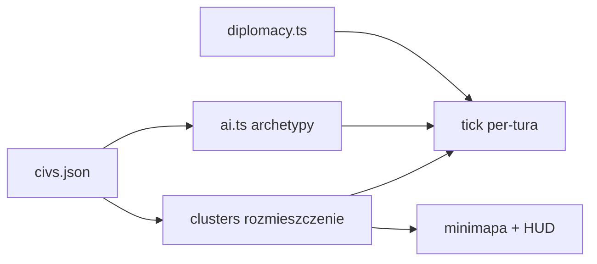

# Analiza 07 — AI · DYPLOMACIA · MAPA · CYWILIZACJE

*Audyt: 2026-06-26 | Lane'y skrócone w jednym raporcie (systemy mapowe i AI)*

---

## AI (~75%)

### DONE
- `ai.ts` wpięty: decideAITurn, chooseAIResearch, decideAIDiplomacy
- Barbarzyńcy: spawn, ruch, atak (barbarians.ts)
- Archetypy agresji per cyw (ARCHETYPE_AGGRESSION)
- aiOwnerCivMap — różne nacje AI (nie stub 'Grecy')
- Difficulty params z ai-params.json
- **ai-test:** 132+ testów

### IN PROGRESS
- Archetypy 7→9 (pełny roster)
- Harness testowy tournament
- Heurystyka fight/flee (reakcja na adjacency — kontrakt do SILNIK)
- Budżet AI (handoff od EKONOMIA — zamknięty)

### CZEKA
- Format startowego rozmieszczenia (clusters.ts → CYWILIZACJE)

---

## DYPLOMACIA (~70%)

### DONE
- `diplomacy.ts` — relacje, respekt, tier names
- Tick per-tura w SILNIK (aiDiplomacyStance)
- Panel UI diplomacyPanel.ts
- **diplomacy-test:** 98/98

### IN PROGRESS
- Efekty dyplomacji aktywne (v0.1 = pasywne — relacje tykają, bez gameplay effect)

### Brak blokad Macieja

---

## MAPA (~62%)

### DONE
- `generator.ts` — mulberry32 + fBm, deterministyczna mapa
- `territory.ts` — isInTerritory wyeksportowane, cityTerritoryRadius=pop
- `clusters.ts` — rozmieszczenie startowe cywilizacji
- Render: scene.ts, units.ts, cities.ts, stoneCity.ts, resources overlay
- Prototyp RUCH (RUCH.html) — traversal, koszty terenu, mgła
- Zakładanie miast z mapy (tryb Budowa) — kontrakt DONE
- Kontekst oblężenia + posiłki 1-heks — gotowe do SILNIK

### IN PROGRESS
- Pełny generator (typ mapy: kontynenty/pangea/wyspy, rozmiary 1k–20k)
- Traversal ruchu z prototypu → SILNIK
- Granica C render (linia terytorium)
- Ulepszenia terenu render
- Instanced rendering dla dużych map
- Minimapa

### BLOCKED
- **Widok główny 6B** — Maciej akceptacja układu
- **Ulepszenia terenu U1** — Maciej akceptacja listy

---

## CYWILIZACJE (~70%)

### DONE
- `civs.json` — roster 9 (Grecy, Rzym, Chiny, Inkowie, Zulusi, Egipt, Sumerowie, Babilon, Persja)
- Wybór nacji wpływa na grę (civType + civBonusy attached)
- Archetypy AI per cyw
- Tech koszty (propozycja w tech.json)
- mnoznikHandelPieniadz pole w civs.json
- Enum → roster9, dead flag cleanup

### IN PROGRESS
- Bonusy mechanizacja (civBonusy[] realizacja w systemach)
- Nazwy klastrów na mapie
- T1–T4 tuning balansu

### BLOCKED (ABC)
- **CYW-T1–T4** — 4 pytania balansu tierów
- **Zelazo 1A/B/C** — epoka w v0.1?
- **Robotnik 2A** — usunąć jednostkę?

---

## Testy zbiorcze

| Suite | Wynik | Lane |
|-------|-------|------|
| ai-test | 132+ | AI |
| diplomacy-test | 98 | DYPLOMACJA |
| barbarians-test | 53 | AI |
| research-test | 33 | AI+EKONOMIA |

---

## Zależności między tymi lane'ami

---

## Następne kroki (priorytet)

| # | Zadanie | Lane | Rola |
|---|---------|------|------|
| A1 | Heurystyka fight/flee | CYWILIZACJE→SILNIK | Composer |
| A2 | Traversal ruchu wpiecie | MAPA→SILNIK | Composer |
| A3 | Granica C render | MAPA | Composer |
| A4 | Generator typ+rozmiar z menu | MAPA+SILNIK | Composer |
| A5 | Archetypy 9 + harness | CYWILIZACJE | Composer+GLM |
| A6 | Realizacja civBonusy | CYWILIZACJE+all | Composer |
| A7 | Dyplomacja efekty v0.2 | DYPLOMACJA | GLM spec |

*Role: GLM (balans AI/cyw) + Composer (kod) + Maciej (ABC balans)*
