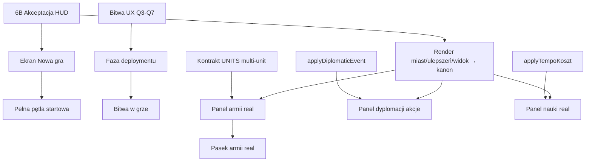

# 07 — Analiza: UI / UX

*Wygenerowano autonomicznie: 2026-06-26 | Źródła: UI-DO-MASTERA.md, Makiety UI, DZIENNIK-MASTERA.md*

---

## 1. Zakres lane'a

**UI/UX** — interfejs gracza, ekrany, HUD, panele, akcje. Pliki wyłączności:
- `gra/src/ui/*`, `gra/src/mainview/*` (część wspólna z MAPA)
- Makiety: `Civ-UI/` (Makieta-panel-armii.html, Makieta-pasek-armii.html, Makieta-przed-bitwa.html, Galeria-jednostek-4widoki.html, Makieta-drzewko-uklad-bez-przeciec.html, Makieta-panel-nauki.html, Makieta-panel-dyplomacji.html)
- HUD/Widok główny (warstwa nad żywą mapą)

## 2. Stan obecny (~55%)

### ZROBIONE (Makiety + część w grze)
- **Makieta panel armii** (front-end gotowy, czeka na kontrakt UNITS): lista jednostek w armii, podgląd statystyk, sortowanie, szczegoły per jednostka
- **Makieta pasek armii** (bottom HUD): skrócona lista aktywnych armii, ikony, licznik jednostek
- **Makieta przed-bitwą** (deployment): rozstawianie jednostek gracza przed Start (BLOK — czeka na akceptację Macieja)
- **Galeria jednostek 4 widoki**: showcase modeli 3D (4 perspektywy), używana do akceptacji nacji
- **Makieta drzewko układ bez przecięczeń** (Q2=A zaakceptowane z warunkiem N=0 przecięć):
  - Preview układu drzewka technologii
  - Algorytm: poziome linie + curvatura; weryfikacja N=0 przecięć
  - Bez auto-przewijania; klik na tech = panel szczegółów
- **Makieta panel nauki**: drzewko + cost + tempo (szybka/standard/długa) + status badań
- **Makieta panel dyplomacji** (PODGLĄD v0.1): relacje (Zaufanie/Respekt), 5 tierów, lista nacji, log eventów; **akcje wojna/pakt/sojusz ZABLOKOWANE** (stub applyDiplomaticEvent)
- **Widok główny / HUD** (warstwa nad mapą):
  - 13 elementów wg Civ7 (z akceptacją 6B czeka)
  - Ikona Budowa → tryb placement z ghost-preview (polprzezroczysty model na hover, solidny po kliku)
  - Zakładanie miast z mapy (tryb Budowa): warunki teren ląd/dystans ≥5/terytorium; miasto L1 per cyw; rozszerzenie granicy r5
- **Bitwa UI** (współdzielone z UNITS w `battleScene.ts`):
  - Paski HP/MORALE/AMUNICJA (góra→dół; ramka na 2 dla niestrzelających; pusta amunicja = czarny prostokąt)
  - Obwódka frakcji (atak=czerwony, obrona=niebieski)
  - Log 10 ostatnich starć (panel prawy-góra)
  - Etykiety strat HP na zegarze realnym ~2s (nie znikają przy x64)
  - SPEED_STEPS 1/2/4/8/16/32/64/128/256/512 (klawisz S)
  - Pauza P (+ przycisk + badge)
  - Ekran końca: pauza + panel zwycięzcy + staty per strona (straty/pozostali/HP) + "Zakończ bitwę" + "Szczegóły" (Zniszczone/Zrootowane/Ocalale per nazwa)

### TESTY
- Brak dedykowanych testów UI (weryfikacja wizualna = screenshot review Macieja)
- Build mainview zielony, zsync z `gra/src`

## 3. Otwarte wątki / decyzje wiszące

| # | Wątek | Status | Czeka na |
|---|-------|--------|----------|
| 6B | Akceptacja układu WIDOKU GŁÓWNEGO/HUD (13 elem Civ7) | **BLOK** | Maciej — warunek wpiecia do kanonu |
| Q2 | Drzewko bez przecięć (Makieta-drzewko-uklad-bez-przeciec) | ZAAKCEPTOWANE z warunkiem N=0 | (GOTOWE) |
| #UX bitwy | Faza deploymentu (rozstawianie przed Start) | **BLOK** | Maciej akceptacja makiety |
| #UI panel armii | Realny panel armii w grze (front-end gotowy) | CZEKA | Kontrakt UNITS merge (multi-unit) |
| #UI pasek armii | Realny pasek armii w bottom HUD | CZEKA | Kontrakt UNITS + 6B |
| #UI panel nauki | Realny panel nauki w grze | CZEKA | Wpięcie applyTempoKoszt + 6B |
| #UI panel dyplomacji | Realny panel dyplomacji (akcje) | CZEKA | applyDiplomaticEvent (DYPLOMACJA) + 6B |
| #Start game UI | Ekran "Nowa gra" (rozm. świata, typ, nacje, tempo, trudność) | CZEKA | Spec UI (MAPA + AI + DYPLOMACJA) |
| #Save/Load UI | Ekran save/load | CZEKA | Spec UI (SILNIK) |

### Decyzje Macieja wymagane (OD UI)
1. **6B**: Akceptacja układu HUD (warunek wpiecia renderu miast/ulepszeń/widoku do kanonu)
2. **Bitwa UX Q3–Q7** (po Q2=A):
   - Q3: Czy panel armii pokazuje tylko jednostki gracza czy też wroga?
   - Q4: Czy pasek armii jest zawsze widoczny czy hover/focus?
   - Q5: Jak pokazujemy morale armii (jeden pasek globalny vs per-jednostka)?
   - Q6: Skirmisher kite — czy pokazujemy planned move preview?
   - Q7: Czy pokazujemy AI thinking (log decyzji)?
3. **Drzewko technologii** — akceptacja finalnego layoutu (po N=0 przecięciach)
4. **Panel dyplomacji** — układ (PODGLĄD v0.1 = odczyt; akcje PO applyDiplomaticEvent)
5. **Ekran "Nowa gra"** — układ + które opcje obowiązkowe (rozmiar świata / typ / nacje / tempo / trudność)

## 4. Decyzje Macieja zamknięte

- **Q2=A drzewko** zaakceptowane pod warunkiem N=0 przecięć (preview Makieta-drzewko-uklad-bez-przeciec.html)
- **13 elementów HUD wg Civ7** — wg specyfikacji (akceptacja całości = 6B wiszące)
- **Ikona Budowa + ghost-preview** — zaakceptowane (tryb placement działa)
- **Zakładanie miast z mapy** (tryb Budowa) — zaakceptowane (warunki ląd/dystans ≥5/terytorium)
- **Paski bitwy HP/MORALE/AMUNICJA** (góra→dół, ramka na 2) — zaakceptowane
- **Obwódka frakcji** (atak=czerwony, obrona=niebieski) — zaakceptowane
- **Log 10 ostatnich starć** — zaakceptowane
- **Etykiety strat HP ~2s real-time** — zaakceptowane
- **Ekran końca bitwy** (pauza + panel + staty + "Zakończ/Szczegóły") — zaakceptowane

## 5. Właściciele

| Rola | Model |
|------|-------|
| Spec UX, makiety ( GLM ) | `glm-5.2-max` subagent |
| Implementacja UI ( Composer ) | `composer-2.5-fast` subagent |
| Screenshot review ( Opus ) | Opus 4.8 Ask/Agent |
| Decyzje 6B, Q3–Q7, layouty | Maciej |

## 6. Quick wins / next

| # | Co | Effort | Impact |
|---|-----|--------|--------|
| 6B | Akceptacja HUD → wpiecie renderu do kanonu | S (decyzja) | 🟢 ODBLOK 4 lane'y (MAPA/UI/synchronizacja) |
| #Start UI | Ekran "Nowa gra" | M | 🟢 Pełna pętla startowa |
| #Panel nauki | Realny panel nauki (PO 6B) | M | 🟢 Interakcja z technologią |
| #Panel dyplomacji | Akcje dyplomacji (PO applyDiplomaticEvent) | M | 🟢 Interakcja z AI |

## 7. Ryzyka / flagi

- **6B = BLOK GŁÓWNY** — bez akceptacji HUD nie wpinamy renderu miast/ulepszeń/widoku do kanonu (MAPA czeka)
- **Bitwa UX Q3–Q7** — bez akceptacji deploymentu bitwa zostaje 1v1 auto-rozstawiana
- **Multi-unit panel armii** — front-end gotowy ale wymaga kontraktu UNITS merge (1v1 dziś)
- **3 panele (nauka/dyplomacja/armii) = makiety** — do realnej implementacji potrzebne 6B + kontrakty z odpowiednich lane'ów
- **Brak dedykowanych testów** — ryzyko regresji wizualnej (screenshot review to jedyne QA)
- **OneDrive tnie pliki** — makiety HTML częściej "odcięte" niż kod TS (mają sync issues)

## 8. Hierarchia priorytetów UI (propozycja Macieja)

