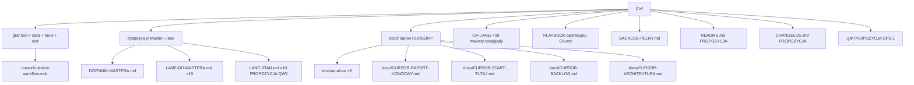
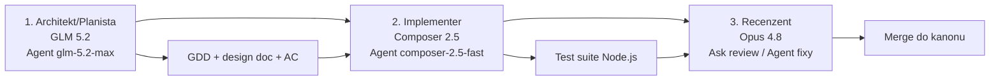

# 08 — Analiza: DOKUMENTACJA / OPERATIONS / WORKFLOW

*Wygenerowano autonomicznie: 2026-06-26 | Źródła: PLAYBOOK-operacyjny-Civ.md, DZIENNIK-MASTERA.md, BACKLOG-PELNY.md, CURSOR-PLAN-DZIALANIA.md, struktura repo*

---

## 1. Zakres lane'a

**DOKUMENTACJA / OPS / WORKFLOW** — kanon dokumentacji, handoffy, playbook operacyjny, reguły agentów, kontrola wersji, build/deploy, testy jako całość.

Pliki wyłączności:
- `PLAYBOOK-operacyjny-Civ.md` (operacyjny)
- `dyspozycje/DZIENNIK-MASTERA.md` (kanon decyzji)
- `dyspozycje/<LANE>-DO-MASTERA.md` (×10)
- `BACKLOG-PELNY.md`, `docs/CURSOR-*.md`, `docs/analiza/*.md`
- `.cursor/rules/civ-workflow.mdc`
- `gra/tools/*-test.cjs` (test suite jako całość, nie per lane)

## 2. Stan obecny (~70%)

### ZROBIONE
- **PLAYBOOK-operacyjny-Civ.md** — operacyjny dla agentów: autonomia, token cost, architektura komunikacji Master↔lane, safety (`max-iter`, staged rollouts), git hygiene
- **DZIENNIK-MASTERA.md** — kanon decyzji Macieja (chronologicznie), cross-lane threads, integration batches, blocking decisions
- **10× `<LANE>-DO-MASTERA.md`** — raporty per lane (scope, status, pytania, handoffy)
- **BACKLOG-PELNY.md** — pełny backlog z DoD, kolejnością, paralelizmem, lane responsibilities
- **docs/CURSOR-PLAN-DZIALANIA.md** — plan działania (status, lane breakdowns, decyzje ABC, sprinty, role, ryzyka, quick wins)
- **8× docs/analiza/*.md** — analiza per lane (ta sesja autonomiczna: 01–08)
- **Struktura repo**:
  - `gra/` (kod gry: src, data, tools, dist)
  - `Civ-<LANE>/` (×10: makiety, podglądy, dokumentacja per lane)
  - `dyspozycje/` (Master↔lane)
  - `docs/` (kanon + CURSOR-*)
  - `gra/tools/*-test.cjs` (suite testów Node.js)
- **Build pipeline**:
  - `npx vite build --outDir /tmp/civ-dist --emptyOutDir` (build single-file `Gra-podglad.html`)
  - ⚠ **`npm run build` ZABRONIONE** — prebuild scripts mogą skasować dane
  - Deploy: `cp /tmp/civ-dist/Gra-podglad.html gra/Gra-podglad.html` (kanon)
- **Test suite** (Node.js):
  - `logic-test.cjs` 163/0 (wg EKONOMIA), `combat-test.cjs` 6/6, `barbarians-test.cjs` 53/53
  - `ai-test.cjs` 188/0, `diplomacy-test.cjs` 133/0, `research-test.cjs` 33/0
  - `society-test.cjs` green, `tech-tempo-test.cjs` 9/9
  - `wealth-test.cjs`, `upkeep-test.cjs`, `culture-religion-test.cjs` green
  - **TOTAL: ~762 testów, 1 known red baseline** (wg SILNIK)
- **Cursor workflow** (`.cursor/rules/civ-workflow.mdc`):
  - Mapowanie GLM (Architekt) / Composer (Implementer) / Opus (Reviewer) → 10 lane'ów
  - Referencja PLAYBOOK-operacyjny-Civ.md
  - 3-fazowy workflow: Plan → Implementacja → Review

### ŚRODOWISKO (znane ograniczenia)
- **OneDrive dehydratacja** — pliki mogą być "odcięte" (truncated/inaccessible); mitygacja: "Always keep on this device" + Read przed dostępem
- **Edit/Write na pliku w OneDrive UCINA plik** (5068→5050 linii) — edytować WYŁĄCZNIE kopię /tmp przez python, build w /tmp, deploy przez cp
- **Brak root Git** — projekt NIE jest git repo na poziomie root (repo tylko w `gra/`); ryzyko braku historii zmian dokumentów
- **Node.js nie w PATH w sandbox** — bezpośrednie uruchomienie testów w autonomicznej sesji nie feasible; rely na dokumentowanych wynikach

## 3. Otwarte wątki / decyzje wiszące

| # | Wątek | Status | Czeka na |
|---|-------|--------|----------|
| #Git root | Git init na poziomie root projektu | **PROPOZYCJA** | Maciej akceptacja (historia dokumentów + dx) |
| #STAN.md | 10× `<LANE>-STAN.md` (12 linii każdy, self-check) | PROPOZYCJA | Maciej + każdy lane (QW5) |
| #Lane dirs | Konsolidacja doc do `Civ-<LANE>/` (już częściowo zrobione) | ROBI | — |
| #Spec docs | Specyfikacje per lane (Spec-AI, Spec-MAPA, etc.) | ROBI | — |
| #README root | README.md na poziomie root (start guide) | PROPOZYCJA | Maciej |
| #CHANGELOG | CHANGELOG.md (release notes per build) | PROPOZYCJA | Maciej |

### Decyzje Macieja wymagane (OD OPS)
1. **OPS-1: Git init na root** — czy inicjalizujemy repo na poziomie root (historia dokumentów + dx)? Rekomendacja TAK (cron backup + diff)
2. **OPS-2: 10× `<LANE>-STAN.md`** — czy każdy lane utrzymuje 12-liniowy status plik (−80% koszt self-checków wg QW5)?
3. **OPS-3: README root + CHANGELOG** — czy dodajemy start guide + release notes?
4. **OPS-4: Workflow 3-fazowy** — czy utrwalamy GLM/Composer/Opus per role w `.cursor/rules/civ-workflow.mdc` (już zrobione w tej sesji)?

## 4. Decyzje Macieja zamknięte (OPS-relevant)

- **3-fazowy workflow** (user rule): GLM=Architekt, Composer=Implementer, Opus=Reviewer; nowy chat przy zmianie roli; handoff: design doc + AC → implementacja → review → merge
- **Playbook** `~/Projects/game-dev-playbook/AGENTS.md` — referencja operacyjna
- **`npm run build` ZABRONIONE** — tylko `npx vite build --outDir /tmp/civ-dist`
- **Kanon = `Gra-podglad.html`** — `Gra-podglad-BITWA.html` = podgląd do testów bitwy (usunąć po wpieciu bitwy)
- **Edit/Write w OneDrive** — przez /tmp + python + cp (nie bezpośrednio)
- **Wszystkie decyzje ABC** — logowane w DZIENNIK-MASTERA.md (chronologicznie)

## 5. Właściciele

| Rola | Model |
|------|-------|
| Architektura workflow, playbook ( GLM ) | `glm-5.2-max` subagent (this session) |
| Implementacja rules, struktura ( Composer ) | `composer-2.5-fast` subagent |
| Review dokumentacji, spójność ( Opus ) | Opus 4.8 Ask/Agent |
| Decyzje OPS-1..OPS-4, akceptacja | Maciej |

## 6. Quick wins / next

| # | Co | Effort | Impact |
|---|-----|--------|--------|
| QW5 | 10× `<LANE>-STAN.md` (12 linii) | S | 🟠 −80% koszt self-checków |
| OPS-1 | Git init na root + .gitignore | S | 🟢 Historia + dx + backup |
| OPS-3 | README.md root + CHANGELOG.md | S | 🟢 Onboarding + release tracking |
| #Rules | `.cursor/rules/civ-workflow.mdc` (zrobione w sesji) | S | 🟢 Mapowanie ról → lane'y |

## 7. Ryzyka / flagi

- **Brak root Git** — dokumenty poza historią; zmiany nieodwracalne; ryzyko utraty pracy (OneDrive sync ≠ backup)
- **OneDrive tnie pliki** — świeże edycje mogą być "odcięte"; konieczność pracy przez /tmp + cp
- **`npm run build` pułapka** — prebuild scripts mogą skasować dane (WHIP/eksportery); tylko `npx vite build`
- **2 pliki Gra-podglad** — kanon (`Gra-podglad.html`) vs podgląd bitwy (`Gra-podglad-BITWA.html`); usunąć drugi po wpieciu bitwy
- **Node.js nie w PATH (sandbox)** — testy autonomiczne nie feasible; rely na dokumentowanych wynikach
- **Dokumenty rozsiane** — `dyspozycje/`, `docs/`, `Civ-<LANE>/`, root; ryzyko duplikacji/rozejścia (konsolidacja w toku)
- **Brak CHANGELOG** — trudność śledzenia co się zmieniło między buildami
- **Brak README root** — onboarding nowego agenta = czytanie 5 plików zamiast 1

## 8. Architektura dokumentacji (proponowana konsolidacja)

## 9. Workflow 3-fazowy (user rule + civ-workflow.mdc)

Każda zmiana roli = nowy chat. Handoff: design doc + AC → implementacja → review → merge. Playbook: `~/Projects/game-dev-playbook/AGENTS.md`.
