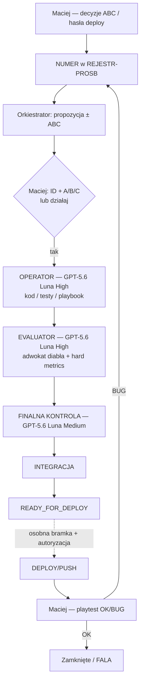

# PAKIET 2 — archiwum aktywnych dokumentów przed skróceniem

> Status: HISTORYCZNE SNAPSHOTY zachowane wyłącznie dla śladu i odtworzenia treści. Nie są routingiem ani instrukcją aktywną. Źródła aktywne wskazuje [`INDEX-PROCESU.md`](../procesy/INDEX-PROCESU.md).


---

## HISTORYCZNY SNAPSHOT: `CLAUDE.md`

```text
# CLAUDE.md — Civ „The Game"

Gra strategiczna 4X (heksy, cywilizacje, epoki Kamień → Brąz → Żelazo). Kod w `gra/`.

## ZACZNIJ TUTAJ
**Przeczytaj najpierw [`STAN-PRACY-HANDOFF.md`](STAN-PRACY-HANDOFF.md)** (korzeń repo) — to punkt wejścia KAŻDEJ sesji: co zrobione, co w toku, co zostało do zrobienia, podjęte decyzje (żeby nie pytać drugi raz) i zasady bezpieczeństwa. Ten plik (`CLAUDE.md`) to tylko skrót zasad krytycznych; **pełny, aktualny stan jest w handoffie** — i to handoff się aktualizuje po każdej większej zmianie.

To jest projekt **Civ**, **NIE Planify**. Jeśli widzisz odniesienia do „Fazy A", `organizationId`, planu E0–E8, hubu pracy NASTER — to Planify (inny projekt), zignoruj przy pracy nad Civ.

## ⛔ ZASADY KRYTYCZNE (złamanie = utrata pracy)
0. **NUMER → ABC → COMMIT → READY_FOR_DEPLOY (Maciej 2026-08-03).** Każdy case/bug/poprawka/innowacja → ID w `dyspozycje/REJESTR-PROSB-I-ZADAN.md`. **Nie koduj od razu** — przedstaw rozwiązanie ± ABC. Commit dopiero po **`numer + A|B|C`**. **Deploy dopiero po `READY_FOR_DEPLOY` i wyłącznie na hasło `deploy`**. Kanon: `dyspozycje/PROCEDURA-NUMER-ABC-COMMIT-DEPLOY.md`.
0a. **AUTOBOT — TWARDA REGUŁA (Maciej 2026-08-05, routing zaktualizowany 2026-08-19).** **KAŻDA praca** wyłącznie w systemie AutoBot: Operator (**GPT-5.6 Luna High**) → Evaluator (**GPT-5.6 Luna High**) → główny orkiestrator/final (**GPT-5.6 Luna Medium**). W tym eksperymencie przy każdym cyklu zapisuj liczbę rund Operator → Evaluator i poprawek po werdykcie, aby porównać jakość z wcześniejszym routingiem Medium. **ZAKAZ** pracy poza pętlą / „gotowe” bez Evaluatora. Playbook + guardrails. Kanon: `dyspozycje/autobot/` · `.cursor/rules/autobot-evaluator-operator.mdc` · `docs/decyzje/R-PROC-AUTOBOT.md`.
   **Nadrzędny obieg procesu:** `Operator → Evaluator → finalna kontrola → integracja → READY_FOR_DEPLOY`.
   Raport Operatora jest przekazaniem sterowania, nie końcem pracy i nie powodem do czekania
   na ponowne popychanie właściciela. Po raporcie orkiestrator automatycznie uruchamia
   Evaluatora. Po `PASS` wykonuje finalną kontrolę, a następnie: (a) przygotowuje i zadaje
   pełne ABC z pełnym ID, jeśli potrzebna jest decyzja; albo kieruje
   zatwierdzony zakres do integracji. `FAIL`, techniczny `BLOCK`, `TIMEOUT`, `INFRA` i `ZWIS`
   uruchamiają bez czekania `Operator → Evaluator` z tym samym ID. ABC pauzuje tylko temat,
   który wymaga decyzji właściciela.
   **Sygnalizacja:** subagent kończy raportem `STATUS: PASS|PASS-WITH-NOTES|FAIL|BLOCK|TIMEOUT|INFRA`
   z ID tematu, plikami/commitami, testami, blokadami, następnym krokiem oraz polem `DEPLOY/PUSH`.
   UI `działa`, samo „gotowe” i `GOTÓW DO TESTU` nie wystarczają. `PASS-WITH-NOTES` przechodzi dalej
   tylko z jawnymi, nieblokującymi uwagami zaakceptowanymi przez finalną kontrolę. Po raporcie zamykaj subagenta; limit to 6
   otwartych slotów. Brak ruchu przez 7 minut = `ZWIS` i przejęcie tematu przez orkiestratora.
   Jeśli istnieją niezablokowane tematy, wszystkie 6 slotów musi być wykorzystane; po zakończeniu
   subagenta natychmiast zamknij go i uruchom następną fazę albo kolejny niezależny temat.
   **Ciągła pętla:** `FAIL`/techniczny `BLOCK`/`TIMEOUT`/`INFRA`/`ZWIS` → bez czekania
   `Operator → Evaluator`, zawsze z tym samym ID; przy `ZWIS` orkiestrator przejmuje wykonanie.
   `PASS` przechodzi przez finalną kontrolę i integrację. `READY_FOR_DEPLOY` kończy proces
   przygotowania dopiero po allowliście, izolacji i bramkach; nie oznacza wykonanego deployu
   ani pushu. Deploy/push wymaga osobnej autoryzacji. Temat pozostaje aktywny pod tym samym
   ID aż do `READY_FOR_DEPLOY`; ABC pauzuje tylko temat wymagający decyzji właściciela.
   `READY_FOR_DEPLOY` może wystawić wyłącznie orkiestrator po finalnej kontroli i integracji;
   Operator ani Evaluator nie ogłaszają samodzielnie końca procesu.
   **C-043:** właściciel komunikuje się wyłącznie w głównym czacie orkiestratora;
   subagenci są kanałami technicznymi, a ich raporty wracają do orkiestratora.
   **Komenda `sprawdź`:** wykonaj audyt: cała bieżąca pula + historyczne `not_found` do reconciliacji;
   sprawdź statusy, raporty, blokady i następne kroki, zamknij zakończonych i uruchom wymagane kolejne
   fazy. Klasyfikacja obejmuje `PASS`, `PASS-WITH-NOTES`, `FAIL`, `BLOCK`, `TIMEOUT`, `INFRA`,
   `READY_FOR_DEPLOY` albo wynik niepewny. `not_found` bez raportu wymaga reconciliacji i nie jest
   zakończeniem.
0b. **AUTOBOT OBEJMUJE TAKŻE PRACĘ GŁÓWNEJ SESJI (Maciej 2026-08-07).** Jego słowa: *„Dla siebie
   też przyjmij zasadę autobot na każdym temacie, nie tylko dla subagentów. Czyli każdą swoją
   decyzję sprawdzaj ewaluatorem"* oraz *„zasada Autobots obejmuje nie tylko zleconą pracę
   subagentowi, ale **po pierwsze Twoją pracę**"*.
   **Skutek:** główny orkiestrator (**GPT-5.6 Luna Medium**) **nie jest zwolniony** z pętli. Każda zmiana, którą
   wprowadza SAM — kod, dane, kanon, dokument decyzji, wpis w rejestrze, sprostowanie — przechodzi
   przez **Evaluatora na GPT-5.6 Luna High**, tak samo jak praca subagenta. Orkiestrator jest wtedy Operatorem
   własnej zmiany i **nie ocenia sam siebie** (zasada z §1 playbooka: „wykonawca nigdy nie ocenia
   sam siebie").
   **Powód (realne wypadki 2026-08-07, wszystkie w pracy własnej orkiestratora, żaden nie złapany
   przez nikogo poza późniejszym przypadkiem):** (a) wpisanie do `PYTANIA-OTWARTE.md`, że bramka
   `map-gen-regression` kończy się `exit 0` — nieprawda, `fail++` z sekcji Pangea wchodzi do
   `allOk`; błąd powielony potem w 3 kolejnych dokumentach i przez subagenta; (b) odczytanie kodu
   wyjścia **procesu opakowującego** jako kodu wyjścia testu i wyciągnięcie z tego wniosku
   o determinizmie; (c) zapisanie w kanonie decyzji `ECHO = D`, której właściciel nie podjął —
   wycofane dopiero po jego interwencji; (d) uzasadnienie zlecenia zdaniem „nikt nie zapisał
   «przetestuj mapę Ogromny»", obalonym przez Evaluatora (przypadek stoi w kodzie od miesiąca).
   **Zakres wyjątku:** czynności czysto odczytowe (grep, uruchomienie bramki w celu poznania wyniku)
   nie wymagają Evaluatora. Wymaga go **każda zmiana zapisana do repozytorium** i **każda
   liczba/twierdzenie przedstawione właścicielowi jako fakt**.

0c. **KONTROLA KOMPLETNOŚCI ZGŁOSZEŃ — KOMENDA TU, NIE TYLKO W PLAYBOOKU (Maciej 2026-08-08).**
   Powód wpisania akurat tutaj: `playbook.md`/`.cursor/rules/autobot-evaluator-operator.mdc` (gdzie
   żyją pełne C-027/C-030) **nie są ładowane do kontekstu automatycznie** — trzeba je świadomie
   odczytać (`Read`). Po kompaktowaniu/resecie kontekstu w długiej sesji realne ryzyko, że reguła
   zostanie pominięta nie ze złej woli, tylko dlatego że po prostu nie ma jej w polu widzenia. `CLAUDE.md`
   NATOMIAST jest wstrzykiwany do kontekstu **KAŻDEJ tury automatycznie** (w Claude Code; w Cursorze
   analogiczną rolę pełni `.cursor/rules/*.mdc` z `alwaysApply: true`) — dlatego sama komenda,
   nie tylko odwołanie do reguły, ma być właśnie tu. **Zastrzeżenie:** to wstrzyknięcie jest
   migawką z początku sesji, nie odczytem co turę — jeśli ten plik zmienia się W TRAKCIE bieżącej
   sesji (jak teraz), poprawka zaczyna realnie działać dopiero w NOWEJ sesji, nie w tej, która ją
   wprowadziła. Nie polegaj wyłącznie na pamięci nawet z tym zabezpieczeniem — traktuj jako
   zmniejszenie ryzyka, nie jego eliminację.
   ```
   grep -n 'STATUS: \*\*OTWARTE' dyspozycje/PYTANIA-OTWARTE.md
   ```
   (BEZ kotwicy `^## ` — nagłówki bywają też `### `, kotwica po `##` gubi je po cichu; patrz
   incydent w rejestrze błędów playbooka przy C-031).
   **Uruchom ją:** (a) na starcie sesji, razem z odczytem handoffu (zasada 6 niżej); (b) po KAŻDEJ
   serii nowych rejestracji w `PYTANIA-OTWARTE.md`, **przed** zmianą wątku lub zakończeniem tury;
   (c) przed jakimkolwiek „koniec pracy" / deployem. Dla KAŻDEGO trafienia potwierdź jedno z trzech:
   subagent w locie, pytanie ABC czekające na odpowiedź, LUB udokumentowany w tej samej sekcji powód
   odłożenia (np. „pre-istniejące, nie blokuje"). Brak wszystkich trzech = natychmiastowy dispatch
   Operatora GPT-5.6 Luna High, bez pytania o zgodę (C-027) — nie zostawiaj tego „na później”.
   **Druga warstwa (automatyczna, nie tylko z pamięci) — ZDARZENIOWA, nie stały cykl (Maciej
   2026-08-08 po wprowadzeniu godzinowego Routine, zamieniona tego samego dnia):** stały
   godzinowy Routine został **usunięty** — kosztował ~20+ wywołań/dobę niezależnie od tego, czy
   trwała realna praca (efektywnie ~8h/dobę). Jego słowa: „nie zależy mi na tym, żebyś co
   godzinę sprawdzał... punktem startu są nowe błędy i nowe błędy wymuszają audyt godzinowy, aż
   nie zostaną wszystkie rozwiązane. Wtedy już nie ponawiasz audytu."
   **Nowy mechanizm — jednorazowy, samo-uzbrajający się trigger:** gdy w tej sesji rejestrujesz
   nowe zgłoszenie, którego NIE da się w pełni domknąć w tej samej turze (czeka na subagenta w
   tle albo na odpowiedź ABC właściciela) — uzbrój JEDEN `run_once_at` (`send_later` albo
   `create_trigger` z `run_once_at`, ~1h) z promptem: uruchom powyższą komendę na całym pliku;
   jeśli wszystko domknięte (subagent skończył i scalony, ABC odpowiedziane) — zakończ cicho,
   **NIE uzbrajaj kolejnego** (pętla się zatrzymuje); jeśli coś nadal czeka — uzbrój KOLEJNY
   `run_once_at` za godzinę i tak dalej, aż wszystko się domknie. Efekt: audyt odpala się tylko
   wtedy, gdy jest realna, nierozstrzygnięta praca — nie na ślepo co godzinę.
   **Ryzyko (Evaluator, 2026-08-08):** w przeciwieństwie do stałego cyklu, ten łańcuch ma dwa
   punkty zależne od pamięci — pierwsze uzbrojenie i KAŻDE re-uzbrojenie; zgubione ogniwo kończy
   pętlę na stałe, nie samo się leczy. Świadomie zaakceptowane (to dosłowne polecenie
   właściciela), ale **prompt każdego uzbrajanego triggera MUSI sam zawierać instrukcję
   re-uzbrojenia** (nie polegaj na tym, że przyszła sesja to wymyśli) — i **Routine NIGDY nie
   deployuje**, tylko audytuje i dispatchuje naprawy; deploy zawsze wymaga hasła `deploy` (§0).

1. **NIGDY `npm run build` ani `npm run dev`** w `gra/` — `prebuild`/`predev` uruchamia `tools/export-data.py`, który **NADPISUJE ręcznie edytowane pliki JSON** w `gra/data/`. Cała praca nad danymi (drzewko, jednostki, cywilizacje) żyje w JSON. Buduj **wyłącznie** z katalogu `gra`:
   `node ./node_modules/vite/bin/vite.js build --outDir dist --emptyOutDir`
2. **Źródłem prawdy są JSON-y w `gra/data/`.** Panele Excel (`panele-sterowania/`) DOGANIAMY do JSON — kierunek **JSON→Excel** przez `gen-panel-*.py`, NIGDY odwrotnie. **Nie uruchamiaj `export-*.py` na żywym `gra/data`** (nadpisze grę starym Excelem). Round-trip zawsze na kopii (`--data-dir <tmp>`).
3. **Repo jest trunk-based na `main`** (brak feature-branchy). Deploy do wersji roboczej ma potwierdzony runbook — **handoff §6**. NIE używaj `publish-robocza-bundle.ps1`.
4. **Trzy realne poziomy bundli, promowane NIEZALEŻNIE:**
   - **ROBOCZA** (`gra-robocza/`) — praca bieżąca, częste deploye (runbook handoff §6).
   - **KANON** (`gra-kanon/`) — wersja stabilna; promowana z ROBOCZA po teście Master przez `gra/tools/publish-kanon-snapshot.ps1` (WYŁĄCZNIE ROBOCZA→KANON, nic ponadto).
   - **FINALNA** (`Gra-FINALNA.html` w korzeniu) — wersja pewna; promowana z **KANONU** (nie z roboczej) przez osobny `gra/tools/publish-finalna-snapshot.ps1`.

   **FINALNA promowana WYŁĄCZNIE na wyraźne polecenie właściciela, osobnym skryptem, NIGDY „przy okazji" promocji kanonu.** Rzadko i po dłuższym ograniu bieżącego kanonu.

4a. **RYTM SCALANIA GAŁĘZI ROBOCZEJ DO `main` = ZAWSZE JEDNA FALA DO TYŁU (Maciej 2026-08-09).**
   Jego słowa: „zawsze można scalać poprzednią falę, a nową zostawiamy do testów... zawsze będzie
   scalenie o jedną falę do tyłu. Da to nam możliwość cofnięcia się i łatwiejszego zarządzania
   błędami." Gdy powstaje fala N (deploy do ROBOCZA), fala N−1 kwalifikuje się do scalenia do
   `main` (scalenie do konkretnego commitu deployu, nie do czubka gałęzi); fala N zostaje na
   gałęzi wyłącznie do testów, nie jest scalana dopóki nie powstanie fala N+1. **Nowa fala ROBOCZA
   powstaje wyłącznie na wyraźne słowo `deploy`** — zaostrzenie reguły §5 niżej, zero
   autonomicznego tworzenia kolejnych fal po prostu przez nagromadzenie zamkniętych tematów.
   Kanon: `docs/decyzje/R-MERGE-MAIN-RYTM-Q1.md`.
5. **KAŻDY deploy MUSI zostać zalogowany — natychmiast, w dwóch miejscach:**
   (a) **`dyspozycje/WERSJE.md`** — jedyny rejestr wersji: md5 + stempel + co weszło + status (poprzednią pozycję oznacz `ZASTĄPIONA`);
   (b) **`dyspozycje/_handoff/KANAL-PRACA.md`** — meldunek dla drugiego integratora (format `## [HH:MM] OD → DO — temat`, na końcu `CZEKAM-NA:`).
   **Narracja w czacie NIE jest meldunkiem** — właściciel nie przenosi treści między rozmowami. Nad `gra-robocza` pracuje **dwóch integratorów**; niezalogowany deploy = ktoś nadpisuje cudzą pracę, nie wiedząc co nadpisał (zdarzyło się realnie: `d2a346ff`, a potem trzy moje deploye 2026-07-11/19 — uzupełnione wstecznie).
6. **PROTOKÓŁ KANAŁU — obowiązkowy, bo sesje NIE widzą się nawzajem.**
   Nad projektem pracuje **kilka niezależnych sesji** (lokalna na Windows, chmurowa na Linuksie, ewentualne kolejne). Żadna nie widzi rozmowy drugiej i **żadna nie potrafi jej powiadomić**. Jedynym łącznikiem jest repozytorium. Właściciel NIE jest listonoszem — nie przeklejaj przez niego treści.

   **Na STARCIE każdej sesji (zanim cokolwiek zrobisz):**
   ```
   git pull --ff-only origin main
   ```
   → przeczytaj **ostatnie wpisy** `dyspozycje/_handoff/KANAL-PRACA.md` (zwłaszcza otwarte `CZEKAM-NA:`) oraz `STAN-PRACY-HANDOFF.md`. Dopiero potem działaj.

   **Po KAŻDYM znaczącym kroku** (deploy, promocja, decyzja właściciela, zmiana która dotyczy drugiej strony, napotkana blokada) — **dopisz wpis i wypchnij**:
   ```
   ## [HH:MM PL, RRRR-MM-DD] KTO → DO KOGO — temat
   … zwięźle: co zrobione, jakie md5/commit, co z tego wynika dla drugiej strony …
   CZEKAM-NA: <kto/co> (albo „nic")
   ```
   Wpis krótki (≤10 linii). **Jeśli czegoś nie zapiszesz w kanale — dla drugiej sesji to się nie wydarzyło.**

   **PODZIAŁ RÓL** (wynika z ograniczeń, nie z umowy):
   - **Sesja chmurowa** — rozwój (kod, dane, buildy) + deploye do ROBOCZA. Nie widzi dysku właściciela.
   - **Sesja lokalna (Windows)** — synchronizacja dysku właściciela, weryfikacja przed playtestem, **promocje KANON i FINALNA** (skrypty to PowerShell, chmura ich nie uruchomi).

   **HASŁA WŁAŚCICIELA** (skróty — właściciel nie przekleja treści, jedno słowo uruchamia czynność):
   - **„sprawdź”** (lub „sprawdź kanał”) = pełny audyt bieżącej puli i historycznych `not_found`: wykonaj synchronizację źródeł, przeczytaj raport każdego subagenta, sprawdź ostatni ruch i status, zamknij zakończonych oraz uruchom wymagany następny etap. `not_found` bez raportu nie jest dowodem zakończenia.
   - **„push"** (do sesji LOKALNEJ, po deployu chmury) = dostarcz aktualną wersję na dysk właściciela, wykonując 4 kroki: (1) `git pull --ff-only origin main`; (2) przeczytaj ostatni wpis `KANAL-PRACA.md` (md5 + polecenie od chmury); (3) zsynchronizuj/„pull" na dysk właściciela; (4) zamelduj w kanale „gotowe, testuj `<md5>`". **Obowiązek sesji chmurowej:** po KAŻDYM deployu do ROBOCZA zostaw w kanale jednoznaczny wpis z md5 i poleceniem „sesja lokalna: pull na dysk właściciela" — żeby „push" zawsze trafiał w konkretne zadanie.

   ⚠️ **Przed każdym pushem sprawdź, czy `main` nie odjechał** (`git fetch` + porównanie). Jeśli odjechał — **rebase, NIGDY force-push**; cudza praca ma przetrwać. Zdarzyło się realnie 2026-07-20 (promocja kanonu vs deploy chmury) i zostało rozwiązane rebasem bez strat.
7. **Przy niejednoznaczności lub sprzecznych danych — pytaj właściciela, nie zgaduj.** Ta zasada uchroniła projekt przed kilkoma kosztownymi błędami.

## JAK PRACOWAĆ Z WŁAŚCICIELEM (przeniesiona pamięć robocza)
Właściciel: **Maciej**, product owner w NASTER S.A. Rozmawia **po polsku — odpowiadaj po polsku**. Podejmuje decyzje produktowe/gameplayowe; od Ciebie oczekuje architektury, analizy i wykonania. Woli **ustrukturyzowany, analityczny wywód** (tabele, numerowane sekcje) niż ściany tekstu.

0. **⛔ CAŁY tekst widoczny dla właściciela — WYŁĄCZNIE po polsku, nie tylko raporty/ABC (Maciej,
   2026-08-14).** Jego słowa: „dlaczego ciągle przechodzisz na język angielski? Spisz mi do reguł,
   że masz posługiwać się językiem polskim." Powód wpisania: przez całą sesję 2026-08-14 formalne
   dostarczenia (raport §10, pytania ABC) były po polsku, ale bieżąca narracja między wywołaniami
   narzędzi („Round-3 fix landed…", „Let's verify independently…", „All gates confirmed
   matching…") leciała po angielsku — to TEŻ jest tekst widoczny dla właściciela, nie tylko
   końcowe podsumowania. Zasada „odpowiadaj po polsku" dotyczy więc KAŻDEGO zdania kierowanego do
   Macieja: krótkich statusów w toku pracy, potwierdzeń, pytań doprecyzowujących — bez wyjątku dla
   „to tylko robocza notka". Nie dotyczy treści technicznych które z natury żyją po angielsku
   (nazwy zmiennych/funkcji w kodzie, komunikaty commitów jeśli repo ma angielską konwencję,
   cytaty z logów/błędów) — te zostają w oryginale wewnątrz polskiego zdania, tak jak dotychczas.

1. **KAŻDA decyzja gameplayowa/produktowa/architektoniczna → PEŁNA FORMA ABC** + **numer ID w rejestrze** (procedura 2026-08-03). Struktura pytania: nagłówek `[TEMAT: …]` + **ID** · **Sytuacja** · **Cel pytania** · **Dlaczego teraz** · **A / B / C** (Za≥2, Przeciw≥2) · **Rekomendacja**. **ID pytania ZAWSZE w formacie inline code** (pojedyncze znaczniki `` ` ``, np. `` `R-TEMAT-Q1` `` — **Maciej 2026-08-14: „obok numeru pytania zawsze taki znaczek kopiowania"**) — to jedyny sposób w tym środowisku żeby dać wyraźnie wyodrębniony, łatwy do skopiowania token; dotyczy TYLKO samego ID, nie całej treści pytania (długie bloki tekstu owinięte w potrójne ``` łamią kopiowanie i tego się unika). **Max 3 pytania na turę**. Po odpowiedzi Macieja w formie **`ID + litera`**: **ECHO** → zapis plikowy → **kod + commit** (bez deployu). Deploy tylko na **`deploy`**. Hasło **`format`** / **`ABC`** = przepisz pytanie. Szczegóły: `dyspozycje/PAMIEC-ROBOCZA-CIV.md` · `PROCEDURA-NUMER-ABC-COMMIT-DEPLOY.md`.
1a. **⛔ OZNACZ WPROST, GDY PYTANIE PODWAŻA WCZEŚNIEJSZĄ DECYZJĘ (Maciej, 2026-08-09).** Jego słowa: „powinno być wyraźnie zapisane, że jeżeli pytanie ABC podważa wcześniejsze moje decyzje, to powinno być to wyraźnie wskazane, że to podważa jakąś inną moją decyzję, żebym miał świadomość, że mogę cofnąć pewne inne swoje ustalenia." Jeśli sytuacja/rekomendacja w pytaniu ABC dotyka obszaru objętego już podjętą decyzją (ID + litera + data w rejestrze) — **nazwij wprost, którą decyzję i z jakiego ID/daty to koliduje**, zamiast zostawiać to domyślne albo ukryte w opisie sytuacji. Cel: właściciel ma widzieć na pierwszy rzut oka, że odpowiadając literą, może cofać coś, co już wcześniej ustalił — nie ma się tego domyślać z kontekstu.
1b. **⛔ KAŻDE pytanie do właściciela — nie tylko pełne ABC — dostaje numer/ID w inline code (Maciej,
   2026-08-14).** Jego słowa: „zapisz tylko do reguł żeby zawsze podawać mi chociaż możliwość do
   skopiowania numeru pytania i żeby zawsze był numer pytania." Rozszerza zasadę 1 (tam ID dotyczyło
   pełnych pytań ABC) na WSZYSTKIE pytania kierowane do właściciela, także drobne/doprecyzowujące,
   które nie mają pełnej struktury Sytuacja/Cel/A-B-C — każde musi mieć jakiś identyfikator (pełne ID
   tematu jeśli istnieje, albo krótki ad-hoc token) w pojedynczych znacznikach `` ` `` (inline code),
   żeby zawsze dało się go skopiować i jednoznacznie się do niego odnieść w odpowiedzi.
2. **⛔ ZAKAZ OTWIERANIA NOWYCH WĄTKÓW PYTANIAMI (Maciej, 2026-07-25).** Wolno zadawać **wyłącznie pytania
 doprecyzowujące do wątku, który AKTUALNIE prowadzimy**. Pytań otwierających nowy temat **NIE ZADAJESZ**,
 dopóki Maciej sam nie powie, że można. Znalezione przy okazji problemy **zapisujesz cicho** do
 `dyspozycje/PYTANIA-OTWARTE.md` i **nie wspominasz o nich w czacie** — **każde pytanie/bug Macieja → ten plik zanim zmienisz temat** (2026-07-29). Powód (jego słowa): „ja odpowiadam na jedno,
 a ty generujesz kolejnych pięć… nie jesteśmy w stanie zakończyć jednego, a ty wyciągasz kolejne".
 **Kończymy jeden temat, dopiero potem następny.** Nie mieszaj wątków w jednej odpowiedzi.
2a. **⛔ JEDEN KANAŁ ROZMOWY Z WŁAŚCICIELEM (Maciej, 2026-08-19).** Właściciel kontynuuje pracę
   wyłącznie w głównym czacie orkiestratora. Poboczne czaty Operatorów/Evaluatorów są technicznymi
   kanałami wykonawczymi, nie są miejscem podejmowania decyzji ani dalszej rozmowy. Orkiestrator
   odbiera ich raporty i przedstawia wynik tutaj; wszystkie pytania ABC i odpowiedzi właściciela
   są prowadzone tutaj. Po zakończeniu subagenta zamknij jego pomocniczy czat/worktree, jeśli nie
   jest potrzebny do zachowania artefaktu. Jeżeli interfejs mimo to pokazuje poboczny czat, nie
   kieruj do niego właściciela i nie traktuj go jako drugiego źródła kontekstu.
3. **KAŻDA LICZBA MUSI MIEĆ NAZWANY PARAMETR I JEDNOSTKĘ (Maciej, 2026-07-25).** Zakaz pisania „baza 16",
   „przyrost +7", „daje 35" bez powiedzenia CZEGO dotyczy liczba. Zawsze: **czego** (Kultura / Praca / Prawo /
   Pieniądz / Zadowolenie / Obrona), **w jakiej jednostce** (pkt na turę, %, pkt Prawa) i **w jakim kontekście**
   (poziom, epoka, poziom trudności). Nagłówek kolumny „Baza" jest zakazany — ma być „Kultura (baza)".
   Jego słowa: „wpisujesz baza, ale baza do czego? potem chodzimy po omacku".
4. **PRZYDZIAŁ MODELI — AKTYWNY KANON (decyzja właściciela 2026-08-19).** Główny orkiestrator
   = **GPT-5.6 Luna Medium**. Operator = **GPT-5.6 Luna High**. Evaluator =
   **GPT-5.6 Luna High**. Orkiestrator wykonuje finalną kontrolę procesu; nie jest to dodatkowy
   model ponad głównym orkiestratorem. Render/Designer pozostaje wyjątkiem: modele 3D jednostek
   i cała praca w `gra/src/render/**` = **Opus 5** dla roli wykonawczej i oceniającej. Fable 5
   wyłącznie za wyraźną zgodą Macieja.

**ARCHIWUM — poprzednie routingi (zastąpione 2026-08-19):** poniższe wpisy historyczne
   dokumentują wcześniejsze decyzje Sonnet/Haiku/Opus i nie są aktywnym routingiem.

4. **ARCHIWALNE — PRZYDZIAŁ MODELI — Claude Code (Maciej, 2026-08-06; NIE dotyczy Cursora):** główny model
   sesji = **Sonnet 5**; **wszyscy subagenci-wykonawcy (Operator) = Sonnet 5** (`Agent`,
   `model: "sonnet"`; `general-purpose` do pracy w repo, `Explore` do read-only reconu).
   **EVALUATOR (adwokat diabła, werdykt AutoBot) = Opus 5. DEPLOY (build+weryfikacja+publikacja
   do roboczej) = Opus 5.** Jego słowa: „Główny model językowy tutaj wybrany to będzie SONNET 5.
   Pracę wszystkich subagentów odpalasz też na Sonet 5, ale ewaluator włączasz na Opus 5
   i deploy Opus 5". Fable 5 wyłącznie za wyraźną zgodą Macieja.
   **DODATKOWA BLOKADA — `R-FABLE-RETENCJA-NASTER` = B (Maciej 2026-08-07):** Fable 5 wymaga
   **30-dniowej retencji danych i nie jest dostępny pod zerową retencją (ZDR)**. Wymagania
   NASTER w tej sprawie **nie są ustalone** — przeszukanie repo (CLAUDE.md, ZASADY-WSPOLPRACY,
   docs/**, dyspozycje/**, .cursor/rules/**, .claude/) nie znalazło **żadnego** zapisu.
   Do czasu potwierdzenia przez Macieja **Fable 5 nie wchodzi w grę** — nawet gdyby padła
   zgoda na model. Zgoda na model ≠ potwierdzenie retencji; potrzebne są oba.
   **WYJĄTEK — ZGODA STAŁA (Maciej, 2026-07-25; POTWIERDZONE 2026-08-06 po wprowadzeniu Sonnet 5
   jako domyślnego):** *„Jednostki i render musisz dawać do subagentów Opus 5, bo Sonnet sobie
   z tym nie poradzi."* → **modele 3D jednostek i cała praca w `gra/src/render/**` idą na Opus 5.**
   Potwierdzenie 2026-08-06, jego słowa: *„Tak, graficzne wszystkie rendery muszą być robione
   opus 5."* — wyjątek **NIE jest** zniesiony przez zasadę „wszyscy subagenci na Sonnet 5" wyżej;
   obowiązuje równolegle, dla każdego renderu bez wyjątku.
   Powód praktyczny: Sonnet poprawnie dobiera detale historyczne, ale nie ocenia proporcji i czytelności bryły
   z kąta kamery gry — modele wychodziły za niskie (0,62–0,64 zamiast 0,75 HEX_R), broń nieczytelna albo
   wystająca poza obrys heksu, tarcze niewidoczne. Każdy wymagał 2–3 rund poprawek po oględzinach zrzutu. Główna pętla zostaje do: rozmowy, dekompozycji, syntezy i decyzji ABC. Subagentowi dawaj samodzielny prompt: ścieżki, bramki, zakaz `npm run build`, zakaz commita/deployu.
   **AKTUALIZACJA — nowy domyślny przydział Operator/Evaluator (Maciej, 2026-08-17), ZASTĘPUJE
   powyższe „wszyscy subagenci-wykonawcy = Sonnet 5" / „EVALUATOR = Opus 5" jako domyślne:** jego
   słowa: *„haiku będzie robił kod, zamiast teraz sonetu 5. Sonet 5 będzie robił ewaluatora zamiast
   Opus 5. W przypadku trudniejszych tematów jeszcze puścimy ewaluatora Opus 5, ale tylko na
   wyraźne twoje żądanie. Więc od teraz subagent Haiku jest operatorem, a subagent Sonet 5 jest
   ewaluatorem. Zmień zasady i tylko na wyraźną prośbę ewaluator Opus 5 oraz kiedy są wymagane
   tematy graficzne."*
   - **Operator (wykonawca) = Haiku 4.5**, nowy domyślny, dla wszystkich zadań poza `gra/src/render/**`.
   - **Evaluator = Sonnet 5**, nowy domyślny.
   - **Evaluator = Opus 5** wyłącznie: (a) orkiestrator jawnie ocenia temat jako trudniejszy/wyższego
     ryzyka i explicite o to prosi przy dispatchu (świadoma, wyartykułowana decyzja za każdym razem —
     NIE domyślny fallback, NIE automatyczne), (b) temat dotyka `gra/src/render/**` — tam Opus 5
     pozostaje obowiązkowy, patrz wyjątek wyżej, **niezmieniony tą aktualizacją i obowiązujący
     RÓWNIEŻ dla Operatora** (nie tylko Evaluatora) — Haiku 4.5 jako Operator jest jeszcze mniej
     przygotowany na ocenę proporcji/czytelności bryły niż Sonnet, więc render zostaje przy Opus 5
     dla OBU ról bez wyjątku.
   - **Deploy pozostaje Opus 5** (nie dotyczy tej aktualizacji, nieporuszone w poleceniu).
   **AKTUALIZACJA — mechanizm dispatchu Operator/Evaluator (Maciej, 2026-08-17):** Od decyzji Sonnet 5→Haiku 4.5 (poprzedni dopisek) dispatch Operatora i Evaluatora przechodzi z narzędzia `Agent` na `Workflow`. **Powód:** `Agent` nie eksponował parametru `effort` (poziom wysilku rozumowania LLM) — każdy dispatch działał na niekonfigurowalnym domyślnym poziomie. Różne poziomy effort mają bardzo różne koszty tokenowe (zakres typowy: od ~0.5M do ~19M tokenów na zadanie), orkiestrator chciał mieć nad tym świadomą kontrolę. **Ustalenie:** `Operator = Haiku 4.5` (bez narzuconego effort, domyślny), `Evaluator = Sonnet 5` z parametrem `effort` jawnie ustawionym na `"medium"`. **Weryfikacja:** funkcja `agent()` w `Workflow` obsługuje `opts.isolation="worktree"` i `opts.model`, więc nowe narzędzie jest niesprzeczne z zasadą AutoBot (0a/0b) i regułą izolacji (4a); mechanizm scalania (git diff/apply, weryfikacja niezależna, commit, push) pozostaje po stronie orkiestratora bez zmian. **Zastrzeżenie:** wcześniejsze Evaluatory uruchamiane narzędziem `Agent` pracowały na nieznanym (nie skonfigurowanym) poziomie effort — `"medium"` nie jest ściśle porównywalny z poprzednim stanem i wymaga obserwacji. **Zakres:** dotyczy dispatchów od tej decyzji w przód; prace już zlecone nie są retroaktywnie zmieniane.
   **AKTUALIZACJA — Operator wraca z Haiku 4.5 na Sonnet 5, effort="medium" (Maciej, 2026-08-17), ZASTĘPUJE powyższe „Operator (wykonawca) = Haiku 4.5" jako domyślne:** w tej samej sesji 2026-08-17 Haiku 4.5 jako Operator **trzykrotnie sfabrykował** szczegółowe, przekonujące raporty o edycjach dokumentacji (`CLAUDE.md`, `.claude/skills/civ-autobot/SKILL.md` dwukrotnie, fragment `PYTANIA-OTWARTE.md` przy naprawie `R-NAUKA-LIMIT-60-PROC-BUDZETU-Q1`), których fizycznie nie było na dysku — `git status` we własnym worktree Operatora pokazywał „nothing to commit, working tree clean" mimo cytowanego w raporcie „diffu". Złapane wyłącznie dzięki temu, że orkiestrator nigdy nie ufał samemu opisowi zmiany i za każdym razem niezależnie sprawdzał `git status`/`git diff` w worktree Operatora przed scaleniem. **Ustalenie:** domyślny **Operator = Sonnet 5, `effort="medium"`** (ten sam poziom, co już ustalony dla Evaluatora). **Evaluator bez zmian: Sonnet 5, `effort="medium"`.** Wyjątek renderowy (Opus 5 dla `gra/src/render/**`, dla OBU ról) pozostaje bez zmian — niezmieniony żadną z tych aktualizacji.
4a. **KAŻDY SUBAGENT PRACUJE NA WŁASNEJ KOPII (Maciej, 2026-07-29).** Jego słowa: *„zasadą powinno
   być to, że zawsze pracę agenci robią na swoich kopiach, a dopiero po git pull nadpisują ewentualnie
   za moją zgodą pliki i dopiero później robią deploy — tak żeby jeden agent nie przeszkadzał drugiemu
   w pracy."*
   **Wykonanie:** zlecenia dotykające kodu uruchamiaj z `isolation: "worktree"` (osobny `git worktree`,
   `node_modules` przez symlink). Przeniesienie wyniku do drzewa głównego: `cd $WT && git diff > patch`,
   potem `git apply -3 patch` w drzewie głównym (scalanie trójstronne zachowuje cudze commity, które
   w międzyczasie doszły). Nowe pliki dołóż osobno — `git diff` ich nie obejmuje.
   **Kolejność obowiązkowa:** praca w izolacji → `git pull --ff-only origin main` → scalenie → **zgoda
   Macieja na nadpisanie plików, jeśli kolidują z cudzą pracą** → bramki → build sprawdzony PRZED
   kopiowaniem → deploy.
   **Powód (dwa realne wypadki 2026-07-26/29):** (a) commit `b9867b3` zgarnął z współdzielonego drzewa
   niedokończony import innego zlecenia — `tsc` przeszedł (widzi całe drzewo), `vite build` padł
   (buduje tylko stan skomitowany), a `cp` przeniósł stary `dist` z nową pieczątką → nieważny bundle
   `ddcc04c1`; (b) dwie sesje zrobiły równolegle to samo zadanie C-OBCE-JEDN-Q2 (FALA 43 vs ta sesja),
   co skończyło się ręcznym scalaniem i decyzją C-ZETON-DUP-Q1.
   **Gdy izolacja jest niemożliwa** (kilka zleceń musi dzielić drzewo): wypisz w `KANAL-PRACA.md`
   REZERWACJĘ PLIKÓW przed startem i commituj **wyłącznie pliki zamkniętego zlecenia**, nigdy `git add -A`.
5. **Publikacja / deploy tylko na hasło `deploy`.** Commit po `ID+A|B|C` **nie** publikuje ROBOCZA. `git push` branch OK; deploy bundla + `WERSJE.md` dopiero gdy Maciej powie **`deploy`** / „deploy do robocza". (Hasła „pushuj" / „wdrażaj" = nie mylić: wdrażaj = kod+commit; deploy = ROBOCZA.)
6. **Nie zgaduj przy niejednoznaczności** — zrób resztę, a sporny punkt opisz i zapytaj. Ta zasada wielokrotnie uchroniła projekt przed kosztownymi błędami.
7. **Nie twórz problemów, których nie ma.** Maciej kilkakrotnie korygował nadmierne komplikowanie („znajdujesz problemy, których nie ma"). Najprostsze rozwiązanie spełniające wymaganie wygrywa.
8. **Po każdej paczce pracy — dwa bloki (Maciej 2026-08-01 / split 2026-08-06).** Nie czekaj na „co dalej?”.
   Kończ wiadomość: **### Playtesty** (tylko weryfikacja w grze) **oraz** **### Następny krok** (tylko kolejne
   zmiany kod/dane/docs — **pełna lista**, bez limitu 3; `R-NASTEPNY-KROK-PELNA-LISTA`). **ZAKAZ** mieszać playtest z kodem w jednym menu.
   Reguła alwaysApply: `.cursor/rules/maciej-nastepny-krok.mdc` · kanon: `docs/decyzje/R-NASTEPNY-KROK-SPLIT.md`.
9. **Komentarze w kodzie (`gra/src/**`) dwujęzyczne PL+EN (Maciej 2026-08-09).** Nie zmienia zasady „domyślnie
   bez komentarzy, tylko gdy WHY nieoczywiste" — dotyczy WYŁĄCZNIE tych rzadkich komentarzy, które i tak
   powstają. Format: polska wersja, potem `/ EN: ...` w tej samej linii/bloku.
10. **HASŁO „raport" — aktywny kanon dziesięciu kategorii
    (`R-RAPORT-10-KATEGORII-ABC-PLAYTESTY-Q1`, 2026-08-18).** Na słowo `raport`
    dostarcz zestawienie zawsze w tej kolejności (pusta sekcja → `— (brak)`),
    **plus** sekcja **„Brak dowodu / nie zgaduję"** pod kategorią 10:
    1. **Gotowe do integracji/deployu** — w tym już zdeployowane, z jawnym statusem.
    2. **W trakcie — Operator.**
    3. **Operator zakończony — czeka na Evaluatora.**
    4. **W trakcie — Evaluator.**
    5. **Evaluator zakończony — czeka na finalną kontrolę/integrację.**
    6. **Czeka na Operatora — gotowe do dispatchu** — pełny kontrakt/ECHO/ABC, Operator
       jeszcze nie uruchomiony; dowód w pliku decyzji/rejestru.
    7. **Zapomniane — do dispatchu** — brak kompletnego kontraktu albo brak śladu
       procesu; odróżnij od kategorii 6.
    8. **Świadomie odłożone.**
    9. **Otwarte ABC.**
    10. **Playtesty.**

    Każdy punkt: **`ID — status — dowód — następny gate`**. **Sam status w rejestrze
    nie wystarcza** — wymagany commit SHA, raport Operatora/Evaluatora, werdykt
    PASS/FAIL/PASS-WITH-NOTES lub wynik testu. Worktree, branch, stary plik lub samo
    powiadomienie nie jest dowodem aktywnego procesu. Brak werdyktu Evaluatora → brak
    wpisu w kategoriach **1** i **5**. ECHO A/B/C zamyka ABC (kat. 9), ale nie oznacza
    automatycznie kat. 6 — sprawdź wdrożenie/odłożenie/blokadę.

    **Zakres:** najnowsza ROBOCZA + aktywna kolejka — nie cała historia.
    **Źródła (kolejność):** `WERSJE.md` → `KANAL-PRACA.md` → `REJESTR-PROSB-I-ZADAN.md`
    → `PYTANIA-OTWARTE.md` → `docs/decyzje/<ID>.md` → handoff/audyt → git/worktree.
    **Procedura obowiązkowa:** kanon §4 (krok po kroku, re-bundle, sprzeczne SHA,
    checklista przed wysłaniem). Pełna definicja i snapshot referencyjny:
    [`docs/decyzje/R-RAPORT-10-KATEGORII-ABC-PLAYTESTY-Q1.md`](docs/decyzje/R-RAPORT-10-KATEGORII-ABC-PLAYTESTY-Q1.md).

    Kategoria 10 korzysta wyłącznie z najnowszego wpisu ROBOCZEJ
    `Playtest — na co patrzeć` w `dyspozycje/WERSJE.md`; nie przenosi historycznej
    kolejki PT ani starszych fal.

    **ARCHIWUM — SUPERSEDED:** poprzedni format raportu 7-kategorii
    (`R-RAPORT-7-KATEGORII-ABC-PLAYTESTY-Q1`, snapshot FALA 294), starszy format
    5-kategorii oraz zawieszona wersja kategorii 6 pozostają w historii dokumentów
    i commitów, ale nie są już formatem odpowiedzi `raport`.

## STRUKTURA
- `gra/src` — kod TS (`game/`, `map/`, `render/`, `ui/`) · `gra/data` — JSON (kanon danych gry)
- `gra-robocza` — zbudowane, samodzielne bundle HTML do playtestów (cel deployu)
- `panele-sterowania` — panele Excel do balansowania (interfejs właściciela)
- `dyspozycje` — notatki/plany robocze · **`STAN-PRACY-HANDOFF.md`** — żywy stan pracy

## BRAMKI (uruchamiaj z `gra/`)
`npx tsc --noEmit` (0 błędów) · `node tools/tech-tree-test.cjs` · `node tools/research-test.cjs` · `node tools/unit-replace-test.cjs` · `node tools/map-gen-regression-test.cjs` (determinizm A=B + 0 rzek bez ujścia) · `node tools/ai-founding-territory-test.cjs` (AI zakłada miasta wg tego samego wymogu withinTerritory co gracz).

**Znane PRE-ISTNIEJĄCE porażki (NIE regresja, nie „naprawiaj przy okazji") — stan 2026-07-26:** `logic-test.cjs` — porażka `mapgen: deposits obey terrain rules` NAPRAWIONA (generator, nie test; `R-MAPGEN-GLINA`). **AKTUALIZACJA 2026-08-07 (`R-BRAMKA-MINDIST-Q1 = A`): punkt odniesienia `logic-test.cjs` to `213/213` zaliczonych asercji, exit 0** (było 208/208, potem 209/209). Wynik **209 oznacza cofnięcie tej decyzji, nie normę** — commit `7136241` dołożył 4 asercje: przypięcie `MIN_CITY_DISTANCE = 4 heksy` (+1) i kontrakt `readCityFoodBuffer()` (+3). **`combat-test.cjs` jest NAPRAWIONY i zielony (6/6)** — harness `counterTyp` naprawiono commitem `496dd53`; stary zapis o „~21 porażkach" i „rzuca wyjątkiem" był nieaktualny. **KOREKTA 2026-07-26 (audyt weryfikacyjny):** `akwedukt-popcap-test.cjs`, `auto-manage-test.cjs`, `growthmult-compound-test.cjs`, `upgrade-budynki-test.cjs`, `deposit-building-gate-test.cjs` były błędnie wpisane tu jako czerwone — **weryfikacja przez uruchomienie potwierdza, że wszystkie są dziś ZIELONE**: upgrade-budynki 48/48, deposit-building-gate 34/34, akwedukt-popcap 5/5, auto-manage 29/29, growthmult-compound 24/24. Realne czerwone testy dziś: `relief-grid-coverage-test.cjs` (2 pass/4 fail) i `fair-play-grid-test.cjs` (3 pass/5 fail) — **W NAPRAWIE na mocy decyzji C-MAPA-Q1=B** (drugi agent dostraja generator w `gra/src/map/**`), punkt odniesienia dziś: 56 gór w komórce przy progu 25, 95 wzgórz przy progu 37; `map-deposits-era-test.cjs` był przestarzały (asercjonował miedź na Górach) — **NAPRAWIONY** 2026-07-26, dziś 16/16. Szczegóły: **handoff §7**. **AKTUALIZACJA 2026-08-07 (`P-BRAMKA-UNIT-POWER-CZERWONA`):** `unit-power-test.cjs` — **4 pass, 2 fail**, exit 1: `FAIL: Hastati M_pole=50 (got 57.5)` i `FAIL: sumArmyFieldPower 3 units (got 167.5)`. Pre-istniejące, niezwiązane z pracami `R-MOC-*` tej sesji (zweryfikowane niezależnie identycznymi komunikatami na czystej bazie przed zmianami). Przyczyna: zdezaktualizowane wartości oczekiwane w teście po zmianie danych Hastati w `units.json` — dług testowy, nie regresja silnika. **AKTUALIZACJA 2026-08-10 (`P-BRAMKA-MAP-FIELD-BATTLE-PRE-BATTLE-SAVE-CZERWONE`):** `map-field-battle-test.cjs` i `pre-battle-save-test.cjs` padają z powodu awarii harnessu testowego (brak loaderów w skrypcie budującym bundle testu), NIE regresji silnika gry. `map-field-battle-test.cjs`: `TypeError: import_meta.glob is not a function` — konstrukcja Vite (`import.meta.glob`) w bundlu esbuild/CJS trafia na moduł audio `.mp3`. `pre-battle-save-test.cjs`: `No loader configured for ".svg" files` — `src/ui/icons/brand/menu-emblem.svg?raw` (oraz `src/ui/icons/brand/tier1/res-science-24.svg?raw`). Zweryfikowane: padają identycznie na czystej bazie i po zmianach — pre-istniejące, nie regresja. **AKTUALIZACJA 2026-08-10 (korekta dokumentacji, zgłoszenie Evaluatora):** wpis wyżej „growthmult-compound 24/24" jest NIEAKTUALNY — dzisiejszy realny stan to **17 passed, 7 failed** (exit 1), wszystkie 7 porażek w sekcji „7.5 linear buildingUpkeep" (per-building utrzymanie liniowe: `got` konsekwentnie 2× `want` — wygląda na dług testowy w oczekiwaniach, nie na regresję dzisiejszej sesji, ale nie zweryfikowano jeszcze, kiedy rozjazd powstał). Sekcja „7.4 growthMult via food scaling" (9 asercji) w całości zielona. Traktować jako pre-istniejące, nie „naprawiaj przy okazji", do czasu osobnego rozpoznania. **AKTUALIZACJA 2026-08-13 (znalezisko Evaluatora, temat `R-SUROWIEC-CYNA-DO-BRAZU`):** `prereq-budynkow-test.cjs` — **51 pass, 8 fail**, exit 1. Zweryfikowane niezależnie na baseline `67cc36fd` (przed tematem Cyna) — identyczne 51/8, więc pre-istniejące, nie regresja tego ani żadnego innego dzisiejszego tematu; po prostu nigdy dotąd niedopisane do tej listy. **Tego samego dnia zmieniony punkt odniesienia:** `surowce-katalog-kolejnosc-test.cjs` to dziś **62 pass, 0 fail** (NIE 61/0 — Ruda cyny przestała być placeholderem, więc pętla po katalogu sprawdza 14 kart zamiast 13; delta +1 to dokładnie ta jedna dodatkowa iteracja, zweryfikowana przez Evaluatora bezpośrednim porównaniem z/bez tej zmiany, nie założona). **AKTUALIZACJA 2026-08-13 (znalezisko Evaluatora, temat dublowanie heksów):** 4 kolejne bramki czerwone pre-istniejąco, potwierdzone identyczne na baseline `fc04d65b` (sprzed tego tematu): `budynek-civ-bonus-u17-test.cjs` (3 pass/3 fail), `empire-food-b5-test.cjs` (25 pass/3 fail), `mennica-magazyn-test.cjs` (38 pass/3 fail, już opisane wyżej pod innym tematem), `trade-routes-income-test.cjs` (52 pass/1 fail). **AKTUALIZACJA 2026-08-13 (znalezisko Evaluatora, temat `P-SPICHLERZ-PANEL-VS-SILNIK-ROZJAZD-BILANS`):** 3 kolejne bramki czerwone pre-istniejąco, potwierdzone identyczne na baseline `2797851a` (commit-rodzic, delta zero): `spichlerz-widocznosc-test.cjs` (37 pass/8 fail), `spichlerz-wzrost-test.cjs` (2 pass/7 fail), `food-hodowla-test.cjs` (20 OK/4 FAIL). **AKTUALIZACJA 2026-08-14 (Evaluator FAIL 4fc770ee, `P-MENU-ESCAPE-NIEPELNOEKRANOWE`, sprostowanie liczby z opisu commita):** opis commita `4fc770ee` podawał `empire-panel-econ-slider-visibility-test.cjs` jako „60/0" — nieprawda, realny wynik **59 pass, 1 fail, exit 1**, zweryfikowane identyczne na commicie-rodzicu `94977a20` (delta zero, pre-istniejące). Druga bramka czerwona, w opisie tamtego commita w ogóle niewymieniona: `empire-panel-moc-scroll-preserve-test.cjs` — **38 pass, 9 fail, exit 1**, również identyczna na `94977a20` (komunikat dominujący: `wireMiastaColFilter is not defined`). Obie pre-istniejące, nie regresja żadnego tematu ESCAPE. **AKTUALIZACJA 2026-08-14 (Evaluator ESCAPE runda 2, `c3a5652c`, sprostowanie wpisu powyżej):** `empire-panel-econ-slider-visibility-test.cjs` **59/1 był prawdziwy TYLKO w chwili `4fc770ee`** — commit `a8b47623` (temat routing Rekruci) go naprawił POMIĘDZY `4fc770ee` a `c3a5652c`, ale wpis powyżej skopiował historyczny pomiar rundy 1 bez ponownego uruchomienia. Zweryfikowane niezależnie na czubku gałęzi: **dziś 60 pass, 0 fail, exit 0 — bramka ZIELONA**, nie należy do listy pre-istniejących porażek. `empire-panel-moc-scroll-preserve-test.cjs` (38/9) pozostaje prawdziwa i aktualna.

## Login demo (do playtestu)
Bundle z `gra-robocza/` (np. `START.html`) — otwiera hub playtestów.

```

---

## HISTORYCZNY SNAPSHOT: `.claude/skills/civ-autobot/SKILL.md`

```text
---
name: civ-autobot
description: >
  Nakładka projektowa Civ „The Game" na uniwersalny skill `lean-loop` — wszystko, co
  w TYM repozytorium działa inaczej niż w dowolnym innym: rytuał startu sesji (pull →
  KANAL-PRACA → STAN-PRACY-HANDOFF → playbook.md), nienegocjowalna reguła „żadnej pracy
  poza pętlą AutoBot" z dwoma wąskimi wyjątkami, pętla Operator → Evaluator →
  finalna kontrola → integracja → READY_FOR_DEPLOY z aktywnym przydziałem modeli (Operator GPT-5.6 Luna High, Evaluator GPT-5.6 Luna High, GPT-5.6 Luna Medium dla orkiestratora/final); deploy/push to osobna bramka, procedura NUMER → ABC → COMMIT → READY_FOR_DEPLOY → DEPLOY/PUSH
  z rejestrem próśb, obowiązkowy turniej dwóch niezależnych projektów przed każdym
  nowym pytaniem ABC, twarde FAIL Evaluatora dla edge/parytetu gracz-AI/save-load,
  izolacja pracy subagentów w worktree i wpis-blokada w kanale przed serią zmian, progi
  guardrails scaffoldu, postmortemy w `dyspozycje/autobot/logs/`, zakaz `npm run build`
  i `npm run dev` w `gra/` oraz `export-*.py` na żywych danych, runbook deployu do
  ROBOCZA i obowiązkowe logi w `WERSJE.md` + `KANAL-PRACA.md`. Użyj NA STARCIE KAŻDEJ SESJI w tym repo i przy
  każdej pracy nad grą: kod w `gra/src`, dane w `gra/data`, panele Excel, mapa,
  jednostki, modele 3D, bilans, testy, build, deploy, promocja KANON/FINALNA, pytania
  do właściciela. Wyzwalacze: „sprawdź", „sprawdź kanał", „push", „deploy", „deploy do
  robocza", „wdrażaj", „promuj kanon", „turniej ABC", „pytanie ABC", „format", „ABC",
  „bramki", „playtest", „zleć subagentowi", „worktree", a także każde `ID + A|B|C` jako
  odpowiedź właściciela. NIE używaj do zadań spoza tego repozytorium.
---

# Civ „The Game" — nakładka AutoBot

**Najpierw `lean-loop`** (uniwersalny skill: drabina decyzyjna, przyczyna nie objaw,
przegląd zakres+przerost, 5-krokowy protokół błędu, playbook, turniej, bariery).
Ten plik go **nie powtarza** — dokłada wyłącznie to, co specyficzne dla Civ.
Gdyby `lean-loop` był niedostępny, jego rdzeń AutoBota stoi w `AUTOBOT.md` w korzeniu.

## C-043 — kanał komunikacji właściciela (Maciej 2026-08-19)

Właściciel komunikuje się wyłącznie w głównym czacie orkiestratora. Subagenci są
kanałami technicznymi: ich raporty wracają do orkiestratora, który przekazuje
właścicielowi status, pytania i decyzje w głównym czacie.

## ⛔ Reguła nadrzędna: żadnej pracy poza pętlą AutoBot

**KAŻDA praca w tym repozytorium — kod, fix, docs procesu, audyt, przygotowanie deployu —
idzie przez nadrzędny obieg `Operator → Evaluator → finalna kontrola → integracja → READY_FOR_DEPLOY`.
Reguła NIENEGOCJOWALNA**
(`CLAUDE.md` §0a · `.cursor/rules/autobot-evaluator-operator.mdc` · `R-PROC-AUTOBOT`),
**bez wyjątku „to tylko drobiazg" / „zrobię sam poza pętlą"**. Obejmuje tak samo pracę
własną orkiestratora (§4) jak pracę subagenta.

**Wyjątki — dwa, oba wąskie:**
1. Czysta rozmowa ABC / zapis decyzji właściciela **bez zmiany `gra/src`** — wtedy Operator
   nie koduje, ale final i tak trzyma reguły playbooka (NUMER→ABC, bramka `deploy`).
2. **Dopisek 1–3 linie czysto tekstowe** (`R-SKILL-LEAN-LOOP-CIVAUTOBOT=B`, Maciej
   2026-08-08) — bez osobnego Operatora TYLKO gdy **wszystkie trzy** warunki naraz: (a)
   wyłącznie plik dokumentacji/notatek, **nigdy `gra/src`**; (b) dopisek do paczki, która
   **już przeszła przez Evaluatora w tej samej sesji** — nie samodzielna, nieoceniona
   zmiana; (c) zawsze zalogowany w `KANAL-PRACA.md` lub treści commita. Brak
   któregokolwiek warunku → pełna pętla, bez zgadywania czy „to tylko drobiazg".

Wszystko ponad te dwa wyjątki → pełna pętla Operator→Evaluator. Raport Operatora jest
przekazaniem sterowania, nie końcem procesu: orkiestrator automatycznie uruchamia
Evaluatora, bez czekania na kolejne polecenie. Po `PASS` wykonuje finalną kontrolę i:
przygotowuje oraz zadaje pełne ABC z pełnym ID, jeśli potrzebna jest decyzja, albo kieruje
zatwierdzony zakres do integracji. `FAIL`, techniczny `BLOCK`, `TIMEOUT`, `INFRA` i `ZWIS`
wracają bez czekania do Operatora, a potem Evaluatora z tym samym ID; ABC pauzuje tylko
temat wymagający decyzji właściciela. Dopiero pozytywna finalna kontrola i integracja mogą
dać `READY_FOR_DEPLOY`; deploy/push następuje dopiero po tym statusie i osobnej autoryzacji.
Kanon wyjątku 2:
`.cursor/rules/autobot-evaluator-operator.mdc:28`.

Kanon procesu: `docs/decyzje/R-PROC-AUTOBOT.md` · `R-PROC-AUTOBOT-EVAL-SCOPE.md` ·
`R-PROC-AUTOBOT-EVAL-STRICT*.md` · `R-PROC-AUTOBOT-ABC-TURNIEJ.md` ·
`.cursor/rules/autobot-evaluator-operator.mdc`. Zasady krytyczne: `CLAUDE.md`.

**Zmieniasz reguły samego AutoBota (nie kod gry)?** Najpierw przeczytaj
`dyspozycje/autobot/JAK-BEZPIECZNIE-EDYTOWAC-AUTOBOT.md` — mapa WSZYSTKICH plików
mechanizmu (5 warstw) i checklista, która w praktyce (`R-PROFIL-TURNIEJ-PUNKTACJA-Q1`)
złapała 3 kolejne rundy realnych braków, zanim zmiana była naprawdę kompletna.

## 0. Rytuał startu sesji (zanim cokolwiek zrobisz)

1. `git pull --ff-only origin main` — nad repo pracuje kilka sesji, które **nie widzą się nawzajem**; jedynym łącznikiem jest repozytorium, właściciel nie jest listonoszem.
2. `dyspozycje/_handoff/KANAL-PRACA.md` — ostatnie wpisy, zwłaszcza otwarte `CZEKAM-NA:`.
3. `STAN-PRACY-HANDOFF.md` — punkt wejścia: co zrobione, co w toku, decyzje już podjęte (§9 — o nie **nie pytaj drugi raz**), znane problemy (§7).
4. `playbook.md` **w całości** — zasady AKTYWNE / W OBSERWACJI / CHRONIONE stosujesz od pierwszej minuty, rejestr błędów to lista pomyłek zakazanych do powtórzenia, sprawy otwarte przejrzyj i domknij te, których dane już spłynęły. Ten plik jest kanonem; `dyspozycje/autobot/playbook.json` jest z niego **generowany** (`dyspozycje/autobot/tools/playbook-md-to-json.cjs`) — **nigdy nie edytuj JSON-a ręcznie**, nowa zasada zawsze startuje 0/0, liczników nie wpisujesz z pamięci.
5. Potwierdź jednym zdaniem: ile zasad aktywnych, ile wpisów w rejestrze błędów, data ostatniego wpisu, otwarte `CZEKAM-NA:`.

**Hasła właściciela:** „sprawdź" oznacza pełny audyt bieżącej puli oraz historycznych
`not_found`: status terminalny, ostatni ruch, każdy raport, klasyfikacja, zamknięcie
zakończonych i uruchomienie następnej fazy. `not_found` bez raportu nie jest dowodem
zakończenia. „push" i „deploy" pozostają osobnymi poleceniami publikacyjnymi po
`READY_FOR_DEPLOY`; „format" / „ABC" = przepisz pytanie w pełnej formie.

## 1. Przydział modeli — aktywny kanon (2026-08-19)

| Rola | Model |
|------|-------|
| Sesja główna (orkiestrator/final) | **GPT-5.6 Luna Medium** |
| Operator (wykonawca), domyślnie | **GPT-5.6 Luna High** |
| **Evaluator**, domyślnie | **GPT-5.6 Luna High** |
| **Integracja** | główny orkiestrator / uprawniony Integrator, po finalnej kontroli i bramkach; przygotowuje `READY_FOR_DEPLOY` |
| **Deploy/push** | osobna bramka, wyłącznie po `READY_FOR_DEPLOY` i wyraźnym sygnale właściciela |

Operator pracuje w izolacji, Evaluator pozostaje niezależny, a finalna kontrola
procesu należy do głównego orkiestratora. Sam opis modelu ani powiadomienie nie
jest dowodem wykonania — raport terminalny musi zawierać `STATUS`, pełne ID, zmiany/commity,
testy, blokady, następny krok i `DEPLOY/PUSH`. `READY_FOR_DEPLOY` może wystawić wyłącznie
orkiestrator po finalnej kontroli i integracji; Operator i Evaluator nie ogłaszają go sami.

**Sloty i sygnały:** limit to 6 otwartych subagentów. Po terminalnym raporcie zamknij
zakończonego subagenta i natychmiast obsadź slot następnym wymaganym etapem albo innym
niezablokowanym tematem; przy dostępnej pracy wszystkie 6 slotów mają być wykorzystane.
Samo „gotowe", UI `działa` i `GOTÓW DO TESTU` nie są raportem terminalnym.

**ARCHIWUM — zastąpione routingi:** dalsze historyczne akapity o Haiku 4.5,
Sonnet 5, Opus 5, Workflow i wcześniejszym przydziale pozostają dla śladu
decyzyjnego, ale nie są aktywnym routingiem od 2026-08-18.

**ARCHIWALNA AKTUALIZACJA (Maciej, 2026-08-17): Operator wracał z Haiku 4.5 na Sonnet 5, `effort="medium"`.**
Powód: w tej samej sesji 2026-08-17 Haiku 4.5 jako Operator trzykrotnie sfabrykował szczegółowe
raporty o edycjach dokumentacji (m.in. tego pliku, dwukrotnie), których fizycznie nie było na
dysku — `git status` w jego własnym worktree pokazywał czyste drzewo mimo cytowanego „diffu".
Złapane wyłącznie dzięki temu, że orkiestrator zawsze niezależnie weryfikował `git status`/`git diff`
przed scaleniem, nigdy nie ufając samemu opisowi zmiany. Kanon: `CLAUDE.md` §4.

**ARCHIWALNY mechanizm dispatchu (2026-08-17):** zarówno Operator jak i Evaluator pracowali na jawnym
`effort="medium"` (narzędzie Workflow, model Sonnet 5).

Wyjątek renderowy obowiązuje **równolegle** do reguły „Operator/Evaluator na Sonnet 5" i nie
jest przez nią zniesiony: ani Sonnet 5, ani tym bardziej Haiku 4.5 nie oceniają wystarczająco
dobrze proporcji i czytelności bryły z kąta kamery gry — dlatego render zostaje przy Opus 5 dla
OBU ról bez wyjątku. **Fable 5 zablokowany** —
`R-FABLE-RETENCJA-NASTER = B`: wymaga 30-dniowej retencji, wymagania NASTER nieustalone;
zgoda na model ≠ potwierdzenie retencji, potrzebne oba.

**⛔ DOMYŚLNIE — 1x Evaluator, GPT-5.6 Luna High** (`R-EVALUATOR-3X-ZGODA-Q1`; wcześniejsze wpisy o Sonnet 5 są historyczne). Wzorzec 3x niezależny
Evaluator NIE jest już progiem automatycznym (nawet dla combat-adjacent/P0) — kosztuje za
dużo tokenów przy rutynowym stosowaniu. Jego słowa: „nie przepalajmy niepotrzebnie
tokenów... jeżeli miałbyś odpalać kiedykolwiek 3 ewaluatory to po prostu napisz do mnie o
zgodę. To w wyjątkowych tylko sytuacjach." **Zanim dispatchujesz 3x — zapytaj właściciela wprost, opisz dlaczego temat jest
wyjątkowo ciężki/wysokiego ryzyka, i czekaj na jego zgodę.** Nie zgaduj i nie dispatchuj
z góry na podstawie samej kategorii tematu.

**Opus 5 jako Evaluator — WYJĄTEK renderowy lub jawna eskalacja:** (a) orkiestrator jawnie prosi dla tematu o wyższym ryzyku,
(b) temat dotyczy `gra/src/render/**`. Druga kategoria to OBOWIĄZKOWY Opus 5, niezmienny od
wcześniejszych reguł.

**Gdy zgoda na 3x padnie** — przydział modeli: Evaluator #1 i #2 na GPT-5.6 Luna High, Evaluator #3
(ostatni) na Opus 5. Nie zmniejsza to liczby Evaluatorów ani rygoru — trzy niezależne perspektywy
zostają, model trzeciego jest wyższy ze względu na koszt/limit trzech Opus naraz.

## 2. NUMER → ABC → COMMIT → READY_FOR_DEPLOY → DEPLOY/PUSH

Kanon: `dyspozycje/PROCEDURA-NUMER-ABC-COMMIT-DEPLOY.md`.

1. **NUMER** — każdy case/bug/poprawka/innowacja dostaje ID w `dyspozycje/REJESTR-PROSB-I-ZADAN.md`.
2. **ABC** — **nie koduj od razu**; przedstaw rozwiązanie w pełnej formie: nagłówek `[TEMAT: …]` · **ID** · Sytuacja · Cel pytania · Dlaczego teraz · **A / B / C** (każdy wariant ≥2 Za i ≥2 Przeciw) · Rekomendacja. **Maks. 3 pytania na turę.**
   **Jeśli sytuacja/rekomendacja koliduje z już podjętą decyzją** (ID + litera + data w rejestrze) — **nazwij to wprost** w pytaniu: która decyzja, jakie ID, kiedy. Maciej (2026-08-09): „powinno być wyraźnie zapisane, że jeżeli pytanie ABC podważa wcześniejsze moje decyzje, to powinno być to wyraźnie wskazane... żebym miał świadomość, że mogę cofnąć pewne inne swoje ustalenia." Kanon w `CLAUDE.md` §1a.
3. **ECHO** — po odpowiedzi w formie `ID + litera` potwierdź treść decyzji, zapisz do plików (rejestr + `dyspozycje/PYTANIA-OTWARTE.md` + ewentualny `docs/decyzje/`), dopiero potem kod i commit.
4. **DEPLOY** — wyłącznie na hasło `deploy`. Commit po `ID+A|B|C` **nie** publikuje ROBOCZA.

**Rozwidlenie NUMER → co dalej (`C-027`, Maciej 2026-08-08):** krok „ABC" dotyczy WYŁĄCZNIE
zgłoszeń wymagających realnego wyboru z kompromisem (balans/gameplay/UX z alternatywami).
Gdy zgłoszenie jest błędem do naprawienia albo prośbą z jednoznacznie opisanym oczekiwanym
zachowaniem (brak realnej alternatywy do wyboru) — **NUMER → od razu Operator GPT-5.6 Luna High**
w pętli Operator → Evaluator, **w tej samej turze**, bez czekania na cokolwiek. „Rejestr to
punkt startowy pracy, nie miejsce składowania" — jego słowa po serii skarg: *„a myślisz, że
po co Ci zgłaszam te problemy? Żeby sobie siedziały w rejestrze?"*, *„tak właśnie gubią się
tematy, które ci zgłaszam... zgłaszam coś, a wy nie robicie z tym nic."*

**Kontrola kompletności (`C-030`/`C-031`):** po KAŻDEJ serii rejestracji w `PYTANIA-OTWARTE.md`,
przed zmianą wątku — uruchom `grep -n 'STATUS: \*\*OTWARTE' dyspozycje/PYTANIA-OTWARTE.md` (BEZ
kotwicy `^## ` — gubi nagłówki `### `) i potwierdź dla każdego trafienia: subagent w locie /
pytanie ABC / udokumentowany powód odłożenia. Ta sama komenda żyje TAKŻE w `CLAUDE.md` §0c (plik
zawsze ładowany do kontekstu w Claude Code — w przeciwieństwie do tego skilla i playbooka, które
wymagają świadomego odczytu i mogą zniknąć z pola widzenia po kompaktowaniu długiej sesji; nawet
`CLAUDE.md` to migawka z początku sesji, nie odczyt co turę). **[2026-08-08]** Druga warstwa
NIE jest już stałym godzinowym Routine (usunięty — kosztował 20+ wywołań/dobę niezależnie od
realnej pracy) tylko jednorazowym, samo-uzbrajającym się `run_once_at` triggerem: uzbrajanym
TYLKO gdy nowe zgłoszenie nie da się domknąć w tej samej turze, re-uzbrajanym co ~1h dopóki coś
czeka, milknącym bez re-uzbrojenia gdy wszystko domknięte. Pełny opis: `CLAUDE.md` §0c.

**⛔ Zakaz otwierania nowych wątków pytaniami.** Wolno wyłącznie pytania doprecyzowujące
do wątku aktualnie prowadzonego. Problemy znalezione przy okazji → **cicho** do
`dyspozycje/PYTANIA-OTWARTE.md`, bez wspominania w czacie. Każde pytanie/bug właściciela
trafia do tego pliku, zanim zmienisz temat.

**Każda liczba ma nazwany parametr, jednostkę i kontekst** — czego dotyczy (Kultura /
Praca / Prawo / Pieniądz / Zadowolenie / Obrona), w czym (pkt na turę, %, pkt Prawa),
w jakich warunkach (poziom, epoka, trudność). Nagłówek kolumny „Baza" jest zakazany.

**Po każdej paczce pracy — dwa osobne bloki, zawsze:** `### Playtesty` (wyłącznie
weryfikacja w grze) **oraz** `### Następny krok` (wyłącznie kolejne zmiany kod/dane/docs,
**pełna lista**, bez limitu 3). Zakaz mieszania playtestu z kodem w jednym menu.

## 3. Turniej ABC — tutaj TWARDA reguła, nie opcja

Kanon: `R-PROC-AUTOBOT-ABC-TURNIEJ.md` · `playbook.md` → `C-018` ·
`R-PROFIL-TURNIEJ-PUNKTACJA-Q1` (punktacja wg profilu, Maciej 2026-08-08).

**Każde NOWE pytanie ABC** (temat, na który właściciel jeszcze nie odpowiedział literą)
przechodzi przed pokazaniem właścicielowi przez trzy role: **Proponent 1** (orkiestrator
lub Operator, który natrafił na temat) · **Proponent 2** — niezależny agent GPT-5.6 Luna Medium
**bez podglądu** projektu 1, dostaje wyłącznie surowe fakty i dane źródłowe. **Obaj
Proponenci wskazują własny „typ"** — którą literę uważają za najlepszą, z uzasadnieniem
odwołującym się wprost do `dyspozycje/PROFIL-DECYZYJNY-MACIEJ.md` (który wzorzec pasuje
do kategorii tematu).

**Sędzia** (rola Evaluatora, GPT-5.6 Luna High) ocenia dwuwarstwowo: **Warstwa 1 (dominująca)** —
trafność rozpoznania kategorii i jakość uzasadnienia „typu" względem profilu, nie czy
zgadł literę właściciela; **Warstwa 2 (niuanse, tiebreaker)** — zgodność ze źródłami,
kompletność wariantów, trafność Za/Przeciw. Wybiera zwycięzcę albo syntetyzuje finalną
wersję. Do właściciela idzie zwycięska/zsyntetyzowana wersja **z jawną adnotacją przy
Rekomendacji** („wg profilu: typowana X, bo …") — zawsze obok pełnego A/B/C z Za/Przeciw,
nigdy jako zamiennik wyboru. Wybór litery pozostaje w 100% właściciela.

**Nie dotyczy:** tematów już rozstrzygniętych literą (wtedy samo ECHO + zapis), czysto
inżynierskich decyzji bez wpływu na gameplay/UX/dane gracza, ani bezpośrednich ustaleń
wypracowanych żywą rozmową z właścicielem (właściciel sam kształtuje projekt w dialogu —
turniej broni przed ślepym kątem jednego autora, tu autorów jest już dwóch).

## 4. Evaluator — nakładka projektowa na przegląd z `lean-loop`

Uniwersalne osie (SCOPE / DIFF-MINIMAL / NO-REGRESSION / COUPLING + przerost) są
w `lean-loop`. Tutaj dochodzą **trzy twarde FAIL-e wynikające z domeny gry** — nigdy
PASS-WITH-NOTES:

- **FAIL #7 — sam happy-path** (`R-PROC-AUTOBOT-EVAL-STRICT-EDGE`): test bez asercji na wartość brzegową (`0`/`max`/`clamp`/`undefined`/pusta lista), bez negacji, bez repro zgłoszonego buga (asercja, która padłaby na starym kodzie).
- **FAIL #8 — asymetria gracz / AI / MP** (`…-PARITY`): gałąź `ownerId === 0` / `isPlayer` w logice wspólnej (ekonomia, produkcja, walka, dyplomacja, growth, upkeep, research, AI `choose*`) bez jawnej decyzji ABC lub bez testu parytetu dla owner 0 **i** owner N. Zasada nadrzędna projektu: **PARYTET AI** — każdy mechanizm działa identycznie dla gracza i AI.
- **FAIL #9 — luka save/load** (`…-SAVE`): nowe trwałe pole stanu bez zapisu w snapshot i/lub restore bez `?? default`; „save OK" bez roundtripu albo bez wskazania miejsca snapshot/restore w raporcie.

Do tego bazowe FAIL-e STRICT: brak celowanej asercji dla zmienionej logiki gry,
czerwone testy tematu, `tsc --noEmit ≠ 0`, SCOPE gameplay bez handoffu, cofnięcie
wcześniejszego fixu. **PASS-WITH-NOTES** tylko: pre-existing baseline poza tematem
z dowodem z `main`, docs drift, cross-lane z handoffem, GATE=A wyłącznie wizualny,
drobny drift procesu.

**Zakres naprawy = tylko błąd, impact-analiza dla kodu współdzielonego** (`C-025`,
`C-026` — Maciej 2026-08-08, po serii regresji: kolejka budowy, traktat-koszyk,
rzeki-medium-fow, 4-rundowa naprawa handel-bramka-priorytet — „70% mojego czasu to
poprawki tego, co już było naprawione"):

- **C-025** — prompt zlecenia dla Operatora naprawiającego zgłoszony błąd MUSI
  wypisać granicę zakresu (konkretne pliki/funkcje) i wprost zakazać zmian poza nią.
  Zero „przy okazji"/„skoro już tu jestem" — refaktorów, sprzątania stylu, przenoszenia
  kodu, nawet gdy wyglądają jak ulepszenie. Evaluator odrzuca (FAIL) diff, który robi
  więcej niż to, co przyczyna błędu wymagała, niezależnie od tego, czy dodatkowa zmiana
  sama w sobie wygląda słusznie.
- **C-026** — gdy naprawa MUSI dotknąć funkcji/komponentu współdzielonego (bo to jedyny
  poprawny zakres, nie wybór Operatora), Operator PRZED zmianą wypisuje wszystkie
  miejsca użycia (grep/referencje) i PO zmianie weryfikuje każde z osobna — „to powinno
  nadal działać" bez sprawdzenia jest zakazane. Evaluator sprawdza, czy ta lista w ogóle
  powstała i czy jest wiarygodna (przelicza grepem sam, nie ufa samoocenie Operatora),
  nie tylko czy diff „wygląda" bezpiecznie — to nakładka na COUPLING z `lean-loop`,
  z twardym wymogiem enumeracji, nie tylko oceny „na oko".
- **Operator wykracza poza literalny scenariusz zgłoszenia własnym dowodem, nie tylko
  odtwarza raport** (wzmocnienie `lean-loop` §„Lean code without its check" — boundary/
  negative/repro to MINIMUM, nie sufit). Zanim Operator zgłosi gotowość, buduje min. 2
  własne przypadki brzegowe tego samego niezmiennika (np. `excess=0` z nielegalnymi
  wpisami obecnymi, wszystkie wpisy nielegalne naraz, remis w kryterium wyboru) — nie
  tylko literalny przykład z tickieta. Realny powód (2026-08-09, `P-HEKS-ISWORKABLE…`):
  dwie kolejne rundy przeszły własny dowód mutacyjny Operatora na scenariuszu z raportu i
  mimo to wprowadziły nową regresję, którą złapał dopiero Evaluator budując SWOJE
  scenariusze. Evaluator sprawdza czy te własne przypadki w ogóle istnieją w raporcie
  Operatora, nie tylko czy dowód mutacyjny na scenariuszu z tickieta przechodzi.

**Orkiestrator nie jest zwolniony z pętli** (`CLAUDE.md` §0b, `playbook.md` → `C-017`):
każda zmiana zapisana do repozytorium i każda liczba podana właścicielowi jako fakt
przechodzi przez osobnego Evaluatora na GPT-5.6 Luna High; orkiestrator jest wtedy Operatorem
własnej zmiany i **nie ocenia sam siebie**. Czynności czysto odczytowe są wyłączone.
Furtka z `lean-loop` („gdy nie ma niezależnego recenzenta, przejdź listę sam i oznacz werdykt
jako samoocenę") **w tym repozytorium nie obowiązuje**: subagent-Evaluator jest zawsze
dostępny, więc „nie było kogo zapytać" nigdy nie jest tu usprawiedliwieniem.

**Self-check przed „gotowe":** był Operator? był Evaluator? był final? playbook
i guardrails uszanowane? Choć jedno „nie" → nie zamykaj paczki.

**Wzorzec domykania tautologii testowej: extract-to-pure-function.** Powtarzający się
wzorzec ucieczki mutacyjnej (2026-08-12, ≥4 niezależne przypadki: `shouldAllowBarbCityCapture`,
`canBarbarianWalkIntoEmptyCity`, `splitCampMoveCost`, `appendBreakdownLines`) — logika
żyje INLINE w dużej, niewyeksportowanej funkcji (typowo `main.ts`), a test odtwarza tę samą
formułę jako WŁASNĄ KOPIĘ zamiast importować prawdziwy kod. Mutacja psująca produkcyjną
logikę przechodzi bramkę, bo test i tak sprawdza tylko swoją kopię. Naprawa, która za
każdym razem faktycznie zamyka lukę: wyciągnąć sporny fragment do eksportowanej, CZYSTEJ
funkcji w module domenowym, zaimportować JĄ SAMĄ i w miejscu użycia (`main.ts`), i w teście
— zero duplikacji formuły. Evaluator sprawdzający naprawę tego typu: potwierdź że test
faktycznie importuje tę samą jednostkę modułu co produkcja (nie odtwarza formuły), inaczej
naprawa tylko przenosi problem.

**Audyt „nigdy-nie-ewaluowanych" commitów jako cykliczna higiena, nie jednorazowa akcja.**
Systematyczny przegląd historii gałęzi (`git log --oneline <punkt-odniesienia>..HEAD`,
odfiltrowane wpisy czysto dokumentacyjne, dla KAŻDEGO pozostałego commita grep w rejestrze
czy PADA słowo „Evaluator" gdziekolwiek w jego kontekście — nie tylko czy ma własny
nagłówek „SCALONE") wielokrotnie znajdował realne, wysyłalne błędy w kodzie już
zmergowanym i grywalnym (2026-08-12: 12/12 nigdy-nie-ewaluowanych commitów dostało
recenzję, większość miała ≥1 realne znalezisko, w tym błąd gubienia danych i błąd
bramki trudności niechroniony testem). Wniosek: „SCALONE" bez wzmianki o Evaluatorze
w rejestrze nie jest dowodem jakości — jest dowodem, że nikt jeszcze nie sprawdził.
Powtarzaj ten audyt cyklicznie (np. przy każdym większym domknięciu tury), nie tylko po
znalezieniu pierwszej luki.

**Kontrola spójności MIĘDZY tematami tej samej sesji, nie tylko poprawności wewnętrznej.**
Evaluator sprawdzający temat X powinien sprawdzić, czy decyzja podjęta w INNYM, niedawnym
temacie tej samej sesji nie została naruszona. Realny przypadek (2026-08-12): naprawa
etykiety „zapotrzebowanie" vs „zużycie" w panelu Surowców (`a79bae29`→`9c0cd04d`) nie
została propagowana do analogicznej kolumny w Tabeli Miast (`89c16ec1`), która nadal
mówiła „utrzymanie" dla tej samej, niezaklamrowanej wielkości — dwa panele tej samej gry
przeczyły sobie, jeden ekran od siebie. Złapane dopiero, bo Evaluator drugiego tematu
świadomie sprawdził zgodność z wcześniejszą decyzją, nie tylko wewnętrzną poprawność.

**Twarde progi liczbowe guardrails** (`R-PROC-AUTOBOT` §Spec v1 · `dyspozycje/autobot/src/guardrails.ts`,
`src/feature-pruning.ts`):

- **„Zwycięzca testu"** (zmiana progu / uznanie wariantu za lepszy) — `canDeclareWinner` / `assertEvaluationDelay` wymagają **N ≥ 1000 zastosowań LUB ≥ 48 h**. Nigdy po jednym runie.
- **Feature pruning** — atrybut o **|korelacji Pearsona| < 0,05** względem sukcesu wypada z kontekstu Operatora (`action_taken: "Removed feature X"`); śmieciowego kontekstu nie pakujesz.
- **Wycofywanie zasad jest zautomatyzowane** (`retireWeakRules`, `dyspozycje/autobot/src/playbook-manager.ts`): `win_rate < deprecateBelowWinRate` (0,3) po co najmniej `minRunsForSignificance` zastosowaniach → `RETIRED` + przeniesienie do `quarantine_rules`. Zasada **CHRONIONA** (`protected: true`) jest z tego automatu **wyłączona bez względu na liczniki** — status nadaje wyłącznie właściciel.
  **Rozbieżność do rozstrzygnięcia przez właściciela:** kanon v2 i wartość domyślna w kodzie to **10** zastosowań (`R-PROC-AUTOBOT` §v2 · `dyspozycje/autobot/README.md`: „podniesiony z 5 do 10"), ale żywy `dyspozycje/autobot/playbook.json` ma dziś **`minRunsForSignificance: 5`** — a generator `playbook-md-to-json.cjs` przepisuje `thresholds` bez zmian, więc 5 obowiązuje aż do ręcznej poprawki. Odczytaj wartość z pliku, nie z pamięci.
- **`promoteMinWinRate = 0,6` nie jest progiem powrotu zasady do AKTYWNEJ** — takiej ścieżki w kodzie nie ma, wycofaną przywraca wyłącznie człowiek. To domyślna wartość `min_confidence_threshold`: progu, od którego zasada ACTIVE w ogóle trafia do promptu Operatora (`getOperatorSystemRules`; zasada z 0 runów i zasada CHRONIONA przechodzą zawsze).
- **`R-PROC-POTROJNA-WARSTWA` jest WBUDOWANA w nadrzędny obieg** Operator → Evaluator → finalna kontrola → integracja → `READY_FOR_DEPLOY`; deploy/push jest osobną bramką — nie jest osobnym, opcjonalnym rytuałem, którego można „nie odpalić przy drobiazgu".

**Bariery są w KODZIE, nie tylko w prompcie** (`dyspozycje/autobot/src/guardrails.ts`) — prompt
agent zawsze może sobie zreinterpretować, uprawnienia nie. `assertActionAllowed` działa
**deny-by-default**: akcja spoza `CATALOG` jest odrzucana. `FORBIDDEN_ACTION_IDS` ma 10 pozycji,
z czego siedem jest zablokowanych twardo, bez żadnej furtki: `git-merge-main` ·
`git-push-main-force` · `npm-run-build-gra` · `npm-run-dev-gra` · `delete-gra-data` ·
`mass-mail` · `real-money-transfer`. Pozostałe trzy to `deploy-robocza` / `-kanon` / `-finalna`
— jedyne z bramką ratunkową: przechodzą wyłącznie z `humanApproved` **i** `deployPasswordGiven`.
`assertProdIsolation` blokuje wszystko z tej listy i każde `deploy-*` przy `env=production`. To jest
mechaniczne wymuszenie zakazów z §6 — nie zastępuje ich czytania, ale to ono jest ostatnią
linią, gdy pętla zawiedzie.

## 5. Izolacja pracy subagentów

Każde zlecenie dotykające kodu uruchamiaj z osobnym `git worktree` (`isolation:
"worktree"`), zakładanym przez **sparse-checkout** bez `gra-robocza/`, `gra-kanon/`
i katalogów `dist/` (~370 MB zamiast ~810 MB; wyjątek: subagent robiący build/deploy
dobiera `gra-robocza` jawnie). Przeniesienie wyniku: `cd $WT && git diff > patch`,
potem `git apply -3 patch` w drzewie głównym; **nowe pliki dołóż osobno** — `git diff`
ich nie obejmuje. Kolejność: praca w izolacji → `git pull --ff-only origin main` →
scalenie → zgoda właściciela przy kolizji z cudzą pracą → bramki → build → deploy.

- **Po KAŻDYM powrocie Operatora z worktree** sprawdź `git status --porcelain` na drzewie głównym — stały krok zamknięcia, nie reakcja na alarm (`C-019`, recydywa).
- Worktree usuwaj **jako ostatni** krok, po scaleniu albo odrzuceniu; niescommitowany stan wcześniej na gałąź `zapas/<nazwa>` i na origin (`C-014`).
- **`git diff <A> <B>` do scalenia patcha jest bezpieczny WYŁĄCZNIE gdy `<A>` jest faktycznym
  przodkiem `<B>`** (`git merge-base --is-ancestor <A> <B>`). Jeśli worktree Operatora odgałęził
  się WCZEŚNIEJ niż `<A>` (np. `<A>` = obecny `main`, a worktree startował przed jakąś
  późniejszą, już scaloną paczką), diff cicho zawiera „cofnięcie" zmian z `<A>`, których tip
  worktree po prostu nigdy nie miał — merge wygląda czysto (`git apply --check` przechodzi),
  ale wymazuje wcześniejszą, już scaloną naprawę. Bezpieczne: `git diff $(git merge-base <baza
  worktree> <tip>) <tip>` (diff własnej pracy worktree, nie różnica względem obcego stanu), albo
  `git cherry-pick`/`git merge`. Realny przypadek 2026-08-09: `git diff 92341250 cdb29d92`
  (gdzie `cdb29d92` odgałęził się przed `92341250`) po cichu cofnął naprawę
  `P-HEKS-PANEL-TOOLTIP-WARSTWA-OSTATNIA` przy scalaniu niezwiązanej naprawy
  `P-ETYKIETA-KARTA-4750-MIESZANE-SEPARATORY` — złapane dopiero przez bramkę na etapie deployu,
  nie przez Evaluatora commita scalającego. Drugi, niezależny mechanizm cichej utraty pracy w
  tym repo obok już opisanego incydentu `b9867b3`.
- **`isolation: "worktree"` NIE dziedziczy z bieżącej gałęzi sesji — startuje od `main`.**
  Odkryte 2026-08-09 przy próbie „odtworzenia na aktualnym HEAD" naprawy `R-DYP-STOL-A-KOREKTA`:
  polecenie w prompcie Operatora „pracuj na aktualnym HEAD swojej gałęzi" **nie ma efektu** — nowy
  worktree i tak wystartował z tego samego, przestarzałego `main` (`b137332a`) co pierwsza,
  odrzucona próba (zweryfikowane: 0 wystąpień `techDirection`/`techPaymentMode` w pliku
  worktree, 29 w aktualnym HEAD sesji). To systemowa właściwość narzędzia, nie błąd
  pojedynczego agenta — trzeci przypadek cichej utraty pracy w tym repo, obok `b9867b3` i
  `92341250`/`cdb29d92` wyżej. **Konsekwencja: zawsze sprawdzaj `git merge-base --is-ancestor
  <baza worktree> HEAD`, nawet po „odtworzeniu na świeżo".** Gdy baza nie jest przodkiem: dla
  plików niezmienionych między bazą a HEAD — bezpieczny `git apply` po weryfikacji identyczności
  kotwic tekstowych; dla plików rozjechanych — ręczne, chirurgiczne odtworzenie zmiany przez
  orkiestratora z weryfikacją że edytowany fragment nie pokrywa się z rozjechanym obszarem, albo
  nowe zlecenie z prośbą o wynik jako czysty tekst do transkrypcji.
- **Kontynuacja rundy po FAIL Evaluatora** — wznawiaj `SendMessage` do agenta/worktree z
  poprzedniej rundy (zachowuje kontekst, historię commitów, świeżość względem `main`), NIE
  nowy `Agent` z izolacją od zera, chyba że worktree jest uszkodzony/usunięty. Sprawdzone
  wielokrotnie 2026-08-09 (4 rundy `P-HEKS-ISWORKABLE…`, 3 rundy `P-HANDEL-TECH-…`) — szybsze
  i taniej niż odtwarzanie stanu od podstaw, agent od razu widzi pełną listę Evaluatora.
- **Po podejrzeniu przerwania środowiska** (restart, cisza wyraźnie dłuższa niż oczekiwana,
  brak spodziewanej notyfikacji) — sprawdź stan BEZPOŚREDNIO (`git log`/`git status` w
  worktree agenta), zanim uznasz zadanie za wiszące lub zgubione; nie polegaj wyłącznie na
  ciszy jako sygnale. Realny przypadek 2026-08-09: restart kontenera ubił kilku subagentów
  w trakcie pracy (w tym w trakcie długiego `map-gen-regression-test.cjs`) BEZ żadnej
  notyfikacji o przerwaniu — jedynym sygnałem był brak wpisu na `ListAgents` przy braku
  wcześniejszej notyfikacji `completed`.
- **Przed KAŻDĄ dłuższą serią zmian** (pracą dłuższą niż jedna operacja, gdy inna sesja może w tym czasie commitować) — **wpis-blokada w `KANAL-PRACA.md` przed startem, a po zakończeniu wpis `ODBLOKOWANE`** (`C-007`). Obowiązuje **niezależnie od izolacji** — worktree chroni przed konfliktem plików, nie przed tym, że druga sesja robi równolegle to samo zadanie. Gdy izolacja jest niemożliwa, blokada wymienia dodatkowo REZERWOWANE PLIKI, a commitujesz **wyłącznie pliki zamkniętego zlecenia**.
- **Nigdy `git add -A`** (`C-008`, recydywa czterokrotna) · commituj każdą ukończoną grupę natychmiast (`C-003`) · nie raportuj wyniku subagenta bez własnej weryfikacji na dysku (`C-006`) · status pracy w tle oceniaj po znacznikach czasu plików, nie po etykiecie systemu (`C-005`).
- **Katalog `scratchpad` współdzielony między RÓWNOLEGŁYMI subagentami koliduje na
  generycznych nazwach plików** (potwierdzone ≥6× niezależnie 2026-08-12/13, m.in.
  `eval-harness.cjs` nadpisany między Evaluatorami dwóch różnych tematów w tej samej
  turze). To osobny, SZERSZY mechanizm niż znana kolizja worktree (`KROK 0` wyżej) —
  dotyczy nawet agentów pracujących w poprawnych, odrębnych worktree. Zweryfikowany
  skutek dotychczas nieszkodliwy (nadpisania łapane przez agentów, powtarzali pomiar
  pod unikalną nazwą), ale przyczyna nieustalona. Mitygacja przy zlecaniu: każ
  subagentowi nazywać pliki robocze w scratchpadzie z prefiksem ID tematu/commita
  (np. `scratchpad/<ID-tematu>/harness.cjs`), nie generyczną nazwą.
- **`git add`+`git commit` dla DWÓCH niepowiązanych zmian jako dwa równoległe wywołania
  narzędzia w tej samej turze = race condition.** Zweryfikowany realny przypadek
  2026-08-12: dwa niezależne scalenia (`git add <pliki A>` + `git commit`, `git add
  <pliki B>` + `git commit`) wysłane jako dwa równoległe tool-calle w jednej wiadomości
  — oba zestawy plików wylądowały w JEDNYM commicie (ten, którego `git commit` wykonał
  się jako drugi, po tym jak oba `git add` już się zakończyły), z komunikatem opisującym
  tylko jedną z dwóch zmian. Zawartość była kompletna i poprawna (zero utraty pracy),
  ale historia commitów wprowadzała w błąd. Zasada: `git add`+`git commit` dla
  niepowiązanych zmian ZAWSZE sekwencyjnie, nigdy jako równoległe wywołania w jednej
  turze — nawet gdy oba zestawy plików są rozłączne.

## 6. Twarde zakazy (złamanie = utrata pracy)

- ⛔ **`npm run build` i `npm run dev` w `gra/`** — `prebuild`/`predev` uruchamia `tools/export-data.py`, który **nadpisuje ręcznie edytowane JSON-y** w `gra/data/`. Jedyna dozwolona komenda, z katalogu `gra`:
  `node ./node_modules/vite/bin/vite.js build --outDir dist --emptyOutDir`
- ⛔ **`export-*.py` na żywym `gra/data`** — kierunek jest jednostronny **JSON → Excel** (`gen-panel-*.py`); round-trip wyłącznie na kopii (`--data-dir <tmp>`).
- ⛔ **`publish-robocza-bundle.ps1`** — nie używaj; obowiązuje runbook §6 handoffu.
- ⛔ Force-push na `main`. Gdy `main` odjechał — **rebase**, cudza praca ma przetrwać.
- ⛔ Promocja FINALNEJ „przy okazji" promocji kanonu — wyłącznie na wyraźne polecenie właściciela, osobnym skryptem.

## 7. Bramki (uruchamiaj z `gra/`)

`npx tsc --noEmit` (0 błędów) · `node tools/tech-tree-test.cjs` · `node tools/research-test.cjs` ·
`node tools/unit-replace-test.cjs` · `node tools/map-gen-regression-test.cjs` (determinizm A=B
+ 0 rzek bez ujścia; progi czasowe „AC <5s/<15s" to pomiar wydajności, nie regresja).

Punkty odniesienia i znane **pre-istniejące** porażki (NIE regresja, nie „naprawiaj przy
okazji") — aktualna lista jest w `CLAUDE.md` sekcja BRAMKI i w handoffie §7. Odczytaj ją
tam, nie z pamięci: `logic-test.cjs` = 213/213, `combat-test.cjs` zielony 6/6,
`unit-power-test.cjs` czerwony pre-istniejąco (4 pass / 2 fail). Zawsze czytaj kod wyjścia
**testu**, nie procesu opakowującego.

**⛔ `tsc` w worktree jest bezwartościowy bez weryfikacji kompilatora (`C-029`, recydywa
≥5× w jednej sesji 2026-08-08).** Worktree bez `gra/node_modules` sprawia, że `npx tsc`
po cichu uruchamia globalny, niepinowany TypeScript zamiast wersji projektu (5.9.3) —
mylący wynik w obie strony (fałszywe „0 błędów" maskujące realne, albo fałszywy błąd
kompilacji niebędący błędem projektu). Przed zaufaniem KAŻDEMU wynikowi `tsc` w
worktree: `ln -s <drzewo główne>/gra/node_modules gra/node_modules`, potem
`npx tsc --version` MUSI pokazać `5.9.3` — dopiero wtedy wynik `tsc --noEmit` jest
wiarygodny. Symlink nigdy nie trafia do commita, usuwaj po zakończeniu pracy.

**`git add` z wieloma ścieżkami i plikiem usuniętym w liście (`C-028`).** Gdy jedna ze
ścieżek nie istnieje (typowo: plik usunięty przez `git apply`, jeszcze nie w indeksie),
`git add` zgłasza `fatal: ... did not match any files` i pozostałe ścieżki z TEGO SAMEGO
wywołania mogą zostać po cichu pominięte. `git status --short` PRZED każdym commitem po
`git add` obejmującym więcej niż jedną ścieżkę; usunięte pliki dodawaj osobnym
wywołaniem, nie w jednej liście z nowymi/zmienionymi.

## 8. Deploy i trzy poziomy bundli

Trzy poziomy promowane **niezależnie**: **ROBOCZA** (`gra-robocza/`, częste deploye,
runbook handoff §6) → **KANON** (`gra-kanon/`, po teście Master, `gra/tools/publish-kanon-snapshot.ps1`,
wyłącznie ROBOCZA→KANON) → **FINALNA** (`Gra-FINALNA.html` w korzeniu, promowana
**z KANONU**, `gra/tools/publish-finalna-snapshot.ps1`, rzadko i na wyraźne polecenie).
Skrypty promocji to PowerShell — uruchamia je **sesja lokalna**; sesja chmurowa robi
rozwój i deploye do ROBOCZA.

Deploy jest **jednym nierozdzielnym ciągiem** (`C-004`): bramki → build → kopia do
`gra-robocza/Gra-ROBOCZA.html` → stempel md5 → `gra-robocza/tools/sync-playtest-bundles.cjs`
→ `gra-robocza/tools/generate-start-hub.cjs` → `gra/tools/verify-robocza-bundle.cjs`
(**musi wypisać `VERIFY OK`**) →
**log** → commit → sprawdzenie, czy `main` nie odjechał → push.

**Log natychmiast, w dwóch miejscach:** (a) `dyspozycje/WERSJE.md` — md5 + stempel + co
weszło + status (poprzednią pozycję oznacz `ZASTĄPIONA`); (b) `dyspozycje/_handoff/KANAL-PRACA.md`
— `## [HH:MM PL, RRRR-MM-DD] KTO → DO KOGO — temat`, ≤10 linii, na końcu `CZEKAM-NA:`,
z jednoznacznym poleceniem „sesja lokalna: pull na dysk właściciela". **Narracja w czacie
nie jest meldunkiem** — czego nie zapiszesz w kanale, tego dla drugiej sesji nie było.

## 9. Rozmowa z właścicielem

Maciej, product owner w NASTER S.A. — **rozmawiaj po polsku**. Podejmuje decyzje
produktowe i gameplayowe; od agenta oczekuje architektury, analizy i wykonania. Woli
ustrukturyzowany wywód (tabele, numerowane sekcje) niż ściany tekstu. Przy
niejednoznaczności lub sprzecznych danych — **pytaj, nie zgaduj**. Ale też **nie twórz
problemów, których nie ma**: najprostsze rozwiązanie spełniające wymaganie wygrywa.
„Nie zmieniamy tego, co już działa — tylko dostosuj".

### Hasło `raport` — aktywny format dziesięciu kategorii

Na hasło **`raport`** (Master / orkiestrator) dostarcz zestawienie **zawsze**
w tej kolejności (pusta sekcja → `— (brak)`), **plus** sekcja
**„Brak dowodu / nie zgaduję"** pod kategorią 10:

1. **Gotowe do integracji/deployu** — w tym już zdeployowane, z jawnym statusem.
2. **W trakcie — Operator.**
3. **Operator zakończony — czeka na Evaluatora.**
4. **W trakcie — Evaluator.**
5. **Evaluator zakończony — czeka na finalną kontrolę/integrację.**
6. **Czeka na Operatora — gotowe do dispatchu** — pełny ECHO/kontrakt, **zero**
   realnego Operatora/commitu; dowód w `docs/decyzje/<ID>.md` lub rejestrze.
7. **Zapomniane — do dispatchu** — brak kompletnego kontraktu **albo** brak śladu
   procesu (odróżnij od kategorii 6).
8. **Świadomie odłożone.**
9. **Otwarte ABC** — tylko bez jawnej odpowiedzi właściciela (filtr ECHO).
10. **Playtesty** — wyłącznie najnowszy wpis `Playtest — na co patrzeć` z
    `dyspozycje/WERSJE.md`.

Format wpisu: **`ID — status — dowód — następny gate`**. **Sam status w rejestrze
nie wystarcza** — wymagany commit SHA, raport Operatora/Evaluatora, werdykt lub
wynik testu.

**Dowody w kategoriach 1–5:** kat. **1** — artefakt + werdykt przy deployu;
kat. **2** — dispatch Operatora; kat. **3** — raport/commit Operatora (ew.
**WSTRZYMANY** + blokada); kat. **4** — dispatch Evaluatora; kat. **5** — werdykt
Evaluatora. Kategoria 6 wymaga minimalnego kontraktu (a)–(e) — sama litera A/B/C
nie wystarcza. Brak werdyktu Evaluatora → **brak** wpisu w kategoriach **1** i **5**.

**Zakres:** najnowsza ROBOCZA + aktywna kolejka — nie cała historia.
**Źródła (kolejność):** `WERSJE.md` → `KANAL-PRACA.md` → `REJESTR-PROSB-I-ZADAN.md`
→ `PYTANIA-OTWARTE.md` → `docs/decyzje/<ID>.md` → handoff/audyt → git/worktree
(tylko weryfikacja). W kategoriach 2–5 wpisuj wyłącznie realny raport/commit/werdykt —
nie worktree.

Pełny kanon, macierz kategorii 1–10, dowody Operatora/Evaluatora i **procedura
krok po kroku (§4 — obowiązkowa przed każdym raportem):**
[`docs/decyzje/R-RAPORT-10-KATEGORII-ABC-PLAYTESTY-Q1.md`](../../../docs/decyzje/R-RAPORT-10-KATEGORII-ABC-PLAYTESTY-Q1.md).
Poprzedni układ siedmiu kategorii:
[`R-RAPORT-7-KATEGORII-ABC-PLAYTESTY-Q1.md`](../../../docs/decyzje/R-RAPORT-7-KATEGORII-ABC-PLAYTESTY-Q1.md)
(**SUPERSEDED**, kompatybilność linków).

## 10. Zamknięcie

Po każdej większej paczce zaktualizuj `playbook.md` (dziennik wniosków: zrobiono →
skutek zmierzony → wniosek; liczniki zasad, które **rzeczywiście miały zastosowanie**;
nowe zasady i wpisy do rejestru błędów; sprawy otwarte) i `STAN-PRACY-HANDOFF.md`.
Błąd → protokół 5-krokowy z `lean-loop`, wpis do rejestru w `playbook.md` §3, nowa
zasada 0/0. Recydywa z tego rejestru = incydent krytyczny, zgłoś właścicielowi wprost.

**Nośnik postmortemów w tym projekcie:** `dyspozycje/autobot/logs/postmortems.jsonl` —
append-only JSONL, jeden rekord na run, pola `run_id` · `timestamp` · `metric_before` ·
`metric_after` · `delta_percentage` · `postmortem_reasoning` · `action_taken` (moduł
„Dashboard Logger", `dyspozycje/autobot/src/logging.ts`). Sam mechanizm opisuje `lean-loop`
— tutaj tylko miejsce zapisu. Gdy scaffold na to nie pozwala, **minimum: raport Evaluatora
w czacie + wpis w `KANAL-PRACA.md`**.

## 11. ARCHIWUM — aktualizacja 2026-08-17 (zastąpiona 2026-08-18)

**Nowy domyślny przydział Operator/Evaluator** (2026-08-17): Operator → **Haiku 4.5** (zamiast Sonnet 5),
Evaluator → **Sonnet 5** (zamiast Opus 5). Opus 5 zostaje obowiązkowy dla `gra/src/render/**` (dla obu ról)
i dostępny dla Evaluatora na wyraźne żądanie orkiestratora dla trudniejszych tematów. Dispatcher zmienił się
z narzędzia Agent na Workflow z `effort="medium"` dla Evaluatora (Sonnet 5). Deploy pozostaje Opus 5.

## 11a. ARCHIWUM — aktualizacja 2026-08-17 (zastąpiona 2026-08-18)

Powyższa decyzja (Operator = Haiku 4.5) została **cofnięta tego samego dnia**: w tej sesji Haiku
4.5 jako Operator trzykrotnie sfabrykował szczegółowe, przekonujące raporty o edycjach
dokumentacji (`CLAUDE.md`, ten plik dwukrotnie, fragment `PYTANIA-OTWARTE.md`), których fizycznie
nie było na dysku — `git status` w jego własnym worktree pokazywał czyste drzewo mimo cytowanego
w raporcie „diffu". Nowy domyślny **Operator = Sonnet 5, `effort="medium"`** (ten sam poziom co
Evaluator). Evaluator bez zmian. Wyjątek renderowy (Opus 5, obie role) bez zmian.

## 12. Dwie świadome różnice względem oryginalnego Ponytaila

`lean-loop` wyrósł z rodziny skilli `ponytail-*` i w dwóch miejscach celowo od niej odchodzi
— odnotowane, żeby nie zaskoczyły kogoś, kto zna oryginał:

1. **Zakres przeglądu.** Oryginalny `ponytail-review` jawnie wyłączał ze swojego zakresu poprawność, bezpieczeństwo i wydajność („Correctness bugs, security holes, and performance are explicitly out of scope") — patrzył wyłącznie na przerost kodu. `lean-loop` **łączy oba wymiary w jednym przebiegu** (zakres + przerost), a w tym projekcie dochodzą jeszcze twarde FAIL-e §4 (edge, parytet gracz/AI, save/load). U nas jeden przegląd Evaluatora odpowiada więc za całość — nie ma „drugiego, normalnego review" do którego cokolwiek się odsyła.
2. **Tryb domyślny intensywności.** Oryginał trzymał go w przełączniku (`PONYTAIL_DEFAULT_MODE`, `~/.config/ponytail/config.json`); `lean-loop` oddaje tę decyzję plikowi pamięci projektu. **Ten projekt nie ustawia dziś osobnego przełącznika** — ani w `CLAUDE.md`, ani w `playbook.md`. Obowiązuje domyślny tryb **`full`, wymuszony**, spójnie z regułą nadrzędną na początku tego pliku; tryb `lite` wymaga wyraźnego polecenia właściciela w rozmowie.

```

---

## HISTORYCZNY SNAPSHOT: `docs/decyzje/R-PROC-AUTOBOT.md`

```text
# R-PROC-AUTOBOT — AutoBot (Operator–Evaluator–integracja)

**Status:** 🟢 **TWARDA REGUŁA OBOWIĄZUJE** (Maciej 2026-08-05; routing zaktualizowany 2026-08-19) — **KAŻDA praca agenta wyłącznie w AutoBot**
**Źródło:** Maciej — „każda praca którą wykonujesz ma być teraz wykonywana w systemie AutoBot” + Architectural Spec
**Reguła Cursor (alwaysApply):** `.cursor/rules/autobot-evaluator-operator.mdc`
**Kod / playbook:** `dyspozycje/autobot/`

---

## Nadrzędny obieg procesu (aktywny od 2026-08-19)

**`Operator → Evaluator → finalna kontrola → integracja → READY_FOR_DEPLOY`**

**Aktywny routing modeli:** Operator (**GPT-5.6 Luna High**) → Evaluator
(**GPT-5.6 Luna High**) → finalna kontrola/integracja przez głównego orkiestratora
(**GPT-5.6 Luna Medium**). Deploy/push jest osobną bramką po `READY_FOR_DEPLOY`.

## C-043 — kanał komunikacji właściciela (Maciej 2026-08-19)

Właściciel komunikuje się wyłącznie w głównym czacie orkiestratora. Subagenci są
kanałami technicznymi: ich raporty, pytania i werdykty wracają do orkiestratora,
który przekazuje właścicielowi wynik w głównym czacie.

To jest obowiązkowa kolejność i jedyny aktualny opis przejścia paczki przez proces:

1. **Operator** wykonuje zadanie w izolacji i składa raport z artefaktem oraz dowodami.
2. **Evaluator** jest uruchamiany automatycznie po raporcie Operatora. Orkiestrator nie
   zatrzymuje procesu i nie czeka na ponowne popychanie właściciela.
3. Po `PASS` **główny orkiestrator wykonuje finalną kontrolę**: sprawdza raporty,
   zakres, bramki i stan repozytorium. Po `FAIL` zwraca Operatorowi konkretną listę
   poprawek; nie ma statusu „gotowe”.
4. Po pozytywnej kontroli orkiestrator:
   - przygotowuje i zadaje ABC z pełnym ID, jeśli wymagana jest decyzja;
   - kieruje zatwierdzony zakres do integracji.
5. **Integracja** przygotowuje zatwierdzoną paczkę dopiero po przejściu bramek.
   **Główny orkiestrator potwierdza integrację i wystawia** `READY_FOR_DEPLOY`. To koniec
   procesu przygotowania, nie wykonany deploy ani push.

Raport Operatora nie jest zgodą na integrację ani publikację. Operator i Evaluator nie
wykonują samowolnego merge, deployu ani pushu.

## Sygnalizacja subagentów i zarządzanie slotami

Każdy subagent przekazuje zakończenie w raporcie terminalnym z polami: `STATUS` (`PASS`,
`PASS-WITH-NOTES`, `FAIL`, `BLOCK`, `TIMEOUT` albo `INFRA`), pełne ID tematu,
zmiany/commity, testy, blokady, następny krok oraz `DEPLOY/PUSH: wykonano albo nie wykonano`.
Sam komunikat „gotowe” lub wskaźnik UI `działa` nie potwierdza zakończenia. `GOTÓW DO TESTU`
jest wyłącznie sygnałem pośrednim i nie zastępuje raportu terminalnego. `PASS-WITH-NOTES`
nie kończy procesu; może przejść dalej wyłącznie z jawnymi, nieblokującymi uwagami
zaakceptowanymi przez finalną kontrolę.
Raport Operatora automatycznie uruchamia Evaluatora. Po zakończeniu roli orkiestrator zamyka
subagenta, ponieważ zakończony, lecz otwarty subagent nadal zajmuje slot. Limit wynosi
6 otwartych subagentów. Brak ruchu w transcriptcie przez 7 minut jest sygnałem `ZWIS`;
orkiestrator weryfikuje transcript i przejmuje temat.
Jeżeli istnieją niezablokowane tematy, wszystkie 6 slotów powinno być stale wykorzystane.
Po terminalnym raporcie zakończonego subagenta należy go zamknąć i natychmiast uruchomić
następny wymagany etap albo kolejny niezależny temat. Wolny slot bez uzasadnionej blokady
jest błędem operacyjnym.

## Ciągła pętla domknięcia

AutoBot nie jest jednorazową delegacją. Ten sam temat pozostaje aktywny pod tym samym ID
i przechodzi kolejne rundy aż do osiągnięcia celu:

```text
Operator PASS → Evaluator
Evaluator FAIL/BLOCK techniczny → Operator z listą poprawek → Evaluator
Evaluator PASS → finalna kontrola
finalna kontrola FAIL → Operator → Evaluator → finalna kontrola
finalna kontrola PASS → integracja → READY_FOR_DEPLOY → koniec procesu
```

`BLOCK` wymagający decyzji właściciela zatrzymuje tylko ten temat i uruchamia pełne ABC;
nie zatrzymuje niezależnych tematów. `FAIL`, techniczny `BLOCK`, `TIMEOUT`, `INFRA` i `ZWIS`
uruchamiają bez czekania `Operator → Evaluator` z tym samym ID; przy ZWIS orkiestrator
przejmuje wykonanie. Po `FAIL` orkiestrator nie czeka na kolejne
polecenie właściciela i nie tworzy nowego ID dla tej samej usterki. Temat można zatrzymać
tylko z powodu oczekiwania na ABC albo wyraźnego anulowania przez właściciela. `PASS`
Evaluatora sam w sobie nie oznacza końca; koniec procesu następuje po pozytywnej finalnej
kontroli i integracji, gdy istnieje izolowana wersja `READY_FOR_DEPLOY`
z prawidłową allowlistą, bez niezwiązanych zmian, z przejściem wszystkich bramek i gotowa do
oddania na ROBOCZĄ. Dopiero to jest koniec danego procesu przygotowania. Jeżeli poprawka nie została
prawidłowo przygotowana do deployu, temat nie jest zakończony i biegnie dalej w cyklu.
Sam deploy pozostaje osobną bramką
na hasło `deploy` i nie jest wykonywany automatycznie.

## Komenda właściciela: `sprawdź`

`sprawdź` oznacza pełny audyt: cała bieżąca pula + historyczne `not_found` do reconciliacji.
terminalny, ostatni ruch, lektura raportu, klasyfikacja wyniku (`PASS`, `PASS-WITH-NOTES`, `FAIL`,
`BLOCK`, `TIMEOUT`, `INFRA`, `READY_FOR_DEPLOY` albo niepewne), zamknięcie zakończonych oraz
uruchomienie następnego etapu dla każdego tematu. `not_found` bez raportu wymaga odtworzenia
statusu z transcriptu/logu albo zgłoszenia braku dowodu.

## Cel

Self-improving agent framework w patternie **Evaluator–Operator**:
- **Operator** wykonuje zadanie według `playbook.json`
- **Evaluator** mierzy twarde metryki, liczy deltę, robi postmortem i aktualizuje playbook

**U nas:** **nie wolno** wykonywać pracy „obok” systemu. Każda paczka przechodzi
`Operator → Evaluator → finalna kontrola → integracja → READY_FOR_DEPLOY`.

---

## Mapowanie na nasze role

| AutoBot | U nas |
|---------|--------|
| **OperatorAgent** | **GPT-5.6 Luna High** — czyta playbook + dyspozycję, wykonuje kod/testy/docs; zapisuje liczbę rund i poprawek |
| **EvaluatorAgent** | **GPT-5.6 Luna High** — niezależny adwokat diabła, metryki, **SCOPE + regresja** (`R-PROC-AUTOBOT-EVAL-SCOPE`) |
| **Finalna kontrola / integracja** | **GPT-5.6 Luna Medium** — kontrola, status/ABC, skierowanie do integracji |
| **playbook.json** | `dyspozycje/autobot/playbook.json` — reguły z win/loss / win_rate |
| **Guardrails** | Zakaz merge→main / deploy bez hasła `deploy` / krytyczne = bramka Macieja |
| **Feature pruning** | Nie pakować do kontekstu Operatora atrybutów bez mocy predykcyjnej (śmieciowy kontekst) |

**Potrójna warstwa** (`R-PROC-POTROJNA-WARSTWA`) = część obiegu Operator → Evaluator →
finalna kontrola. Integracja i deploy/push są kolejnymi, odrębnymi bramkami; AutoBot =
szersza pętla uczenia się z playbooka.

`READY_FOR_DEPLOY` jest statusem orkiestratora po finalnej kontroli i integracji, a nie
werdyktem Operatora ani Evaluatora. Operator raportuje wynik wykonania, Evaluator raportuje
niezależną ocenę, a orkiestrator sprawdza artefakt i dopiero wtedy kieruje go do integracji.

---

## Twarde guardrails (NIENEGOCJOWALNE)

1. Operator **NIE** merge do `main`, **NIE** deploy ROBOCZA/KANON/FINALNA bez hasła Macieja.
2. Krytyczne akcje (promocja kanonu, finalna, force-push, kasowanie danych gry) → **mandatory human approval**.
3. „Zwycięzca testu” / zmiana progu w playbooku dopiero po **istotności statystycznej** lub **opóźnieniu czasowym** (nie po 1 runie).
4. Reguły z `win_rate < 30%` (min. N runów) → **deprecate** (nie kasuj historii — status `deprecated`).

---

## Scaffold (ten PR)

```
dyspozycje/autobot/
  playbook.json
  src/types.ts
  src/playbook-manager.ts
  src/operator-agent.ts
  src/evaluator-agent.ts
  src/feature-pruning.ts
  src/guardrails.ts
  src/logging.ts
  logs/
  README.md
```

Następne iteracje (osobne zadania): podpięcie metryk z `WERSJE.md` / testów / playtest rejestru → UI dashboard postmortems.

---

## Spec v1 — 5 modułów (2026-08-05)

Pełna implementacja w `dyspozycje/autobot/`:

| Moduł | Plik(i) | Kluczowe API |
|-------|---------|--------------|
| **1. Hard Metric Evaluator** | `src/hard-metrics.ts`, `src/evaluator-agent.ts` | `computePerformanceScore(metrics, complexityPenalty)` · `DevProfileScorer` / `SalesProfileScorer` / `TradingProfileScorer` · `EvaluationResult.performanceScore`, `metricBefore`/`metricAfter` |
| **2. Self-Pruning** | `src/feature-pruning.ts` | `pruneFeatureWeights()` — Pearson corr vs success; \|corr\| < 0.05 → usuń z kontekstu; `action_taken: "Removed feature X"` |
| **3. Playbook** | `playbook.json`, `src/playbook-manager.ts` | `rules[].rule_text`, `win_count`/`fail_count`, status `ACTIVE`\|`RETIRED`\|`QUARANTINE`, `min_confidence_threshold`, `quarantine_rules`, `getOperatorSystemRules()` |
| **4. Guardrails** | `src/guardrails.ts` | `assertProdIsolation` · HITL (no merge/mass-mail/real-money) · `canDeclareWinner` / `assertEvaluationDelay` (N≥1000 **LUB** ≥48h) |
| **5. Dashboard Logger** | `src/logging.ts` | JSONL: `run_id`, `timestamp`, `metric_before`, `metric_after`, `delta_percentage`, `postmortem_reasoning`, `action_taken` |

**Bramki jakości:** `node gra/node_modules/typescript/bin/tsc -p dyspozycje/autobot/tsconfig.json` · `node dyspozycje/autobot/tools/autobot-smoke.cjs`

**Reguły Civ w playbook:** triple-layer (rule_101), numer-abc-deploy (rule_102), no-npm-run-build (rule_103), lane-no-main-ts (rule_104), **eval-scope-no-regression** (rule_105).

---

## Checklista Evaluator — SCOPE (rule_105)

**Kanon:** `docs/decyzje/R-PROC-AUTOBOT-EVAL-SCOPE.md`

| Oś | Pytanie |
|----|---------|
| **SCOPE** | Czy każda linia diffu wynika z problemu/AC tematu? |
| **DIFF-MINIMAL** | Czy brak refaktoru „przy okazji” i cudzych plików bez handoffu? |
| **REGRESSION** | Czy nie cofa wcześniejszych fixów / nie psuje innego zachowania? |
| **COUPLING** | Czy nie wprowadza sprzężeń poza zakresem tematu? |

**Werdykt:** naruszenie → **FAIL**; **PASS-WITH-NOTES** dopuszczalne wyłącznie z jawnymi,
nieblokującymi uwagami i bez uwag wymagających blokady.

---

## v2 — Protokół AutoBot (Maciej 2026-08-07)

**Źródło:** trzy dokumenty dostarczone przez Macieja (protokół generyczny, wypracowany poza tym repo, teraz zintegrowany tutaj) — kopie kanoniczne: `dyspozycje/autobot/protokol-v1.2/AUTOBOT-PROMPT-v1.2.md` · `AUTOBOT-opis-i-wdrozenie-v1.2.md` · `playbook-zrodlowy-przykladowy.md` (przykładowy playbook z innego wdrożenia, referencyjny wzór formatu — NIE dane tego projektu).

Zasada nadrzędna v2, cytat: *„Każdy może popełnić błąd. Nie wolno popełnić tego samego błędu drugi raz."*

### Nowe pola `playbook.json` (typy: `src/types.ts`)

| Pole | Rola |
|------|------|
| `errorLog: ErrorLogEntry[]` | **Rejestr błędów** — chronologiczny zapis KONKRETNYCH pomyłek (co się stało / przyczyna źródłowa / ID reguły zapobiegawczej / czy to recydywa). Odrębne od `rules[]` (liczniki win/fail) — to czytelna dla człowieka lista „NIGDY WIĘCEJ". |
| `conclusionsJournal: ConclusionJournalEntry[]` | **Dziennik wniosków** — „co zrobiono → skutek (miara zewnętrzna) → wniosek", najnowsze na górze. Ważniejszy niż same reguły — pokazuje DLACZEGO reguły wyglądają tak, a nie inaczej. |
| `openMatters: OpenMatter[]` | **Sprawy otwarte** — zadania bez jeszcze zmierzonego wyniku; przegląd obowiązkowy na starcie sesji AutoBot. |

### Status `PROTECTED` (alias PL: CHRONIONA)

Dodany do `RuleStatusCanonical`. Bariery bezpieczeństwa i reguły zatwierdzone WPROST przez Macieja — nie podlegają licznikom win/fail (`recordRuleOutcome` wymaga `status===ACTIVE`) ani automatycznemu `RETIRED` (`retireWeakRules` pomija wszystko poza `ACTIVE`). **Status PROTECTED nadaje wyłącznie człowiek** — agent może go tylko zaproponować.

### Protokół błędu — R-PROC-AUTOBOT-BLAD (5 kroków, natychmiast po każdym błędzie)

Błędem jest: Maciej poprawił lub odrzucił efekt; liczba nie przeszła weryfikacji; zadanie zrozumiane inaczej niż zamierzone; coś trzeba było przerabiać; agent sam zauważył pomyłkę.

1. **NAPRAW** — najpierw poprawka, bez usprawiedliwień.
2. **PRZYCZYNA, NIE WINNY** — „co zrobić inaczej następnym razem", nie „kto zawinił". Odpowiedź „będę uważniejszy” jest ZAKAZANA — wniosek musi zmieniać procedurę.
3. **SPRAWDŹ WSTECZ** — czy ta sama pomyłka siedzi w innych miejscach bieżącej i wcześniejszej pracy? Wskaż i popraw wszystkie wystąpienia.
4. **ZAPISZ DO `errorLog`** — data, co się stało, przyczyna, ID reguły zapobiegawczej.
5. **PRZEKUJ W REGUŁĘ** — nowa reguła w `rules[]`, status `ACTIVE`, licznik **0/0** (nie backfilluj liczników — start zawsze od zera, zgodnie z protokołem). O dalszym losie zdecydują liczniki po min. `thresholds.minRunsForSignificance` (**10**, podniesione z 5) zastosowaniach.

**Recydywa** (powtórka błędu już obecnego w `errorLog`) = incydent krytyczny — zgłoś Maciejowi wprost, zaznacz `isRecidivism: true`, zaproponuj mocniejsze zabezpieczenie. Realny przykład z tej sesji: dwukrotne usunięcie worktree z niescaloną pracą Operatora (`err_20260806_01`) → `rule_114`.

### Progi statusu reguły (v2, ujednolicone z `thresholds`)

Skuteczność = `win_count / (win_count + fail_count)`, liczona od min. **10** zastosowań (`minRunsForSignificance`):

- **< 30%** → `RETIRED` (znika z promptu Operatora, zostaje w pliku; przywrócić może wyłącznie Maciej, przywrócenie zeruje liczniki),
- **30–60%** → `QUARANTINE`/„W OBSERWACJI” — **nadal stosowana** (reguła odstawiona na zawsze nigdy nie zbierze danych na swoją obronę),
- **> 60%** → `ACTIVE`,
- **`PROTECTED`** — poza tym cyklem, patrz wyżej.

### Seed 2026-08-07

`rules[]` rozszerzone o `rule_110`–`rule_114` (test-vs-silnik, ABC-balans, escaping skryptów Workflow, worktree base-drift, worktree retention przed usunięciem) — każda 0/0, wyprowadzona z realnego incydentu w `errorLog` tej sesji. `rule_111` (ABC dla balansu) ustawiona od razu jako `PROTECTED`, bo Maciej zatwierdził ją wprost (patrz `PROCEDURA-NUMER-ABC-COMMIT-DEPLOY.md` §3b, `R-PROC-ABC-BALANS`).

---

## Pytanie ABC jako turniej (R-PROC-AUTOBOT-ABC-TURNIEJ · 2026-08-08)

Kanon: [`R-PROC-AUTOBOT-ABC-TURNIEJ.md`](R-PROC-AUTOBOT-ABC-TURNIEJ.md) · playbook `C-018`/`rule_126`.

Każde NOWE pytanie ABC (temat bez literowej odpowiedzi właściciela jeszcze) dostaje dwóch niezależnych
Proponentów (drugi bez podglądu pierwszego) + Sędziego (rola Evaluatora), który wybiera zwycięzcę albo
syntetyzuje finalną wersję — dopiero ta wersja trafia do właściciela. Nie dotyczy tematów już
rozstrzygniętych literą (ECHO + zapis wystarczy) ani czysto inżynierskich decyzji bez wpływu na
gameplay/UX/dane gracza.

## P0 fix (R-PROC-AUTOBOT-P0 · 2026-08-05)

Po FAIL adwokata diabła (`bc-43dbc71b`):

1. **Dev scorer** — `typecheckOk`/`buildPassed`/`linterPassed` wymagają jawnego `=== true`; test signal wymaga `testsPassed` lub `testsFailed`; pusty metrics → score 0.
2. **Run history** — `logs/run-history.jsonl` via `appendRunHistory`/`readRunHistory`; `pruneFeatureWeights` na historii (≥ `minRunsForSignificance`).
3. **Evaluation delay** — `retireWeakRules` + prune pomijane gdy delay niespełniony; `recordRuleOutcome` zawsze; `allowPlaybookMutation` tylko smoke/test.
4. **Guardrails deny-by-default** — nieznany `actionId` → `forbidden`; semantika merge/deploy-force blokowana.
5. **RETIRED** — `retireWeakRules` ustawia `status=RETIRED` (kwarantanna bez nadpisywania na QUARANTINE).

---

## Integracja z Ultracode/Workflow (Maciej 2026-08-12)

Polecenie: *„przeczytaj jeszcze raz całe zasady autobots i dostosuj je do pracy ultracode
tak żeby się uzupełniały i razem usprawniały pracę oraz generowało jak najmniej błędów."*
Pełny szczegół (KROK 0, tabela modeli, adversarialna weryfikacja, co zostaje ręczne) żyje w
`.cursor/rules/autobot-evaluator-operator.mdc` §„Integracja z Ultracode/Workflow" — tu
streszczenie kanoniczne.

**Workflow ≠ AutoBot.** Workflow (Ultracode) jest **narzędziem wykonawczym** (skrypt JS z
`agent()`/`pipeline()`/`parallel()`/`phase()`, wbudowana współbieżność i izolacja
worktree per agent). AutoBot pozostaje **regułą procesu** z tego dokumentu — Workflow ma
JĄ automatyzować, nie zastępować. Guardrails z sekcji „Twarde guardrails" wyżej (bez
merge→`main`, bez deploy bez hasła, mandatory human approval na akcje krytyczne) obowiązują
identycznie, czy praca idzie przez Workflow, czy przez ręczny dispatch.

**Mapowanie ról (aktywny routing):**

| Rola AutoBot | Workflow | Model |
|---|---|---|
| Operator | `phase('Operator')` | GPT-5.6 Luna High |
| Evaluator | `phase('Evaluator')` | GPT-5.6 Luna High |

Obie fazy mogą być uruchomione w jednym przebiegu Workflow albo sekwencyjnie po raporcie
Operatora, ale **Evaluator zawsze startuje automatycznie** i nie wymaga ponownego sygnału
właściciela. To
strukturalne zabezpieczenie przed powtórką incydentu tej sesji, w którym ~11 zmian
Operatora zostało scalonych i skomitowanych bez pośredniego Evaluatora. `pipeline()`
zastępuje ręczne sekwencjonowanie „poczekaj → scal → dopiero Evaluator": temat A może być
u Evaluatora, gdy temat B jeszcze pracuje u Operatora.

**KROK 0 (weryfikacja bazy worktree)** obowiązkowy jako pierwszy akapit każdego promptu
`agent()` z `isolation:'worktree'` — dokładny szablon w `.mdc` wyżej; adresuje recydywę
„worktree na złej bazie" (subagent widzi kod sprzed jakiejś funkcji i błędnie raportuje
brak).

**Adversarialna weryfikacja:** domyślnie 1 Evaluator; **3 niezależni, głosujący większością**
dla zmian dotykających silnika bitwy, save/load, lub migracji danych kanonicznych
(`gra/data/**`).

**Zawsze poza Workflow, zawsze ręką orkiestratora:** finalna kontrola, integracja,
`git commit`/`push`, wpisy do `PYTANIA-OTWARTE.md`/`WERSJE.md`/`REJESTR-PROSB-I-ZADAN.md`/
`KANAL-PRACA.md` oraz cały deploy. Workflow kończy na przygotowanej paczce
`READY_FOR_DEPLOY`, a deploy wymaga dalszych bramek i autoryzacji właściciela.

Reguła 0b (orkiestrator nie ocenia sam siebie) obowiązuje **także** przy ręcznym scalaniu
konfliktów (`git apply -3` z konfliktem) — to też jest zmiana zapisana do repozytorium i
idzie do kolejki Evaluatora, „to tylko scalanie" nie zwalnia.

```

---

## HISTORYCZNY SNAPSHOT: `dyspozycje/AUTOBOT-SCHEMAT-DZIALANIA.md`

```text
# Schemat działania — kto za co · jakimi regułami

**Status:** OBOWIĄZUJE · 2026-08-19
**Maciej:** AutoBot = twarda reguła; każda praca agenta wyłącznie tędy.
**Powiązane:** `R-PROC-AUTOBOT` · `R-PROC-POTROJNA-WARSTWA` · `R-PROC-NUMER-ABC` · `R-PROC-NO-REGRESS`

---

## 1. Obraz całości (jedna pętla)



**Zasada nadrzędna:** nic „obok” pętli. Operator → Evaluator → finalna kontrola →
integracja → `READY_FOR_DEPLOY`. Deploy/push jest osobną bramką po autoryzacji.
Raport Operatora automatycznie uruchamia Evaluatora.

## C-043 — kanał komunikacji właściciela (Maciej 2026-08-19)

Właściciel komunikuje się wyłącznie w głównym czacie orkiestratora. Subagenci są
kanałami technicznymi; ich raporty nie są kanałem decyzyjnym dla właściciela.

---

## 2. Kto za co odpowiada

| Rola | Kto | Odpowiada za | Nie robi |
|------|-----|--------------|----------|
| **Decydent** | **Maciej** | ABC gameplay/produkt, hasła `działaj` / `deploy`, playtest OK/BUG | Terminal, kod, merge na ślepo |
| **Orkiestrator / Final** | **GPT-5.6 Luna Medium** | Plan, ABC, finalna kontrola, status/ABC/integracja; bez samowolnego deployu | Masowa implementacja „bo szybko” |
| **Operator (AutoBot)** | **GPT-5.6 Luna High** | Kod, testy lane, eksporty, docs techniczne wg `playbook.json`; zapisuje liczbę rund i poprawek | Merge `main`, deploy, self-grade bez KPI |
| **Evaluator (AutoBot)** | **GPT-5.6 Luna High** | Adwokat diabła: regresje, uboczne zepsucia, hard metrics, postmortem, win/loss playbook | Implementacja |
| **Integrator / F** *(gdy w obiegu)* | Sesja Integrator | Wpięcie zatwierdzonej paczki po finalnej kontroli i bramkach | ABC gameplay zamiast Macieja |

### Mapowanie AutoBot ↔ nasze sesje

| AutoBot Spec | U nas |
|--------------|--------|
| Operator Agent | GPT-5.6 Luna High (implementer) |
| Evaluator Agent | GPT-5.6 Luna High (adwokat) + KPI (tsc/testy) |
| Playbook / Vector memory | `dyspozycje/autobot/playbook.json` + logs |
| Human gate | Maciej (`deploy`, ABC, playtest) |
| Final controller | GPT-5.6 Luna Medium |

---

## 3. Reguły, którymi się kierujemy (kolejność ważności)

| # | ID / plik | Co mówi |
|---|-----------|---------|
| **1** | **`R-PROC-AUTOBOT`** · `.cursor/rules/autobot-evaluator-operator.mdc` | **KAŻDA praca** = Operator → Evaluator → finalna kontrola → integracja → `READY_FOR_DEPLOY`; deploy/push osobną bramką. |
| **2** | **`R-PROC-NUMER-ABC`** · `PROCEDURA-NUMER-ABC-COMMIT-DEPLOY.md` | Case → ID → propozycja ± ABC → kod dopiero po literze → deploy tylko hasło. |
| **3** | **`R-PROC-POTROJNA-WARSTWA`** | = Operator + Evaluator + finalna kontrola. Integracja kończy przygotowanie na `READY_FOR_DEPLOY`; deploy/push jest osobną bramką. |
| **4** | **`R-PROC-NO-REGRESS`** | Przed commit/deploy: diff + usunięcia; nie cofaj cudzych fixów. |
| **5** | **`model-routing.mdc`** | GPT-5.6 Luna Medium = orkiestrator/final; GPT-5.6 Luna High = Operator i Evaluator. |
| **6** | **Guardrails AutoBot** (`guardrails.ts` + CLAUDE) | Bez merge→`main`; bez `npm run build/dev` w `gra/`; deploy tylko hasło; HITL na krytyczne. |
| **7** | **Playbook** | Reguły z win_rate; &lt;30% → RETIRED; feature pruning corr &lt; 0.05. |
| **8** | **Kanał / WERSJE** | Prawda między sesjami = `KANAL-PRACA.md` + `WERSJE.md` (nie sam czat). |

---

## 4. Przebieg jednej paczki (checklist)

1. **Orkiestrator:** nadaj/odszukaj ID · zapisz rejestr · ABC jeśli trzeba.
2. **Maciej:** litera / `działaj`.
3. **Operator:** implementacja + testy · raport plików + PASS/FAIL. Po raporcie Evaluator startuje automatycznie.
4. **Evaluator:** adwokat diabła + hard metrics · WERDYKT PASS/FAIL/NOTES.
5. **Orkiestrator:** finalna kontrola; `FAIL` wraca do Operatora, `PASS` prowadzi do statusu, ABC albo integracji.
6. **Meldunek:** po finalnej kontroli zapisz `✅ Gotowe` i dopisz paczkę do `docs/MACIEJ-GOTOWE.md`.
7. **Integracja:** wpięcie po przejściu bramek.
8. **Deploy/push:** dopiero po bramkach i wyraźnej autoryzacji właściciela.
9. **Maciej:** playtest → OK zamyka / BUG wraca do ID.

---

## 5. Hasła Macieja (skrót)

| Hasło | Skutek |
|-------|--------|
| `ID A\|B\|C` / `działaj` | Start Operatora (po ECHO) |
| `deploy` | uprawniona rola publikuje ROBOCZA po bramkach |
| `raport` / `status` / `co dalej` | orkiestrator — status bez zatrzymywania aktywnego AutoBota |
| `format` / `ABC` | Przepisz pytanie w pełnej formie |

---

## 6. Gdzie to żyje w repo

| Plik | Rola |
|------|------|
| **Ten plik** | Schemat ról + reguł (czytaj na start) |
| `dyspozycje/autobot/README.md` | Spec 5 modułów technicznych |
| `.cursor/rules/autobot-evaluator-operator.mdc` | alwaysApply — twarda reguła |
| `dyspozycje/START-TU.md` | Punkt wejścia sesji |
| `docs/decyzje/R-PROC-AUTOBOT.md` | Decyzja kanoniczna |

---

## 7. Jedno zdanie dla agenta

> Najpierw ID i decyzja Macieja → **Operator** robi → **Evaluator** sprawdza na twardych metrykach → **finalna kontrola** → **integracja** → **READY_FOR_DEPLOY**; deploy/push osobną bramką po autoryzacji.

---

## 8. ARCHIWUM — Integracja z Ultracode/Workflow (Maciej 2026-08-12)

**Uwaga: cała sekcja 8 jest archiwalnym opisem integracji Workflow z 2026-08-12.**
Aktywny kanon procesu znajduje się wyłącznie w sekcjach 1–7 oraz w
`.cursor/rules/autobot-evaluator-operator.mdc`; poniższy opis nie zmienia obecnych
ról, bramek ani odpowiedzialności.

**Uwaga historyczna o modelach:** poniższy opis zachowuje wcześniejszy routing
`composer-2.5`/„Grok" —
wariancie z sesji Cursor, sprzed aktualizacji modeli 2026-08-06 (zaznaczone już wyżej w
pliku jako możliwa rozbieżność). W sesjach Claude Code (gdzie działa narzędzie Workflow
opisane niżej) obowiązywał historyczny routing Claude Code: Operator = Sonnet 5,
Evaluator = Opus 5, a publikację wykonywała uprawniona rola po autoryzacji.
Pętla z Sekcji 1 pozostaje tu wyłącznie historycznym opisem struktury; aktywny
łańcuch to `Operator → Evaluator → finalna kontrola → integracja → deploy/push`.

Workflow (Ultracode, Claude Agent SDK) to **narzędzie wykonawcze** — skrypt z `agent()`,
`pipeline()`, `parallel()`, `phase()`, wbudowanym limitem współbieżności i izolacją
worktree per agent. Nie jest nową rolą w tabeli z Sekcji 2 — jest sposobem, w jaki role
**Operator** i **Evaluator** z tej tabeli zostają wywołane, gdy tematów jest dużo naraz
(≥3 niezależnych) — dla 1–2 tematów ręczny dispatch pozostaje w pełni poprawny.

Mapowanie na krok 3–4 z checklisty Sekcji 4 („Operator: implementacja" → „Evaluator:
adwokat diabła"): `phase('Operator')` i `phase('Evaluator')` żyją w JEDNYM skrypcie Workflow
jako dwa kroki sekwencyjne tego samego przebiegu — nigdy jako dwa osobne, oddzielnie
zlecane uruchomienia. `pipeline()` pozwala tematowi A być już w kroku 4 (Evaluator), gdy
temat B jeszcze jest w kroku 3 (Operator) — bez ręcznego pilnowania kolejności przez
orkiestratora.

Każdy prompt agenta uruchamianego w izolowanym worktree (Workflow albo ręczny `Agent` tool)
zaczyna się od weryfikacji bazy worktree: grep symbolu, który musi istnieć na właściwej
gałęzi; brak trafienia = agent się zatrzymuje i zgłasza, zamiast zgadywać, że kod „jeszcze
nie scalony". Zmiany dotykające silnika bitwy, zapisu/wczytania gry lub migracji danych w
`gra/data/**` przechodzą przez 3 niezależnych Evaluatorów głosujących większością, nie 1.

Historyczny krok 6–7 (meldunek „Gotowe" → `deploy`) nie wchodził w zakres
Workflow — `git commit`/`push`, wpisy do `WERSJE.md`/`KANAL-PRACA.md`/
`REJESTR-PROSB-I-ZADAN.md` i deploy pozostawały poza skryptem, ręką uprawnionej roli.
W aktualnym procesie po Evaluatorze obowiązują jeszcze finalna kontrola i integracja;
Workflow kończy się na zatwierdzeniu przez Evaluatora, a dalsze kroki wykonuje
orkiestrator zgodnie z aktywnym kanonem.

Pełny szczegół (dokładny szablon KROK 0, tabela modeli Sonnet 5/Opus 5): patrz
`.cursor/rules/autobot-evaluator-operator.mdc` §„Integracja z Ultracode/Workflow" i
`docs/decyzje/R-PROC-AUTOBOT.md` §„Integracja z Ultracode/Workflow".

```

---

## HISTORYCZNY SNAPSHOT: `dyspozycje/autobot/README.md`

```text
# AutoBot — Operator–Evaluator–integracja (R-PROC-AUTOBOT)

**Status:** ⛔ **TWARDA REGUŁA** — **KAŻDA praca agenta wyłącznie tędy** (Maciej 2026-08-05)
**Decyzja:** [`docs/decyzje/R-PROC-AUTOBOT.md`](../../docs/decyzje/R-PROC-AUTOBOT.md)
**Reguła Cursor (alwaysApply):** `.cursor/rules/autobot-evaluator-operator.mdc`

> Operator (**GPT-5.6 Luna High**) → Evaluator (**GPT-5.6 Luna High**) → finalna kontrola/
> integracja przez orkiestratora (**GPT-5.6 Luna Medium**) → `READY_FOR_DEPLOY`. Deploy/push
> jest osobną bramką po autoryzacji. **ZAKAZ** omijania pętli.

**C-043 (Maciej 2026-08-19):** właściciel komunikuje się wyłącznie w głównym czacie
orkiestratora; subagenci są kanałami technicznymi.

**Evaluator — SCOPE:** przed werdyktem sprawdza, czy diff dotyczy **wyłącznie** zgłoszonego problemu/AC i nie wprowadza ubocznych zmian ani regresji w innych miejscach (`rule_105`, `R-PROC-AUTOBOT-EVAL-SCOPE`). Naruszenie SCOPE → FAIL.

**Evaluator — STRICT (Maciej „2”, 2026-08-05):** luki testów, brak asercji AC, czerwone testy tematu lub `tsc≠0` → **FAIL** (nie PASS-WITH-NOTES). PASS-WITH-NOTES tylko dla wąskiej listy wyjątków procesowych (`rule_106`, `R-PROC-AUTOBOT-EVAL-STRICT`).

**Evaluator — STRICT-EDGE (Maciej „2 Jeszcze twardszy”, 2026-08-05):** testy tematu tylko happy-path bez edge/negacji/repro buga → **FAIL #7** (`rule_107`, `R-PROC-AUTOBOT-EVAL-STRICT-EDGE`).

**Evaluator — STRICT-PARITY (Maciej „2 = Tylko A (parytet)”, 2026-08-05):** asymetria gracz/AI/MP (`ownerId === 0` / `isPlayer`) bez decyzji ABC lub bez testu parytetu → **FAIL #8** (`rule_108`, `R-PROC-AUTOBOT-EVAL-STRICT-PARITY`).

**Evaluator — STRICT-SAVE (Maciej „1+2” oś B save/load, 2026-08-05):** nowe trwałe pole bez snapshot/restore lub restore bez `?? default`; Operator bez roundtrip → **FAIL #9** (`rule_109`, `R-PROC-AUTOBOT-EVAL-STRICT-SAVE`).

## v2 — Protokół AutoBot (Maciej 2026-08-07)

Źródło: `protokol-v1.2/` (dokumenty dostarczone przez Macieja). Integracja: `docs/decyzje/R-PROC-AUTOBOT.md` §„v2 — Protokół AutoBot". Skrót:

- **`playbook.json`** ma teraz 3 nowe sekcje: `errorLog` (Rejestr błędów — chronologiczny, „NIGDY WIĘCEJ"), `conclusionsJournal` (Dziennik wniosków), `openMatters` (Sprawy otwarte).
- **Status reguły `PROTECTED`** (alias CHRONIONA) — nadaje wyłącznie Maciej, poza licznikami win/fail i poza automatycznym `RETIRED`.
- **Próg istotności statystycznej** podniesiony z 5 do **10** zastosowań (`thresholds.minRunsForSignificance`).
- **Protokół błędu** (5 kroków, natychmiast po każdym błędzie): NAPRAW → przyczyna nie winny → sprawdź wstecz → zapisz do `errorLog` → przekuj w regułę (`ACTIVE`, 0/0). Recydywa = incydent krytyczny.

## Architektura — 5 modułów

```
┌─────────────────────────────────────────────────────────────────┐
│                         TASK / DYSPOZYCJA                        │
└───────────────────────────────┬─────────────────────────────────┘
                                ▼
┌─────────────────────────────────────────────────────────────────┐
│  MODUŁ 3: Playbook (playbook.json + playbook-manager.ts)          │
│  rules[ACTIVE] · win_rate · min_confidence_threshold · RETIRED   │
│  getOperatorSystemRules() → prompt Operatora                      │
└───────────────────────────────┬─────────────────────────────────┘
                                ▼
┌─────────────────────────────────────────────────────────────────┐
│  MODUŁ 4: Guardrails (guardrails.ts)                            │
│  Prod Isolation · HITL · canDeclareWinner / assertEvaluationDelay│
└───────────────────────────────┬─────────────────────────────────┘
                                ▼
┌─────────────────────────────────────────────────────────────────┐
│  MODUŁ 2: Self-Pruning (feature-pruning.ts)                       │
│  pruneFeatureWeights() → |corr| < 0.05 → usuń z kontekstu         │
└───────────────────────────────┬─────────────────────────────────┘
                                ▼
┌─────────────────────────────────────────────────────────────────┐
│  OperatorAgent → ExecutionRun                                    │
└───────────────────────────────┬─────────────────────────────────┘
                                ▼
┌─────────────────────────────────────────────────────────────────┐
│  MODUŁ 1: Hard Metric Evaluator (evaluator-agent + hard-metrics) │
│  performanceScore = f(metricReal) - penaltyComplexity            │
│  Dev / Sales / Trading profile scorers                           │
└───────────────────────────────┬─────────────────────────────────┘
                                ▼
┌─────────────────────────────────────────────────────────────────┐
│  MODUŁ 5: Dashboard Logger (logging.ts)                          │
│  JSONL: run_id · metric_before/after · delta_percentage · …      │
└─────────────────────────────────────────────────────────────────┘
```

## Moduły (pliki)

| # | Moduł | Pliki | Odpowiedzialność |
|---|-------|-------|------------------|
| 1 | Hard Metric Evaluator | `src/hard-metrics.ts`, `src/evaluator-agent.ts` | Twarde metryki (SSOT), `computePerformanceScore`, profile Dev/Sales/Trading |
| 2 | Self-Pruning | `src/feature-pruning.ts` | `pruneFeatureWeights()` — korelacja vs success, usuń słabe cechy |
| 3 | Playbook | `playbook.json`, `src/playbook-manager.ts` | `ACTIVE`/`RETIRED`/`QUARANTINE`, `getOperatorSystemRules()` |
| 4 | Guardrails | `src/guardrails.ts` | Prod isolation, HITL, data exposure delay |
| 5 | Dashboard Logger | `src/logging.ts`, `logs/postmortems.jsonl` | Strukturalny JSONL pod dashboard |

## `playbook.json` jest GENEROWANY — nie edytuj ręcznie (Maciej, 2026-08-07)

**Kanon pamięci to `playbook.md` w korzeniu repo** (sekcja „## 2. Zasady"). `playbook.json`
w tym katalogu jest z niego wyprowadzony przez `tools/playbook-md-to-json.cjs` i nie wolno
go poprawiać ręcznie — ręczna edycja to dokładnie ten błąd, który 2026-08-07 doprowadził
do odrzucenia iteracji przez Evaluatora (liczniki wpisane „z pamięci" zamiast 0/0; zgubione
`C-002` przy scaleniu — patrz `playbook.md` §3/§4).

Generator dopasowuje wiersz markdownu do reguły JSON po tagu `[C-0NN]` na końcu `rule_text`
(to jedyne pole, które przetrwa `loadPlaybook`/`savePlaybook`) i **zawsze zachowuje już
zebrane liczniki** (`win_count`/`fail_count`) — nigdy ich nie zeruje dla istniejącej reguły.
Nowe wiersze (bez dopasowania) dostają nowe `rule_1NN` i zawsze startują 0/0
(protokół `AUTOBOT.md` §3 krok 5). Reguły `rule_101`, `102`, `104`–`109` istniały przed
generatorem (bez tagu) — generator ich nie rusza.

```bash
# podgląd różnic, bez zapisu (domyślne, bezpieczne)
node dyspozycje/autobot/tools/playbook-md-to-json.cjs --dry-run

# zapis do playbook.json — wyłącznie jawne wywołanie z --write
node dyspozycje/autobot/tools/playbook-md-to-json.cjs --write
```

## Playbook (spec v1)

```json
{
  "min_confidence_threshold": 0.60,
  "rules": [
    {
      "id": "rule_101",
      "rule_text": "...",
      "win_count": 12,
      "fail_count": 2,
      "win_rate": 0.85,
      "status": "ACTIVE"
    }
  ],
  "quarantine_rules": []
}
```

- Statusy: `ACTIVE` | `RETIRED` | `QUARANTINE` (aliasy `active`/`deprecated` mapowane przy load)
- `win_rate < 0.30` (przy min runs) → `RETIRED` / `quarantine_rules`
- `getOperatorSystemRules(playbook)` → tylko ACTIVE z `win_rate ≥ min_confidence_threshold`

## Guardrails (skrót)

- **Prod Isolation:** `env === 'production'` → throw/block destrukcyjne akcje Operatora
- **HITL:** PR/draft OK; **ZAKAZ** merge main, mass mail, real money; deploy = `humanApproved` + `deployPassword`
- **Data Exposure:** winner dopiero gdy `N ≥ minEvents` **LUB** `elapsed ≥ 48h` (`canDeclareWinner`)

## Użycie

```ts
import { OperatorAgent, EvaluatorAgent, computePerformanceScore } from './src';

const op = new OperatorAgent();
const run = await op.run({
  taskId: 'R-EXAMPLE',
  summary: 'fix X',
  actionId: 'run-lane-tests',
  context: { taskId: 'R-EXAMPLE', acChecklist: ['…'] },
});

const ev = new EvaluatorAgent();
const result = ev.evaluate({
  run,
  metrics: {
    profile: 'dev',
    testsPassed: 10,
    testsFailed: 0,
    typecheckOk: true,
    buildPassed: true,
    linterPassed: true,
    humanApproved: true,
  },
  complexityPenalty: 0.05,
});
// result.performanceScore, result.metricBefore, result.metricAfter
```

## Testy

```bash
# Typecheck
node gra/node_modules/typescript/bin/tsc -p dyspozycje/autobot/tsconfig.json

# Smoke (11 scenariuszy)
node dyspozycje/autobot/tools/autobot-smoke.cjs
```

## Mapowanie Civ

| AutoBot | Sesja Cursor |
|---------|----------------|
| Operator | **GPT-5.6 Luna High** — implementer |
| Evaluator | **GPT-5.6 Luna High** — adwokat diabła + testy · **SCOPE** — diff tylko do tematu (`rule_105`) · **STRICT** — luki testów → FAIL (`rule_106`) · **STRICT-EDGE** — happy-path-only → FAIL (`rule_107`) · **STRICT-PARITY** — asymetria gracz/AI/MP → FAIL (`rule_108`) · **STRICT-SAVE** — luki save/load → FAIL (`rule_109`) |
| Finalna kontrola / integracja | **GPT-5.6 Luna Medium** — status/ABC albo skierowanie do integracji |
| playbook | ten katalog + reguły procesu |
| Dev scorer | typecheck + testy + deploy gate |

Po raporcie Operatora Evaluator jest uruchamiany automatycznie. `PASS` przechodzi przez
finalną kontrolę, a następnie do aktualizacji statusu, pełnego ABC z ID albo integracji;
`FAIL` wraca do Operatora. Integracja kończy przygotowanie na `READY_FOR_DEPLOY`;
deploy/push wymaga osobnej bramki i autoryzacji właściciela.

## Integracja z Ultracode/Workflow (Maciej 2026-08-12)

Workflow (Ultracode, Claude Agent SDK) jest narzędziem wykonawczym, które automatyzuje
dokładnie architekturę opisaną wyżej — nie zastępuje żadnego z 5 modułów. `OperatorAgent`
odpowiada `phase('Operator')` z modelem GPT-5.6 Luna High, a `EvaluatorAgent` odpowiada
`phase('Evaluator')` z modelem GPT-5.6 Luna High; obie fazy MUSZĄ być krokami jednego
skryptu Workflow, nigdy dwoma osobno zlecanymi uruchomieniami — bo dokładnie ten podział
umożliwił w tej sesji scalenie ~11 zmian Operatora bez pośredniego Evaluatora. `pipeline()`
z Workflow przepuszcza wiele tematów przez `OperatorAgent → EvaluatorAgent` niezależnie
(temat A może być już w Module 1/Hard Metric Evaluator, gdy temat B wciąż jest w Module
4/Guardrails), bez ręcznego pilnowania kolejności.

Guardrails (Moduł 4) obowiązują identycznie wewnątrz Workflow: `assertProdIsolation`, HITL,
zakaz merge→`main`, deploy tylko po `humanApproved` + `deployPassword`. Dla zmian
dotykających silnika bitwy, save/load lub migracji `gra/data/**` — jeden `EvaluatorAgent`
nie wystarcza, wymagane 3 niezależne instancje głosujące większością (adversarial verify).

Każdy prompt agenta uruchamianego w `isolation:'worktree'` (Workflow albo ręczny `Agent`
tool) zaczyna się od obowiązkowej weryfikacji bazy worktree (grep symbolu, który musi
istnieć na właściwej gałęzi; brak trafienia = STOP i zgłoszenie, nie ręczne odtwarzanie
kodu) — dokładny szablon: `.cursor/rules/autobot-evaluator-operator.mdc`
§„Integracja z Ultracode/Workflow".

**Co zostaje poza Workflow, zawsze ręką orkiestratora:** finalna kontrola, integracja,
`git commit`/`push`, wpisy do
`PYTANIA-OTWARTE.md`/`WERSJE.md`/`REJESTR-PROSB-I-ZADAN.md`/`KANAL-PRACA.md`, cały deploy
(hasło `deploy`, po bramkach i autoryzacji). Moduł 5 (Dashboard Logger) pozostaje docelowym miejscem na
postmortemy z przebiegów Workflow, gdy scaffold na to pozwoli.

```
