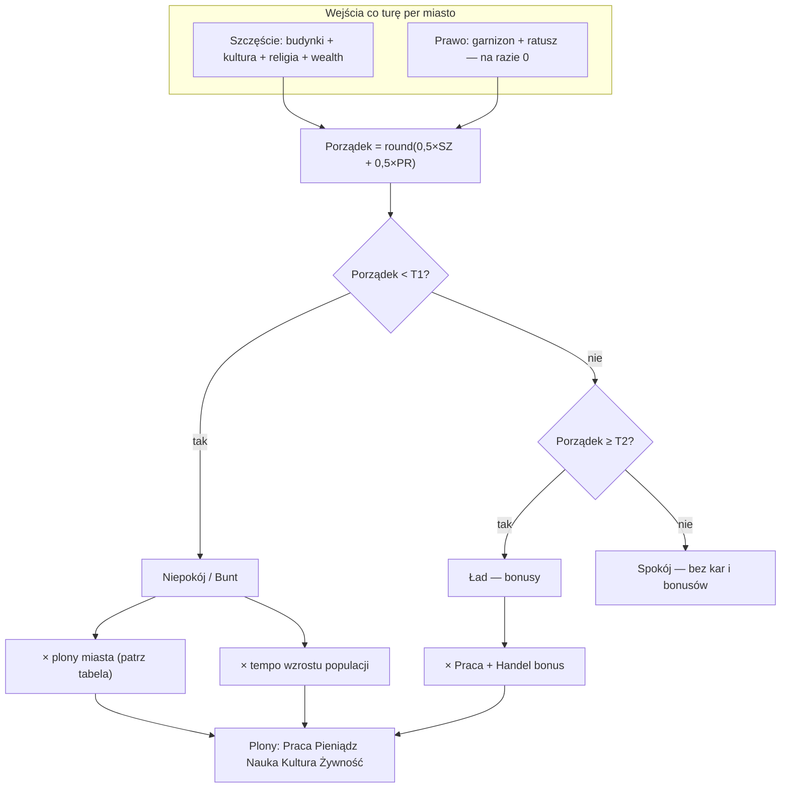

# B2 — Efekt buntu / niepokoju — plan działania

> **Decyzja Macieja (2026-06-26/27):** B2-Q4=C · **B2-Q6=C** — kary produkcyjne + migracja, nie utrata miasta.  
> **Status:** **WYKONANY** (2026-06-27) — `order.ts`, F-B2-porzadek. Plik = archiwum planu.

---

## 1. Co jest dziś w kodzie (audyt)

| Element | Stan | Uwaga |
|---------|------|--------|
| Skala **Porządek** | ✅ `order.ts` | `Order = round(0,5×Szczęście + 0,5×Prawo)` |
| 3 tiery | ✅ | `unrest` / `neutral` / `order` wg prog T1/T2 |
| Kara **Praca** | ✅ częściowo | `productionMult` × tylko `praca` w `main.ts` |
| Kara **wzrost** | ✅ | `growthMult` → wolniejsze zapełnianie magazynu żywności |
| Kara **Pieniądz/Nauka/Kultura** | ❌ | brak mnożnika na plony |
| Bonus **Handel** | ❌ | `tradeMult` zdefiniowany, **nie wpięty** |
| **Bunt losowy** | ⚠️ | 10%/turę → **−1 populacja** (`main.ts`) — **nie** utrata miasta |
| UI panel | ✅ | Sekcja Porządek pokazuje tier; nazewnictwo T1/T2 ≠ tier silnika |

**Wniosek:** mechanika jest blisko Twojego kierunku (kary), ale **losowa utrata pop** i **wąski zakres kar** (tylko Praca) trzeba zmienić po ABC.

---

## 2. Docelowy model (propozycja v1.0)

**Bunt / niepokój** = stan **`unrest`** (Porządek < T1) — **trwa**, dopóki nie podniesiesz Szczęścia/Prawa.

**Nie ma:** przejęcia miasta, exodus, ani „game over” miasta.  
**Jest:** spowolnienie gospodarki miasta — gracz czuje presję, ale może naprawić sytuację.

---

## 3. Propozycja parametrów (trudność **normal**)

Źródło danych: `gra/data/society-params.json` → sekcja `porzadek` (+ **nowe klucze** oznaczone 🆕).

### Progi

| Parametr JSON | normal | Znaczenie |
|---------------|--------|-----------|
| `porzadek_prog_t1` | **0** | Poniżej → **niepokój** |
| `porzadek_prog_t2` | **6** | Od 6 w górę → **ład** (bonusy) |

### Efekty w niepokoju (Porządek < 0)

| Parametr | normal | Efekt na gracza |
|----------|--------|-----------------|
| `porzadek_kara_produkcja_t1` | **−0,15** | Praca × **0,85** |
| 🆕 `porzadek_kara_pieniadz_t1` | **−0,15** | Pieniądz × **0,85** |
| 🆕 `porzadek_kara_nauka_t1` | **−0,10** | Nauka × **0,90** |
| 🆕 `porzadek_kara_kultura_t1` | **−0,10** | Kultura × **0,90** |
| `porzadek_kara_wzrost_t1` | **−0,25** | Wzrost pop. × **0,75** (wolniejsze zapełnianie progu żywności) |
| `porzadek_ryzyko_buntu_t1` | **0** 🆕 | **Wyłączone** — brak losowej utraty pop |

### Efekty w ładzie (Porządek ≥ 6)

| Parametr | normal | Efekt |
|----------|--------|-------|
| `porzadek_bonus_produkcja_t2` | **+0,10** | Praca × **1,10** |
| `porzadek_bonus_handel_t2` | **+0,10** | Pieniądz z podziału Handlu × **1,10** |

### easy / hard (skrót)

| | easy | normal | hard |
|---|------|--------|------|
| T1 | −1 | 0 | 1 |
| T2 | 4 | 6 | 8 |
| Kara Praca/Pieniądz | −10% | −15% | −20% |
| Kara Nauka/Kultura | −5% | −10% | −15% |
| Kara wzrost | −15% | −25% | −35% |
| Ryzyko −1 pop | **0** | **0** | **0** |

---

## 4. Przykład liczbowy (normal)

Miasto daje surowo: Praca 10, Pieniądz 8, Nauka 4, Kultura 2.  
Szczęście niskie → Porządek = **−2** (< T1).

| Zasób | Surowo | × kara | Po karze |
|-------|--------|--------|----------|
| Praca | 10 | 0,85 | **8,5** |
| Pieniądz | 8 | 0,85 | **6,8** |
| Nauka | 4 | 0,90 | **3,6** |
| Kultura | 2 | 0,90 | **1,8** |

W panelu miasta: status **„Niepokój”** + lista aktywnych kar (czytelnie dla gracza).

---

## 5. Plan implementacji (po ABC B2-Q6)

| Krok | Lane | Plik | Co |
|------|------|------|-----|
| 1 | EKONOMIA | `order.ts` | Rozszerzyć `OrderEffects`: `pieniadzMult`, `naukaMult`, `kulturaMult`; `ryzyko_buntu` opcjonalnie = 0 |
| 2 | EKONOMIA | `society-params.json` | Dodać 3 klucze kara_* + ustawić ryzyko na 0 |
| 3 | SILNIK | `main.ts` | Zastosować wszystkie mnożniki na plony miasta; **usunąć** blok `−1 pop` |
| 4 | SILNIK | `main.ts` | Wpiąć `tradeMult` na Pieniądz z podziału Handlu |
| 5 | UI | `cityPanel.ts` | W sekcji Porządek: tier z silnika + tabela aktywnych kar/bonusów |
| 6 | UI | test regresji | `order` test suite + scenariusz „niskie szczęście → niższe plony” |
| 7 | (później) | Grupa A | B2-Q5 — alert na mapie, jeśli wybierzesz A/C |

**Szacunek:** 1 batch EKONOMIA + 1 batch SILNIK + kosmetyka UI. **Bez** nowej mechaniki Prawa (garnizon) — Prawo=0 do czasu osobnej decyzji.

---

## 6. Co NIE robimy w v1.0 (unless ABC C)

- Utrata kontroli nad miastem
- Przejęcie przez AI/barbarzyń
- Stały debuff po wyjściu z niepokoju (kary znikają od razu po podniesieniu Porządku)

---

*Plan: 2026-06-26 · Grupa B · do akceptacji B2-Q6*
