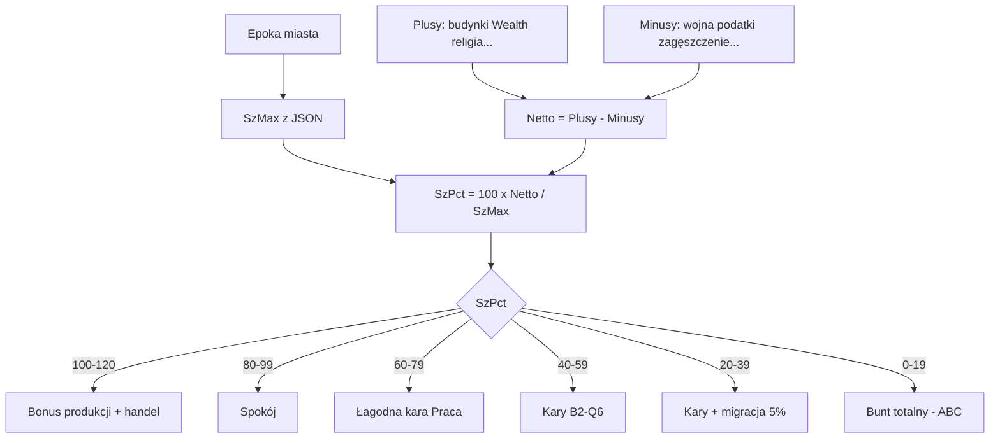

# B2 — Szczęście: progi procentowe i efekty

| Pole | Wartość |
|------|---------|
| **Status** | **Superseded dla efektów** — progi od **PorPct** → `B2-porzadek-progi-efektow.md`. Ten plik = referencja progów **SzPct** (emotikony UI). |
| **Model** | `SzPct = 100 × Netto / SzMax` — patrz `B2-model-szczescie-procent.md` |
| **Excel** | Progi edytowalne w `Spoleczenstwo-parametry.xlsx` (do dopisania arkusz `Szczescie-progi`) |

---

## Zasada

Wszystkie efekty gameplay (produkcja, przychody, wzrost, bunt) wynikają z **jednej liczby: SzPct**, nie z liczby „niezadowolonych ludzi”. Panel pokazuje **dlaczego** SzPct tak wyszedło (rozpiska +/-).

Mapowanie na istniejący kod: tier `unrest | neutral | order` z `order.ts` + mnożniki B2-Q6 — ale **progi na SzPct**, nie na surowe punkty Porządku (Porządek może zostać aliasem tieru w UI).

---

## Tabela progów (propozycja v1.0 — do strojenia w Excel)

| SzPct | Nazwa | Co widzi gracz | Efekty gameplay |
|-------|--------|----------------|-----------------|
| **100–120%** | **Euforia** | Pasek zielony, „120%”; 😊 dominują | Bonus **Praca** ×1,10, bonus **Handel** ×1,10 (jak `porzadek_bonus_*_t2`). Szybszy wzrost pop (+10% do `growthMult`). |
| **80–99%** | **Spokój** | Pasek jasnozielony; 😊/😐 | **Brak kar.** Tier `order`. Normalna rozgrywka. |
| **60–79%** | **Niepokój łagodny** | Pasek żółty; 😐 | **Praca** ×0,95. Komunikat „Nastroje spadają”. Tier bliski `neutral`. |
| **40–59%** | **Niepokój** | Pasek pomarańczowy; 😐/😠 | **Pełne kary B2-Q6** na Praca/Pieniądz/Nauka/Kultura (~×0,85). **Wzrost** ×0,75. Tier `unrest`. Chip buntu możliwy (B2-Q5). |
| **20–39%** | **Bunt** | Pasek czerwony; 😠 | Kary jak wyżej **+** ryzyko **migracji** 5%/turę (B2-Q6=C). Event „Niepokoje w [miasto]”. |
| **0–19%** | **Bunt totalny** | Pasek szary; ikona 🔥 | **Patrz ABC poniżej** — konflikt z B2-Q6 |

Wartości mnożników = istniejące klucze `porzadek_kara_*_t1`, `porzadek_bonus_*_t2` w JSON (normal).

---

## Wizualizacja koszyków (B2-Q1=A — nowa interpretacja)

| SzPct | 😊 | 😐 | 😠 |
|-------|----|----|-----|
| ≥80% | dominacja | reszta | 0 |
| 60–79% | ~40% | ~60% | 0 |
| 40–59% | ~20% | ~50% | ~30% |
| 20–39% | 0 | ~40% | ~60% |
| <20% | 0 | ~20% | ~80% |

To **tylko obrazek** z procentu — **nie** osobny licznik w silniku.

---

## Schemat przepływu (mermaid)

---

## Bunt totalny (0–19%) — **wymaga ABC Macieja**

Wspomniałeś: miasto przechodzi w **tryb szary**, **AI zarządza jak oddzielna nacja**.

To **rozszerza** zamknięte B2-Q6=C (kary + migracja, **bez utraty miasta**).

### B2-Q12 — **ZAMKNIĘTE → C** (2026-06-27)

Maciej: rebelia AI **po 2 turach grace** + alert strategiczny. Dźwignie: Luksus % → Sz, wojsko → Prawo. Patrz `B2-Q12-bunt-rebelia.md`, `B2-narzedzia-stabilizacji.md`.

### Archiwum opcji ABC (nieaktualne)

**A — Tylko kary + migracja (B2-Q6=C bez zmian)**  
Najgorszy tier = te same kary co 20–39%, ewentualnie wyższe mnożniki. **Miasto zostaje twoje.**

**B — Miasto „szare” — rebelia bez zmiany właściciela**  
Produkcja ≈ 0, nie budujesz, nie produkujesz jednostek; musisz podnieść SzPct &gt; 40% przez X tur, inaczej **automigracja** ludzi. **Nie** oddajesz miasta AI.

**C — Miasto przechodzi pod AI rebeliantów (oddzielna frakcja)**  
Przy SzPct &lt; 20% przez **2 tury z rzędu** → miasto neutralne/rebelia na mapie (szary kolor), AI kontroluje produkcję obrony. Można **odbijać** wojskiem. **Zmiana właściciela** możliwa tylko po zdobyciu.

**Rekomendacja agenta:** **A** lub **B** spójne z B2-Q6; **C** duży scope (nowy stan miasta, AI, dyplomacja).

---

## Powiązanie z Porządkiem (UI)

Sekcja **Porządek** w panelu może pokazywać:

- **SzPct** (główna liczba)
- **Tier** słownie: Spokój / Niepokój / Bunt
- Skrót aktywnych kar: „Praca −15%, migracja 5%/turę”

Prawo (pytanie **3**) — jeśli 0, Porządek = funkcja SzPct (1:1 z tierem).

---

## Następne kroki

1. Maciej: akceptacja progów w tabeli (lub poprawki %) + **B2-Q12** (bunt totalny).
2. Maciej: odpowiedź **2** (które składniki w v1.0).
3. EKONOMIA: `computeHappinessBreakdown` + testy progów.
4. Excel: arkusz `Szczescie-progi` + kolumny SzMax per epoka.
