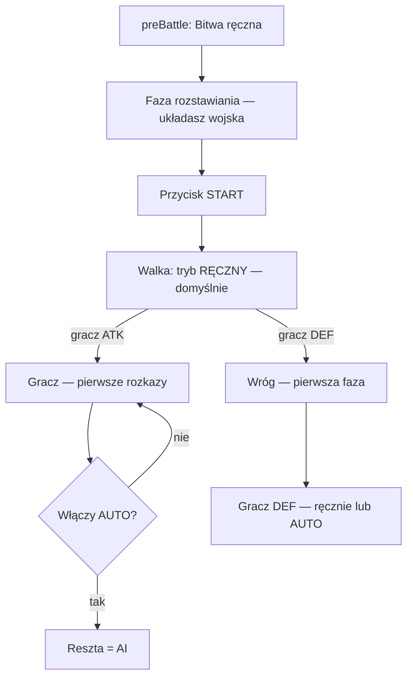

# C2-FLOW — Rozstawianie → Start → ręczna walka (potem opcjonalnie AUTO)

**Ekran:** pole bitwy 3D (`battleScene.ts`).  
**Status:** **ZAMKNIĘTE (decyzja Macieja)** · **⏸ wdrożenie** — lane UNITS / C2v2  
**Data:** 2026-07-03 (doprecyzowanie: rozstawianie **przed** regułami walki)  
**Powiązane:** D5=B · C1-Q2b=B · C2-ux-bitwy.md · deployment w `battleScene.ts`

---

## Kolejność faz (ważne — nie mylić z samą walką)

Reguły C2-FLOW **nie obowiązują od wejścia na pole bitwy**. Są **dopiero po przycisku Start**.

| Faza | Co robi gracz | Czy działają reguły R1–R4? |
|------|----------------|----------------------------|
| **0. preBattle** (C1) | Wybór: Auto-rozstrzygnij / **Bitwa ręczna** / Wycofaj | **NIE** — to jeszcze mapa świata |
| **1. Rozstawianie (deployment)** | Ustawiasz wojska na polu: przeciąganie, grupy, formacje F1–F3, Reset | **NIE** — to tylko ustawienie pozycji startowych; **brak walki**, **brak AUTO** |
| **2. Start** | Klik **Start** — kończysz rozstawianie | **TAK — od tego momentu** wchodzą reguły poniżej |
| **3. Walka** | Ręczne rozkazy (domyślnie) lub świadome włączenie AUTO | **TAK** |

**Skrót:** najpierw **rozstawiasz**, potem **Start**, **dopiero wtedy** zaczyna się walka wg reguł ręcznej inicjatywy.

---

## Decyzja Macieja (cytat sensu)

> Na początku bitwy ręcznej jest **faza rozstawiania** — układam wojska.  
> **Dopiero po Start** wchodzą reguły: walka **ręczna** (AUTO opcjonalnie później), atakujący pierwszy gdy atakuję, wróg pierwszy gdy bronię.

> *(Wcześniejsze ustalenie, bez zmian — obowiązuje od Start, nie od deploy:)*  
> Po **Start** gra **zawsze** zaczyna od **ręcznej** walki. Dopiero **potem** można włączyć **AUTO**.  
> **Nie** wolno startować walki w AUTO z jednoczesnym ruchem jednostek.  
> **Atakujący** idzie pierwszy · **obrońca** — najpierw wróg, potem gracz.

---

## Reguły kanoniczne (v1.0) — **obowiązują od Start, nie od deploy**

### R0 — Faza rozstawiania (przed Start)

| Reguła | Opis |
|--------|------|
| **R0a** | Po wejściu w bitwę ręczną gracz **najpierw** jest w fazie **rozstawiania** (`deployPhase`). |
| **R0b** | W deploy: przesuwanie jednostek, grupowanie, formacje, Reset — **bez** tur walki, **bez** AUTO, **bez** inicjatywy ATK/DEF. |
| **R0c** | Przycisk **Start** kończy deploy i **dopiero wtedy** uruchamia fazę walki (R1–R4). |
| **R0d** | Reguły R1–R4 **nie dotyczą** czasu spędzonego w rozstawianiu. |

### R1 — Domyślny tryb **po Start** (początek walki)

| Reguła | Opis |
|--------|------|
| **R1a** | Po naciśnięciu **Start** (koniec rozstawiania) walka **zawsze** startuje w trybie **RĘCZNYM**. |
| **R1b** | Przełącznik **AUTO** jest **dostępny**, ale **wyłączony** na starcie walki — gracz włącza go **świadomie**. |
| **R1c** | **Zakaz:** po Start auto-start w AUTO z jednoczesnym ruchem jednostek bez wcześniejszej fazy ręcznej. |

### R2 — Gracz **ATAKUJE** (jest stroną ATK) — **od Start**

| Krok | Co się dzieje |
|------|----------------|
| 1 | Po **Start** walka startuje **RĘCZNIE**. |
| 2 | **Pierwsza inicjatywa** należy do **atakującego** (gracz). |
| 3 | Gracz wydaje rozkazy: ruch, kierunek, atak — **zanim** cokolwiek zadziała w trybie automatycznym. |
| 4 | W dowolnym momencie gracz może przełączyć **AUTO**. |

### R3 — Gracz **BRONI** (jest stroną DEF) — **od Start**

| Krok | Co się dzieje |
|------|----------------|
| 1 | Po **Start** walka startuje **RĘCZNIE** (ten sam domyślny tryb UI). |
| 2 | **Pierwsza inicjatywa** należy do **wroga (atakującego AI)** — wróg wykonuje fazę **zanim** gracz dostanie kontrolę. |
| 3 | Po fazie wroga gracz **ręcznie** steruje obrońcami **albo** włącza **AUTO**. |

### R4 — Przełącznik AUTO (obie role, tylko w fazie walki)

| Reguła | Opis |
|--------|------|
| **R4a** | AUTO = **opcjonalne** przyspieszenie **po Start**, nie w deploy. |
| **R4b** | Przełączenie AUTO ↔ RĘCZNE w trakcie walki: dozwolone (klawisz **R** / przycisk trybu). |
| **R4c** | AUTO **nie zastępuje** preBattle (C1) ani fazy rozstawiania. |

---

## Diagram przepływu (pełny)

**Deploy (DEP)** = brak reguł R1–R4. **Start (BTN)** = punkt wejścia reguł.

---

## Stan kodu (gap — 2026-07-03)

| Element | Stan | Uwaga |
|---------|------|-------|
| `_manualMode = true` na starcie | ✅ częściowo | domyślnie ręczny, ale brak wymuszenia „pauzy” przed pierwszym ruchem |
| Sterowanie tylko `side === 'atk'` | ⚠️ gap | przy grze **jako obrońca** gracz musi być na `def` — wymaga `playerSide` |
| Kolejność tury interleaved | ⚠️ gap | `_beginTurn` miesza ATK/DEF — trzeba **blok fazowy** wg R2/R3 |
| Start AUTO przed rozkazem | ⚠️ do weryfikacji | upewnić się, że po Start nie leci `_activateNext` bez czekania na gracza |

**Lane:** UNITS · **Handoff docelowy:** `UNITS-do-MASTER` + kontrakt `playerSide` dla SILNIK (kto jest ATK/DEF z perspektywy gracza).

---

## Kryteria akceptacji (DoD wdrożenia)

1. Wejście w bitwę ręczną → **najpierw deploy** (rozstawianie); jednostki **nie walczą**.
2. Po **Start**: banner **TRYB: RĘCZNE**, jednostki gracza **nie ruszają same** bez rozkazu.
3. **Gracz ATK:** pierwszy aktywny slot sterowania = jego jednostki atakujące.
4. **Gracz DEF:** przed pierwszym kliknięciem gracza wróg wykonuje pierwszą fazę.
5. AUTO **niedostępne / nieaktywne** w fazie deploy; pojawia się dopiero po Start.
6. Test regresji: `combat-test.cjs` + smoke: deploy → Start → walka ATK i DEF.

---

## → SILNIK / MASTER

- **GOTOWE DO WPIĘCIA:** **NIE** — najpierw implementacja UNITS + `playerSide` w `BattleScene` options.
- **Nie ruszać** `main.ts` bez dyspozycji MASTER (Integrator wpina `playerSide` z mapy).

---

🔗 Echo: `docs/obieg/C-walka.md` · `docs/obieg/REJESTR-DECYZJI.md` · `dyspozycje/UNITS-DO-MASTERA.md`
