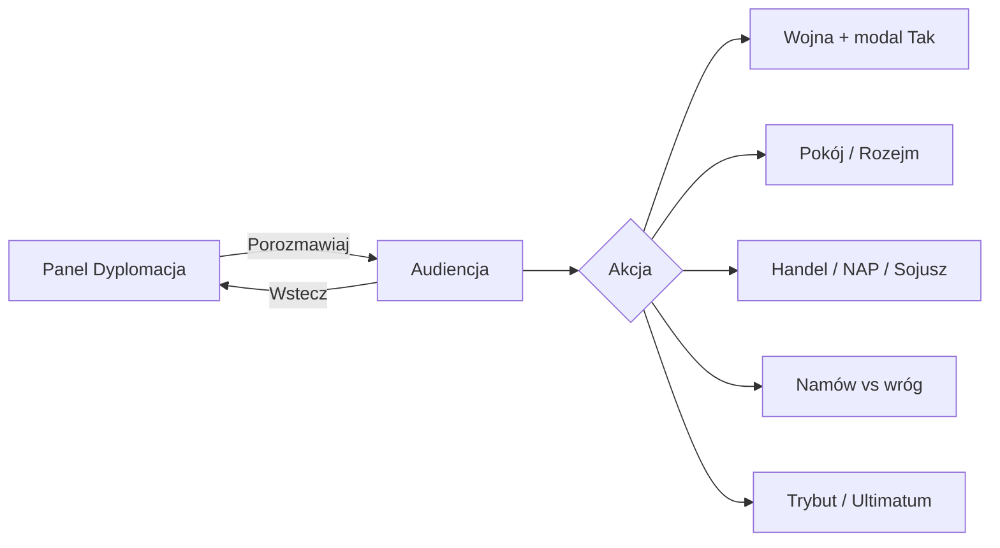

# Gr-D3 — Audiencja dyplomatyczna (korekta UX 2026-06-27)

**Ekran:** Panel Dyplomacja → **Audiencja** (drugi ekran)  
**Status:** **ZAMKNIĘTE** (D3-Q1…Q4 audiencja) · implementacja **GOTOWA DO STARTU**  
**Źródło danych akcji:** `gra/data/diplomacy.json` → `akcje_dyplomatyczne` (12 pozycji)

---

## Decyzja Macieja (2026-06-27) — kierunek produktowy

1. **Lista dyplomacji** pokazuje **tylko nacje, które spotkaliśmy** — reszta **niewidoczna**.
2. Na liście **NIE MA**: tier Neutralny/Klaster, Zaufanie/Respekt, Handel, Wypowiedz wojnę.
3. Na liście **JEST**: nazwa + **jeden** przycisk typu **„Porozmawiaj"** / **„Nawiąż kontakt"**.
4. Klik → **ekran audiencji**: po lewej **nasz władca**, po prawej **przedstawiciel drugiej strony**; tu wybieramy **pakiety działań** (wojna, pokój, handel, neutralność, namów do wojny z innym, itd.).
5. Inspiracja: **Total War** (audience / diplomacy screen) + **Civilization** (leader dialogue, deal matrix).

### Dlaczego dziś jest źle (screenshot playtest)

| Problem | Przyczyna techniczna |
|---------|---------------------|
| Wiele wpisów „Inkowie"/„Zulusi" | Wiele `ownerId` AI tego samego typu — etykieta z `aiOwnerCivMap`, nie miasto |
| Akcje wojna/handel na liście | Implementacja P0 `diplomacyPanel.ts` (do wycofania) |
| „Neutralny"/„Klaster" | Tier + warstwa D-START na liście zamiast w audiencji |
| Nacje „nie spotkane" | Filtr `computeDiplomaticContacts` = **odkryty heks** miasta/jednostki — za szeroki vs oczekiwanie „formalnego kontaktu" |

---

## Flow docelowy (2 ekrany)

### Ekran 1 — Lista (panel boczny)

| Element | v1.0 |
|---------|------|
| Wiersz | **Nazwa** (miasto klastra lub lider obcego typu) |
| Przycisk | **„Porozmawiaj"** jeśli kontakt formalny · **„Nawiąż kontakt"** jeśli tylko spotkanie w mgle |
| Ukryte | tier, Zaufanie, Respekt, Klaster, akcje wojna/handel |
| Pusta lista | „Nie spotkałeś jeszcze żadnej obcej cywilizacji." |

### Ekran 2 — Audiencja (overlay pełnoekranowy lub modal duży)

| Strefa | Zawartość |
|--------|-----------|
| **Lewa** | Portret + tytuł gracza (król/wódz) + nazwa cywilizacji |
| **Prawa** | Portret + imię/tytuł AI + nazwa nacji |
| **Środek góra** | Pasek relacji: **Zaufanie** · **Respekt** · status (Pokój / Wojna / Sojusz) — tylko tutaj |
| **Środek dół** | Siatka **kart akcji** (dostępność wg relacji, epoki, warstwy simplified/full) |
| **Wstecz** | Powrót do listy bez zmiany stanu |

**D3-Q1=A zachowane:** wypowiedzenie wojny z audiencji → modal **„Na pewno?"** → Tak/Anuluj.

---

## Pakiet akcji dyplomatycznych (kanon v1.0 — propozycja z `diplomacy.json`)

Pogrupowane jak TW / Civ. **Implementacja fazowa** — pełna lista w danych, UI/AI stopniowo.

### Tier 1 — v1.0 must-have (po nawiązaniu kontaktu)

| ID | Akcja | TW / Civ analog | Efekt skrót |
|----|-------|-----------------|-------------|
| **D-ACT-01** | Nawiązanie kontaktu | TW first contact / Civ meet | Odblokowuje audiencję; pierwsze wrażenie ±Relacja |
| **D-ACT-10** | Propozycja pokoju / rozejmu | TW peace / Civ peace treaty | Koniec wojny; opcjonalnie reparacje |
| **D-ACT-11** | Wypowiedzenie wojny | TW declare war / Civ surprise war | status=wojna; modal potwierdzenia; kara reputacji bez casus belli |
| **D-ACT-05** | Umowa handlowa | TW trade / Civ trade route | Transfer zasobów; +Zaufanie przy aktywnym handlu |
| **D-ACT-02** | Pakt o nieagresji (NAP) | TW NAP / Civ open borders lite | 10–20 tur bez ataku |

### Tier 2 — v1.0 nice (jeśli starczy sprintu)

| ID | Akcja | Analog |
|----|-------|--------|
| **D-ACT-03** | Sojusz wojskowy | TW military alliance / Civ defensive pact |
| **D-ACT-07** | Namów do wojny z X | TW join war against / Civ bribe war |
| **D-ACT-08** | Trybut (żądanie/oferta) | TW tribute / Civ gold per turn |
| **D-ACT-04** | Otwarte granice / przemarsz | TW military access |

### Tier 3 — po v1.0

| ID | Akcja |
|----|-------|
| D-ACT-06 | Wymiana technologii |
| D-ACT-09 | Ultimatum |
| D-ACT-12 | Wasalizacja / wchłonięcie |

### Warstwa **simplified** (klaster, ten sam typ — D-START)

Dozwolone w audiencji: **pokój, wojna, handel, NAP** — bez sojuszu, namów, trybutu, tech.

### Warstwa **full** (obcy typ po kontakcie)

Pełny Tier 1 + Tier 2 (wg decyzji D3-Q4).

---

## Pytania ABC do Macieja (domknięcie przed kodem)

Odpowiedź jedną linią, np.: `Q2B, Q3A, Q4A`

### D3-Q2 — Kiedy nacja pojawia się na liście?

**[EKRAN: Panel Dyplomacja]**

**A — Spotkanie w świecie (mgła)**  
Wpis gdy gracz **odkrył heks** miasta AI lub jednostki AI (jak dziś technicznie). Przycisk: **„Nawiąż kontakt"** dopóki nie było audiencji.

**B — Tylko po formalnym kontakcie**  
Lista **pusta** do momentu kliknięcia „Nawiąż kontakt" (posłaniec / spotkanie jednostek). Bez kontaktu = **zero wpisu** (nawet jeśli widać miasto w mgle).

**C — Hybryda (rekomendacja CYW)**  
W mgle: **zero wpisu**. Po odkryciu: wpis **„???" / „Nieznana nacja"** + **„Nawiąż kontakt"**. Po audiencji: pełna nazwa + **„Porozmawiaj"**.

---

### D3-Q3 — Jeden wpis na liście = co?

**[EKRAN: Panel Dyplomacja]**

**A — Jedno miasto / owner AI** (Ostia, Kapua, Pompeje — jak na screenie, ale bez duplikatów typu)  
**B — Jeden typ cywilizacji** (max 1× „Inkowie", agregacja wszystkich ownerów)  
**C — Klaster = 1 wpis „Klaster Rzymian"; obcy typ = 1 wpis per spotkany owner**

---

### D3-Q4 — Audiencja v1.0: które akcje w siatce? — **ZAMKNIĘTE 2026-06-27**

**Decyzja Macieja (wariant hybrydowy C+A):**

| Typ nacji | Pakiet na audiencji | UI |
|-----------|---------------------|-----|
| **Główni rywale** (9 typów roster — obcy typ po kontakcie) | **C** — wszystkie **12 akcji** z `diplomacy.json` | niedostępne **wyszarzone** + podpowiedź „dlaczego nie" |
| **Nacje poboczne** (`DrobnaCywilizacja` / kolumna „Poboczni" w danych) | **A** — tylko **5 podstawowych:** kontakt, pokój/rozejm, wojna, handel, NAP | bez kart Tier 2–3 |

**Implementacja:** `diplomacy.json` → kolumny „Dostępne: Główni rywale" / „Poboczni" + flaga `isMinorCiv` z silnika.

**D3-Q1=A:** wojna z audiencji → modal Tak/Anuluj (obie kategorie).

---

### D3-Q2 — Kiedy nacja pojawia się na liście? — **ZAMKNIĘTE 2026-06-27**

**Decyzja Macieja: A**

| Reguła | Efekt |
|--------|--------|
| Wpis na liście | Gdy gracz **odkrył heks** obcego **miasta** lub **jednostki** w mgle (`computeDiplomaticContacts`) |
| Przed formalną audiencją | Przycisk **„Nawiąż kontakt"** |
| Po pierwszej audiencji | **„Porozmawiaj"** + pełna nazwa |
| Niewidoczne w mgle | **Zero wpisu** |

**Silnik:** `diplomaticContactEstablished: Set<ownerId>` — osobno od „widoczności w mgle".

---

### D3-Q3 — Jeden wpis na liście = co? — **ZAMKNIĘTE 2026-06-27**

**Decyzja Macieja: A**

| Reguła | Efekt |
|--------|--------|
| Jeden wiersz | **Jeden owner AI = jedna nazwa miasta** (z `ownerDisplayName` / klastra) |
| Etykieta | **Ostia, Kapua, Pompeje** — nie „Inkowie" × N |
| Fallback | Tylko gdy brak nazwy miasta → typ cyw. (ostrożnie, unikać duplikatów) |

**Silnik/UI:** `ownerDiploLabel` → priorytet **nazwa miasta**; deduplikacja po `ownerId` (nigdy po typie cyw.).

---

### D3-Q4 — (archiwum opcji ABC)

**A** — Tier 1 only · **B** — Tier 1+2 · **C** — pełne 12 → **Maciej: C dla głównych, A dla pobocznych** (patrz wyżej)

## Po decyzji (Work)

| Lane | Plik / batch |
|------|----------------|
| **UI** | `diplomacyPanel.ts` — lista minimalna; **NOWY** `diplomacyAudience.ts` |
| **SILNIK** | `diplomaticContactsFormal: Set<ownerId>`; filtr listy; callbacki audiencji |
| **CYW** | mapowanie akcji ↔ `applyDiplomaticEvent`; AI akceptacja propozycji |

Handoffy:
- `dyspozycje/_handoff/CYWILIZACJE-do-UI_dyplomacja-audiencja-D3Q2.md`
- `dyspozycje/_handoff/CYWILIZACJE-do-SILNIK_dyplomacja-kontakty-D3Q2.md`

**BLOKADA:** ~~batch SILNIK-D-P0-1~~ — **superseded**. Implementacja: audiencja D3-Q1…Q4.

---

## → SILNIK / UI

**GOTOWE DO STARTU** — handoffy:
- `CYWILIZACJE-do-UI_dyplomacja-audiencja-D3Q2.md`
- `CYWILIZACJE-do-SILNIK_dyplomacy-kontakty-D3Q2.md`
- `CYWILIZACJE-do-SILNIK_F-GRUPA-D-P0-integracja.md` (batch audiencji, nie stary panel)
