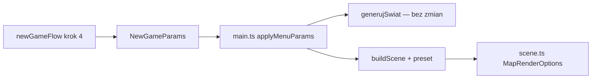

# Spec: jakość renderu + jakość mapy w kreatorze „Nowa gra”

**Data:** 2026-06-27  
**Autor:** MASTER (architektura)  
**Decydent gameplay:** Maciej (ABC poniżej)  
**Status:** SPEC — czeka na ABC → dyspozycje lane  

---

## 1. TL;DR

| Pytanie Macieja | Odpowiedź |
|-----------------|-----------|
| Czy to robi **Grupa E**? | **Tak — wiodąco:** UX kreatora, kontrakt `NewGameParams`, teksty PL. **MAPA** implementuje presety w `scene.ts`. **SILNIK** wpina w `main.ts` / `buildScene`. |
| Czy to to samo co **Rozmiar mapy**? | **Nie.** Rozmiar = ile hexów (Malenki→Ogromny). **Jakość mapy** = ile dekoracji *na hex* (drzewa, góry, piasek, zwierzęta 3D). |
| Czy już coś jest w grze? | W `ui-params.json` → menu główne ma **„Jakość grafiki”** (Niska/Średnia/Wysoka) — **niepodpięte do silnika**. Kreator kroku 4 **nie ma** osobnych suwaków jakości. |

---

## 2. Dwa niezależne suwaki (3 poziomy każdy)

### 2.1 Jakość renderu (`renderQuality`)

Wpływa na **GPU / kanvas WebGL** — wygląd globalny, nie zmienia generatora mapy.

| Poziom | PL (UI) | Co robi technicznie (Roblox v1) |
|--------|---------|----------------------------------|
| **low** | Niska | `antialias: false`, `pixelRatio` max **1.0**, cienie **off**, mapa cieni **—**, mgła bliżej (krótszy `fogFar`) |
| **medium** | Średnia | `antialias: false`, `pixelRatio` max **1.5**, cienie **off**, pełne dekoracje mapy (jeśli mapQuality=high) |
| **high** | Wysoka | `antialias: true`, `pixelRatio` max **2.0**, cienie **on** (1024), pełne dekoracje |

*Uwaga:* przy mapie **Ogromnej** + render **Wysoki** nadal może być ciężko — preset może pokazać **dyskretną podpowiedź** w UI (nie blokada).

### 2.2 Jakość mapy (`mapDetailQuality`)

Wpływa na **gęstość dekoracji 3D** i uproszczenia w `buildScene` — **nie** zmienia liczby hexów ani logiki gry (surowce, teren, AI).

| Poziom | PL (UI) | Co robi technicznie (Roblox v1) |
|--------|---------|----------------------------------|
| **low** | Niska | `robloxLite` **zawsze**: 1 drzewo/hex lasu, 2 warstwy gór, bez drugiego kopca wzgórza, mniej segmentów piasku brzegowego, prostsze modele zwierząt (opcjonalnie billboard — **v2**) |
| **medium** | Średnia | `robloxLite` gdy hex **> 3000** (obecnie próg 6500 — obniżyć), pełne dekoracje na małej/średniej mapie |
| **high** | Wysoka | `robloxLite` **nigdy** (pełne klastry lasu 3–5 drzew, pełne góry, pełny brzeg) — **zalecane** przy Malenki/Mały |

**Generator (`generateMap`)** — bez zmian w v1. Jakość mapy dotyczy tylko warstwy **render/dekoracje**.

---

## 3. Gdzie w kreatorze (krok 4 — „Ustawienia rozgrywki”)

Obecny krok 4 (`newGameFlow.ts`, `ui-params.json` → `nowa_gra.ustawienia`):

1. Poziom trudności  
2. **Rozmiar mapy**  
3. Typ świata  
4. Liczba rywali (skalowana do mapy)  
5. Prędkość gry  

### Propozycja layoutu (E1-UX-02)

Dodać **dwie nowe karty** w tym samym kroku, **pod** „Rozmiar mapy” (logicznie powiązane):

```
┌─────────────────────────────────────────────────────────┐
│  USTAWIENIA ROZGRYWKI                                   │
├─────────────────────────────────────────────────────────┤
│  [Trudność]  [Rozmiar mapy ▼]  [Typ świata ▼]           │
│  [Rywale ▼]  [Prędkość ▼]                               │
│                                                         │
│  ── Wygląd świata ──                                     │
│  Jakość renderu    ( ) Niska  (•) Średnia  ( ) Wysoka   │
│                    Dla słabszych PC / pełne detale GPU   │
│                                                         │
│  Szczegółowość mapy ( ) Niska  (•) Średnia  ( ) Wysoka   │
│                    Mniej drzew i ozdób / pełny styl Roblox│
└─────────────────────────────────────────────────────────┘
```

**Podpowiedź dynamiczna (UI only):**  
gdy `map_size ∈ {Duży, Ogromny}` i oba suwaki = Wysoka → żółty tekst:  
*„Na dużej mapie zalecamy Średnią jakość renderu lub mapy.”*

Mockup HTML: `UI/Makieta-flow-nowa-gra.html` (Grupa E).

---

## 4. Kontrakt silnika (rozszerzenie `NewGameParams`)

Plik wzorcowy: `docs/grupa-e/implementacja/kontrakt-kreator.md`

```typescript
export type QualityTier = 'low' | 'medium' | 'high';

export interface NewGameParams {
  // ... istniejące pola ...
  /** Etykieta PL z kreatora: Niska | Średnia | Wysoka */
  renderQualityLabel: string;
  /** Etykieta PL: Niska | Średnia | Wysoka */
  mapDetailQualityLabel: string;
  /** Klucze silnika — mapowane w newGameMapDefaults.ts */
  renderQuality: QualityTier;
  mapDetailQuality: QualityTier;
}
```

Mapowanie etykiet PL → klucz: wspólna funkcja `qualityTierFromLabel()` w `newGameMapDefaults.ts` (obok `rozmiarFromMenuLabel`).

### Przepływ danych



**`buildScene` — nowy argument (propozycja):**

```typescript
export interface MapRenderOptions {
  style: MapRenderStyle;           // 'roblox' dziś stałe
  renderQuality: QualityTier;
  mapDetailQuality: QualityTier;
}

buildScene(map, canvas, options?: MapRenderOptions): SceneResult
```

SILNIK przechowuje `currentRenderOptions` w stanie gry; przy **rebuild mapy** (nowa gra / wczytanie) przekazuje te same wartości.

---

## 5. Podział pracy (lane)

| Lane | Zadanie | Pliki |
|------|---------|-------|
| **Grupa E / UI** | Karty w kroku 4, opisy PL, podpowiedź Duży+Wysoki, rozszerzenie `NewGameParams`, wpis w `ui-params.json` (`nowa_gra`), mockup HTML | `newGameFlow.ts`, `ui-params.json`, `Makieta-flow-nowa-gra.html` |
| **MAPA** | `MapRenderOptions`, tabela presetów, `resolveRenderPreset()`, podpięcie `robloxLite` do `mapDetailQuality` zamiast samego `hexCount`, wyłączanie cieni/`pixelRatio` z `renderQuality` | `mapRenderStyle.ts`, `scene.ts` |
| **SILNIK** | Przekazanie opcji z kreatora do `buildScene`; opcjonalnie sync z menu „Jakość grafiki” | `main.ts` |
| **Opus** | Review przed kanonem — brak regresji FPS na Malenki + smoke | — |

**Grupa E** nie edytuje `scene.ts` ani `main.ts` — dostarcza kontrakt + UI + handoff `_handoff/E-do-MAPA_render-presety.md`.

---

## 6. Relacja do menu głównego („Ustawienia”)

Dziś: `ui-params.json` → `menu.ustawienia` → key `grafika` (Niska/Średnia/Wysoka) — **martwe**.

### Propozycja (do ABC Macieja)

| Wariant | Zachowanie |
|---------|------------|
| **A** | **Kreator nadpisuje** — wybór w Nowej grze obowiązuje w sesji; menu główne = domyślne dla *następnej* nowej gry |
| **B** | **Jedno źródło** — tylko menu główne; kreator **nie** pokazuje jakości renderu (tylko szczegółowość mapy) |
| **C** | **Oba** — kreator kopiuje wartość z menu jako default; gracz może zmienić przed startem |

**Rekomendacja MASTER:** **C** — mniej zaskoczeń, spójność z istniejącym polem „Jakość grafiki”.

---

## 7. Domyślne wartości (provisional — do ABC)

| Preset startu | renderQuality | mapDetailQuality |
|---------------|---------------|------------------|
| Proponowany default | **medium** | **high** |

Uzasadnienie: Maciej zaakceptował pełny styl Roblox wizualnie → mapa **Wysoka** domyślnie na małych mapach; render **Średni** = kompromis GPU bez utraty „super wyglądu” na laptopie.

**Auto-sugestia (opcjonalna, v1.1):** przy wyborze mapy Ogromny → UI automatycznie ustawia mapDetail na Średnia (gracz może cofnąć).

---

## 8. Zapis gry / wczytanie

W save JSON dodać (SILNIK):

```json
{
  "renderQuality": "medium",
  "mapDetailQuality": "high"
}
```

Przy wczytaniu — rebuild sceny z tymi samymi presetami. **Bez** tego wczytana gra mogłaby wyglądać inaczej niż podczas tworzenia.

---

## 9. Fazy wdrożenia

| Faza | Zakres | Blokada |
|------|--------|---------|
| **F0** | ABC Macieja (§10) | — |
| **F1** | UI kreator + kontrakt + `ui-params` | F0 |
| **F2** | MAPA: presety w `scene.ts` | Handoff E→MAPA |
| **F3** | SILNIK: `main.ts` wire + save | F1+F2 |
| **F4** | Opcjonalnie: spięcie menu `grafika` (wariant C) | F3 |
| **F5** | Instancing dekoracji (osobny backlog) | nie blokuje F1–F3 |

---

## 10. Decyzje ABC dla Macieja

Odpowiedz np.: `Q1C, Q2A, Q3B, Q4A`

| ID | Pytanie | A | B | C |
|----|---------|---|---|---|
| **Q1** | Gdzie wybór jakości? | Oba suwaki w **kroku 4** kreatora (propozycja §3) | Osobny **krok 5** „Grafika”; generowanie = krok 6 | Tylko **menu główne** (bez kreatora) |
| **Q2** | Domyślne na start | Render **Średni** + mapa **Wysoka** (§7) | Oba **Średnie** | Oba **Wysokie** |
| **Q3** | Duża mapa + Wysoka | Tylko **podpowiedź** tekstowa (nie blokuj) | **Auto-obniż** mapDetail do Średniej (można ręcznie podnieść) | **Wymuś** max Średnia przy Ogromny |
| **Q4** | Menu „Jakość grafiki” vs kreator | **C** — menu = default kreatora | **A** — kreator niezależny | **B** — tylko menu, bez suwaka renderu w kreatorze |

---

## 11. Następne kroki po ABC

1. MASTER → wpis w `dyspozycje/DZIENNIK-MASTERA.md` + `docs/decyzje/E-jakosc-render-mapa.md` (litery Macieja).  
2. Grupa E → mockup krok 4 + dyspozycja UI (`UI.md` / `E1-UX-02`).  
3. Handoff `E-do-MAPA_render-presety.md` z tabelami §2.  
4. Po MAPA GOTOWE → SILNIK batch (1× `main.ts`).  

---

## 12. Poza zakresem v1 (backlog)

- Instancing dekoracji Roblox (draw calls) — osobny sprint MAPA.  
- Zmiana gęstości **surowców w generatorze** (mniej hexów z końmi) — gameplay, nie tylko render.  
- Preset „Ultra” / ray tracing — nie.  
- Styl inny niż Roblox — dziś `GAME_MAP_RENDER_STYLE = 'roblox'` stałe (decyzja C wcześniejsza).

---

## 13. Addendum 2026-06-29 (Maciej — E1-Q-BUNDLE)

**Decyzja:** jeden suwak **Jakość mapy**; styl **Roblox** stały; **las logiczny ≠ liczba meshów drzew**.

| Zmiana vs §2 | Nowy kanon |
|--------------|------------|
| Dwa suwaki (render + map detail) | **Jeden** suwak → `bundledMapQualityPreset(tier)` w `newGameMapDefaults.ts` |
| `robloxLite` = 1 drzewo/hex | **Zakaz** — lite = prostsze meshe, **ta sama** liczba drzew i **ten sam** hex z `Nakladka.Las` |
| `render_quality` w zaawansowanych | **Usunąć** z UI v1 |
| Generator zależny od jakości | **Nadal zakaz** |

Pełna decyzja: `docs/decyzje/E1-jakosc-mapy-bundle.md`.
