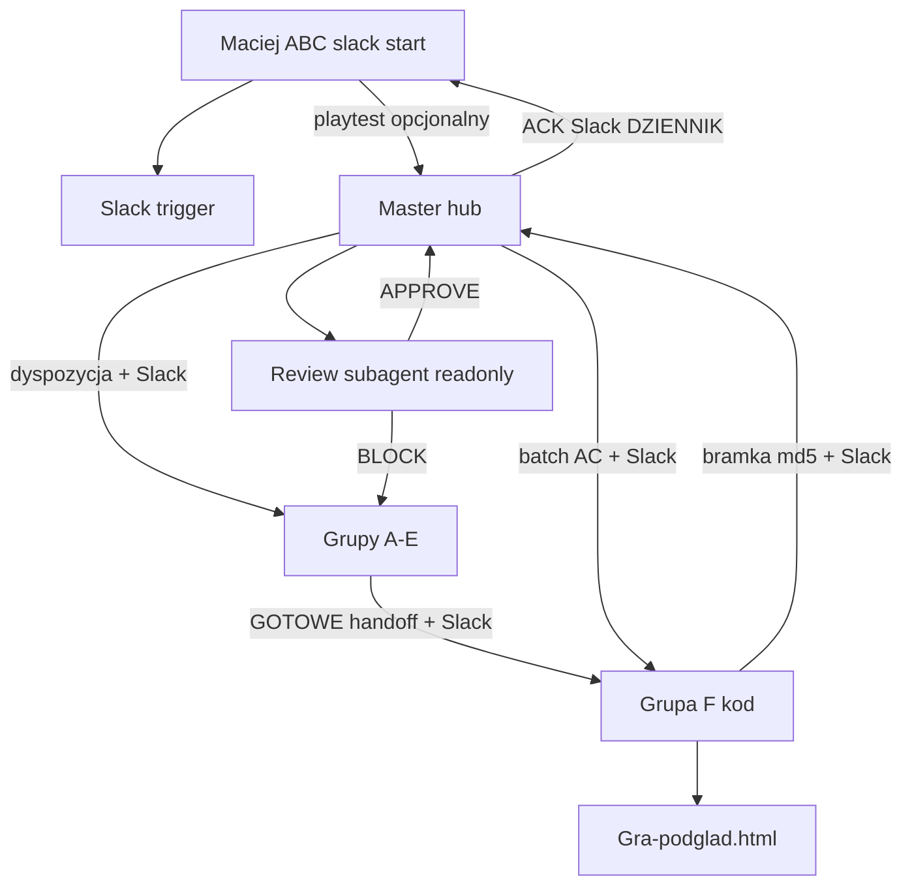

# Obieg operacyjny — wersja do akceptacji Macieja (2026-06-30)

> **Status:** ✅ **AKCEPTOWANE** — Maciej: „Akceptuję obieg" · **2026-06-30**
> **Kanon obiegu:** ten plik + [`ROLE-2026-06-30.md`](ROLE-2026-06-30.md) + [`SLACK-OBIEG.md`](SLACK-OBIEG.md)
> **Zastępuje:** Opus 4.8 (ręczny Ask) · stary Master GLM · osobny czat review.

---

## 1. Role (tylko te — reszta wycofana)

| Rola | Gdzie | Robi | Nie robi |
|------|-------|------|----------|
| **Maciej** | hub Master + ABC w lane | decyzje, playtest, `slack` / `start` | kod |
| **Master Orkiestrator** | **ten czat hub** | plan, dyspozycje, weryfikacja, **review subagentem**, ACK | kod, `main.ts` |
| **Grupa F** | osobny czat Cursor | `main.ts`, bramka, publish `Gra-podglad.html` | ABC, architektura cross-lane |
| **Grupy A–E** | osobne czaty | moduły lane + handoff | `main.ts` |
| ~~Opus 4.8~~ | **WYCofany** | — | — |
| ~~Master GLM + main.ts~~ | **WYCofany** | archiwum `docs/archiwum/master-legacy/` | — |

---

## 2. Przepływ (jedna ścieżka)

**Krok po kroku:**

1. **Grupa A–E** — moduł gotowy → handoff w pliku + wpis `→ INTEGRATOR: GOTOWE` + **Slack `#grupa-<litera>`**
2. **Master** — widzi Slack / pliki → dyspozycja do **Grupy F** (+ opcjonalnie Slack `#master`)
3. **Grupa F** — wpięcie `main.ts` → bramka testów → publish **`Gra-podglad.html`** → meldunek + **Slack `#grupa-f`**
4. **Master** — checklist read-only → **review subagent** (readonly, polski) → **APPROVE** lub **BLOCK**
5. **APPROVE** → ACK w `MASTER-WATCH.md` + linia `DZIENNIK-MASTERA` + **Slack `#master`**
6. **BLOCK** → powrót do **grupy źródłowej** (nie F „dopnij"), wpis Slack z powodem
7. **Maciej** — opcjonalny playtest po ACK (nie blokuje technicznie, chyba że zgłosisz BUG)

---

## 3. Review subagent (zamiast Opus)

| Było (Opus) | Jest (subagent) |
|-------------|-----------------|
| Osobny czat Ask, ręczny wybór modelu | **Master** wywołuje subagenta w tym samym czacie hub |
| Opus 4.8 | **Composer subagent, readonly** — ten sam język (polski) |
| Sign-off przed kanonem | Werdykt **APPROVE / BLOCK** + lista uwag |
| Integrator czeka na Opus | F publikuje po bramce; Master review **po** meldunku F |

**Kiedy Master odpala review subagenta:**
- Po `→ MASTER: GOTOWE-KANON` od Grupy F (md5 + wyniki bramki w meldunku)
- Wejście subagenta: handoff AC + opis batcha + wyniki testów + scope plików
- Subagent **nie edytuje** plików — tylko raport dla Mastera

**Typ subagenta (domyślnie):** adversarial review (bugbot / readonly explore) — sceptyk względem self-preference Mastera.

**Master po BLOCK:** nie naprawia kodu — zwraca lane lub F według przyczyny (bug modułu vs złe wpięcie).

---

## 4. Slack — gdzie wpinamy (trigger, nie prawda)

Slack **nie zastępuje** plików (`_handoff/`, `INTEGRATOR-kolejka.md`, `MASTER-WATCH.md`).  
Slack = **krótki sygnał „rusz" + ścieżka do pliku**.

| Moment w procesie | Kanał Slack | Kto pisze | Treść (szablon) |
|-------------------|-------------|-----------|-----------------|
| Moduł lane gotowy | `#grupa-a` … `#grupa-e` | lane | `[GRUPA-X] → INTEGRATOR: GOTOWE · handoff: …` |
| Dyspozycja / ACK Master | `#master` | Master | `[MASTER] dyspozycja F: batch …` / `[MASTER] ACK md5 …` |
| Wpięcie + kanon | `#grupa-f` | Grupa F | `[GRUPA-F] → MASTER: GOTOWE-KANON · md5 … · testy …` |
| Pytanie ABC | `#decyzje` | lane → Maciej | `[ABC] B1-Q3 · link do karty decyzji` |
| Review BLOCK | `#master` + kanał lane | Master | `[MASTER] BLOCK → Grupa X: powód …` |

**Twoje hasło w Cursorze:** `slack` (lub `start slack`) — agent czyta **nowe na Twoim kanale** (faza 1: podsumowanie z Slacka; faza 2: MCP/API).

**Workspace:** [The Game Slack](https://join.slack.com/t/thegame-jbl3744/shared_invite/zt-42j2jkjfl-VnRIogsDtt03yEfGkk9XRw)

Szczegóły: [`SLACK-OBIEG.md`](SLACK-OBIEG.md)

---

## 5. Pliki — kto pisze

| Plik | Pisze | Rola |
|------|-------|------|
| `dyspozycje/_handoff/` | lane / Master | kontrakt AC |
| `docs/obieg/INTEGRATOR-kolejka.md` | Grupa F | kolejka, md5 kanonu |
| `docs/obieg/MASTER-WATCH.md` | Master | ACK, review, czeka na… |
| `dyspozycje/SILNIK-DO-MASTERA.md` | Grupa F | meldunki (Master tylko czyta) |
| `dyspozycje/DZIENNIK-MASTERA.md` | Master | krótkie wpisy ACK |

---

## 6. Komendy Macieja (hub)

| Komenda | Efekt |
|---------|-------|
| `start` | Master: `MASTER-WATCH` + 🎯 TERAZ |
| `slack` | Przeczytaj Slack (trigger) → potem pliki |
| `start slack` | Slack najpierw, potem praca |
| `raport` | 3 sekcje: u Mastera / wysłane bez odpowiedzi / domknięte |
| `status` | Skrót z `MASTER-WATCH` |
| `pytania` | Otwarte ABC |
| `co dalej` | Jedna rekomendacja |

W czatach grup: **`start`** (jak dziś) · opcjonalnie **`slack`** gdy Master coś wrzucił na kanał.

---

## 7. Co wycofujemy (nie używać)

- Opus 4.8 Ask przed kanonem
- Osobny czat „Master GLM" z edycją `main.ts`
- `OPUS-REVIEW-QUEUE.md` jako bramka aktywna (archiwum / stub)
- Meldunki „czeka Opus" w starych sekcjach — historyczne only

---

## 8. Akceptacja

**Maciej — 2026-06-30 (hub Master):**

> **„Akceptuję obieg."**

| Wybór | Status |
|-------|--------|
| **AKCEPTUJĘ** (obieg + Slack MCP Faza 2) | ✅ **obowiązuje** |
| AKCEPTUJĘ BEZ SLACK | — nie wybrano |
| KORYGUJĘ | — nie wybrano |

**Rejestr:** `OBIEG-2026-06-30` w [`REJESTR-DECYZJI.md`](REJESTR-DECYZJI.md) · wpis `DZIENNIK-MASTERA.md` · `MASTER-WATCH.md` zaktualizowany.
