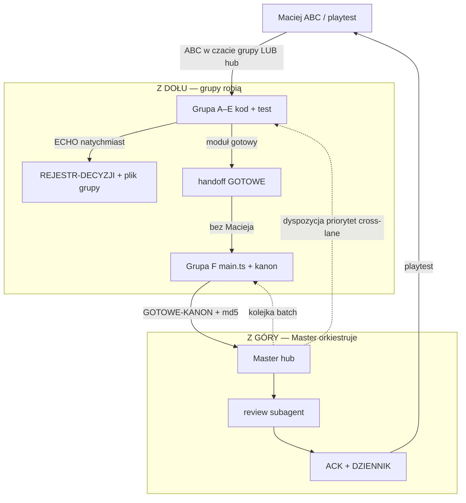

# Przepływ pracy — z góry i z dołu

> **Dla Macieja:** gdzie rozmawiasz, kto co zapisuje, czy musisz być listonoszem.
> Zasady techniczne: [`_ZASADY.md`](_ZASADY.md) §3, §7 · role: [`ROLE-2026-06-30.md`](ROLE-2026-06-30.md)

---

## Krótka odpowiedź

| Pytanie | Odpowiedź |
|---------|-----------|
| ABC w czacie **Grupy C** (Walka)? | ✅ **Tak** — ustalacie tam, agent C **natychmiast zapisuje** |
| Czy Ty potem przekazujesz to Masterowi? | ❌ **Nie** |
| Czy wszystko idzie przez Mastera do Integratora? | ❌ **Nie** — gotowy moduł idzie **grupa → Integrator (F)** |
| Kto pilnuje, że decyzja nie zginie? | **Agent grupy** (ECHO) + **Master** czyta rejestr |

**Ty = decyzja. Reszta = automatyczne pliki + agenci.**

---

## Dwa kierunki (diagram)

---

## Scenariusz: rozmawiasz z Grupą C o walki

1. **Grupa C** zadaje pytanie ABC (pełna forma A/B/C).
2. **Ty** odpowiadasz np. `C4-Q2 → B` **w tym samym czacie C**.
3. **Agent C — obowiązek (ECHO → START → AKCJA):**
   - wpis do `C-walka.md` + `REJESTR-DECYZJI.md` (🟡),
   - **od razu AskQuestion**: „Tak — wdrażaj teraz?" / „Jeszcze doprecyzujmy",
   - po **Tak** → 🔵 W TRAKCIE + pierwszy krok kodu w tej samej sesji.
4. **Agent C** implementuje w swoim module (`combat.ts`, `battle/*`, …).
5. Gdy moduł gotowy → **`→ INTEGRATOR: GOTOWE`** + handoff w `dyspozycje/_handoff/` + Slack `#grupa-c`.
6. **Integrator F** wpina `main.ts` — **bez Twojego udziału**.
7. **Master** dostaje meldunek F → review → ACK → **Ty** dostajesz sygnał do playtestu.

**Nie musisz** iść do Mastera z „hej, w C ustaliliśmy B". Master **widzi to w rejestrze** (albo Slack `#decyzje` opcjonalnie).

---

## Co idzie gdzie (tabela)

| Co się stało | Kto zapisuje | Dokąt trafia | Maciej robi? |
|--------------|--------------|--------------|--------------|
| Decyzja ABC | **Agent grupy** (ECHO) | `REJESTR-DECYZJI` + plik grupy | tylko A/B/C |
| Implementacja modułu | Grupa A–E | własne pliki kodu | nic |
| Moduł gotowy | Grupa | handoff + `→ INTEGRATOR: GOTOWE` + Slack | nic |
| Wpięcie w grę | **Integrator F** | `main.ts`, kanon, md5 | nic |
| Review techniczny | **Master** | subagent readonly | nic |
| Playtest finalnej | **Maciej** | `playtest OK` / `BUG` | **tak** |
| Konflikt cross-lane / priorytet | **Master** | dyspozycja + `#master` | tylko jeśli ABC |

---

## Kiedy Master jest pośrednikiem (a kiedy nie)

| Master **NIE** jest pośrednikiem | Master **JEST** w pętli |
|----------------------------------|-------------------------|
| ABC zapisane w czacie grupy | Kolejność batchy w F (kolejka) |
| Handoff grupa → Integrator | Cross-lane (np. C potrzebuje zmiany w A) |
| Kod modułu w lane | Review po publish kanonu |
| Eksport paneli, testy lane | BLOCK → powrót do grupy |
| | `status` / `raport` gdy **Ty** pytasz |

**Integrator nie dostaje „przekaż od Mastera co Maciej powiedział w C"** — dostaje **handoff techniczny** z pliku, gdy C ogłosi GOTOWE.

---

## Slack w tym obrazie

- `#grupa-c` — sygnał „C skończyła / coś gotowe" (trigger Mastera i F)
- `#decyzje` — **opcjonalny** skrót ABC (nie wymagany, jeśli ECHO w plikach zadziałało)
- `#master` — dyspozycje, ACK, playtest ready
- `#grupa-f` — kanon + md5

Maciej **nie musi** pisać na Slacku.

---

## Protokół ECHO (skrót dla agentów)

Po każdej odpowiedzi Macieja agent **ZAKAZ** kodu, dopóki nie:

1. nada ID (`C4-Q2`, `DEC-…`),
2. zapisze w pliku grupy + `REJESTR-DECYZJI.md`,
3. potwierdzi jednym zdaniem Maciejowi.

Pełna reguła: [`_ZASADY.md`](_ZASADY.md) §7.1.

---

## Powiązane

- [`MACIEJ-ROLA-MINIMAL.md`](MACIEJ-ROLA-MINIMAL.md) — Twoje 2 zadania
- [`REJESTR-DECYZJI.md`](REJESTR-DECYZJI.md) — gdzie Master widzi wszystkie decyzje
- [`SLACK-OBIEG.md`](SLACK-OBIEG.md) — triggery Slack
