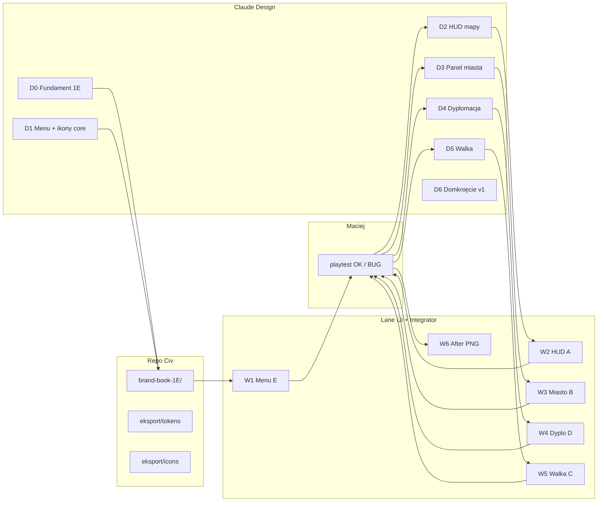

# Roadmap — wdrożenie nowego UX/UI (The Game)

> **Dla:** Maciej (decyzje + playtest) · **Design:** `brand-book-1E/DYSPOZYCJA.md`  
> **Decyzje zamknięte:** 1B 2C 3C 4C 5C 6C 7A 8A · **Kolejność kodu:** **E → A → B → D → C**  
> **Nie robimy:** Figma cloud (P6 odrzucone) · emoji w HUD · gradientowe CTA

**Ostatnia aktualizacja:** 2026-06-26

---

## Mapa procesu (jeden obraz)

---

## ETAP 0 — ✅ DONE (przed kodem)

| Co | Status |
|----|--------|
| Decyzje Warstwa 1 (ABC) | ✅ `DECYZJE-WARSTWA1-MACIEJ.md` |
| Baseline PRZED (34 PNG) | ✅ `docs/ux/baseline/{A..E}/` |
| Rejestr 130+ ekranów | ✅ `REJEST-UX-MASTER.md` |
| Spec ikon 3C | ✅ `FIGMA-SPEC-IKONY.md` |
| Protokół Design | ✅ `brand-book-1E/` + `DYSPOZYCJA.md` |
| Brand Book 1E (Design) | 🟡 hub + szkielet — iteracje w folderze |

---

## ETAP 1 — 🔴 PIERWSZY (zamykamy w pierwszej kolejności)

**Cel:** pierwsze wrażenie + wspólne tokeny + ikony core — **gracz widzi nowy wygląd od menu**.

### 1A. Claude Design (ETAP D1) — Ty: utrzymuj folder

| # | Deliverable | Blokuje |
|---|-------------|---------|
| 1 | Freeze `tokens.css` / `tokens.json` | cały CSS w grze |
| 2 | Tier 1+2 SVG komplet (18+ plików) | HUD, toolbar, chipy |
| 3 | Poprawka **dyplomacja = uścisk dłoni** | spójność 3C |
| 4 | Ekrany **E-01 menu** + **E-08…E-13 kreator** + **E-15 wygrana** | kod menu |
| 5 | **E-15b porażka** (czerwony wariant) | game over |
| 6 | **HANDOFF.md v2** | lane UI wie co wpiąć |

**Sygnał dla Mastera:** pliki w `brand-book-1E/` zaktualizowane → **`brand book w repo`**

### 1B. Lane UI (ETAP W1) — po D1

| # | Zadanie | Pliki |
|---|---------|-------|
| 1 | Import tokenów → `UI/design-tokens-brand-v1.css` + opcjonalnie `gra/data/design-tokens.json` | sync z `eksport/` |
| 2 | Podmiana emoji → SVG Tier 1 w **menu i kreatorze** | `mainMenu.ts`, `newGameFlow.ts` |
| 3 | Style: przyciski 4C, ramki 5C, Georgia 2C | CSS w module UI |
| 4 | Game over overlay — wygrana + porażka | handoff F jeśli `main.ts` |
| 5 | Self-test: menu → kreator → start gry | bez regresji flow |
| 6 | **`przekaż do Mastera`** + handoff | `UI-do-MASTER_warstwa1-E-W1.md` |

### 1C. Integrator F — batch po handoff UI

| # | Zadanie |
|---|---------|
| 1 | Wpięcie zmian w `main.ts` jeśli wymagane (game over, import CSS global) |
| 2 | Build `/tmp/civ-dist` + smoke |
| 3 | Meldunek F → Master |

### 1D. Master + Maciej — bramka Etapu 1

| # | Kto | Co |
|---|-----|-----|
| 1 | Master | Review vs HANDOFF + decyzje 1B–6C |
| 2 | Master | Promocja kanonu (po Opus jeśli batch duży) |
| 3 | **Maciej** | Playtest: menu → kreator → 2–3 tury → **koniec gry test** (dev) |
| 4 | **Maciej** | Sygnał **`playtest OK`** / **`BUG:`** |
| 5 | Lane UI | Baseline **after/** dla E-01, E-09…E-11, E-15 (te same nazwy co baseline) |

**Definition of Done Etapu 1:** menu + kreator + game over wyglądają jak Design · zero emoji w tych ekranach · tokeny globalne załadowane · playtest Macieja OK.

---

## ETAP 2 — HUD mapy (W2 + D2)

**Design:** A-01 pasek zasobów, A-02 toolbar, A-03 dolny pasek, A-05 minimapa, chipy 6C, Tier 3 rail icons start.

**Kod:** `hud.ts`, `mapToolbarHud.ts`, `bottomBarHud.ts`, `minimapHud.ts` — podmiana ikon + CSS tokenów.

**Playtest Macieja:** 10 tur na mapie — czytelność chipów, toolbar, koniec tury.

**After PNG:** `A-01` … `A-04`, `A-06`, `A-08`, `A-11`, `A-16`

---

## ETAP 3 — Panel miasta (W3 + D3) — największy batch

**Design:** B-01 layout, B-02 pasek, B-14 rail, zakładki budowa/rekrut/handel/porządek, B-26 okolica, docki, B-34 drzewko.

**Kod:** `cityPanel.ts`, `cityUxFrame.ts`, `sciencePicker.ts`, `hoverDetailDock.ts`.

**Playtest:** panel miasta pełny cykl — budowa, rekrut, suwaki handlu/wealth, porządek.

**After PNG:** `B-01`, `B-02`, `B-15`, `B-17`, `B-29`, `B-30`, `B-33`, `B-34`

---

## ETAP 4 — Dyplomacja (W4 + D4)

**Design:** D-02 lista, D-03 audiencja, D-04 karty, modale D-05/D-06, ikony Tier 5 dip-*.

**Kod:** `diploListHud.ts`, `diplomacyAudience.ts`, `diplomacyPendingHud.ts`, koszyk PN (P4).

**Playtest:** audiencja → wojna/pokój/handel → blocking chip.

**After PNG:** `D-02` … `D-06`

---

## ETAP 5 — Walka (W5 + D5)

**Design:** C-01 pre-bitwa, C-06 deploy, C-07–09 HUD bitwy, C-19 mur, C-21 koniec.

**Kod:** `preBattle.ts`, `battleScene.ts` (overlay UI, nie logika walki).

**Playtest:** T → pre-bitwa → ręczna → koniec bitwy.

**After PNG:** `C-01`, `C-06`, `C-07`, `C-08`, `C-09`, `C-19`, `C-21`

---

## ETAP 6 — Domknięcie v1.0 UX (W6 + D6)

| Co | Opis |
|----|------|
| Reszta ekranów | A-04…A-30, B-03…B-31, pozostałe C/D/E |
| Ikony Tier 4–6 | pełna biblioteka |
| Ustawienia E-03, O grze E-06 | jeśli w scope v1.0 |
| Hub Design | kafelki Kreator/Walka/Motion |
| **Porównanie** | 34 pary baseline vs after |
| Opus review | wizualny sign-off przed kanonem final UX |

---

## Kto co robi (stałe role)

| Rola | Robi | Nie robi |
|------|------|----------|
| **Maciej** | Zapis w `brand-book-1E/` · playtest po batchu · ABC | kod, terminal, eksport python |
| **Claude Design** | Ekrany PO + SVG + tokeny + HANDOFF · czyta `DYSPOZYCJA.md` | logika gry, JSON balansu |
| **Lane UI** | Review Design · CSS/TS w `gra/src/ui/` | `main.ts` |
| **Integrator F** | Wpięcie `main.ts` · build · kanon | redesign od zera |
| **Master** | Orkiestracja · dyspozycje · promocja kanonu | implementacja paneli |

---

## Metryki postępu (do śledzenia)

| Warstwa | Liczba | Done Design | Done Kod |
|---------|--------|-------------|----------|
| Design System | 17 | 🟡 | — |
| Ikony Tier 1–7 | ~70 plików SVG | 🟡 14 | ⬜ |
| Ekrany E | 17 | 🟡 | ⬜ |
| Ekrany A | 30 | 🟡 | ⬜ |
| Ekrany B | 31 | 🟡 | ⬜ |
| Ekrany D | 15 | 🟡 | ⬜ |
| Ekrany C | 21 | 🟡 | ⬜ |
| Baseline after | 34 PNG | — | ⬜ |

---

## Pliki hub

| Plik | Cel |
|------|-----|
| [`brand-book-1E/DYSPOZYCJA.md`](claude-design/01-propozycje-z-design/brand-book-1E/DYSPOZYCJA.md) | **Pełna lista dla Design** |
| [`WYMIANA-UI-DESIGN.md`](claude-design/WYMIANA-UI-DESIGN.md) | Status YAML lane UI |
| [`UI-pipeline-ux.md`](../obieg/UI-pipeline-ux.md) | Trigger `działaj` lane UI |
| [`WORKFLOW-GRAFIKA-UI-v2.md`](WORKFLOW-GRAFIKA-UI-v2.md) | Proces v2 |
| [`REJEST-UX-MASTER.md`](REJEST-UX-MASTER.md) | 130+ pozycji |

---

## Twój następny krok (Maciej)

1. **Design:** domknij **ETAP D1** (lista w `DYSPOZYCJA.md` § ETAP D1) — zapis w `brand-book-1E/`
2. Napisz w hubie Master: **`brand book w repo`**
3. Master deleguje lane UI **`działaj`** → **ETAP W1**
4. Po kanonie: **playtest Etapu 1** (menu + kreator + game over)

---

*Master Orkiestrator · roadmap UX/UI v1.0*
