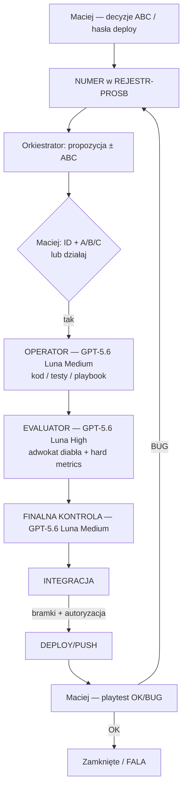

# Schemat działania — kto za co · jakimi regułami

**Status:** OBOWIĄZUJE · 2026-08-05  
**Maciej:** AutoBot = twarda reguła; każda praca agenta wyłącznie tędy.  
**Powiązane:** `R-PROC-AUTOBOT` · `R-PROC-POTROJNA-WARSTWA` · `R-PROC-NUMER-ABC` · `R-PROC-NO-REGRESS`

---

## 1. Obraz całości (jedna pętla)

**Zasada nadrzędna:** nic „obok” pętli. Operator → Evaluator → finalna kontrola →
integracja → deploy/push. Raport Operatora automatycznie uruchamia Evaluatora.

---

## 2. Kto za co odpowiada

| Rola | Kto | Odpowiada za | Nie robi |
|------|-----|--------------|----------|
| **Decydent** | **Maciej** | ABC gameplay/produkt, hasła `działaj` / `deploy`, playtest OK/BUG | Terminal, kod, merge na ślepo |
| **Orkiestrator / Final** | **GPT-5.6 Luna Medium** | Plan, ABC, finalna kontrola, status/ABC/integracja; bez samowolnego deployu | Masowa implementacja „bo szybko” |
| **Operator (AutoBot)** | **GPT-5.6 Luna Medium** | Kod, testy lane, eksporty, docs techniczne wg `playbook.json` | Merge `main`, deploy, self-grade bez KPI |
| **Evaluator (AutoBot)** | **GPT-5.6 Luna High** | Adwokat diabła: regresje, uboczne zepsucia, hard metrics, postmortem, win/loss playbook | Implementacja |
| **Integrator / F** *(gdy w obiegu)* | Sesja Integrator | Wpięcie zatwierdzonej paczki po finalnej kontroli i bramkach | ABC gameplay zamiast Macieja |

### Mapowanie AutoBot ↔ nasze sesje

| AutoBot Spec | U nas |
|--------------|--------|
| Operator Agent | GPT-5.6 Luna Medium (implementer) |
| Evaluator Agent | GPT-5.6 Luna High (adwokat) + KPI (tsc/testy) |
| Playbook / Vector memory | `dyspozycje/autobot/playbook.json` + logs |
| Human gate | Maciej (`deploy`, ABC, playtest) |
| Final controller | GPT-5.6 Luna Medium |

---

## 3. Reguły, którymi się kierujemy (kolejność ważności)

| # | ID / plik | Co mówi |
|---|-----------|---------|
| **1** | **`R-PROC-AUTOBOT`** · `.cursor/rules/autobot-evaluator-operator.mdc` | **KAŻDA praca** = Operator → Evaluator → finalna kontrola → integracja → deploy/push. |
| **2** | **`R-PROC-NUMER-ABC`** · `PROCEDURA-NUMER-ABC-COMMIT-DEPLOY.md` | Case → ID → propozycja ± ABC → kod dopiero po literze → deploy tylko hasło. |
| **3** | **`R-PROC-POTROJNA-WARSTWA`** | = Operator + Evaluator + finalna kontrola. Integracja i deploy/push są kolejnymi bramkami. |
| **4** | **`R-PROC-NO-REGRESS`** | Przed commit/deploy: diff + usunięcia; nie cofaj cudzych fixów. |
| **5** | **`model-routing.mdc`** | GPT-5.6 Luna Medium = orkiestrator/Operator; GPT-5.6 Luna High = Evaluator. |
| **6** | **Guardrails AutoBot** (`guardrails.ts` + CLAUDE) | Bez merge→`main`; bez `npm run build/dev` w `gra/`; deploy tylko hasło; HITL na krytyczne. |
| **7** | **Playbook** | Reguły z win_rate; &lt;30% → RETIRED; feature pruning corr &lt; 0.05. |
| **8** | **Kanał / WERSJE** | Prawda między sesjami = `KANAL-PRACA.md` + `WERSJE.md` (nie sam czat). |

---

## 4. Przebieg jednej paczki (checklist)

1. **Orkiestrator:** nadaj/odszukaj ID · zapisz rejestr · ABC jeśli trzeba.
2. **Maciej:** litera / `działaj`.
3. **Operator:** implementacja + testy · raport plików + PASS/FAIL. Po raporcie Evaluator startuje automatycznie.
4. **Evaluator:** adwokat diabła + hard metrics · WERDYKT PASS/FAIL/NOTES.
5. **Orkiestrator:** finalna kontrola; `FAIL` wraca do Operatora, `PASS` prowadzi do statusu, ABC albo integracji.
6. **Meldunek:** po finalnej kontroli zapisz `✅ Gotowe` i dopisz paczkę do `docs/MACIEJ-GOTOWE.md`.
7. **Integracja:** wpięcie po przejściu bramek.
8. **Deploy/push:** dopiero po bramkach i wyraźnej autoryzacji właściciela.
9. **Maciej:** playtest → OK zamyka / BUG wraca do ID.

---

## 5. Hasła Macieja (skrót)

| Hasło | Skutek |
|-------|--------|
| `ID A\|B\|C` / `działaj` | Start Operatora (po ECHO) |
| `deploy` | uprawniona rola publikuje ROBOCZA po bramkach |
| `raport` / `status` / `co dalej` | orkiestrator — status bez zatrzymywania aktywnego AutoBota |
| `format` / `ABC` | Przepisz pytanie w pełnej formie |

---

## 6. Gdzie to żyje w repo

| Plik | Rola |
|------|------|
| **Ten plik** | Schemat ról + reguł (czytaj na start) |
| `dyspozycje/autobot/README.md` | Spec 5 modułów technicznych |
| `.cursor/rules/autobot-evaluator-operator.mdc` | alwaysApply — twarda reguła |
| `dyspozycje/START-TU.md` | Punkt wejścia sesji |
| `docs/decyzje/R-PROC-AUTOBOT.md` | Decyzja kanoniczna |

---

## 7. Jedno zdanie dla agenta

> Najpierw ID i decyzja Macieja → **Operator** robi → **Evaluator** sprawdza na twardych metrykach → **finalna kontrola** → **integracja** → **deploy/push** po bramkach i autoryzacji.

---

## 8. ARCHIWUM — Integracja z Ultracode/Workflow (Maciej 2026-08-12)

**Uwaga: cała sekcja 8 jest archiwalnym opisem integracji Workflow z 2026-08-12.**
Aktywny kanon procesu znajduje się wyłącznie w sekcjach 1–7 oraz w
`.cursor/rules/autobot-evaluator-operator.mdc`; poniższy opis nie zmienia obecnych
ról, bramek ani odpowiedzialności.

**Uwaga historyczna o modelach:** poniższy opis zachowuje wcześniejszy routing
`composer-2.5`/„Grok" —
wariancie z sesji Cursor, sprzed aktualizacji modeli 2026-08-06 (zaznaczone już wyżej w
pliku jako możliwa rozbieżność). W sesjach Claude Code (gdzie działa narzędzie Workflow
opisane niżej) obowiązywał historyczny routing Claude Code: Operator = Sonnet 5,
Evaluator = Opus 5, a publikację wykonywała uprawniona rola po autoryzacji.
Pętla z Sekcji 1 pozostaje tu wyłącznie historycznym opisem struktury; aktywny
łańcuch to `Operator → Evaluator → finalna kontrola → integracja → deploy/push`.

Workflow (Ultracode, Claude Agent SDK) to **narzędzie wykonawcze** — skrypt z `agent()`,
`pipeline()`, `parallel()`, `phase()`, wbudowanym limitem współbieżności i izolacją
worktree per agent. Nie jest nową rolą w tabeli z Sekcji 2 — jest sposobem, w jaki role
**Operator** i **Evaluator** z tej tabeli zostają wywołane, gdy tematów jest dużo naraz
(≥3 niezależnych) — dla 1–2 tematów ręczny dispatch pozostaje w pełni poprawny.

Mapowanie na krok 3–4 z checklisty Sekcji 4 („Operator: implementacja" → „Evaluator:
adwokat diabła"): `phase('Operator')` i `phase('Evaluator')` żyją w JEDNYM skrypcie Workflow
jako dwa kroki sekwencyjne tego samego przebiegu — nigdy jako dwa osobne, oddzielnie
zlecane uruchomienia. `pipeline()` pozwala tematowi A być już w kroku 4 (Evaluator), gdy
temat B jeszcze jest w kroku 3 (Operator) — bez ręcznego pilnowania kolejności przez
orkiestratora.

Każdy prompt agenta uruchamianego w izolowanym worktree (Workflow albo ręczny `Agent` tool)
zaczyna się od weryfikacji bazy worktree: grep symbolu, który musi istnieć na właściwej
gałęzi; brak trafienia = agent się zatrzymuje i zgłasza, zamiast zgadywać, że kod „jeszcze
nie scalony". Zmiany dotykające silnika bitwy, zapisu/wczytania gry lub migracji danych w
`gra/data/**` przechodzą przez 3 niezależnych Evaluatorów głosujących większością, nie 1.

Historyczny krok 6–7 (meldunek „Gotowe" → `deploy`) nie wchodził w zakres
Workflow — `git commit`/`push`, wpisy do `WERSJE.md`/`KANAL-PRACA.md`/
`REJESTR-PROSB-I-ZADAN.md` i deploy pozostawały poza skryptem, ręką uprawnionej roli.
W aktualnym procesie po Evaluatorze obowiązują jeszcze finalna kontrola i integracja;
Workflow kończy się na zatwierdzeniu przez Evaluatora, a dalsze kroki wykonuje
orkiestrator zgodnie z aktywnym kanonem.

Pełny szczegół (dokładny szablon KROK 0, tabela modeli Sonnet 5/Opus 5): patrz
`.cursor/rules/autobot-evaluator-operator.mdc` §„Integracja z Ultracode/Workflow" i
`docs/decyzje/R-PROC-AUTOBOT.md` §„Integracja z Ultracode/Workflow".
