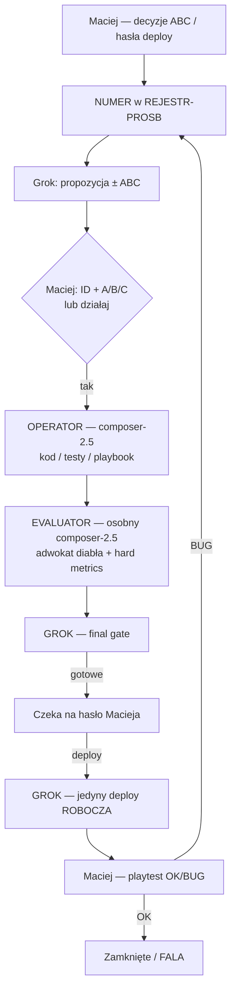

# Schemat działania — kto za co · jakimi regułami

**Status:** OBOWIĄZUJE · 2026-08-05  
**Maciej:** AutoBot = twarda reguła; każda praca agenta wyłącznie tędy.  
**Powiązane:** `R-PROC-AUTOBOT` · `R-PROC-POTROJNA-WARSTWA` · `R-PROC-NUMER-ABC` · `R-PROC-NO-REGRESS`

---

## 1. Obraz całości (jedna pętla)

**Zasada nadrzędna:** nic „obok” pętli. Operator → Evaluator → Grok → (opcjonalnie) deploy.

---

## 2. Kto za co odpowiada

| Rola | Kto | Odpowiada za | Nie robi |
|------|-----|--------------|----------|
| **Decydent** | **Maciej** | ABC gameplay/produkt, hasła `działaj` / `deploy`, playtest OK/BUG | Terminal, kod, merge na ślepo |
| **Orkiestrator / Final** | **Grok 4.5** (czat główny) | Plan, ABC, dekompozycja, **final** po Evaluatorze, **jedyny deploy**, WERSJE/KANAL | Masowa implementacja „bo szybko” |
| **Operator (AutoBot)** | **composer-2.5** (Task) | Kod, testy lane, eksporty, docs techniczne wg `playbook.json` | Merge `main`, deploy, self-grade bez KPI |
| **Evaluator (AutoBot)** | **osobny composer-2.5** | Adwokat diabła: regresje, uboczne zepsucia, hard metrics, postmortem, win/loss playbook | Implementacja (chyba że Grok każe fix po FAIL) |
| **Integrator / F** *(gdy w obiegu)* | Sesja Integrator | Wpięcie `main.ts`, bramka, publish ROBOCZA **po** `deploy` od Groka/Macieja | ABC gameplay zamiast Macieja |

### Mapowanie AutoBot ↔ nasze sesje

| AutoBot Spec | U nas |
|--------------|--------|
| Operator Agent | Subagent `composer-2.5` (implementer) |
| Evaluator Agent | Subagent `composer-2.5` (adwokat) + KPI (tsc/testy/playtest) |
| Playbook / Vector memory | `dyspozycje/autobot/playbook.json` + logs |
| Human gate | Maciej (`deploy`, ABC, playtest) |
| Final controller | Grok |

---

## 3. Reguły, którymi się kierujemy (kolejność ważności)

| # | ID / plik | Co mówi |
|---|-----------|---------|
| **1** | **`R-PROC-AUTOBOT`** · `.cursor/rules/autobot-evaluator-operator.mdc` | **KAŻDA praca** = Operator → Evaluator → Grok. Zakaz omijania. |
| **2** | **`R-PROC-NUMER-ABC`** · `PROCEDURA-NUMER-ABC-COMMIT-DEPLOY.md` | Case → ID → propozycja ± ABC → kod dopiero po literze → deploy tylko hasło. |
| **3** | **`R-PROC-POTROJNA-WARSTWA`** | = kroki 1–3 AutoBot (implementer + adwokat + Grok). Nie osobna opcja. |
| **4** | **`R-PROC-NO-REGRESS`** | Przed commit/deploy: diff + usunięcia; nie cofaj cudzych fixów. |
| **5** | **`model-routing.mdc`** | Grok = mózg + deploy; Composer = ręce; **nie** `composer-2.5-fast`. |
| **6** | **Guardrails AutoBot** (`guardrails.ts` + CLAUDE) | Bez merge→`main`; bez `npm run build/dev` w `gra/`; deploy tylko hasło; HITL na krytyczne. |
| **7** | **Playbook** | Reguły z win_rate; &lt;30% → RETIRED; feature pruning corr &lt; 0.05. |
| **8** | **Kanał / WERSJE** | Prawda między sesjami = `KANAL-PRACA.md` + `WERSJE.md` (nie sam czat). |

---

## 4. Przebieg jednej paczki (checklist)

1. **Grok:** nadaj/odszukaj ID · zapisz rejestr · ABC jeśli trzeba.  
2. **Maciej:** litera / `działaj`.  
3. **Operator:** implementacja + testy · raport plików + PASS/FAIL.  
4. **Evaluator:** adwokat diabła + hard metrics · WERDYKT PASS/FAIL/NOTES.  
5. **Grok:** final · jeśli NOTES → fix (znów Operator lub drobny patch) → ponów Evaluator na delcie.  
6. **Meldunek Maciejowi:** `✅ Gotowe` · czeka na **`deploy`**.  
7. **Po `deploy`:** tylko Grok → ROBOCZA + WERSJE + KANAL.  
8. **Maciej:** playtest → OK zamyka / BUG wraca do ID.

---

## 5. Hasła Macieja (skrót)

| Hasło | Skutek |
|-------|--------|
| `ID A\|B\|C` / `działaj` | Start Operatora (po ECHO) |
| `deploy` | Grok publikuje ROBOCZA |
| `raport` / `status` / `co dalej` | Grok — status (bez omijania AutoBot przy kolejnej pracy) |
| `format` / `ABC` | Przepisz pytanie w pełnej formie |

---

## 6. Gdzie to żyje w repo

| Plik | Rola |
|------|------|
| **Ten plik** | Schemat ról + reguł (czytaj na start) |
| `dyspozycje/autobot/README.md` | Spec 5 modułów technicznych |
| `.cursor/rules/autobot-evaluator-operator.mdc` | alwaysApply — twarda reguła |
| `dyspozycje/START-TU.md` | Punkt wejścia sesji |
| `docs/decyzje/R-PROC-AUTOBOT.md` | Decyzja kanoniczna |

---

## 7. Jedno zdanie dla agenta

> Najpierw ID i decyzja Macieja → **Operator** robi → **Evaluator** sprawdza na twardych metrykach → **Grok** zatwierdza → **deploy** tylko gdy Maciej powie.
